---  
title: 16|只有懂了养猪,投资周期股才能摸到门道  
index: true  
icon: editor  
order: 17  
category:  
  - 短线  
  - 大A  
tag:  
  - 雪球  
---  
  
## 16|只有懂了养猪,投资周期股才能摸到门道  
  
你养过猪吗?你听说过猪周期吗?  
  
没错，猪也是有周期的。作为我国国民肉类消费的首选，猪肉虽然是刚需，但它的供给却并不稳定。  
  
目前我国绝大部分的猪仍然是散养的，前十家猪企也不过占据市场20%的份额，这就导致了养殖意愿不一致而产生的供需错位，从而产生了猪周期。  
  
猪周期的本质是人性的演绎。  
  
人性是趋利的，村头老李听说隔壁老王养猪赚到大钱眼馋不已，于是也想趁着猪价上涨捞上一笔，便拿出家里积蓄投资养猪。  
  
从母猪分娩到猪仔长大往往需要10个月时间，在此期间，老李发现村里家家户户竟然都开始养猪了，猪多了就会滞销，导致猪价发生暴跌。  
  
人性又是避害的，看到猪价持续下跌，老李生怕自己血本无归，最后含泪将自家生猪连同母猪打包甩卖处理。村民们养猪赔了钱，从此村里没人再敢养猪。  
  
慢慢地，市场上的猪肉开始紧缺起来，猪价开始上涨，村里又开始流传养猪致富的消息。  
  
......  
  
就这样，猪周期随着人性演绎周而复始。  
  
在A股市场中，猪周期曾进行过多轮演绎，是一个既迷人又危险的存在.  
  
理解了猪周期的人，善于把握其中变化趋势，很容易抓住上行趋势并赚到钱。而不理解猪周期的人，往往看到股价上涨而一股脑冲进去，成为了高位接盘者。  
  
那么，养猪到底有什么魅力?我们又该如何学会养猪呢?本节带你了解清楚。  
  
### 为什么养猪如此迷人?  
  
作为区别于价值股、成长股的第三大类股票，周期股具有独特的行情特征和研究框架，A股具有代表性的周期行业有煤炭、化工、海运、养殖等，但为什么投资者却如此偏爱猪周期呢?  
  
#### 懂养猪才能懂周期  
  
猪周期的传导机制简单，规律易于掌握。简单来说，猪周期的核心驱动因素就是利润，猪价高利润就高，生猪供给就会提升，反之同理。所以，猪周期成为了许多投资者投资周期股的必修课。  
  
想要知道周期股的门道，想要从周期股中赚到钱，就一定要学习猪周期。  
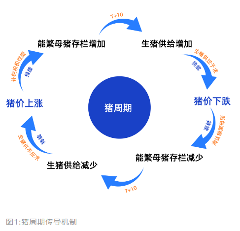  
  
#### 行情紧跟周期走  
  
A股市场中的猪周期是一个非常有“个性”的板块,它的行情并不跟着市场走。  
  
从过去多年间申万生猪养殖指数与上证综指涨跌幅对比可以发现，当市场处于极端熊市或者牛市时，猪周期反而会凸显独立行情。  
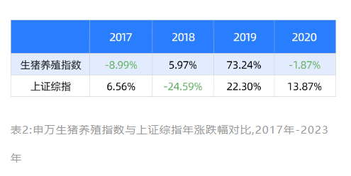  
  
另一方面，A股猪周期行情紧跟着行业周期走。我们将过去9年间生猪养殖行业指数与生猪市场均价做对比，可以很明显地发现，A股市场的猪周期演变与生猪价格呈现强相关的关系。  
  
所以，对于投资者来说，只要能把握准生猪行业的变化，赚钱就是一件确定的事情。  
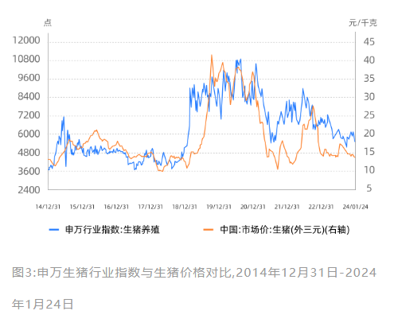  
  
#### 风浪越大猪越贵  
  
通常情况下，行业或个股基本面越好，增长越强，股价和估值才会越高。而猪周期投资却完全相反，往往是行业和个股基本面非常差，风险因素非常多的时候，猪周期才会有很强的上行动力。  
  
这是因为当风险出现，生猪行业的供给才能得到非常快的出清，从而导致供需格局反转，股价上行。  
  
所以，对于猪周期投资来说，不考虑极端风险(比如市场系统性风险，公司破产风险等)的情况下，风险越高，投资价值则越大，这也是猪周期的魅力所在。  
  
### 养猪人经历了哪几轮周期?  
  
自2000年以来，国内生猪行业共经历了完整的5轮猪周期，目前正在经历第6轮。  
  
回顾过去的几轮猪周期，驱动的原因也不尽相同，让我们看看过去几轮猪周期是如何演绎的。  
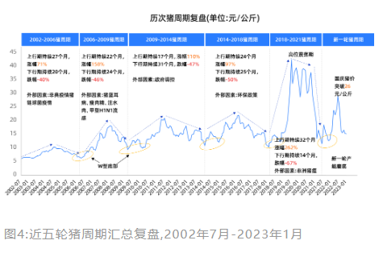  
  
#### 第一轮猪周期(2002年-2006年)  
  
第一轮周期的关键事件为2次疫情。  
  
2003年5月爆发非典疫情，中国生猪养殖场停摆、宰杀母猪、减少补栏以及交通运输困难等导致生猪产能减少。  
  
2004年禽流感疫情爆发，猪肉供不应求，猪价进入上行通道，受益于此，生猪养殖行业利润高企，养殖户补栏拉动产能增长。  
  
#### 第二轮猪周期(2006年-2010年)  
  
第二轮猪周期仍然是疫情主导，关键事件为猪蓝耳疫病的爆发。  
  
2006年猪价已处于阶段性低位，行业大量去化产能。2007年猪蓝耳疫病爆发，前期产能去化叠加疫病导致生猪存栏量急速下降，供需关系反转猪价进入上行阶段。  
  
高利润导致猪价上行持续20个月，同时生猪出栏量持续增长。此后，随着“瘦肉精”和”甲型H1N1流感"等事件相继发生，猪肉需求减少，猪价进入下行阶段，期间猪价跌幅达43%。  
  
#### 第三轮猪周期(2010年-2014年）  
  
该轮猪周期属于自然产能变化主导的典型猪周期。本轮猪周期中未发生影响供给的重大外部事件，因此供需矛盾相对不尖锐，整体周期拉长，猪价与产能变动趋势较平缓。  
  
猪价在2010年6月开始触底并一路攀升，至2011年9月涨至此轮周期高点，涨幅达107%，这个创历史新高的价位直到2016年5年后才被打破。  
  
随着猪价的上涨，能繁母猪存栏持续回升，猪肉供应增加，猪价逐步回落至2014年的4月的周期性低点，跌幅达44%。  
  
期间，为了稳定猪肉价格，2013年5月，商务部等三部委联合开启猪肉收储工作，提振了市场信心，短期价格有所反弹。  
  
#### 第四轮猪周期(2014年-2018年)  
  
第四轮猪周期则是由重要政策驱动的政策型猪周期。  
  
国内从2014年起开始实施严格的环保禁养规定，提升生猪养殖业的规模化程度，导致大量散养户退出市场，生猪和能繁母猪存栏持续下降。  
  
猪价在2014年4月见底，震荡上涨至2016年的5月，其中2015年上半年爆发的猪丹毒疫情起到推波助澜的作用，涨幅达83.9%。  
  
#### 第五轮猪周期(2018年-2022年)  
  
第五轮猪周期同样是受到了重大疫情的催化。  
  
2018年爆发了非洲猪瘟疫情，导致2018-2019年能繁母猪存栏量大幅下降，2019年能繁母猪存栏较2018年5月下降42%。  
  
前期环保禁养使得能繁母猪存栏已经降至低位，叠加非瘟去产能，2019年能繁母猪存栏降至不足2000万头。  
  
猪价也迎来一波大幅拉升，2020年8月37.83元/公斤，涨幅高达278%。  
  
回顾前几轮猪周期，可以将猪周期的驱动因素归结为三种，分别是扰动因素、催化因素、盈利因素。  
  
其中，扰动因素指季节、天气、节假日等，这些因素本质上不会改变现行周期趋势，一般来说只会影响短期价格波动，就比如春节元旦假期猪肉价格会短期上涨。  
  
催化因素指的是疫情、政策等，是影响供需格局的关键因素，会使得现行行业格局发生反转，加速进入上行或下行周期，比如在2018年非瘟疫情直接影响了生猪行业进入第五轮周期。  
  
盈利因素是主导猪周期变化的核心因素，是猪周期能够持续上行或下行的主要动力来源。所以，我们在分析猪周期变化趋势时，要从这三个方面进行分析。  
  
### 大户是如何养猪的?  
  
如何养猪?如何把猪养好?养猪大户牧原股份告诉你答案。  
  
作为一年卖出超6000万头生猪，公司市值近2000亿元，历经数轮猪周期仍然屹立不倒的生猪行业龙头，牧原股份成功的秘诀总结起来主要有两点:成本低和出货快。  
  
低廉的成本保证了牧原股份更高的利润空间，在面临周期下行，其他养殖户普遍亏损的情况时，牧原股份仍然有利可图。  
  
较高的养殖效率则保证了牧原股份产能灵活性，在行业供给过剩或紧缺时，可以更加灵活调整自身产能节奏应对。  
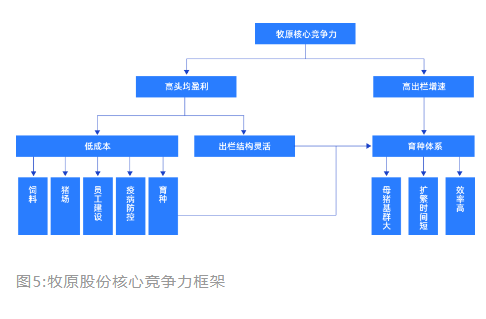  
  
#### 把成本控到最低  
  
为什么同样养一头猪，普通养殖户和养殖大户得到的效益却不同呢?这些差异主要来源于哪里?  
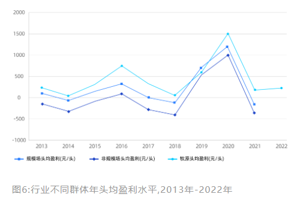  
  
##### 首先是饲料成本  
  
饲料成本占养殖总成本的50-60%，随着行业近几年主要饲料原材料玉米及豆粕价格的上涨，饲料成本亦水涨船高。  
  
牧原股份早在成立之初就没有采用传统的粮食饲料，而是自研低蛋白日粮。相比于传统饲料，低蛋白日粮的配方中添加适宜种类和数量的生物合成氨基酸，在保障猪群生长性能和猪肉品质的前提下，降低了豆粕的使用量。  
  
2022年牧原股份全年豆粕用量占比7.3%，远低于行业平均14.5%。牧原股份饲料综合成本在3200元/吨左右，而国内育肥配合饲料均价为3800元/吨，饲料成本优势突出。  
  
##### 其次是养殖模式  
  
生猪养殖公司的养殖模式主要分为集中养殖和分散养殖两种。  
  
随着2015年《环境保护法》推出，个体养殖户开始逐步出清，规模化集中养殖进程加速推进，猪企大多采取集中养殖模式。相比于分散养殖，集中养殖有着非常显著的成本优势。  
  
同时，分散养殖由于是大量的个体养殖户参与，受到养殖环境、养殖管理差异影响，生猪品质变得极为不可控，反而可能会给成本造成更大负担。  
  
牧原股份将集中养殖的优势发挥到最大，现已形成集饲料加工、种猪选育、种猪扩繁、商品猪饲养、屠宰肉食等环节于一体的生猪产业链，能够将各个生产环节置于可控状态。  
  
同时，牧原股份在各个环节设立严格技术标准和质量标准，控制成本水平的同时也保证了食品安全。  
  
##### 最后是疫病防控管理  
  
疫情疾病可以说是每个养猪人最头疼的问题，疫情问题如果处理不好，猪仔们很容易被”一锅端”，养殖户一年的心血付之东流。  
  
牧原股份从两个方面着手抵御疫病风险，一方面将猪舍升级改造，采取分区管理，减少交叉风险。  
  
同时，牧原股份通过饲料高温灭菌、管链密闭输送、饮水超滤消毒、出风灭菌除臭、智能装备应用升级等方式，实现对猪群的全方位把控，减少人畜接触，提升全程疾病防控能力。  
  
另一方面，牧原股份搭建猪病天网工程，在近5年加大了猪病研究费用，累计财务投入30亿元，2022年牧原股份猪病研究财务投入高达9.38亿元，为2018年的7.6倍，仅2022年公司普查样本量便达到了6200万份，覆盖151型病毒、181型细菌和27种寄生虫病，全方位保证猪仔们的健康，最大程度减少疫病带来的损失。  
  
#### 把生产效率提到最高  
  
对于一家优秀的猪企来说，不仅养殖成本要低生猪品质要好，还要能在最短的时间供应最大的产量。  
  
牧原股份在过去正是靠着生产效率高这一优势在产能紧缺周期中，抓住机会抢占市场，一步步成为生猪龙头。生产效率高的秘诀就在于其培育体系。  
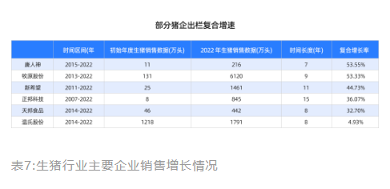  
  
目前生猪行业主要采用三元培育体系。所谓三元培育体系，简单理解就是培育出售卖的商品猪需要经过三代父母系生猪繁殖的体系。  
  
为什么不直接用一代母猪繁殖培育?这是由于我国生猪在种群培育上的不足。  
  
与国内的本地猪种相比，国外猪种得益于基因技术改良，具有吃得少、长肉快、瘦肉含量高的优势，就使得猪企需要向国外进口种猪。  
  
进口种猪不能直接用于繁殖，还需要再经过两代杂交才能培育出优质猪仔。  
  
从引种曾祖代到培育祖代，再到培育父母代生产商品猪仔，形成了超过3年的超长生产周期，使得国内猪企的生产效率一直比较低下。  
  
牧原股份则开创了独特的二元培育体系，大大缩短了生产周期。  
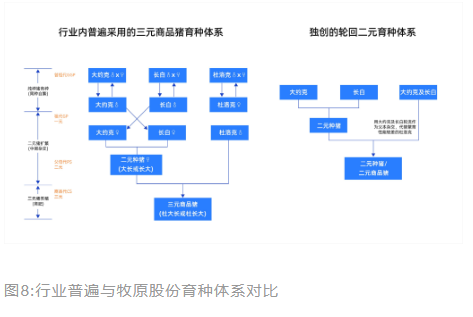  
  
相比于三元培育体系，牧原股份的二元培育体系摒弃了将二元种猪再与杜洛克公猪交配的流程，一方面将二元种猪直接留种作为种猪使用;另一方面，当母猪繁殖性能出现下降时，其瘦肉率高的特点也可以当作商品猪直接售卖。  
  
同时，牧原股份自研的低蛋白饲料体系完全适用于二元轮回杂交体系，其猪群表现出良好的生产性能，诸如繁殖力、饲料转化率、生长速度等，牧原股份目前PSY(每头母猪每年产能)已达到28，为行业领先水平。  
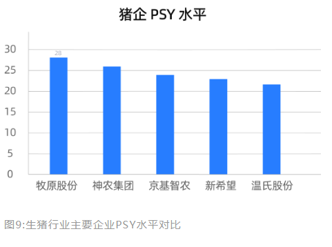  
  
### 怎么养猪能赚钱?  
  
我们再回头看看村民老李的故事，假如你是老李，你会怎么养猪赚钱呢?  
  
没错，核心要义就是反人性而为，在村民们“谈猪色变”时开始养猪，在全民养猪浪潮升起时全身而退，猪周期如此，A股亦是如此。  
  
实操层面上，想要"养猪"赚钱，我们就要判断好所处周期位置、找到关键拐点、交易风险因素。  
  
#### 判断周期位置  
  
过去二十年间，国内一共经历了5轮猪周期。一般来说，一轮猪周期整体上分为上行、震荡、下行三个阶段。判断所处周期阶段相对简单，我们只需要从价格和时间两个维度进行大致判断即可。  
  
生猪价格是反映猪周期变化的核心指标，通过观测生猪价格变动，我们大体上对生猪市场可能发生的状态有认知。  
  
但是，价格上涨也许是进入上行阶段，也有可能是震荡阶段的小幅上行，所以，我们不能仅以生猪价格作为我们的判断依据，还需要从时间维度上进一步判断。  
  
在时间维度上，从过去数轮猪周期的演绎来看，一轮周期持续时间相对恒定，基本都维持在4年多的时间，这背后是产能周期导致的。  
  
比如，在生猪价格上行阶段中，生猪产能开始扩张，但这个扩张往往需要一定时间才能实现。  
  
从母猪出生到能繁状态需要8个月时间，猪仔出生到出栏又需要10个月时间，也就是说生猪产能从紧缺到过剩需要至少1.5年的时间，也就意味着生猪价格上涨时间可以持续至少1.5年，叠加外部因素影响后，上行时间可能会被拉的更长。排除掉上行时间，震荡和下行时间就差不多就需要2-3年的时间。  
  
所以，我们从时间维度上判断本轮周期阶段，需要以上一轮猪周期上行阶段的反转到现在的时间长度来判断。  
  
就比如第四轮猪周期高点反转开始于2016年的5月，以此往后推2-3年时间，大致能判断第五轮猪周期上行阶段开始的节点，事实上第五轮猪周期上行开始于2019年2月，时间相差2.7年。  
  
#### 找到关键拐点  
  
想要寻找拐点，我们主要观察两个指标，分别是猪粮比价指标和能繁母猪存栏指标。  
  
猪粮比价主要用于判断行业是否陷入深度亏损状态。猪粮比价，顾名思义，就是生猪价格与粮食(猪饲料)价格比值，反映价格与成本间的关系，猪粮比越高，说明养殖利润越好。一般来说，猪粮比价在6左右时，生猪养殖基本处于盈亏平衡点。  
  
综合历史数据来看，历史上猪价探底阶段，猪粮比价最低基本不低于5。所以，猪粮比价达到5代表生猪行业的亏损状态达到历史极限，是判断猪价底部拐点的重要依据。  
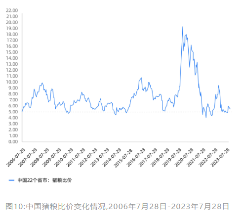  
  
第二个重要指标是能繁母猪存栏数据，主要用于判断行业产能去化情况。  
  
能繁母猪存栏指的是市场上用于生产的母猪的存量数据，是判断实际生产决策的关键性指标。  
  
能繁母猪对于养殖户是最重要的生产工具，如果行业只是出现短期的价格波动，养殖户首先会考虑调整能繁母猪的配种时间间隔，而不是把能繁母猪处理掉。  
  
也就是说，当能繁母猪存栏数开始快速下行时，说明生猪行业已经真正进入了周期底部。这里我们用能繁母猪存栏增速与生猪价格进行对比，可以很明显发现，在能繁母猪存栏加速去化时，往往对应着猪周期底部。  
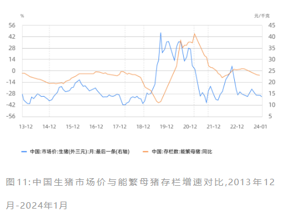  
  
#### 交易风险因素  
  
判断好周期位置，找到关键拐点后，我们就要寻找交易机会。实际交易方面，正如前文所说，猪周期具有风险越高机会就越多的特点，所以我们就要考量当下存在哪些风险。  
  
**首先，我们要看有无扰动因素**。  
  
扰动因素比如出现极端天气情况，会导致豆粕等猪饲料粮食减产，间接提升了生猪养殖成本，从而一定程度上影响生猪供给，导致猪周期发生改变。  
  
**接着，我们要看有无催化因素**。  
  
催化因素主要是疫情、政策，在过去几轮猪周期中成为影响猪周期的关键因素。所以，我们需要分析是否存在或出现诸如禽流感、猪瘟等疫情病毒的可能。  
  
政策方面，除了2015年环境保护法这种重要政策外，我们还可以关注国家收储的进程和力度，也是影响猪周期未来走势的关键。  
  
**最后，我们要看利润因素的变化**。  
  
这里我们主要看行业或者公司是否出现非常大的亏损，如果公司盈利表现远低于市场预期，出现净利润增长降速甚至亏损，这意味着未来很可能开始出现反转机会。  
  
比如在2019年第五轮的猪周期中，牧原股份股价自2019年一季度开始启动，而牧原股份在2019年一季度的净利润却是在亏损的状态。  
  
2021年也是如此，在2021年三季度牧原股份净利润出现大幅亏损的情况下，股价却开始持续上涨。  
  
从估值的角度来看的话，猪周期在估值高到非常夸张或者为负时，股价具有较强的上行动力，存在很大的交易机会。反而在估值冰点时，股价会面临比较大的下行压力。  
  
在投资标的选择上，从个股和行业两方面考虑。一方面，虽然在一轮猪周期行情中，个股表现会相对更强，如果押中了猪周期的王者，比如过去的牧原股份，可以在上行周期中为你带来超越生猪行业指数非常多的超额收益。  
  
但反过来看，个股投资的风险同样也非常高，即便是再强的公司，也不能百分之百保证能够抵抗住周期的力量，很可能会在周期下行时，由于自身资产负债率过高，经营现金流紧张，经营稍不谨慎，很可能遭到破产出清。  
  
所以，在个股投资上，尽量不要押注单一标的，而是选择行业内能力优秀，市占率排前列的几只个股，分散布局。  
  
另一方面，由于周期波动剧烈，生猪行业整体行情变化就比较大，从行业ETF入手，做行业β投资也是不错的选择。  
  
行业投资既可以把握周期上行带来的大行情，由于分散布局了行业内多只个股，一定程度上规避了单一公司暴雷带来的极端风险，收益风险性价比较高。  
  
总的来说，猪周期的核心理念可以归结为守正出奇。  
  
所谓守正，即跟随周期变迁，顺大势而为;所谓出奇，即与风浪共舞，从风险中寻找机会。  
  
就让我们一起等待下一轮猪周期来临吧!  
