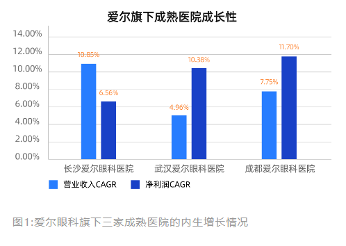
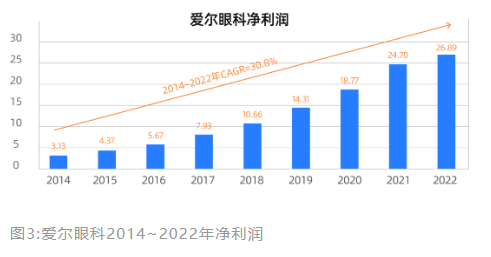
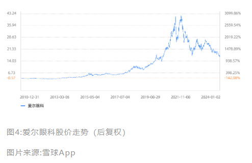

## 17|以爱尔为例，学习分析并购增长的公司

在股市中，你是否遇到过这种情况:一家公司近期的业绩非常优秀，股价节节攀升，而当你买入后的某一天，股价却毫无征兆地“崩“不住了，陷入持续下跌中。你损失惨重，但又一脸懵，根本不知道自己是“怎么死掉“的。

这时，你可能买到了依靠并购增长的公司。并购带来的短期高成长，可能会在股市中被"热炒“一拨。然而，如果并购不能带来持续增长，资本的热度很快就将退去，只留下亏钱的你在风中凌乱。

所以，**我们在做投资时，关键是要识别公司的高成长是不是可以持续**。

公司的成长有两种方式，一种是基于公司主业的内生增长，另一种是通过并购进行外延式增长。

内生增长比较好理解，并购增长则比较复杂。这节课，我们学习一下，并购增长模式的分析方法。

### 并购增长，是捷径还是雷区

依靠并购扩张成长起来的公司，在股市行情好的时候，也会受到资金追捧，但这种公司如果不能把外延增长转变为内生增长的话，就容易出现高风险。尤其是在资本市场顺风顺水时，缺乏内生增长、完全由资本的风吹起来的公司，我们要格
外注重投资风险。

比如全通教育，就是一家“成也并购，败也并购”的公司。

2014年，教育行业正值全盛时期，全通教育上市，2015年就开启了“买买买“的疯狂扫货模式，一年内完成8家公司的并购，总共耗资14亿元。

当然，并购带来的效果也是立竿见影，2015年公司的营收、利润分别同比大增127%、158%，叠加资本市场对教育股的普遍看好，公司股价持续上扬，一度创出467元的高价，成为当时的新晋“股王”。

然而，短暂的繁荣消散之后，剩下的却是一地鸡毛。

当初疯狂的"买买买"，留给日后的是商誉大额减值导致账面亏损惨重，2018年公司亏损6.13亿，把过去五年的利润一把亏光，2019年再亏7.17亿。公司股价更是在三个月内疯狂下跌86%，此后进入长期阴跌状态。

在A股，也有一家依靠外延式并购成为行业龙头的公司，那就是爱尔眼科。

首先，爱尔眼科的内生增长能力并不弱，然后依靠非常强大的并购整合能力，沿着主业进行外延式并购扩张，把并购模式演绎成确定性较强的企业成长故事，近十年来，爱尔每年的利润增长率都稳定在百分之二三十。

即便如此，市场上对爱尔眼科依然存在激烈的多空争议。支持者认为这种模式符合多方利益，在行业扩张期，公司可以依靠并购迅速占领市场，形成规模优势;而看空者则认为这就是一个资本游戏，不仅多次融资损害了股东利益，收购形成的大额商誉，还埋下了爆雷的风险。

本节课，我们就以爱尔眼科为例，学习一下如何分析并购增长模式的公司。

### 如何分析并购增长的公司

对于并购增长模式的公司，我们主要从公司所处行业背景、公司内生增长情况、公司并购的具体模式、并购模式在什么情况下会被打破四个方面，进行分析。

#### 看行业背景，成长期更适合并购扩张

一般来说，当行业处于成长期时，市场的需求空间在持续增长，行业集中度低，渗透率较低，主要企业处于快速扩张期，此时，并购扩张模式更容易帮助企业迅速占领市场，形成规模优势。

如果行业已经进入成熟期，这个阶段进行并购扩张的企业，则有可能是因为自身缺乏内生增长动力，在寻求新的增长点。

我们看一下，爱尔眼科所处的行业是什么情况呢?

爱尔眼科属于眼科医疗服务行业，在人口老龄化趋势加快、互联网普及导致用眼强度增加、人们眼健康意识不断提升等因素的推动下，市场需求持续增长，行业空间巨大。

国内眼科医疗服务行业的渗透率仍比较低。以屈光手术为例，2021年我国每千人激光近视手术量仅为 0.7 例，而同期韩国、美国的这一数字分别为3.8例、2.6例。

目前，民营眼科行业形成“一超多强“的竞争格局，行业的市场集中度还比较低，CR3(行业前三名市占率)仅为37%，不过爱尔眼科独占28%的市场份额，头部效应已经显现。

综合来看，国内的眼科医疗服务行业仍处于快速成长期，市场需求持续增长，渗透率和市场集中度都较低，头部公司正处于抢夺市场份额的阶段，此时并购增长模式是符合公司发展的。

#### 看内生增长，打铁还需自身硬

如果公司自身没有成长性，甚至主营业务出现衰退，仅依赖收购其他资产贡献业绩，这样的企业投资风险较大。如果公司的内生增长能力强，并能把收购来的资产与原有主业很好的协同，把并购增长转化为内生增长，就有可能通过并购做大做强。

分析公司的内生增长，可以看近几年营收、利润的增长率。

我们选取爱尔眼科旗下几家成熟医院，看一下爱尔眼科的内生增长情况如何。

2017~2022年，长沙、武汉、成都三家成熟眼科医院的营收复合增长率分别为10.85%、4.96%、7.75%，净利润的复合增长率分别为6.56%、10.38%、11.70%，三家医院均低于公司整体增速，说明爱尔过往的快速增长，主要依靠并购项目贡献业绩增量。未来一旦并购模式被打破，公司的成长性将会被削弱。

#### 看资金来源，发展要快更要稳

公司是通过什么模式进行项目并购的，所需要的资金来源是什么，直接影响到公司的财务状况以及未来的发展进程。

如果是利用自有资金进行并购，这样的风格比较稳健，但短期内可能面临较大的现金流压力；

如果是通过举债进行并购，则会加大公司的债务压力，还需要承担每年的利息支出；

如果是通过股权融资，企业会直接获取一笔现金流，看起来是最轻松的选择，当然，代价也是有的，那就是原有股东要出让一部分股权。

每一种模式都各有利弊，并没有绝对的好坏之分。我们需要重点关注的是，公司选择的模式是否符合其财务状况和所处的发展阶段。

我们看一下，爱尔眼科是以怎样的模式进行并购扩张的。

从爱尔眼科上市以来的发展历程来看，其并购模式可以分为两个阶段，2014年是转变的重要分水岭。

#### 2009~2013年:新建医院+自有资金并购

这个阶段，公司深耕湖南、湖北两个省份，将原有的”三级连锁“模式升级为"四级连锁“模式，在两湖地区完成地级市眼科医院的布局后，将扩张的触角下探至县级区域。

同时，公司打造了长沙爱尔眼科医院、武汉爱尔眼科医院等样板医院，并根据成熟样板医院的运营经验，总结出一套标准化的服务体系，为日后的规模化扩张奠定了基础。

在深耕两湖地区的同时，爱尔也没有停止向其他省份进军的脚步。到2013年，公司的服务网络已经覆盖了全国23个省级行政区。

这个阶段，公司的扩张主要依靠自建医院和利用自有资金进行并购。这种扩张模式，前期投入成本非常高，还要承担医院刚建好之后的几年亏损期，而且受到资金限制，扩张速度也比较慢。

#### 2014年至今:上市公司+PE基金组成的并购模

2014年，爱尔开始引入“并购基金“模式，此后扩张的步伐明显加快。短短几年内，就成长为全国规模最大的眼科连锁医疗机构，服务网络不仅覆盖大陆各份，还向香港、东南亚、美国、欧洲等地区延伸。

所谓”并购基金"模式，就是爱尔眼科与PE基金(私募股权投资基金)合作，共同孵化新项目。

PE基金凭借丰富的社会资源和资本运作能力，向社会募集资金，成立新医院或收购其他眼科医院，使用爱尔的品牌来经营。

爱尔则为新医院提供技术、管理、医师等资源，把标准化的服务体系在新医院推广，扶持新医院发展。

当新建医院度过了1~5年不等的培育期，达到收购要求后，爱尔将新医院收购，并表到上市公司。

在这样的模式下，爱尔眼科和PE基金实现了共赢。PE基金获得丰厚的投资回报。

而爱尔眼科只需要拿出少量现金，就能通过PE基金撬动大资金进行规模化扩张，新医院在上市公司体外孵化，降低了培育新医院对上市公司现金流和业绩的影响，也降低了投资风险。

同时，收购的新医院即将进入爬坡期，并表后很快就能贡献业绩增量，保证了上市公司业绩的稳定性。

这样，在公司财务上就体现出营收、利润的稳步增长，从而赢得资本市场的高估值。

爱尔利用高估值，以付出较少股权的代价进行融资，融到钱后继续并购新项目，保持业绩稳步成长，维持高估值，再次利用高估值进行融资

......

形成良性循环。

在行业成长期，这种模式是符合公司发展目标的。也正是凭借“并购基金“模式，爱尔眼科在全国市场攻城略地，抢占市场份额，快速成长为行业龙头。

#### 看增长逻辑，哪些环节可能会出问题

对于依靠并购增长的公司，当并购模式正常运转时，一切顺风顺水，公司业绩持续增长，市场估值也能维持在较高水平，投资者仿佛什么时候进入都是正确的，都能赚到钱。

而一旦这种模式被打破，无法继续运转下去，公司业绩达不到市场预期，往往会引发投资者大量抛售股票，高位接盘的人将会面临估值与业绩的'双杀”，遭受惨重的损失。

所以，我们还要分析并购模式在什么情况下会被打破，从而未雨绸缪，早做打算。

判断并购模式在哪些环节可能会出问题，没有固定的方法，要结合公司的具体模式，从增长逻辑中找到关键变量，从而发现风险点。

对于爱尔眼科的“并购基金"模式，可能会从哪些环节出问题呢?我们来分析一下。

##### 估值溢价消失

影响市场估值的因素很多，也很复杂，并不是人为可控的。即便公司能够维持业绩优异，在市场处于熊市时，依然可能面临“估值杀”。

比如自2021年7月开始的下跌行情，爱尔的市盈率从170倍以上下降到40倍以下。

如果资本市场长期不能给出高估值，爱尔就无法以较低股权成本进行增发融资，也就没有足够资金去做并购来维持业绩的高成长，并购模式就可能会被打破。

##### 缺乏优质项目

为了保证旗下眼科医院都是精品，爱尔对于项目并购制定了一系列的考察标准，比如新医院具有经营稳定性，已经实现盈利或达到盈亏平衡点，管理水平和医疗质量都要达到上市公司的要求，等等。

未来，随着市场趋于饱和，如果公司找不到足够多的优质项目去并购，扩张速度也会降下来，导致并购模式被打破。

##### 管理能力无法匹配扩张速度

精细化的业务布局和快速增长的医院数量，对公司的综合管理能力提出极高要求，比如资源整合能力、医疗技术标准化、医师培训、品牌维护，等等。

如果爱尔的综合管理能力不能匹配其发展速度必然会阻碍公司的扩张步伐。

##### 成熟医院质量下滑

虽然爱尔每年通过并购新医院带来业绩增量，但不可忽视的是，已有的数百家成熟医院依然是公司的基本盘.

如果行业基本面变差，或公司的竞争力减弱，导致成熟医院的盈利能力下滑，并购模式同样有可能被打破。

### 并购增长的公司，要不要投资

回顾A股市场，**真正依靠并购走向成功的公司并不多，反而是由于对并购资产“消化不良”，最终惨遭失败的案例倒是数不胜数**。

除了前面提到的全通教育，还有威创股份、和晶科技、百洋股份、乐通股份......

它们的共同之处，都是乘着行业东风顺势“买买买”，股价随着资本的热捧创出历史新高或阶段新高，此后并购的”后遗症”发作，股价快速砸下来，陷入长期的阴跌，在这个过程中，大批追高的投资者深埋其中，欲哭无泪。

即便强如爱尔眼科，具备强大的资源整合能力，始终沿着自己的主业进行并购，且对并购资产有严格考察，当并购达到一定规模时，依然会出现些管理问题。

再看爱尔眼科的股价走势，自2014年公司引入并购基金”后，后复权价格从2014年开年的101元，一路飙涨到2021年最高点2711元，七年半的时间，涨了27倍!

长期优秀的业绩表现，以及连续七八年的股价长牛行情，似乎验证了爱尔模式彻底走通了!

然而，公司股价在2021年7月创出历史新高后，却未能继续高歌猛进，而是陷入震荡下跌阶段，市盈率也从170倍以上跌到40倍以下，这当中无疑有市场整体行情走低的因素，但也反映了投资者对于“并购基金"可持续性的担忧。

实际上，“并购基金“模式的终结，已经进入爱尔眼科决策层的考虑之内。

在2023年5月的股东大会上，公司创始人陈邦表示，并购基金发展模式在爱尔眼科完成了历史使命，将逐步退出历史舞台，今后将以上市公司直接投资为主。

可见，企业要想通过并购扩张实现持续增长，是很难的事情。

爱尔眼科几乎是A股市场中把并购扩张模式做到完美的代表了，即便如此，这种方式带来的增长可能具有阶段性，**企业终究要回归内生增长**。

落实到投资层面，对于并购增长模式的公司，高成长阶段确实很迷人，但也充满了风险。

如果一定要投资这类公司，需要格外谨慎，一方面，要对公司的成长逻辑、风险点都有深刻的认识;另一方面，不能给到过高估值，留出足够的安全边际。

以上就是我们对于并购增长模式公司的分析，并购增长往往伴随着较大的不确定性，如果把握好参与时机，可能会获得非常高的收益，但也承担着较大的投资风险。

关注公司的内生增长，做确定性更强的投资，或许是更好的选择。
