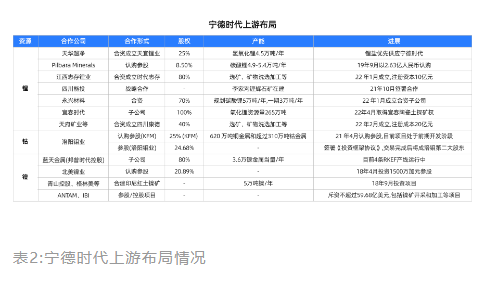
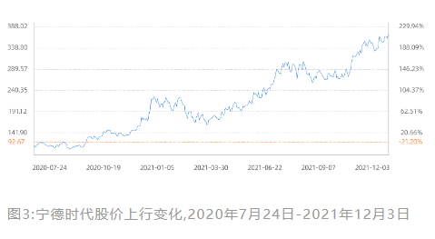
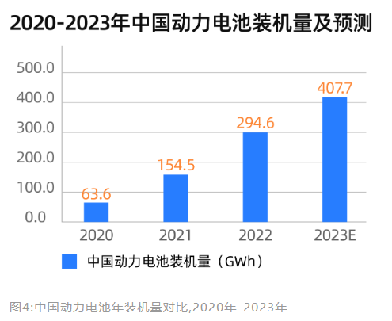
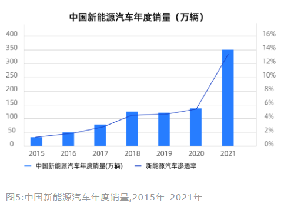
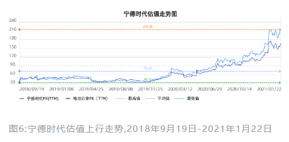
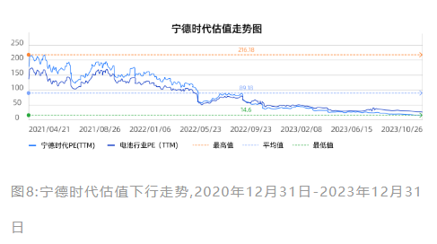
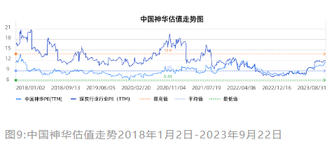
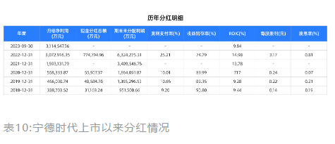
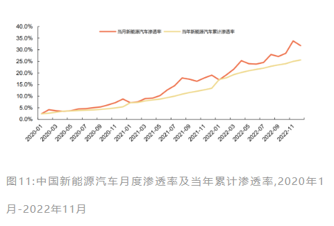
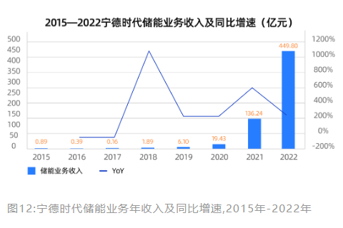

---  
title: 18|剖析宁德时代,演绎超级成长股的波动周期  
index: true  
icon: editor  
order: 19  
category:  
  - 短线  
  - 大A  
tag:  
  - 雪球  
---  
  
## 18|剖析宁德时代,演绎超级成长股的波动周期  
  
A股市场的投资者有强烈的成长偏好，相比于只给到10倍估值的银行股、电力股，100倍估值的科技股、医药股似乎还有更多想象空间。而估值与利润齐升这样的戴维斯双击的机会，更是让众多投资者魂牵梦绕。  
  
作为A股成长股之王，宁德时代曾经上市仅3年市值就突破万亿元，期间涨幅高达13倍，甚至带动了创业板ETF(159952)实现翻倍涨幅，实现了一批投资者的暴富梦。  
  
然而，越迷人的就越危险，你很难想象这样一个深市“股王”，未来有一天市值会蒸发万亿元，高点回撤超过了60%，让一众信仰“宁王“未来十万亿市值星辰大海的投资者苦不堪言。  
  
那么，宁德时代的成长逻辑如何演绎的?曾经的宁王”还有高成长机会吗?本文带你了解清楚。  
  
### 什么造就了“宁王”的高成长?  
  
宁德时代在上市后的五年时间里，经历了一轮完整的成长周期，总体上可分为上行和下行两个阶段。  
  
处于上行阶段的宁德时代，成长与预期并行，利润与估值齐飞，这个阶段下的投资者总能搏得戴维斯双击机会。  
  
那么在这背后，究竟是什么驱动了“宁王“利润高增长?又是什么主导市场曾给到200倍的夸张估值?  
  
#### 核心技术建立垄断  
  
所谓”人无我有，人有我精”，在高端制造产业，是否拥有领先的技术是一家企业有无利润增长空间的前提。  
  
在过去几年，宁德时代通过技术先发、获取专利、建立垄断这样的模式构建起自身的护城河。  
  
截至2022年底，宁德时代已经拥有5518项境内专利及1065 项境外专利，正在申请的境内和境外专利合计10054 项，专利覆盖锂电池中上游各个环节。其他电池厂商想要有新的技术突破，必须要先过宁德时代这一关。  
  
经过在技术领域不断"滚雪球”，宁德时代的电池技术现如今很难被超越。  
  
2023年4月，宁德时代重磅发布凝聚态电池。该电池能量密度高达500Wh/kg，相当于松下2170圆柱电池的近两倍，比亚迪刀片电池的近三倍，碾压竞争对手的同时，也突破了液态锂离子电池300Wh/kg的理论能量密度上限。  
  
技术创新可以给企业带来潜在份额增长，但更重要的则是降低成本水平。降低成本的好处不仅是给企业带来拥有更高的毛利率，而且也给到了企业更多的价格调整空间。  
  
比如当市场需求偏紧时，电池厂商们往往大打“价格战”，宁德时代则可以在保证盈利的前提下，大幅度降价以打压竞争对手，这一点从目前各电池厂商的电池度电售价就可以验证。  
  
  
总的来说，获取技术领先实质上是获得了对价格的控制权，保证了宁德时代的行业竞争力，从而奠定了未来高增长的基础。  
  
#### 产能优势抢占份额  
  
如果说技术领先是帮助宁德时代在"价"的层面建立起的垄断，产能优势则是宁德时代在“量”的层面建立起的掌控。在液态锂电池阶段，镍、钴、锂等稀有金属作为动力电池的核心原材料，获取难度较大，开采周期较长，这就极易导致供给紧缺的情况。  
  
而宁德时代很早便意识到了这一点，提前在供给端进行布局。  
  
  
从2019年开始，宁德时代便开启“大手笔“的投资扩产，募集约300亿元资金用于湖西锂离子电池扩建、四川时代动力电池项目一期等5个项目，新扩产能约100Gwh，约为已投产能的1.7倍。  
  
2020年10月，宁德时代再度投资近390亿元用于宁德、溧阳和宜宾的三大动力电池及储能电池项目扩建计划，新扩张产能约130gwh。  
  
2021年，动力电池原材料进入了供给短缺周期。供给短缺就会导致价格暴涨，电池级碳酸锂价格由年初约7万元/吨的价格，一路扶摇直上攀升超27万元/吨，涨幅高达285%。  
  
上游原材料价格暴涨，让中游电池厂商们苦不堪言，一方面成本大幅提升导致利润空间被压缩，另一方面也因为自身产能限制无法“吃“下更多订单。  
  
而宁德时代凭借提前布局，成功化解了这次产能危机，不仅没有受到影响，反而借此机会加速吞噬市场份额，在2021年净利润历史性突破了200亿元，同比2020年增长达185.34%，市值也突破了1.6万亿元，成为了没有对手的行业龙头。  
  
  
#### 需求爆发推升估值  
  
通过技术与产能建立起的优势使得宁德时代量价齐升，净利润获得了高速增长。那么，宁德时代是靠什么获得估值增长的呢?  
  
说到估值，就不得不提到一个词--景气度。最气度可以理解为一个行业的繁荣程度，其本质反映的是行业的需求程度，行业景气度越高，意味着需求在爆发增长，市场就产生了高度预期，估值则会有更高的提升空间，行业内的公司自然就有可能获得估值增长。  
  
从下图数据可以看出，中国动力电池行业自2020年开始，进入了高景气周期，2021年、2022年中国动力电池装机增速分别为142.92%、90.67%，复合增速达到115.22%。  
  
  
需求的爆发主要源于两个方面，第一个是动力电池产品力迎来加速升级。  
  
在动力电池发展之初，产品并不成熟，续航里程短、稳定性差、充电速度慢等问题一直为市场所诟病，这就导致了终端消费者对于纯电汽车并不看好，家用购车需求就比较低迷，行业发展预期相对较低。  
  
而从2020年开始，动力电池技术迎来质的飞跃。  
  
宁德时代首创CTP1.0技术，比亚迪也于同年发布跨时代的刀片电池，电池体积利用率首次突破60%，续航里程突破600km。  
  
虽然新技术在稳定性、充电速度等方面依然没有很大提升，但家用购车需求已然因为续航性能得到了极大的提振，2021年中国新能源汽车销量迎来井喷式增长。  
  
  
需求爆发的另一方面是来源于重磅政策利好刺激。  
  
2020年7月，工信部、农业农村部、商务部联合印发了《三部门关于开展新能源汽车下乡活动的通知》。  
  
10年前，中央层面发布“汽车下多"政策大力推动了燃油车的发展，而在10年后，汽车产业迎来从燃油车到新能源汽车转变的关键节点，同时也正好处于在上一轮汽车需要置换的时间点，“新能源汽车下乡”政策直接推动了新能源汽车购车的需求，在2020年下半年、2021年新能源汽车下多车型销量同比分别增长80%、169%，成果显著。  
  
第二个具有跨时代意义政策是关于新能源汽车配套设施的。  
  
电动汽车充电问题被认为是电动汽车推广的“最后一公里”，作为电动汽车核心配套设施，充电桩自2020年起迎来加速发展。  
  
2020年充电桩作为新能源汽车推广配套设施，首次被写进政府工作报告，纳入“新基建”，成为七大产业之一。截止2021年底，全国充电桩保有量达 261.7 万台，较2020 年新增94万台，同比增长56%。  
  
所以，估值即人性，发展越繁荣，市场预期就会越高，给予的估值就会越高，2021年的宁德时代就验证了这一道理。  
  
净利润的超预期增长与行业高景气形成共振，市场预期产生了极高的预期，就形成了宁德时代当年超过200倍的夸张估值。  
  
  
什么打破了“宁王“的成长逻辑?  
  
正如顶尖水平的运动员不会在每次比赛都打破世界纪录一样，任何一只成长股都不可能永远加速增长，宁德时代也是如此，在2021年净利润实现了185.34%的飞速增长后，在此基础上实现更高的增速是一件几乎不可能的事情。  
  
可最矛盾的点在于，如果没有越来越高的增速欠下的200倍估值的“债“又该怎么还?这也是每个成长股都会面临的困境。  
  
宁德时代也终究没有逃过成长股困境，在2022年面临估值下杀后，2023年又遭遇利润与估值“戴维斯双杀”。  
  
所以，是什么导致了宁德时代增长趋缓?又是什么导致了估值大幅下杀?  
  
#### 需求承压打断增长  
  
实际上，宁德时代的增长自2022年起开始展现疲态。2022年、2023年宁德时代净利润同比增速分别为92.89%、46.4%，相比于2021年185.34%的增速水平，由加速发展转向降速发  
展。  
  
除此之外，自2022年开始，宁德时代在国内动力电池市场的市占率也开始出现持续下滑的态势，宁德时代在国内市占率在2019年、2020年、2021年连续三年保持在50%以上后，在2022年开始出现大幅下滑，而到了2023年市占率更是勉强维持在40%的及格线。  
  
  
增长降速不仅是由于过去的基数较高造成的，更重要的，是背后的供需格局发生了更严重的恶化。  
  
前面讲到，2021年动力电池产业链迎来了需求爆发的最气周期，同时也进入了供给短缺周期，在供需关系失衡下，造成了产能紧缺、原材料价格暴涨的局面。  
  
而宁德时代凭借自身产能优势，在供需错位初期保持住了毛利率并加速吞噬市场份额。  
  
可事态并没有就此而停息，彼时现有产能依然不足以满足下游需求，于是产业链供需格局在2022年开始恶化加剧，上游碳酸锂价格继续暴涨至60万元/吨的天价，成本端的暴涨相当于上游供应商大口吃肉，中游电池厂商、下游车企甚至连汤都很难喝上一口。  
  
终于，宁德时代也不堪重负，盈利空间遭到了大幅压缩。其动力电池业务毛利率于2022年中一度被压缩至15%，为7年以来最低水平。  
  
供给短缺造成的压力最终开始由中向下游转移，宁德时代为了稳住业务的毛利水平，与下游车企谈判建立原材料价格联动机制，尝试将部分价格波动向下转移给车企，电动汽车的终端销售价格开始上涨。  
  
据瑞银测算，2022年因电池价格上涨，每辆纯电动汽车成本平均增加1.5万元。不仅价格上涨，电动汽车消费者在2022年即便甘心为涨价买单，也因为排产周期长而不得不等上至少2个月的时间才能交付。  
  
就这样，终端需求受到了严重的抑制，行业格局出现恶化，导致宁德时代的高增长节奏被打断。  
  
#### 海外“围剿"杀估值  
  
国内市场内卷导致宁德时代的成长性遇到瓶颈，可放眼全球市场宁德时代的市占率可是逐年突破的，这样总能保住宁德时代的估值吧?  
  
非也!相反的，中国动力电池行业正在遭遇欧美市场的"围剿”，从而扼杀了宁德时代的估值增长。  
  
目前，欧盟在建立一条独立于中国的电池供应链，从而减少对中国进口的依赖。  
  
2023年，欧洲议会投票通过一项提案计划，即到2030年，其战略原材料供应从单一国家的进口不得超过65%。而美国的《2022通胀削减法案》更是将宁德时代的发展预期打落谷底。  
  
2022年8月，美国参议院通过了《2022通胀削减法案》。这项法案主要是通过购车补贴刺激美国市场购车消费需求，从而扶持本土新能源车产业链并吸引外部厂商来到美国投资建厂。可戏谑的是，这些补贴设置了严苛的限制条件。  
  
简单来说，所购车辆必须是在美国本土生产的新能源汽车，不仅如此，电动车所用材料、关键矿物以及电池组件必须有40%-50%以上来自美国或美国贸易伙伴，而且限制比例还要逐年递增，如若满足不了前述条件则无法享受购车税收减  
免。  
  
这就意味着，美国以外的新能源车企、电池厂商想要打开美国市场，不仅要在美国投资建厂，同时还要被迫采购美国本土生产的原材料。  
  
实际上，这是一个很难满足的条件，因为现在全球大约90%的主要锂矿和钴矿都是在中国加工生产的，同时美国又是中国最大的锂电池出口国，这对宁德时代成长预期无疑是一次重大冲击。  
  
内忧外患的双重打击下，宁德时代股价由2021年12月最高点382.68元/股(前复权价)一路跌落至2023年12月19日最低价146.27元/股，回撤高达62%，总市值损失高达10399亿元。而估值也由2021年底的137倍在两年间下杀至现如今的15倍。  
  
  
### 未来的“宁王”该怎么投?  
  
所谓“成也萧何，败也萧何”，宁德时代过去在行业最气上行周期乘风而起，同样的，也会在行业内卷周期中遭到“反噬”。那么，站在当下看，宁德时代未来该如何投资呢?  
  
#### 转向价值股投资  
  
先说一个事实，全世界范围内没有一家公司可以长期维持高速增长，公司发展会随着科技水平、行业规模、人口增长等因素而边际放缓，能够在十年维度保持10%的年复合增长率就已经非常罕见。  
  
所以，从投资的维度讲，成长股的投资逻辑最终会向价值股进行演变，就像贵州茅台在十年前作为成长股存在，随着成长性下降、确定性逐步提升，而转向了价值股。  
  
那么，我们可以就此认为宁德时代从现在开始要转向价值股投资了吗?  
  
判断是否能作为价值股投资主要看估值水平和分红水平两大变化。首先说估值水平变化，宁德时代目前的PE(TTM)来到了15倍左右，有趣的是，在2024年1月5日，煤炭龙头中国神华股价创下15年新高，总市值超越宁德时代来到了6638亿元，而其PE(TTM)是11倍左右。  
  
这么一看，宁德时代似乎真的具备一定价值股特征?如果这么想，就真的错了。  
  
我们先看下中国神华的估值是怎么走的：  
  
  
在过去近6年的时间里，我们可以很明显的发现，中国神华的估值存在一个小幅区间，估值在区间内呈现周期性波动。而这个规律在银行、电力等传统价值股身上表现的也非常明显。  
  
所以，可以说价值股的估值变化要具备两个要素，即估值波动区间小、波动呈现周期性。  
  
而反观宁德时代从最初20倍估值冲到200倍，期间经历了大起大落，再下杀至现在的15倍，并未出现波动区间，也就不具备价值股在估值方面的特征。  
  
从基本面上讲，宁德时代同样不具备价值股特征，这一点从分红水平上即可验证。从基本面来说，企业分红水平是判断其是否从成长阶段走向成熟的重要指标。  
  
我们知道，一家企业在赚到钱后，往往会将利润进行再投资以谋取更好的发展。但是当发展见顶，利润再投资已经无法带来更高的边际增长，企业往往会选择分红来缩减自身的账面价值，从而让ROE水平变得更高。这也是为什么巴菲特在做价值股投资时，额外注重ROE指标，并且看好高分红的“现金奶牛”。  
  
所以，价值股的另一个特征是有较强的分红意愿和较高的分红水平，很显然宁德时代也不具备这一点。  
  
  
宁德时代自上市以来，曾进行过4次现金分红，但每次分红基本上都很“寒酸”，股利支付率长年保持低位水平，股息率甚至还不到1%，与价值股整体60%以上的股利支付率和3%以上的股息率相差甚远。  
  
从另一个角度来说，宁德时代所处的电池产业是重资产运作模式，这就意味着现金流吃紧，很难给到股东做分红。  
  
反过来看，宁德时代管理层面不认为公司发展见顶，所以才会继续将利润再投资，一样可以印证宁德时代不具备价值股的特征。  
  
#### 寻找二次增长曲线  
  
既然宁德时代难以演变成为价值股，那么宁德时代未来还会进入新一轮成长周期吗?未来的成长点又在哪里?这里我们主要从行业发展趋势、业务发展趋势、估值变化趋势三个方面来看。  
  
首先是行业发展趋势。先说一个事实，2023年特斯拉旗下车型Model y年度销量全球第一，成为全球最畅销汽车。注意，是汽车，其中也包含了燃油汽车。  
  
如果说过去电动汽车的购车需求是依靠补贴政策而支撑的，那么在2022年之后，从电动车销量渗透率就能证明，电动汽车作为购车首选已不再是一种吹嘘，也意味着动力电池的向上发展大势所趋。  
  
  
从近几年新能源汽车渗透率变化看，总体向上趋势不减。  
  
据乘联会数据，2022年，国内新能源汽车销售渗透率达到28.2%，而到了2023年，在没有补贴的情况下，在11月新能源汽车单月销量渗透率突破历史新高达到了39.4%，2023年全年渗透率达到35.7%。  
  
而从总量的角度来看，截至2023年底，全国机动车保有量达4.35亿辆，其中汽车3.36亿辆，全国新能源汽车保有量达2041万辆，占汽车总量的6.07%，相当于每15辆车里仅有1辆是新能源汽车。  
  
可以说，新能源车取代燃油车的趋势才刚刚开始。这也就意味着，动力电池行业向上趋势明确，发展空间广阔。  
  
接着是业务发展趋势，这里分为主营业务和其他业务的发展。先说宁德时代的主营业务动力电池，如果说宁德时代发布的CTP1.0技术，是动力电池的第一次技术革新。那么，宁德时代在2023年发布的神行超充电池则是动力电池发展史上第二座里程碑。  
  
在第一次技术革新时，打消了消费者对新能源汽车续航里程的纠结，因而购车需求得到了第一轮极大提振，但当时仍有相当一部分消费者因为充电速度慢，相比于燃油车补能非常不方便的问题而处于观望之中。  
  
而神行超充电池的问世，解决了充电速度慢的问题，实现了无论在低温、常温环境下，都可以进行快速补能的目标，约10分钟即可充电400km里程，该电池在2023年开始量产，在2024年装车上市后，终端购车需求或将二次爆发。  
  
我们知道，宁德时代虽然主营动力电池，但并不是只有动力电池业务，其储能、电池回收业务发展同样表现非常强势。  
  
2020年宁德时代的储能业务营收仅为19.43亿元，占营收比重为3.86%。而仅仅过了两年，宁德时代在2022年的储能业务营收就达到了惊人的449.8亿元，同比增长230.16%，占营收比重提升到13.69%，两年间，宁德时代储能业务营收增长超20倍，业务比重增长超3倍，是所有业务中增速最快板块。其他业务的飞速发展也为宁德时代的二次增长增加了新的预期。  
  
  
最后说下宁德时代的估值增长趋势。  
  
很显然，15倍并不是一个高速发展的成长股该有的估值水平，宁德时代的估值的确是遭到过度下杀的。估值过度下杀不仅与公司及行业在过去发展遇到瓶颈有关，也与国内经济增长趋缓、全球流动性紧缩、市场情绪预期过度悲观有关。  
  
另一方面，横向对比全球动力电池行业其他头部公司估值，比如LG新能源的55.3倍、SK的28.2倍，也可以印证宁德时代的估值水平也是过低的。  
  
所以，宁德时代未来的估值增长存在两个趋势，一个是市场走向正确定价，从而带动估值向合理水平流动。另一个则是宁德时代成功进入二次增长周期，预期重新起势带动的估值上行。  
  
总的来说，判断宁德时代能否进入二次增长，就要关注行业渗透率是否超预期增长，新技术有无引爆市场需求，其他业务是否带来更多惊喜，估值是否开始快速上行等几个方面，如果这些因素形成共振，那就跟着趋势捕捉戴维斯双击的机会吧!  
  
以上就是我们对宁德时代的分析，宁德时代的发展变化是一个典型的成长股演绎过程。  
  
当我们日后想投资成长股时，可以参照宁德时代的走势，从而判断其中的机会与风险。  
