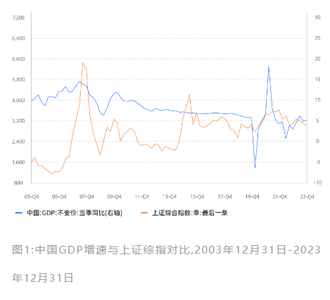
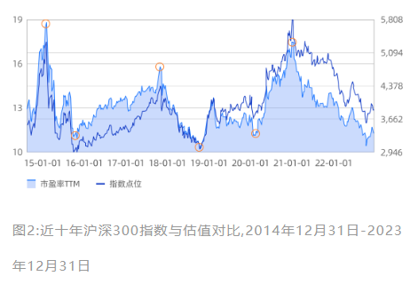
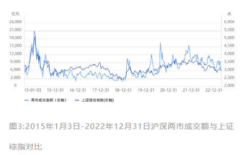
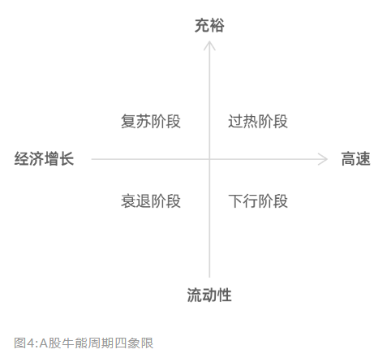
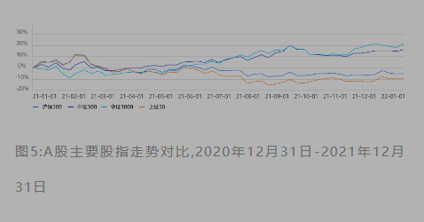

---  
title: 02|什么时候买，什么时候卖--A股的择时秘密  
index: true  
icon: file  
order: 3  
category:  
  - 短线  
  - 大A  
tag:  
  - 雪球  
---  
  
## 02|什么时候买，什么时候卖--A股的择时秘密  
  
如果在错误的季节里播种，无论怎样努力，你都很难收获饱满的果实，A股也是如此。  
  
对于普通人来说，想要赚钱就一定先要在A股大周期里择对时、择好时，并在正确的时间做正确的事。  
  
那么，A股的大周期是什么?我们又该怎么正确的择时?  
  
### 牛熊背后的天时地利人和  
  
任何我们能感知到的大周期，背后无一不是天时地利人和的驱动，A股牛能周期亦是如此，  
  
**天时即经济增长**。  
  
我们都知道一家公司股价上涨一方面源于公司利润增长，而公司利润增长的背后则是由整个国家经济发展在驱动。  
  
当国家经济处于高速发展阶段时，政策宽松积极，国内投融资活跃，市场需求旺盛，企业自然更容易赚到钱，反之亦然。  
  
所以，我们通过了解国家经济增长水平，就能大致判断企业整体盈利水平，从而判断股价上涨的动能。  
  
事实上，过往大多数时间里，国家经济增长与A股上涨都呈现出正相关的关系。  
  
我们通过观察历年GDP增长率即可直观了解国家经济增长水平。  
  
下图统计了过去二十年间，A股股指变化与经济增长的关系。  
  
当经济增长处于上行阶段时，A股往往有良好表现;当经济增长保持相对稳定阶段时，A股涨跌表现不一;而当经济增长处于下行阶段时，A股往往表现低迷。  
  
  
**地利即估值**。  
  
公司股价上涨另一方面则源于估值，盈利与估值造就了A股的天时与地利。  
  
回顾历史数据可以发现，A股的估值具有非常强的周期属性。  
  
古人云“物极必反，否极泰来”，A股的估值周期也是同样的道理。  
  
下图为沪深300指数从2015年至2023年底的市盈率变化情况，在过去8年的时间里，市盈率每触及历史极值后，无一例外地开启了快速的、大幅度的两极反转。  
  
估值快速反转的背后，往往是人性在驱使。  
  
在A股估值水平过高时，市场的“恐高“情绪强烈，很容易引起估值快速下杀;而A股估值被过度下杀时，市场抄底意愿强烈，更可能引起较大的反转。  
  
  
**人和即流动性**。  
  
即便一只股票非常好，股价有非常高的成长空间，但如果市场中没有足够的资金把股价打上去，那就是画饼充饥。  
  
这就好像在拍卖会，买家们都出高价竞拍商品，但是最后并未拿出真金白银购买，那么商品流拍，价格就无法上涨。  
  
流动性就意味着市场有没有足够多的“买家”以及足够强烈的“购买意愿”，通过A股两市成交额即可直接观测。  
  
我们统计了过往A股沪深两市成交量与股指涨跌的变化情况发现，从2015年至2022年间，两市成交活跃阶段，A股股指往往大幅上涨，在2015年尤为明显。  
  
  
经济增长、估值周期、流动性三者共同推动了A股市场牛熊周期的形成。接下来我们具体看看，不同的周期分别对应什么特征，  
  
### 如何判断A股大周期?  
  
天时地利人和的变化演绎形成了A股牛熊大周期的四个阶段，分别是:复苏阶段、下行阶段、过热阶段、衰退阶段。  
  
  
**过热阶段:经济强劲+流动性强+估值上行**。  
  
过热阶段的A股市场基本上占据了天时、地利、人和，是一个完全的牛市。  
  
你可以很明显发现，在A股市场处于过热阶段时，国内经济水平增速突飞猛进，两市成交额屡屡突破万亿大关，估值也是水涨船高。  
  
具有代表性的阶段是2020年，彼时新冠疫情席卷全球，中国由于在疫情防控方面颇具成效，经济增速在全球一马当先。  
  
与此同时，美联储开展史无前例的大“放水”，全球流动性泛滥，A股估值水平也突破了5年新高，A股走出指数级牛市，wind全A指数年内  
上涨26%，创业板指上涨65%。  
  
也是在那一年，公募基金百花齐放，平均每两只主动权益基金就有一只全年收益率超过了59%。  
  
**下行阶段:经济强劲+流动性弱+估值下行**。  
  
下行阶段的国内经济并不会在一开始就出现颓势，其至会延续过热阶段的经济水平，但A股市场预期却不再像过热阶段那样强烈。  
  
此时，部分“聪明钱"提前离场，带动流动性往下走，悲观情绪从这时开始蔓延，估值也开始下行。  
  
这时，市场会出现较大的分化，不同的市场风格、行业、市值会出现截然不同的走势。  
  
2021年的A股市场就是一个很好的案例。在美联储加息政策的影响下，流动性开始出现萎缩，沪深两市成交量自2021年7月起开始下行，成交额由最高日均超15000亿元快速跌落至10000亿元以下。市场也从7月开始出现较大的裂痕，如下图所示，中小市值成长风格突飞猛进，中证500、中证1000全年分别上涨15.58%、20.52%。  
  
而在2020年被热炒的茅、宁指数等核心资产则出现大幅度估值下杀，上证50、沪深300全年下跌10.6%、5.20%。  
  
  
**衰退阶段:经济低迷+流动性弱+估值下行**。  
  
衰退阶段与过热阶段截然相反，国内经济全面下行，成交量极度萎缩，估值极度便宜，是一个完全的熊市。  
  
衰退阶段的A股市场，看空情绪蔓延，是一个每天讲着“鬼故事”成交的寡淡市场，当然也是一个“几年后叫人拍大腿“的市场。  
  
典型的便是2018年的市场，受到中美贸易摩擦及去杠杆影响，国内经济增长回落，美联储在2018年也开始收紧流动性，市场情绪更是进入到了冰点，沪深两市成交额年内最低时只有可怜的1915亿元。  
  
当年的A股市场全面大跌，沪指全年下跌25%，全部A股年内平均收益率为-32%，93.5%的个股在2018年是下跌的。  
  
也就是说，在2018年随便买只股票持有一年大概率是亏损的，随便问一个股民当年的收益基本都亏损百分之三十左右。  
  
**复苏阶段:经济低迷+流动性强+估值上行**。  
  
复苏阶段的国内经济情况并未出现明显好转，经济增长水平往往延续了衰退阶段的低迷，但是已经出现企稳的迹象。  
  
而此时，在过去衰退阶段出台的宽松政策开始出现效果，市场的流动性先行出现好转，估值开始掉头向上，市场信心逐步增强。  
  
这一阶段同下行阶段类似，市场开始出现"乱炒"现象，此阶段下的A股市场没有坚定的主线，反而风格轮动、行业轮动加快，大多数投资者都难以捕捉其中的机会。  
  
最为典型的是2015年的A股市场，是一个流动性周期和估值(情绪)周期叠加造就的牛市，许多资金通过两融加大杠杆入场，致使两融余额和成交量不断创新高，仅3个月时间两市融资余额从1.2万亿增至2.6万亿元。  
  
反观当年的经济水平却表现低迷，GDP增速首次跌破7%达6.9%，PPI同比跌至-5.2%，通缩形势严峻。  
  
2015年的A股也颠覆了许多人的认知，盲目热炒概念的投机者赚的岔满钵满，坚信估值回归的价值投资者却举步维艰。  
  
### 什么时候买?什么时候卖?  
  
如同开篇所述，在正确的时间做正确的事，是在A股赚钱的前提。在不同的A股周期下，我们需要制定不同的买卖策略，大体可分为下面三个方向:  
  
**衰退阶段大胆买**。  
  
衰退阶段是几乎所有投资者的至暗时刻，许多人会感到愤怒、煎熬甚至绝望至极。  
  
有的投资者选择痛苦割肉离场，也有投资者因为已经满仓，只能无奈地看着自己的账户亏损，更有的投资者想逆势抄底，却因为恐惧熊市还会持续更久而煎熬万分。  
  
然而，回顾A股历史牛熊周期，每一次的衰退阶段回头看都是未来胜率最高的买点，因为这一阶段下的市场处于经济、流动性、估值的三重底部，向下的空间远小于向上的空间。  
  
所以在这个阶段下，买什么并不是很重要，敢于买才重要。  
  
就如同在2018年，无论是买蓝筹还是成长，无论买大公司还是小公司，甚至只是利用宽基布局，在未来都能得到不俗的回报。  
  
即便当下入场后，或许还要很久才熬过寒冬，但从一个完整牛熊大周期来看，综合年化回报依旧可观。  
  
所以，当你发现国内经济很低迷，A股成交很差，同时市场哀嚎遍野时，请勇于逆着人性入场。  
  
**过热阶段着手卖**。  
  
你或许听过这样的一句话，"当你身边的朋友都在讨论股票时，你就该离场了”，意思就是市场过热的时候就要准备好止盈离场。  
  
过热阶段的市场，虽然赚钱效应高，但也极易催生大量泡沫，而且泡沫通常很快就会被刺破。  
  
所以，当你发现市场整体估值高于历史60%分位水平时，你就该警惕起来考虑减仓；  
  
当市场整体估值高于80%分位水平时，请做好随时可以清仓离场的准备；  
  
当市场整体估值突破了历史最高时，请坚决离场，不要回头!  
  
**复苏/下行注重选**。  
  
在A股一个完整的牛熊大周期里，过热阶段和衰退阶段往往持续时间较短，市场在大部分时间都处于复苏和下行阶段。  
  
身处两个阶段里的市场中时，你无法躺平赚钱，因为行情并不会雨露均沾，甚至侧倾严重，比如过往的2017年、2021年结构市，呈现了有人欢喜有人忧的局面。  
  
所以，选什么、怎么选是复苏及下行阶段市场最重要的，同时也是最难的一环。  
  
当市场发生成长和价值风格变换，大小市值行情切换，行业轮动时，该如何选?我们将会在下一节详细阐述。  
