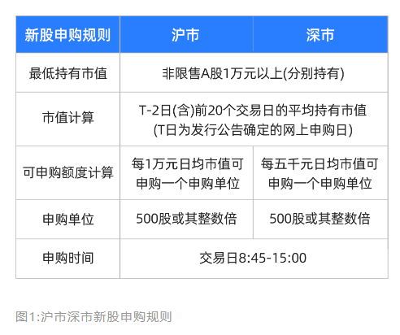
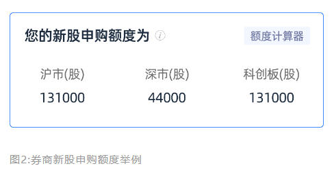
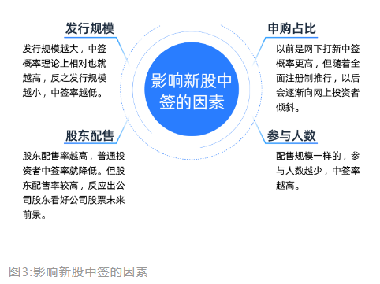
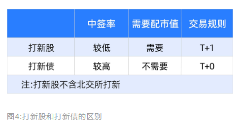
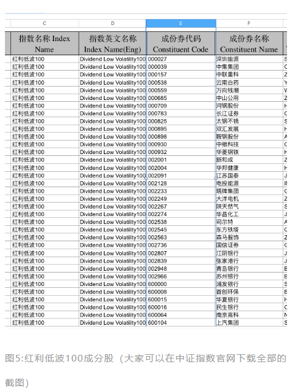
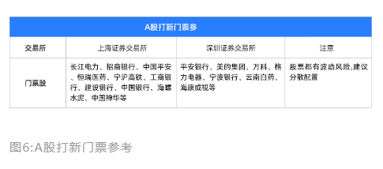
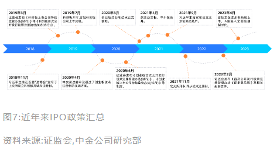
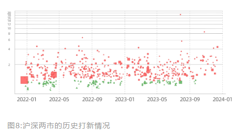
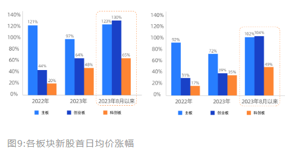

---  
title: 20|打新--具有A股特色的股民抽奖福利  
index: true  
icon: editor  
order: 21  
category:  
  - 短线  
  - 大A  
tag:  
  - 雪球  
---  
  
## 20|打新--具有A股特色的股民抽奖福利  
  
“打新“这个词汇，相信炒股的人都不陌生，如果中签了，就可以拿到即将上市的股票。  
  
直以来，打新股都是A股股民热衷的话题，新股中签率也都很低，一般在0.03%到0.05%之间。  
  
那么为什么打新会受到股民的特别青睐呢，即使在中签率这么低的情况下，也要日复一日的坚持打新呢?  
  
一方面是因为从历史情况看打新的收益非常可观，运气好的话还能抽中大肉签;其次，相比于买卖股票要频繁盯盘、盯消息、看基本面，打新的操作则要容易得多，也更加轻松。  
  
今天就来和大家聊聊关于打新的小知识。  
  
### 保姆级打新攻略  
  
打新不复杂，但这些年监管一直改规则，现在都有了一定的门槛。有一句话叫做"万事要趁早”，在打新方面非常适用，趁早把该开通的账户开通、趁早获得打新资格。股市变化不断，打新能在一定程度上给账户很大的支撑。  
  
#### 主板打新  
  
主板打新的条件目前最低。首先要开个股票账户，买一些股票，就有了打新资格了。  
  
详细来讲，沪深两市新股中购需要连续20个交易日持有1万及以上的沪市股票，5000元股票市值可认购500股，每500股1个号码。(PS.A股自2023年3月27日起全面注册制，沪市新股也从之前的1000股/号、统一调整为500股/号，相对提升了沪市打新的中签率。)  
  
  
这也就是说，刚开好的账户是不能直接打新股的。如果以打新当天为T日，那么T-2日(含)前20个交易日的日均账户市值需要达到1万元才可以打新。  
  
如果想要打沪市主板的股票，你需要在打新前22个交易日，拥有超过日均1万元的上海股票市值;想要打深市主板的股票，同样需要超过日均1万元的深圳股票市值。  
  
然后就是等待券商通知你哪天有新股可以申购，大家可以每天打开券商软件看一眼，有些券商很智能，会自动帮你计算--你可以申购多少股。  
  
比如这种：  
  
  
如果你的券商没这功能，也可以粗略的计算一下。一般来说，可打新的额度是--你手里股票市值的1/10，1万市值可以申购1000股。10万市值就是1万股。  
  
以此类推，一般手里有个10万左右的深票，就可以满打满算地申购绝大部分新股了。如果目前资金有限，也建议大家可以买入沪深两市股票市值各1万元以上，这样两市新股都可以打!  
  
还要提醒大家，打新的计算是有上限的，不管你有多少个股票账户，只会认可你最早报送到交易所的那笔为准。如多次申购，仅第一笔申购有效。因为新股配号匹配的是你的身份信息，而不管你拥有几个账户。如果你在XX券商已经申购了，再在其他券商申购是无效的哦。  
  
#### 科创板、创业板打新  
  
想打科创板和创业板，也要有股票持仓，跟主板打新的区别在于--它们的门槛更高些。具体要求如下所示：  
  
创业板权限开通的条件:至少2年的投资经验以及连续20个交易日日均资产达到10万元以上。  
科创板权限开通的条件:至少2年的投资经验以及连续20个交易日日均资产达到50万元以上。  
  
> 注意:这里的打新底仓必须是A股股票，像指数股票型基金(ETF)、B股或者港股通的股票都不算。  
  
这就意味着不是谁买了门票，都能进场玩一把的。还得进行验资，创业板需要10万元，科创板需要50万元，都需要至少放账户里20个交易日这一招就拦住了不少人。  
  
光有钱还不行，还需要一个更“严格“的条件:得有24个月的炒股经验。买ETF、可转债啥的都不算。科创板和创业板的门槛高，但很多人借钱也要开通，因为新股远远多于主板。  
  
风浪越大鱼越贵。中签机会更高，吸引着众多投资者。  
  
一般在申购日后第2天，新股会公布中签配号。一般券商都会给你发短信提醒，假如你中了1签，新股中购款=中签股数x新股发行价。  
  
举个例子，如果你中了沪市新股，那么中1签就是500股，假设新股发行价是10元/股，那么需缴纳申购款5000元。在当天16:00前，你只要转入5000元到股票账户，就完成缴款了。  
  
> 注意:一旦连续12个月内出现3次放弃缴款，你就会被拉入“黑名单”，之后半年内失去打新资格。  
  
所以我们还是要及时查询中签结果，准备好足够的资金。一般来说，新股中签后，从申购日算起20个交易日左右上市，具体看上市公司的公告。  
  
#### 北交所打新攻略  
  
开通北交所交易权限也是需要门槛的，在中购新股前，应将申购资金足额存入资金账户。具体要求如下所示:  
  
北交所权限开通的条件:至少2年的投资经验以及连续20个交易日日均资产达到50万元以上。  
  
北交所不像沪深新股申购摇号抽签，采取的是配售制。配售制的存在就意味着需要考虑以下两点:  
  
一、获配100股的最低所需资金。低于这个资金标准，那打新就是纯浪费时间，根本中不了。计算方式一般如下:  
  
1)申购资金可以参考上一轮新股的资金量。  
中签率=(公开发行量X发行价):申购资金。中签率一般在万分之几。  
  
2)中一签所需资金。  
中一签需要的资金量=(发行价x100)÷中签率  
  
  
目前网上发布的公开发行数量并不准确，可中签新股数量需要我们自己估算。  
  
实际上，对公众发行新股数量，要减去战略投资者会锁定的部分新股(一般为20%)，加上超额配售初始发行数量的新股数(一般为15%)，最后算出实际上对公众发行的数量(80%较为常见)，具体以公告为准。最近有不少老股民反应:近期这个最低所需资金在100万左右。  
  
二、如何获配分配剩余的100股→博碎股  
  
已经计算出中一签所需要的资金量，那么在准备打新资金时可以多估15%，用来搏碎股，再多也没有必要，卡一个临界值就可以。  
  
比如说:中一签需要100万元，我们用115w就能有机会1+1，215W就能2+1。当然，也会出现一只新股卷的特别厉害的情况，申购资金远超上期，这个时候我们可以酌量增加冗余资金以确保策略执行成功(如果卷的实在厉害就放弃，多牛  
的招数都没用)。  
  
北交所的打新，跟与普通沪深打新不一样。不要盲目顶格打新，会浪费很多资金;另外需要多开账户，北交所打新账户要尽可能多，相比顶格一个账户，多户可以多中新股;尽量博碎股，准确估算中一签需要的资金量，博碎股的前提首先是准确估算出中一签需要的资金量，也就是估算出中签率。  
  
如果是资金量尚且较少的投资者，这一段内容可以跳过。或者等之后资金量充足后再回来看。  
  
#### 可转债打新  
  
相比于A股打新，可转债打新最大的优势就是信用打新、它不需要你预缴申购资金，开通了资格就能打新，打中了再充值。它的第二优势是破发率较低，投资新手完全可以参与。  
  
在2022年6月，沪深交易所提升了可转债权限开通门槛，规定需要2年交易经验+开通前账户20日日均资产达到10万元(不包括融资融券融入的资金和证券)。  
  
此外，请注意可转债的面值是每张100元，以10张为一个最低交易单位，称为“一手”，一手等于1000元。因此，5000元资金最多可以买“50张”。  
  
  
大部分投资者首次接触可转债是从打新债开始的。一般打新债的收益率是按照上市首日开盘价或者收盘价除以发行价来计算的。  
  
按照2023年可转债新债的中签率来看，大多数时候单账户如果中签也只会中1手转债，面值相当于1000元。整体来看，新债单账户中签率平均值为2.48%、中位数为1.26%(数据来源:集思录;统计时间:2023年12月1日)。  
  
按照2023年可转债新债的上市收益来看，截至12月1日，2023年新债破发率为0。  
  
根据2023年新债上市首日收盘价格来看，最低为112.11元，最高为157.3元，也就是说如若中签，按首日收盘价计算可能收获121.1元至573元的毛利(未扣除手续费)，中位数287.50元，平均值343.80元。  
  
所以说，打新债是一种收益风险较为可观的投资方式，近年来被越来越多的普通投资者所喜爱。  
  
### 打新门票股怎么选?  
  
门票股的选择，应该说是打新股当中最难的一步，毕竟打新实际上为了薅羊毛，门票股选不好的话，就会捡了芝麻丢了西瓜。  
  
没有人可以保证一只股票一定不下跌，所以退而求其次只能牺牲波动性，挑选振幅小的股票，即使下跌，其跌幅可以接受。  
  
同时由于门票股需要长期持有，如果每年股票可以提供一定的股息，也可以降低持仓成本，用以对抗股票可能的跌幅，这里推荐几个选股的思路：  
  
#### 选择高股息波动小的股票  
  
市面中，红利低波主题基金可以满足我们的需求。其中“红利”=高股息，“低波”=波动小。此类特点的股票，亦不需要花费时间每日盯盘，市场全天一分钱波动，省时省力。  
  
市场中红利低波策略主题基金也有一些，比如创金合信中证红利低波动指数、天弘中证红利低波动100。  
  
  
由于基金策略原因，其持仓股本身就已经是低位的高股息门票了，我们则需要以个人判断对其进行加强选取。可以从最近的一次调仓中看到，大部分持仓仅仅调整了权重，少部分进行了调入调出。  
  
由于不同投资者对不同类型的股票喜好不同，可以将其中一些类型股票进行排除。例如，将银行股全部剔除名单，亦或是将地产股全部剔除。然后将剩余股票提升相应权重，就可以得到一个自己的低波动高股息门票打新名单了。  
  
#### 跟随优秀基金持仓股  
  
长期优秀的基金经理选股能力必定很强，所以可以参照他们的持仓，缩小筛选范围，进而选择几只中意的个股作为门票股。  
  
但是有一点需要注意，由于基金每隔一个季度才会公布持仓，所以这些股票信息可能是滞后的，最好在季度持仓公布后参考。  
  
#### 有择股能力的可以自己选择  
  
股票投资要比可转债、基金投资等复杂得多，一千个人就有一千种看法，对于有择股能力的小伙伴，可以自由发挥。这里分享下股民们根据历史经验总结的常见的一些门票股：  
  
  
但需要注意的是，股票打新是低风险而不是无风需要承担行情波动，鸡蛋不要放在一个篮子里，要分散配置降低风险。  
  
另外，打新股最终分配的数量可能会因为参与人数较多而受到限制，持有打新门票并不意味着一定能获得新股，买股票最根本的还是要建立在对公司有认知有了解的基础之上。  
  
### 全面注册制来了!'打新“≠“躺赢”?  
  
2021年之前，在A股市场打新，的确是一件稳赚不赔的事情。  
  
从2014年6月到2018年，不到两年的时间里，有1000多只新股上市，首日几乎全部在44%的涨幅以上，上市20日的平均涨幅是146%。这个趋势到了2018年也仍在延续。  
  
新股大涨这件事，不只出现在中国，而是在世界各国都普遍存在的。在金融学术语上，我们把这个现象叫做"IPO"抑价，IPO抑价是为了给处于信息劣势的投资者们一定的风险补偿。  
  
否则，如果IPO的定价总是高于市场价格，投资者就不会购买任何股票，纷纷退出市场。  
  
但是这些IPO股票的暴涨，并不意味着它的内在价值真的高于发行价，其实这些年的实证证据都在告诉我们--很多IPO公司在上市一年之后又跌破了发行价。  
  
  
2023年，监管部门声明不再对新股发行价格、规模等设任何行政性限制，新股定价更加市场化--过去IPO的套利空间越来越小，畸高的“打新”收益也就不复存在。  
  
2023年前四个月，新股上市首日平均涨幅还不错，为40.5%，不过，上市10日后，平均下跌3%。  
  
2022年全年，上市首日破发企业达到121家，破发率为28.27%，“打新"亏钱的概率是30%。  
  
下图为沪深两市的历史打新情况，y轴为打新收益(1表示收益为0，2表示翻倍);绿色表示破发，红色表示盈利;数据点大小表示网上融资规模;正方形、三角形、圆点分别代表沪市主板、科创板、深市。  
  
  
数据显示:2022年到2023年底，上市后破发的共有113支，占比19.76%，破发利率相对北交所低了不少。  
  
涨幅在20%-50%的占比最高，为26.05%。其次是50%-100%，占比23.25%。翻倍的股票共107支，占比18.70%。  
  
其中，科创板破发率较高，虽然新股发行家数很高，但整体资金收益明显低于主板。  
  
在全面注册制推行后，创业板和科创板上市5日内不做涨跌幅限制，第6个交易日起继续保持原规则不变，这就一定程度会导致上市前五日股票可能会出现较大波动，大家应该合理评估打新股票走势，避免收益回撤或亏损。  
  
### 什么样的新股更容易破发?  
  
2023年沪深两市共发行237只新股，IPO家数较上年度骤降近三成。单签收益>1万元的新股有83家、占比35.02%，较上年度的27.33%小幅提升。  
  
与此同时，新股首日(成交均价)破发35只，破发新股的亏损中位数为-2265元。上市首日破发率14.77%，较上年度减少1/3。  
  
A股自2023年3月27日起全面注册制，沪市新股也从之前的1000股/号、统一调整为500股/号，相对提升了沪市打新的中签率。  
  
但与此同时，沪深之外的北交所新增了77家上市公司，IPO募资明显在往北交所倾斜。  
  
  
打新股有风险。在A股市场上，打新股的主要风险为破发，即投资者中购的新股上市之后，其价格低于发行价，让投资者出现亏损的情况，虽然说破发的概率较低，但还是存在的。  
  
新股破发的主要原因可能有：  
  
#### 受市场行情的影响  
  
在市场行情较差的情况下，或者其所处的行业处于萧条期，新股上市之后，受其影响，股价下跌，出现破发的情况。  
  
般来说，在熊市阶段，新股破发的概率较高在牛市阶段，新股破发的概率相对低一些。  
  
如何判断牛熊周期，大家可以回顾一下课程第一部分宏观相关内容。  
  
#### 发行价过高  
  
如果新股在定价时，定价过高，严重脱离了其内在价值，泡沫性较高，导致其在上市之后，市场上的投资者以卖出为主，从而导致其股价下跌，出现破发的情况。  
  
对于破发的新股，大家应以观望为主理性判断交易时机。  
  
如何分析股票的内在价值，大家可以回顾一下课程第三部分个股分析相关内容。  
  
#### 打新市场风险不同  
  
在不同的市场上，打新的风险是不一样的。  
  
全面注册制下，主板新股前5个交易日不设涨跌幅限制，第6个交易日起，涨跌幅限制为10%，这意味着此前新股连板现象将不复存在。  
  
同时，对于无价格涨跌幅限制的股票，盘中成交价格较当日开盘价首次波动达到或超过30%、60%的，各停牌10分钟。  
  
主板市场上市标准严苛，上市企业的基本面情况相对较好，但科创板与创业板企业打新的风险相对就要大一些了。  
  
科创板与创业板实行注册制，企业上市门槛相对较低，发行价格限制小，所以风险相对较高。  
  
创业板、科创板新股上市中有一条规则，即新股前5个交易日不设涨跌幅，可见如果新股上市出现破发的话，那么潜在的损失是非常大的。  
  
总之，在打新的时候也需要对即将上市企业的基本面情况有一定的了解，尤其是对于创业板、科创板的新股而言。  
