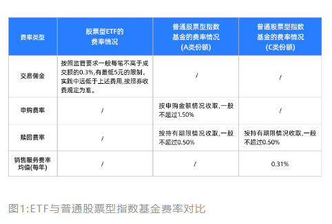
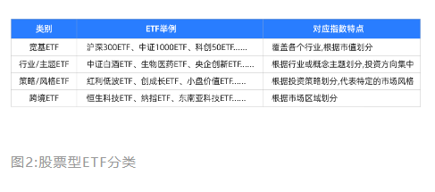
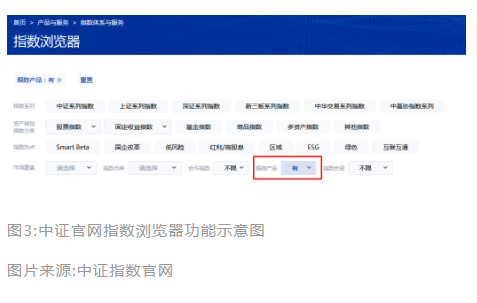
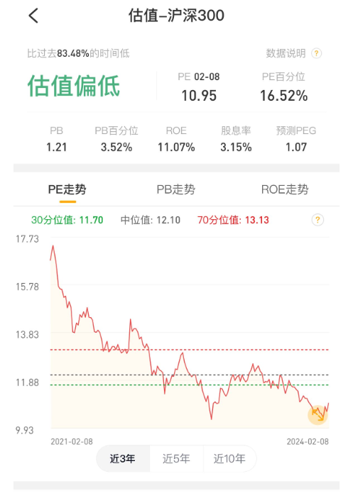
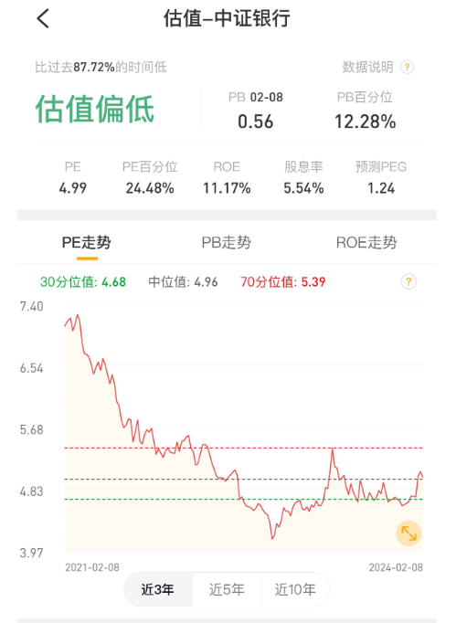

---  
title: 21|ETF--追求贝塔，但不止于贝塔  
index: true  
icon: editor  
order: 22  
category:  
  - 短线  
  - 大A  
tag:  
  - 雪球  
---  
  
## 21|ETF--追求贝塔，但不止于贝塔  
  
对于一个股民来说，最悲伤的投资体验莫过于看对了大势，却选错了个股。  
  
这种囧境目前不罕见，未来更是会成为我们个人投资者的大难题。  
  
一方面，在已经有5300多家上市公司的A股找到能持续增长的股票必定需要不菲的功力;  
  
另一方面，即使找到了确定性很强的股票，克服人性弱点这一关更是难过，贪婪、恐惧、犹豫，侥幸心理、过于自信......  
  
这些都是投资者较为普遍的人性弱点，而成功的投资通常都是反人性的。  
  
正是因为巴菲特太了解投资者失败的原因，知道这些弱点不是普通人可以克服的，所以他才力荐指数基金。认清自己的局限，是投资最重要的一步。  
  
ETF，正是最适合我们散户的指数投资工具。今天我们就来聊聊为什么越来越多的股民痴迷于ETF，如何用ETF获得不止于贝塔的收益.  
  
### 是工具，更是策略  
  
就发展速度而言，ETF在全球市场上都是神一般的存在。  
  
上世纪90年代初，美国推出第一只真正意义上的ETF产品，此后一发不可收拾，截至2023年底，全球挂牌交易的ETF资产总规模达到11.6万亿美元。  
  
我国境内ETF产品起步较晚，但从2004年第一只ETF诞生到现在，总规模也已经迅速突破了2万亿元;在A股表现颇为惨淡的2023年，ETF规模仍然在逆势爆发。ETF是投资者的选择，也是时代的选择。  
  
我们来看看ETF何以被如此热捧。  
  
#### 指数投资工具中的王者  
  
ETF全称是交易型开放式指数基金(Exchange-Trade Fund)，作为指数基金的一种，ETF本质也是一篮子股票的组合。  
  
炒股最怕的就是踩雷，万一选股不慎踩雷吃连续跌停，简直欲哭无泪，交易ETF则可以大大降低个股踩雷的风险。  
  
这里想说，分散投资、降低风险是ETF最不值得一提的优点。以下三点让ETF成为指数投资工具中的王者。  
  
#### 第一，上手简单  
  
我们常说的指数基金都是指在基金账户操作申购赎回的场外基金，“申赎“与“交易”相对，虽然ETF实际上也能做场外申赎，但操作极其复杂且资金门槛很高，一般个人投资者参与不了，在这里我们只聊场内ETF交易。  
  
只要有股票账户我们就能在盘中买卖ETF，与股票交易基本无异，而且每手100份ETF份额也就几百块钱，可以轻松完成对一篮子股票的投资，大大降低了我们交易个股的门槛。  
  
#### 第二，满仓操作  
  
目前A股市场上的ETF品种已经非常丰富，既可以买大盘指数也可以买行业指数，既有股票ETF也有债券ETF，既能投资A股也能投资全球市场。  
  
当我们通过前边的课程能够对A股牛熊位置、风格轮动、行业发展周期等有一些判断时，可以直接买ETF分享周期红利，一方面省去了选股烦恼，同时也避免了错过的遗憾。  
  
值得一提的是，ETF是满仓的指数基金，能最大程度获取贝塔收益。场外基金一般都需要预留一部分现金，以应对用户随时赎回，所以不可能达到满仓操作。而ETF基金的申购赎回都是用股票完成的，所以不需要留现金应对赎回，最高仓位就可以达到100%。  
  
也是因为这个特点，ETF跟踪指数的效果一般都比较好，与指数涨幅大致同步。  
  
#### 第三，费率便宜  
  
相比场外指数基金，ETF更大的优势在于手续费低。我们交易ETF只需要付交易佣金，且佣金费率和交易普通股票相同，一般在万2.5，但ETF买卖是不需要交印花税的，整体交易费用比股票还要便宜。  
  
以股票型ETF和指数基金对比为例，从下表可以看出，ETF场内的交易费用通常明显低于普通股票型指数基金的场外交易费用。  
  
  
#### 优胜劣汰，主动捕捉大牛股  
  
我们看到的市场上每一个金融产品，本质上都是一种投资策略。  
  
对我们股民而言，投资ETF，不是一种弱势的投资，而是利用ETF背后的指数策略主动去捕捉大牛股的行为。  
  
每个指数都有对应的编制规则，一般会对市值，流动性或者财务指标等做出定量限制，同时还会通过定期调整成分股，引入优秀的新公司，剔除表现不好的老公司，保证了涵盖的股票一直都是最优秀的那部分。  
  
比如我们最熟知的沪深300指数，由沪深两市市值最大的前300只股票组成，举个形象些的例子，学校里的优秀学生榜单，只有成绩排在前100名的学生才会上榜。考试不是一次性的，成绩下滑的学生，会被后面的优异学生替代，这样就保证了榜单中的学生一直都是最优秀的。  
  
指数就像这个榜单，表现差的公司被优秀公司不断替换掉，但指数里的公司一直都是最优秀的，可谓流水的公司，铁打的指数。也就是说，指数其实是帮我们做了选股这个工作。  
  
要想选到相对优秀长期上涨的上市公司，不光要学习财务知识，学会如何估值，要能看懂经济形势、周期波动、行业趋势，更需要我们花费非常多时间去收集信息，去梳理逻辑，去对比增长空间。  
  
综合来看，选股对于我们普通投资者而言是个难度很高的工作，而指数这个现成的策略已经帮我们完成了关键的一步。  
  
另外，即使我们选到了优秀的公司，但没有一家企业能永远跟随时代的脚步。随着社会变革、经济发展和技术进步，引领时代发展的行业“城头变幻大王旗”，但龙头企业新老交替，指数却能保持长青。  
  
从理论上来讲，指数永远保持优胜劣汰，保证了持续的新陈代谢，注定了指数的长期趋势就是不断创新高(任何个股都没有这样的确定性)。  
  
所以，投资ETF，虽然追求的是市场贝塔收益，但其实我们收获的不止于贝塔收益。  
  
### 近干只ETF，怎么选?  
  
截止到2023年年底，国内共有900余只ETF产品，我们该如何选择适合自己的ETF呢?  
  
按照底层资产分类，ETF可以分为股票型ETF、债券ETF、商品ETF和货币ETF。  
  
债券ETF和商品ETF，顾名思义是指投资债券和商品期货市场的ETF;  
  
货币ETF是指开放式货币基金，它的定位是场内保证金的现金管理工具，只要你有股票账户，就可以把里面的闲钱放在货币ETF里，如果发现投资机会，可以立马卖出ETF，买入股票。  
  
这三类ETF都是T+0交易，当天买入的ETF，当天即可以卖出。  
  
股票型ETF的数量和规模都是最大的，而且也是普通投资者接触最多的类型，在这里着重讲讲股票型ETF应该如何选。  
  
#### 配指数:看好什么就买什么  
  
在选ETF之前，需要先选定自己看好的指数。就像我们一直强调的一样，没有任何一个指数能永远处于牛市，长期来看总会有其适合或不适合的市场环境。  
  
所以选指数也就很依赖对当下或未来一段时间的趋势判断，你看好什么，就配置什么。  
  
股票型ETF按照指数类别看，大致可分为四大类，分别是:宽基ETF、行业/主题ETF、策略/风格ETF、跨境ETF。  
  
  
宽基ETF背后的宽基指数我们都非常熟悉，比较常见的包括沪深300、中证500、中证2000、科创50等，这类指数最大的优势是不限定具体行业，风险相对更小，对于刚入门准备投资的新手来说，宽基ETF门槛较低，看不懂行业趋势就可以直接选宽基。  
  
细分来看，如果更看好中国核心资产，可以选代表大盘股的中证50、沪深300、MSCl中国A50等指数;  
  
如果更看好中小盘就可以选中证500、中证800，更看好小票、小微盘就可以选中证1000中证2000等；  
  
如果更看好中国新经济，那么就可以选创业板或科创板等相关指数。  
  
行业或主题ETF跟踪某些特定的行业或概念主题指数，投资方向集中，如果你看好某个特定的赛道，那么就可以选对应的行业ETF，一键打包买入一个板块。  
  
我们一直在说，产业迭代对股票市场的走向影响颇大，事实也证明，近几年能取得阿尔法收益的投资者无不是因为选对了行业赛道，不过成也赛道，败也赛道。  
  
行业ETF由于投资方向集中，整体波动较大，如果对行业前景趋势不是十分了解，不建议在这类ETF上做重仓押注。我们熟知的“丐帮““药帮“就是血淋淋的例子。  
  
策略或风格ETF则代表某一类投资策略，比如红利ETF，跟踪的红利指数由一篮子高股息股票组成，如果你认可红利策略，认可高股息股票的长期投资价值，就可以借助红利ETF投资所有符合条件的这类股票。  
  
策略或风格ETF可以简单得理解为代表特定的某种市场风格，你看好大盘成长风格，就可以选大盘成长ETF，看好小盘价值那就选小盘价值ETF整体看，这类ETF的风险介于行业ETF和宽基ETF之间。  
  
上述3类股票型ETF都是投资A股股票的指数基金，而跨境ETF跟踪的是除了A股以外的市场，目前我们可以交易的跨境ETF不仅覆盖港美股市场，还有像印度、越南等新兴市场也可以轻松投资。在A股上市交易的股票型ETF绝大部分是T+1，而跨境ETF可以T+0交易。  
  
以上方法只能供我们选择指数类别，但实际上同样的投资方向却对应着不止一个指数，如何寻找合适的指数呢?  
  
中证指数有限公司的网站提供了较为全面的信息，其网站上有一个指数浏览器的功能，可以帮你找到想了解的指数。  
  
比如我想了解新能源都有哪些指数，就可以在搜索框中输入“新能源”，搜索有十几个新能源指数，然后选择图中的“跟踪产品-有”之后，新能源相关指数就仅剩下了4个，就是说有ETF产品跟踪的新能源指数就都在这里了。  
  
  
如果想要了解它们有什么区别，可以挨个点进去，看看它们的前十大重仓股和细分行业有什么区别，年化收益率哪个更高。此外，页面中还会展示这个指数都对应了哪些ETF，非常方便。  
  
#### 选ETF:跟踪同一指数选哪个  
  
跟踪同一个指数的ETF往往会有很多个，挑好指数之后，接下来选ETF。  
  
#### 规避溢价过高的ETF  
  
溢价率是只有ETF基金才有的一个指标，这是因为ETF既可以场内买卖交易，又可以场外申购赎回。  
  
在场外，ETF有它的实际基金净值，这是ETF跟踪的指数也就是那一篮子股票的实际价格加权构成的。  
  
而我们在二级市场交易的ETF买的其实是交易价格，是市场上买卖双方博弈的结果，它有可能被炒作也有可能低于实际价值，这就要看溢价这个指标。  
  
溢价代表场内价格高于场外净值，折价则代表场内价格低于场外净值。  
  
比如说现在一支基金的实际净值是1元，如果你按实际净值买了这支基金，一个月后基金的净值涨到了1.1元，那么你就赚了10%。  
  
但是如果在有溢价率的情况下，就不一样了:如果现在一支基金的实际净值是1元，但是现在场内的交易价格被推到了1.1元，产生了10%的溢价；  
  
如果这个时候你买了这支基金，那么你就多花了0.1元;未来即便这支基金的实际净值上涨了10%，也只是刚好消化掉这些溢价，而本该属于你的10%的收益，你就赚不到了。  
  
溢价等于透支了基金未来的收益，如果我们在基金有溢价的时候买了，那么相当于我们就已经是亏了钱了。  
  
因此建议大家买ETF前一定要关注溢价率，尽量避免在溢价时买入。一般情况下，当溢价率超过1.5%的时候，就不要再买入;相对应的，如果出现了折价的情况，说明场内ETF更便宜，可以选择买入。  
  
#### 找流动性好的ETF  
  
很多人买ETF是看中了它能像股票一样实时交易，可以快进快出获得短期收益，因此买ETF最重要的就是看流动性。  
  
具体的数据指标就可以看ETF的成交额，在A股市场上，ETF的成交是有巨大差别的，主流的ETF成交额能达到成干上亿元，无人问津的小众ETF成交额可能只有几干、几万元。  
  
我们在选择的时候应尽量挑选日均成交量在万手以上的ETF，对于日成交量只有几手、几十手的ETF，还是尽量规避。  
  
就以沪深300来说，有的沪深300ETF日成交量仅上百手，那就不如买同样是追踪沪深300并且成交量更大的华泰柏瑞沪深300ETF、沪深300ETF易方达等。  
  
#### 选择规模大、费率低的ETF  
  
ETF规模越大，代表大家的认可度越高，这种ETF的交易频率和流动性都会更高。而且基金规模太小，也容易出现清盘风险，所以建议大家选择规模在2亿元以上的ETF，并且越大越好。  
  
虽然ETF的交易成本已经比较低了，但是我们仍然可以选择管理费和托管费更低的产品。如果两个ETF跟踪的指数标的相同，流动性和规模也都不错的情况下，不妨选择费率更低的那一个。  
  
#### 什么时候买，什么时候卖  
  
选好ETF之后，那么怎么判断买点卖点呢?比较通用的方法就是看估值。  
  
目前指数估值最常用的指标就是市盈率PE或市净率PB，宽基指数和多数行业指数看PE，周期性比较明显的行业比如钢铁、煤炭、建筑、券商、银行等多看PB。  
  
更直观的数值是看PE百分位或PB百分位，也就是当前估值在选定历史区间所处的水平，数值越小，说明指数当前的估值越低。  
  
当然，这个数值对比只是行业自身纵向的对比估值，不同行业间的数值对比意义不大。  
  
  
  
打开雪球App，在基金页面里找到“指数估值“选项，就可以看到各个指数当前的估值状态了。  
  
当然，数据选取的区间范围不同，显示的高估还是低估状态也不同。历史区间如果选的太长，成分股可能已经有了很大变化，或者市场发生了趋势性的变化，历史失去了参考意义:但如果选的太短，又缺乏参考价值。  
  
我们倾向于选择近5年的数据，毕竟很多周期性行业或者横跨牛熊需要至少5年左右的时间。  
  
需要强调的是，估值不是万能的，在交易ETF的时候估值应该作为参考指标，但不能成为绝对指标，更多大势的判断还需要综合考虑。  
  
### 玩转ETF，找到适合自己的玩法  
  
简单的单边多头不能一劳永逸，ETF最大的魅力在于，一个工具可以有多种投资策略，能满足不同投资者不同层次的交易需求。  
  
综合来看，ETF的交易策略有三层玩法：  
  
**第一层是单个ETF交易策略，通过网格、定投等方式在波动行情中捕捉稳健收益**。  
  
定投我们不多做解释，主要解决我们什么时候买的问题，通过分批建仓摊低成本，更适合左侧交易。与之不同，网格交易则更加灵活，有买有卖，更适合波动震荡行情。  
  
网格交易顾名思义，就是在一张"网“里进行交易，核心思想就是在反复震荡的行情中做机械性的高抛低吸，也可以理解为程序化做T。  
  
其优势在于不用频繁关注行情，机械化的操作可以避免我们被情绪或者其他信息所干扰。但同时也需要有较强的交易技巧，设置合理的底仓仓位、网格大小等数值，并且愿意投入时间和精力来执行交易策略。当前多数券商交易软件有专门的网格交易功能，如果大家对实操技巧感兴趣的话可以在雪球上搜索关键词“ETF网格交易“学习相关知识。  
  
**第二层是ETF组合配置，通过低估择时、行业轮动、核心卫星等方式实现资产配置**。  
  
目前我国ETF品类丰富，包括境内股票、境外股票、债券、货币、黄金、商品期货等多种资产类型，覆盖宽基、行业、策略等多种风格，足够利用ETF实现跨市场、跨品种的配置需求。  
  
**第三层是ETF衍生品配置策略，通过套利等方式进行风险管理，实现收益增强、增加杠杆、对冲风险等**。  
  
对ETF有过了解的投资者可能经常会听到ETF场内外套利玩法，但其实这种套利我们散户基本没办法做，因为ETF场外申购赎回都需要你真实交易篮子股票，一手最少几十万资金，而且要专用工具，不适合我们普通投资者。  
  
三者没有最好之分，只有找到适合自己的策略才能真正玩转ETF。  
  
如果你是有一定交易经验的老股民，经常做网格等，对波段操作、交易技巧了如指掌，那么可以用第一种策略做ETF交易:其他情况下，我们更建议大家利用ETF工具做资产配置，实现指数投资的终极意义。  
