## 22|可转债--进可攻退可守的投资品种

投资最大的天敌就是不确定性。

然而中国市场上却有这样一个对散户非常友好的投资品种。既可以有保底，即使指数腰斩也能拿到本金(有法律和合同保护);也可以上不封顶，指数翻番照样能拿到100%的红利，完全享受牛市带来的丰厚利润!

这个品种就是可转债!

伴随这些年的打新，路人都知道可转债，但这种知名度更多是来源于"打新薅羊毛”，其作为一个特殊的资产类别，却并没有为大多数投资者所熟知。

今天这节课我们就来详细聊聊可转债的魅力。

### 中国资本市场中黑马级别的存在

最近这几年股市不断走熊，股票投资者大都亏损，而可转债投资者由于有债性和下调转股价的双重保险，当其他投资标的都在坐过山车的时候，它一骑绝尘，成为中国资本市场中黑马级别的存在。

从近三年来看，恰逢股市处于深度熊市中，中证转债累计上涨2.81%，沪深300累计下跌回调40.4%，可转债大幅跑赢沪深300，这就开始显现转债在熊市中的优势了。

通过数据可以看到沪深300最近3年的年化波动为17.59%，最近5年的年化波动为19.19%，而可转债最近三年的年化波动为8.52%，最近5年的年化波动为9.77%。
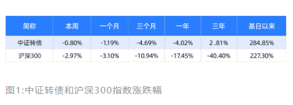

通过数据可以看到沪深300最近3年的年化波动为17.59%，最近5年的年化波动为19.19%，而可转债最近三年的年化波动为8.52%，最近5年的年化波动为9.77%。
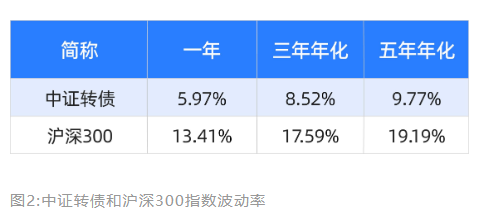

看看这两年的沪深300，从2021年到现在回调了1000多点，可转债拉开了中证500指数近25%的差距，对于沪深300的涨幅，更是直接拉开了超40%的距离。

从持仓体验来说:可转债波动性小，相对而言更适合普通人投资。

除了本身的持仓体验良好外，证监会在给可转债设定交易规则的时候，还给了不一样的优待。

#### 空户也可以参与打新

首先，参与门槛低。无需投资者预缴申购资金，大家只需开通证券账户就可参与新债申购。

可转债权限开通当天就可以申购可转债，各个券商开通的流程差不多，只要完成好可转债的知识测评，然后签署相应的协议即可。**当前可转债开通需要有两年的股票交易经验和10万及以上的股票市值要求**。

可转债的最低交易单位为10张，而市场上的大部分可转债价格在100元左右，这意味着投资者1000元就能购买可转债，与一些理财产品、股票相比较，其门槛要低一些。

同时，参与可转债打新，不需要股票市值，这就意味着"空户"也可以申请可转债。在申购的时候，大家可以采取顶格申购，等T+2日公布中签后，将资金放到股票账户即可，系统会自动扣款。

不过要注意的是，可转债中签后，如果连续12个月放弃缴款三次，则半年内不能进行新股、新债申购。

#### 实行T+0日内买卖

可转债最吸引人的部分就是低手续费加上T+0交易，当日可无限次的利用波动操作赚差价，是短线高手的乐园。

T+0的意思就是日内可以买卖，而且不限次数、不收取印花税。也就是说资金可以上一秒买入，下一秒卖出。而普通股票实行T+1交易制度，投资者无法及时止盈或止损，持仓风险较大，因此相比普通股票，可转债更加灵活有利于投资者短线套利。

在可转债交易过程中，只收取佣金费用，不需要交纳过户费用、印花税，与交易股票相比较，其费用要低一些，可以节省一些交易成本，不同的证券公司，其佣金费率有所不同，同时深市和上海市场上的债券费率也存在差别。

可转债上市首日，设置全日较发行价上涨57.3%和下跌43.3%的有效申报价格范围;上市次日起，设置20%涨跌幅价格限制。

### 牛市不封顶，熊市也能赚到钱

股神巴菲特的铁律是:“第一，不要亏损;第二，永远记住第一点。"一向被投资人士信奉。而可转债，恰恰符合这个基本精神。

可转债的条款本身是复杂的，其投资需要综合考量的因素也有很多，但是可转债并不应该因此成为专业投资人的禁脔。

相反，由于它的100%保底特色和大概率确定性原则，对于信息来源和专业知识严重不对称的普通投资者来说尤为重要。

#### 债权性，稳定可靠的保本收益

可转债本质是一种债券，约定了派息进度和到期还本日期。所以在不违约的前提下，在你买入的那一刹那，未来的派息和还本现金流就已经锁定了，作为债券的持有至到期收益率也能计算出。

虽然对于许多可转债，这个持有至到期的债券收益率可能是负的，但往往负的有限--这就是可转债的防守特性，买入时就大体锁定了不违约前提下的可能最大亏损。

"可转债"投资者可以**持续持有债券到期**，获得固定利息。债券期限最短为1年，最长为6年，发行公司半年或1年付息一次。(来源:《上市公司证券发行管理办法》)
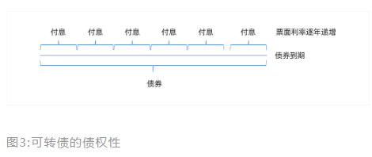

所以，我们可以通过公式计算出可转债的建仓线，加仓线和重仓线。再不济，即使可转债没有一个很高的涨幅，也可以到期获得一个远高于银行存款的收益率。

可别小看这个收益率，要知道，大部分中小投资者能保本，不亏已经是佼佼者。

#### 股权性，给你安全的暴利

可转债的魅力其实就是在**债性保底和股性进攻上，能有一个微妙的平衡**。

作为债券，可转债实际上又内嵌了一个买入期权，可以以约定价格将本金置换为正股，一般用当下的转债价格和转股后对应的股票价格来计算转股溢价率，如果一个转债转股溢价率是 30%，那就意味着如果正股涨 30%后，转股就打平，意味着这之后转债的表现就应该和正股同步，呈现比较强的股性，或者是进攻性了。

按照规定，投资者自可转债发行结束之日起6个月后可行使"转股权”，将持有债券转换成股票，享受上市公司股利分配或资本增值。(来源《上市公司证券发行管理办法》)
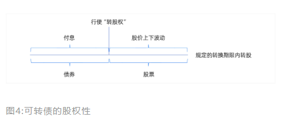

而且由于许多上市公司不希望还债，所以会用转股价下修条款来下修转股价，进一步提升可转债的进攻性。

可转债的本质其实是"债权+股权”的投资组合，具备“攻守兼备”的独特优势。

在股票市场相对低迷时，可转债具有基本的票息，防御性较强，而当股票市场行情较好时，大家则有机会转股博取溢价收益。

可转债中的股权性表现得最酣畅淋漓的，当属2020年的英科转债。

这是英科医疗发行的可转债，在当年完成了可转债史上最为惊人的逆袭:上涨近25倍，站上3000元，创下可转债价格新高，冠以“债中茅台”光环，当然这个涨幅也得结合当时的环境背景在可转债中很罕见的。

#### 为什么可转债比股票更安全?

从历史来看，可转债历史表现好于正股，抗跌性明显。

可转债总体走势和正股具有一定的一致性，但当股市大幅下跌时可转债抗跌作用明显。尤其是在熊市，正股大幅下跌时，可转债的回撤明显更小。(具体请见下图)
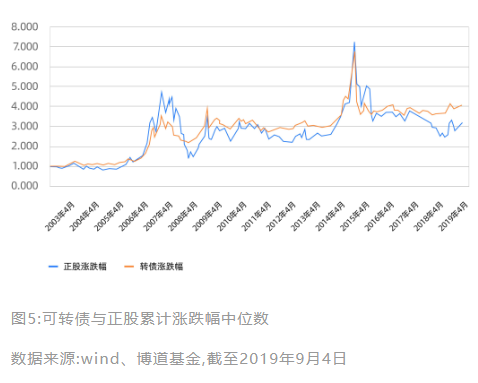

而从每年正股和转债涨跌幅(中位数)统计看，在熊市里可转债均大幅跑赢所对应的正股，回撤小。可转债在过去近16年里每年的中位数收益率加总也超过正股。

数据显示，截至2019年9月4日，2003年以来转债涨跌幅(中位数)相比正股的超额收益率约88%。

可以看出，可转债是一类风险收益比较高的投资品种。
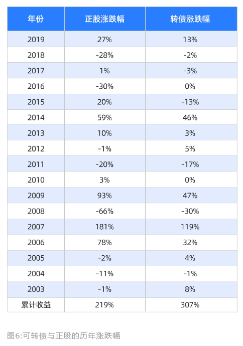

可转债的波动性低于股票，因为可转债受到面值和回售价的支撑，不会像股票那样出现剧烈的涨跌，波动相对较小。大家还可以通过分散投资、选择信用等级较高的可转债、控制资金仓位等方式来降低风险。

由于可转债同时具备股性和债性，有安全边际同时又能相当程度的跟随正股，降低了配置时机的要求，可以利用可转债穿越牛熊，是取得长期较好投资收益，战略性的配置资产较好方式之一。

### 透视可转债牢记这4个指标

区别于普通债券，可转债一般设置三大特殊条款，即**提前赎回条款、回售条款、向下修正转股价条款**。由这三条特殊条款引发的投资者与发行公司之间的“博弈“可谓是可转债的一道独特”风景线”。

可转债的种种条款看起来很多、很复杂，但其实也简单。除去大量解释性文字和官样文章，浓缩之后大概也就一页。

大家只要记住四个最重要的要素就行了，它们分别是:转股价、下调转股价条款(有的公告里叫做转股价格向下修正条款”)、回售条款、强制赎回条款(有的公告里叫做“有条件赎回条款“回售条款)，至于其他条款，不是无关紧要，而是没有以上这四个指标和条款对于投资的指导意义那么重大。
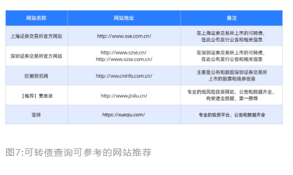

#### 转股价

站在投资者的角度讲，转股价肯定是越低越好。假设股价现在是10元，当转股价设定为9元，等于9折买股票，何乐而不为?就算转股价是10元，虽然等于市价购买股票，但是在五年内可以保底，上涨却不封顶，要比股票安全多了，肯定也是愿意的。

反之站在发行上市公司的角度，就不乐意了。如果五年内股票上涨的概率还是很大的，转股价定的低了，那万一股票大涨了，比如一年内到了15元，投资者用10元买了岂不是让公司很亏?

为了维护可转债双方的利益，证监会为此出台了系列的政策，目前基本都是按照下面这个规定来确定转股价的：

"以本可转债募集说明书公告日前20个交易日公司股票交易均价和前一交易日公司股票交易均价二者之间的较高者。"(当然，不排除有部分例外的，多是早期发行的可转债或者特时期发行的可转债。)

转股价，可以说是可转债最重要的元素，几乎其他所有的条款和投资行为都以它为准绳。

当转股价低于股票市场价的时候，等于可以低价买入股票，所以可转债的价格就会上涨并维持在面值100元以上;当转股价高于股票市场价时，等于高价买入股票不值得，所以可转债价格下跌，向面值靠拢甚至跌破100元。

转股价中还有个关键的词，叫转股期。它规定了可转债发行上市以后，必须过了一定的时间才能进行转换股票的行为。这就等于促使企业借到钱以后尽量用在生产上，而不是用来操纵股价牟取暴利。

值得注意的是，转股价不是一成不变的，在正式发行之后，当上市公司因增新股或配股、派息等情况就会使公司股份发生变化时，将按照一定的规则和公式，进行转股价格的调整。

但是一般来说，上市公司会自行计算后自动调整，并在雪球等专业投资平台上公告。大家只要留意就行了。

#### 下调转股价条款

这是转债投资中最逆天的属性。

假设碰到极端情况，在发行可转债以后，股市节节下跌，上市公司股票也是掉头向下，并且已经远远低于转股价，可转债基本已经毫无转股价值，怎么办?“下调转股价条款“在这个时候就会派上用场。

下调转股价条款”的基本思想是：

假如上市公司的股票市场价，在一定的时间段内，低于设定的 一个阈值，那么上市公司有权在定的条件下下调转股价。

下调修正后的转股价格一般应不低于一个特定日期前20个交易日内该公司股票交易均价和前一交易日均价之间的较高者，同时修正后的转股价格不低于最近一期经审计的每股净资产和股票面值。

概念比较绕弯子，现在直截了当地看 一个例子。凯中精密可转债募集说明书中的“转股价格向下修正条款"
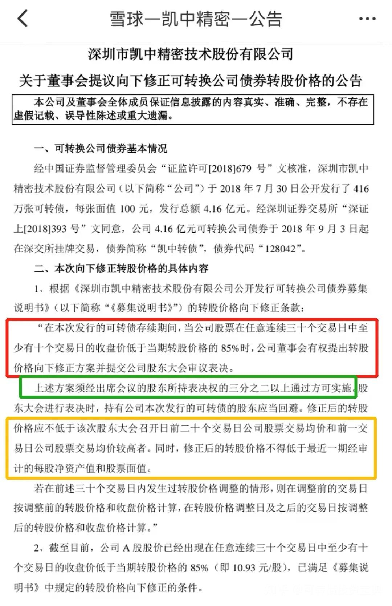

**触发下调转股价条款:**“在本次发行的可转债存续期间，当公司股票在任意连续三十个交易日中至少有十个交易日的收盘价低于当期转股价格的85%时，公司董事会有权提出转股价格向下修正方案并提交公司股东大会审议表决。"所以通常提议下修的公告一出来，第二天该转债的价格就会上涨，提前达到下修的预期，等真正下修成功的时候通常没什么反应。凯中转债2022年2月16日晚发布提议下修的公告，2月17日开盘就涨了.

**当然下修能否成功，也是有条件的:**须经出席会议的股东所持表决权的三分之二以上通过方可实施。股东大会进行表决时，持有公司本次发行的可转债的股东应当回避。

**转股价具体下修到哪里也是有要求的:**修正后的转股价格应不低于该次股东大会召开日前二十个交易日公司股票交易均价和前一交易日公司股票交易均价较高者。同时，修正后的转股价格不得低于最近一期经审计的每股净资产值和股票面
值。

可见，通过”向下修正股价条款”，上市公司可以合法地通过适时下调转股价，降低持有人转股的门槛，促进持有人转股，把持有人牢牢绑定在自己的马车上。

而下调转股价，确实能把转股获利的可能性大大增加了，往往会立竿见影地刺激可转债的市场价格，从而给持有人带来套利机会.

需要注意的是，向下修正转股价条款带有很多附加限制条件，如“有权提出调 整”说明仅是"权利而不是”义务”;提交股东大会能否通过还需要一定的票数;就算是实施了，具体下调到哪里也有限制;此外，有的可转债进入转股期后才能向下修正，也需留心。

#### 强制赎回条款

强制赎回条款”，是可转债募集说明书里最美妙的一个条款。

强制赎回”一旦发生，表示可转债初始持有人至少赚了30%以上的利润，上不封顶，而且可以马上拿钱走人;同时，可转债的发行公司成功地把所有的“债主”一网打尽变成了自己的“股东”可转债发行公司的终极目的，是让可转债持有人全部转股，从“债主”变成”股东”。

怎样才能做到这点?当然是让股票的市场价大大高于转股价，这样持有人等于能以低价买到股票然后以高价在市场中卖出，从而赚得其中的高。

问题是，如果股票市场价格已经远远高于转股价了，还是有人愿意持有可转债，不愿意转股怎么办?毕竟可转债有保底嘛!

“强制赎回条款”的基本思想是：

在可转债转股期内，如果本公司股票市场价格在一定的时间段内，高于设定的一个阈值(一般是当期转股价的130%)，那么上市公司有权按照略高于可转债面值的一个约定赎回价格(一般是103元)赎回全部或部分未转股的可转债。

简而言之，股价已经远远超过约定转股价，您已经赚到了，赶快转股吧!否则我就以低价赎回!要么您在市场上赚30%以上(转股或者卖出可转债)，要么以103元卖给我，二选一!

举个例子:以天地转债为例，背后正股为天地数码，强赎条款为15/30，130%，转股价为12.04元/股，强赎触发价为12.04*1.3≈15.65元。

自2023年9月5日至10月11日期间，公司股票已满足连续30个交易日中至少有15个交易日的收盘价格不低于当期转股价格的130%(含130%)，已触发"天地转债"的有条件赎回条款，公司决定行使提前赎回权利，赎回价为100.45元/张，最后交易日为10月31日。(期间由于股权激励，转股价发生了变化，按照当时的转股价计算即可。)
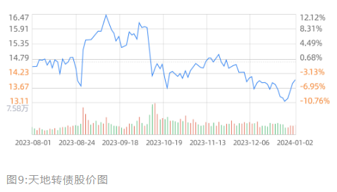

此时，天地转债的持有者有两种选择:一是等待上市公司以 100.45元/张的价格赎回，很明显比10月11日收盘价133.91要低很多，会造成严重亏损;二是转股，三是在二级市场直接卖出，后两种很明显优于第一种。

公布强赎后，可转债的价格一般会有所下跌，从而压缩溢价率至趋近于0甚至小于0，溢价率小于0意味着可转债转化为股票是有利可图的，也就会有很多持债者主动转股。

值得一提的是，满足“强制赎回"条件以后，也不用开什么股东大会投票批准了，上市公司直接就能发布公告实施赎回。但是上面提到的”下调转股价条款”必须要经过重重手续、道道关卡才能放行。

非常可惜的是，过去在可转债强制赎回发生后，确实有极少数投资人出于种种原因忘记了、错过了或者根本不知道一居然没有转股，到期后被自动强制赎回。

所以如果手中有可转债，千万不要粗心错过了强制赎回这张美丽的车票哦~

#### 回售保护条款

这个条款是可转债的保护伞。

站在纯经济学的立场上，不得不承认:上市公司遇到熊市尽量拖着不下调转股价，以待牛市的来临以高价卖出，从而融到更多的资本--这个做法是很“经济“的。

但是，站在投资人的角度，这个做法是很不人道的，还好证监会进行了回售保护条款的设置。回售保护条款的核心思想是这样的:

在可转债存续的一定时间内，如果公司股票收盘价在N个交易日低于当期转股价格的一个阙值(这个阙值一般要低于向下修正转股价)时，可转债持有人有权将其持有的可转债全部或部分按面值的103%或面值100元+当期计息年度利息回售给本公司。

任一计息年度可转债持有人在回售条件首次满足后可以进行回售，但若首次不实施回售的，则该计息年度不应再行使回售权。

“回售保护条款”的出现，就是把”极少数”尽量变为零的一种充满善意的努力。100元已经是可转债的安全底线，而回售又把它提高了:103元(或100元+当期利息)。

其实回售的发生是上市公司和投资人双方都不想看到的事情，发行人没有达到“不还钱”的目的，投资者也只拿到了很少的收益，因为回售价一般很低，通常为100元面值加上当期利息。

但这是对可转债投资者的一种保护机制，如果可转债背后正股股价持续低迷，可转债持有者看不到希望，就需要回售条款出场了。这时，为了避免回售，上市公司可能会努力经营抬升股价或者下调转股价。

### 不同的投资者玩出不一样的花样

作为一个兼具债性和股性的神奇标的，可转债可以有"100买入-130卖出“的安全牌打法、也有将其看成一种特殊形式的期权进行量化投资和定价的投资玩法、还有利用规则势在必行的套利玩法。

今天这节课主要介绍两种常见的可转债投资策略。

#### 可转债打新

**可转债打新和打新股的区别**。

大部分投资者首次接触可转债是从打新债开始的。一般打新债的收益率是按照上市首日开盘价或者收盘价除以发行价来计算的。

按照2023年可转债新债的中签率来看，大多数时候单账户如果中签也只会中1手转债，面值相当于1000元。

整体来看，新债单账户中签率平均值为2.48%、中位数为1.26%(数据来源:集思录;统计时间:2023年12月1日)。

按照2023年可转债新债的上市收益来看，截至12月1日，2023年新债破发率为0。

根据2023年新债上市首日收盘价格来看，最低为112.11元，最高为157.3元，也就是说如若中签，按首日收盘价计算可能收获121.1元至573元的毛利(未扣除手续费)，中位数287.50元，平均值343.80元。

所以说，打新债是一种收益风险较为可观的投资方式，近年来被越来越多的投资者所喜爱。
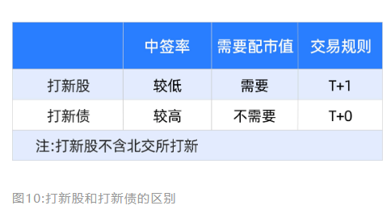

相比于A股打新，可转债打新最大的优势就是信用打新、不需要市值，它的第二优势是破发率较低，投资新手完全可以参与。

#### 打新债收益情况

历史上单账户可转债打新收益具体怎么样呢?

我们按照上市首日以开盘价格卖出计算新债收益，理论上单账户打新债在2019-2022年分别可以收获5598.44元、3777.29元、1537.377元、1261.13元。

以上对于打新债收益的计算都是基于新债中签率、上市首日开盘卖出转债的基础上得出的理论平均收益。

由于可转债打新门槛低，操作方便，2019年至2022年打新债人数大幅提高，导致了新债中签率大大降低。2019年单个新债最高中购户数为171万户，至2022年单个新债最高申购户数超千万户。
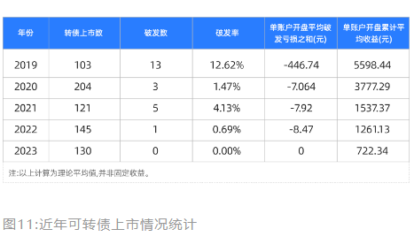

沪深交易所在2022年6月18日实施了《可转换公司债券交易实施细则》，提升了可转债权限开通门槛，细则中规定开通可转债权限的条件包括：需要2年交易经验+开通前账户20日日均资产达到10万元(不包括融资融券融入的资金和证券)。

此外，请注意可转债的面值是每张100元，以10张为一个最低交易单位，称为“一手"，一手等于1000元。因此，5000元资金最多可以买“50张”。

可转债新规执行以来，可转债打新人数上升幅度趋缓，2023年打新人数稳定在800~1100万户之间，中签率下降也比较温和。截至2023年12月1日，单账户打新债2023年首日卖出平均收益722.34元(开盘价计算)、850.09元(收盘价计算)。

#### 可转债套利

可转债就是个公认的套利好工具。但前提是你需要对可转债的各种条款烂熟于胸，对于股价的即时走势时时关心。其核心就是利用可转债的公开规则，再结合市场价格的有利变动，在正股或可转债价格的关键节点上埋伏进去，给予最后一击!

所谓利用规则套利，主要是结合可转债的向下修正转股价条款和回售保护条款，有时也涉及强制赎回条款。既含有可转债套利，也含有正股套利，一般常见的有以下几种情况。

#### 可转债转股套利

假设某转债转股价2元，转债现价101元，正股价2.1元。此时以101元买进转债，以2元转股价转股可得50股正股，市价卖出得50x2.1=105元，去掉交易成本和101元，剩下的就是套利所得。不过，由于当日转股需次日卖出，所以既有时间成本，次日股价也有下跌风险。

这块套利比较重要的，就是去哪里看转股套利的机会?

可以登录集思录App首页可转债数据一栏按溢价率从小到大排序或者在雪球App搜索可转债的代码，在右上角都会显示目前可以折价的转债。

#### 下调转股价条款套利

绝大多数可转债都有一个"转股价格向下修正条款”，比如“在本次发行的可转换公司债券存续期间，当公司股票在任意连续30个交易日中至少有15个交易日的收盘价低于当期转股价格的90%时，公司董事会有权提出转股价格向下修正方案并提交公司股东大会表决。”

一般去寻找那些大股东持有可转债，并且满足转股价下调条款，低于100元的可转债，因为大股东被套了，会有动力推动董事会提议下调转股价。

旦上市公司将转股价下调到能下调的最低价，可转债转股价值就回到100元左右，转债价格很可能会超过100元。

但是，此套利需预判上市公司下调转股价，进而提高转债价值，具有一定的不确定性。

需要特别强调的是，可转债的正股套利只是低风险，不是无风险，具体情况还要看市场和公司运作情况而定，不可一概而论，否则可能造成损失。

#### 强制赎回条款套利

首先敲个黑板:只有进入转股期才能触发强赎，可转债一般在发行6个月后进入转股期:强赎是上市公司的权利，而不是义务。

历史上，95%以上的可转债都是因为触发强制赎回而消失的。那么，我们就可以利用这个方式来进行可转债的低风险套利。

从强制赎回的条款中，我们可以知道30个交易日内有15个交易日，股价在转股价的30%以上时，会触发强制赎回。

此时，可转债的价格计算方式就是:可转债的价格=目前股价/转股价*100+溢价

通常情况下，由于可转债的债性，一般都是具有正溢价的。那么结合可转债的强赎条款，触发强制赎回时，可转债的价格通常在130元以上，甚至更多。也就是说，130元，通常是一个强赎点。

那么，我们只要以一个合理价格去买入可转债、耐心持有到强制赎回，即可获利。

#### 回售保护条款套利

所谓可转债的回售套利，就是利用回售条款，对可转债进行低买高卖，赚取差价。

可转债回售套利的前提，是可转债处于回售期内或回售期比较近的时期。

常见的回售套利有两种情况：

一种是上市公司执行了回售，那么在回售价格以下买入可转债，再回售给上市公司，就完成了套利;

另一种套利是博弈上市公司将采取措施避免回售。上市公司有可能拉抬股价也可能会下修转股价，这两种方式理论上都会提升可转债的价格。

要做回售套利，咱们需要先知道哪些可转债将触发回售条款。大家可以在集思录网站查询，方法很简单。

打开集思录网站，依次点击“可转债“一“回售”，就可以快速查询全部可转债的回售信息。然后按“回售触及天数“排序，排在最前面的就是即将触发回售的可转债。
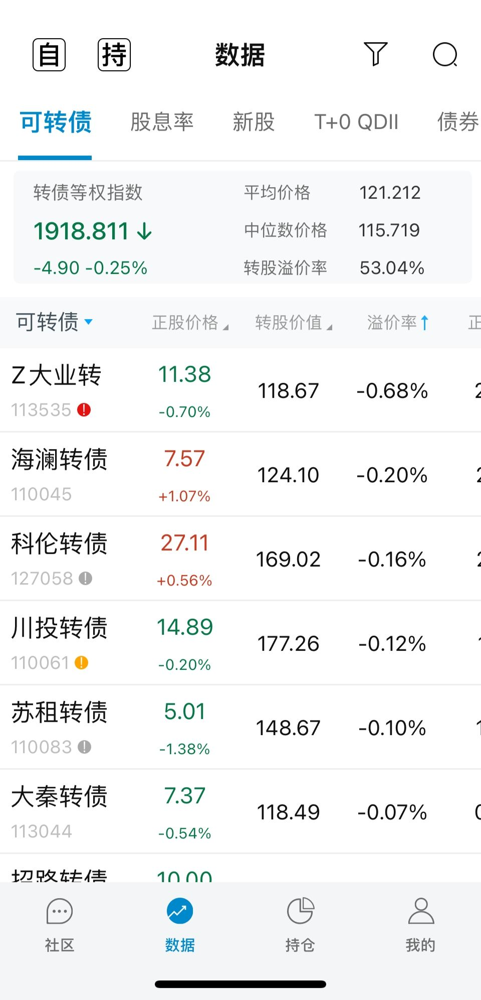
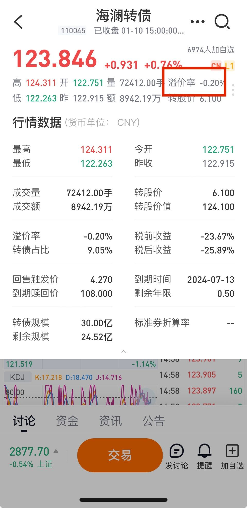

不过，上市公司回售的概率是比较小的。在判断具体某家公司还钱意愿强不强的时候，可以看它之前有没有下修过转股价以及看它财务上有没有足够的现金来还钱。

比如A公司，已经下修过2次转股价，最近一期的报表显示也没那么多现金，那么A公司就有可能再次下修转股价。

### 可转债能保底，为何还有人亏损?

选择可转债作为投资工具是由于它是一个下跌有底，上涨无顶，兼顾了债券和看涨期权的一个特殊投资工具，很合适投资经验不算特别丰富的普通投资者，在保证本金不会有巨大亏损的前提下赚取更多超额收益。

但是网上看看，还是会有一些人说可转债不好、投资可转债亏钱的。仔细一问会发现，几乎100%都不是在面值附近买入并坚持在收盘价以上卖出的，毫无例外。

可转债，股权性的一面是有波动，它也是需要在周期”的视角下进行买卖交易的。

如果大家在面值附近的时候不买:到了面值以下还是不买，总想买到更低的价格。真的创了新低了，反而急不可耐地割肉卖出了，唯恐还有更低的价格卖亏了--却全然忘了有100%的保底，更有到期前130元以上的极大可能性!

而当可转债价格冲上120元、130元、140元，甚至180元，不计后果一窝蜂地投入，期权价值也出来了，转股前景也光明了，唯恐后面的好事没有自己的份儿--却彻底忘记了基本常识，陷入了追涨杀跌的怪圈。

那这可不是可转债投资应有的策略。

可转债的投资，一定要坚持确定性原则。很多投资者都梦想能买在最低点，卖在最高点。

但只有身在股市之中的人，才知道低买高卖有多难。

到目前为止，凭借准确预测市场涨跌而大幅获利的投资者极为罕见，而因追涨杀跌盲目波段操作而在股市中损兵折戟者却屡屡有闻。

投资可转债，唯有抱着不为短线的浮云遮望眼的坚持，不为一切诱惑动心的心态，以及咬定青山不放松的决心。

坚持投资纪律，最后才能积小胜为大胜，以时间换暴利。
