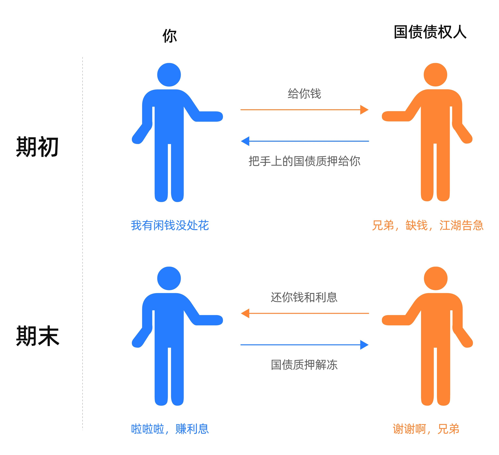
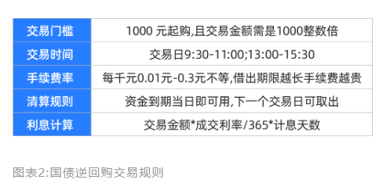
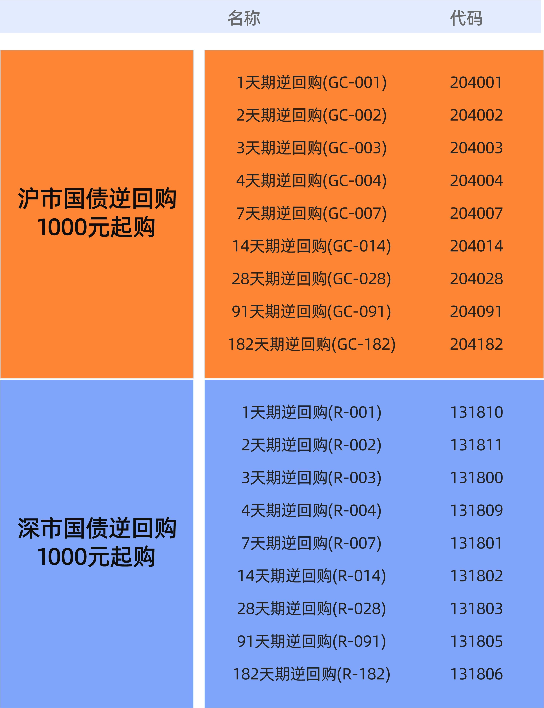
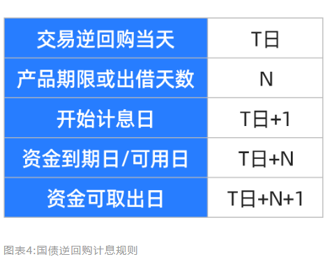
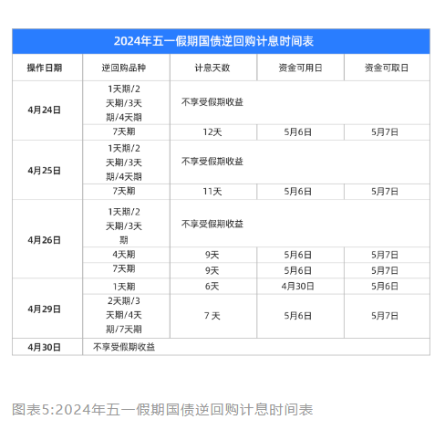

---  
title: 23|国债逆回购-一更适合股民的短期理财神器  
index: true  
icon: file  
order: 24  
category:  
  - 短线  
  - 大A  
tag:  
  - 雪球  
---  
  
## 23|国债逆回购-一更适合股民的短期理财神器  
  
国债逆回购，一个被名字耽误了的理财神器。听起来好像有点高深莫测，实际上，只要有股票账户就可以用它体验“顺手捡钱“的快乐。  
  
我们今天来聊聊国债逆回购到底是怎么回事，有没有风险，为什么说它更适合股民，怎么操作能让收益最大化。  
  
### 有借有还，双层托底  
  
国债逆回购，也可以简称“逆回购”。  
  
本质上它是一种短期贷款，是我们普通投资者把手里的闲钱以约定的利率借给需要现金的人，按约定的期限到期后，他们会归还现金并支付一定的利息。而从我们这里借款的人也不是凭空就能借到钱的，他们需要抵押国债才能获得借款，这也是国债逆回购名字的由来。  
  
我们常见的炒股软件上，操作国债逆回购按钮会写着“借出“或“资金借出”，这里的“借出”显然并不是从人家那借钱给自己花，而是把我们自己的钱借出去给别人然后坐等赚利息。  
  
  
那么这钱借给谁了，靠谱吗?  
  
这里的借款人或者叫融资方大多是银行、保险等大型金融机构，他们还不上钱的概率极低，除非发生了系统性风险；  
  
退一万步说，即使真的发生了极端情况，他们在到期后还不了钱的话，还有个关键角色帮我们“做主”，就是我们熟知的交易所。  
  
在整个交易过程中，交易所是借出方和借入方的"介绍人”，也可以说是中间方，它负责双方借贷关系的撮合和监管，保管着借入方抵押的国债，如果出现还不上钱的情况，那么就会把国债变现然后还给投资者。  
  
更重要的是，这里说的抵押的国债则是最核心的托底资产，只要放在那的国债价格是稳的，那么国债逆回购的本息就是稳的。  
  
我们都知道，国债是国家发行的债券，最高信用主体背书，比银行存款还要安全。  
  
这样看来，国债逆回购有交易所和国债双层托底，是一个妥妥的低风险投资工具。  
  
### 炒股赚息两不误  
  
了解了国债逆回购的底层逻辑后，来看为什么说它是短期理财神器。  
  
前边我们提到了逆回购是交易所撮合完成交易的，是个场内产品，就是说只要有股票账户即可操作逆回购。  
  
上海交易所和深圳交易所分别有自己的逆回购产品，两个交易所同样期限的产品没有本质差别我们在操作的时候对比下收益率，选高的即可。  
  
- GC开头的代表上交所的逆回购  
- R开头的代表深交所的逆回购  
  
除了有区分不同的交易所以外，还按照借出期限不同分为不同的逆回购品种，比如名称里有001是一天期的，002是两天期的，以此类推。  
  
具体的操作步骤更是非常简单，根据你想要借出的天数选择品种然后填写你能借出的金额即可交易成功。  
  
关于基础的交易规则，可以总结为下表:  
  
  
结合交易规则，我们来一起解锁逆回购的两大亮点:  
  
#### 炒股赚息两不误1  
  
一般情况下，如果我们把钱存银行1天时间，应该是按活期利率年化0.3%计息。然而国债逆回购的利率高的时候能超过5%，相当于活期的17倍，几乎是3年期利率的2倍，比银行存款的天花板大额存单利率还要高。  
  
当然逆回购利率水平是波动的，我们后边会单独讲如何抓住高利率时间，但即使是平时平均水平，也有1.5%-2%左右，当前一年期定期存款利率基本也这水平，而逆回购的期限从1天到180天不等，完全不用等一年就能获息取出，同样的利率水平但资金可用性更加灵活。  
  
  
更重要的是，逆回购是更适合股民的理财神器。  
  
交易规则中可以看到，逆回购的交易时间和股市开市时间不完全一致，在下午三点休市后仍然可以交易逆回购。  
  
根据清算规则，资金到期当天既计息又可用，那么如果在收盘后用账户闲钱交易1天期的逆回购，意味着这笔钱在第二天就能连本带息用来做股票交易。  
  
也就是说，利用逆回购我们可以做到既没让闲钱白闲着，还没耽误买股票，完全不占用买股票的资金，不会出现想买股票但理财的钱还没到位的窘境。  
  
基于此，国债逆回购适合作为我们股票账户里的闲钱管理工具，可以灵活取用，既能赚息也不耽误炒股。  
  
#### 收益所见即所得  
  
从上边表格中我们也可以看到，逆回购的手续费比较低，对于一天期的品种，每十万元才收1元手续费，而且也没有最低5元的限制，操作全过程只收取一次手续费，还没有印花税等杂项费用。  
  
不光费用结构简单，逆回购的收益率同样不用我们操心。  
  
逆回购的利率水平也就是我们借出钱的收益率水平，会随着市场上借贷资金的紧张程度而发生波动，但是对我们借出方而言，收益率”所见即所得”:成交数字是几，对应的年化收益率就是几。  
  
也就是在我们完成交易的那一刻，我们最后能拿到多少利息就板上钉钉了，后续不管市场发生什么变化，我们这笔交易也不会受影响了，完全不用担心利率下降导致收益下降。  
  
除此之外，和其他理财产品不一样的是，逆回购只需要单边操作，只需要打开股票账户，选好合适的期限品种完成“借出“操作即可，等到期后连本带利钱款会直接到账户，不需要我们记着日子再操作一次。  
  
### 如何操作能赚的更多?  
  
接下来，我们看看逆回购到底能赚多少钱，怎么操作才能让收益最大化。  
  
#### 了解逆回购的收益如何计算  
  
国债逆回购实行T+1制度，即交易当天是不计息的，从次日(交易日)开始计息。  
  
值得注意的是，前边已经提到，交易逆回购的资金在到期当天就会被释放出来，我们可以用来交易场内任意品种，买股票基金或者继续购买逆回购都是可以的，但是在到期第二天这笔钱才能提现到银行卡。总结如下：  
  
  
举个例子，如果周一(T日)交易两天期逆回购(N=2)，那么周二(T日+1)开始计息，周三(T日+N)到期当天仍然计息，且本息已经可以用，但不能取出来，周四(T日+N+1)才能够取出来。  
  
这里的T日、资金可用日和资金可取出日均指交易日，如果在计息开始后，产品到期前，中间赶上非交易日的话，那么这中间的非交易日也是计息日，也很好理解，毕竟中间占用了我们的资金嘛。  
  
简单来讲，我们只需要记住以下公式就可以计算利息收益:利息=交易金额`*成交利率/365`*计息天数;现在基本每个炒股软件上都会在我们操作时显示对应的计息天数，无需我们自己计算。  
  
#### 记住三个关键时间  
  
我们前边提到，逆回购本质是一种短期借贷，对应的利率水平会随着市场上资金的供需关系发生变化，当市场对资金需求比较旺盛时，比如月末年底或者节假日前夕，这些特殊时点逆回购的利率会更高，那么我们在这些时候交易逆回购就会获得更高的收益。  
  
平时大多数情况下，国债逆回购的收益率并不高，只有1.5%左右。但是在节假日前几天，基本能冲到4%以上，前几年甚至经常到10%以上，可以说是非常可观了。  
  
高利率的国债逆回购虽然不是每天都有，但可贵的是高利率非常有迹可循，如果我们能抓住几个关键时刻，就能轻松“捡钱"。这里为大家总结了几个关键时间点:  
  
**疯狂星期四**。  
  
每周四都是一个绝好的交易国债逆回购的机会。  
  
因为在周四操作的逆回购，周五开始计息，不管是否在周五到期都没办法取出资金，至少得到下周一才能取出，那么当周周末两天就是资金占用日，自然可以多享受这两天的利息。  
  
只要周四的时候账户上有闲钱，建议都交易个一天期的逆回购，周五钱就可以到账(但不能取现)，而且还不影响周五买股票。  
  
**周五陷阱**。  
  
非交易日不能做起息日，所以尽量不要在周五操作逆回购。  
  
假如周五交易一笔，不论是几天期限的，根据前边提到的计息逻辑，周五交易当天不计息，最近的交易日就是下周一才开始计息，所以周末两天其实是白白浪费不拿息的，尤其是在周五操作一天期逆回购的话，为了赚一天的利息却占用了三天资金，显然是很不划算的。  
  
**假期前两天**。  
  
每逢假期，逆回购利率经常会出现大幅冲高的情况，尤其是“五一""十一"“春节“等小长假前夕，市场资金非常紧缺致使利率水平能达到一年中最高水平，所以我们一定要抓住节前黄金时间操作逆回购。  
  
但需要注意的是，并不是放假前任意时间交易都行，根据计息规则，节前最后一个交易日操作的话，那得节后才能计息，中间这么长假期就没有一点收益。  
  
所以最晚一定要在假期前倒数第二个交易日完成逆回购操作，这样就能轻松实现假期躺赚假期有多长我们就白拿多少天的利息。  
  
我们以2024年的五一假期(5月1日-5月5日)为例，来看看如何让收益最大化:  
  
  
国债逆回购最特别的点在于，到期当日即资金可用，还拿上边五一假期的例子来说，我们在4月29日交易的一天期逆回购，在4月30日本息就可以拿来用，用来干嘛?买股票或场内基金都行，比如直接当天买个t+0的ETF，一举两得，资金重复利用。  
  
除了上述几个比较明显的时间点以外，我们也可以关注每个月月末的利率波动，以及每天不同的时间点可能也会有利率水平差异，一般早上开盘时间利率水平相对较高。  
  
#### 避免过高的机会成本  
  
在使用这种短期理财工具过程中，我们一定要注意避免造成过高的机会成本。  
  
比如，如果我们有长期用不到的钱，还是可以主要考虑长期收益更高的品种，逆回购则更适合短期资金理财。通常情况下，我们操作逆回购选1天期、2天期、3天期、4天期、7天期的比较多，如果是平常操作基本只选个1天或2天的性价比最高，遇上小长假的时候则会选个3天到7天的。  
  
如果平常不炒股，只想抄高息逆回购，那就更要注意了，尽量不要让你的资金在其他账户和股票账户之间来回切换，一定会造成不同程度的资金闲置，每一点资金浪费都是我们财富积累的机会成本。  
  
总体看来，国债逆回购适合平常有股票交易、且股票账户上有闲钱的投资者，既能有效管理短期闲钱，也能高效炒股。  
