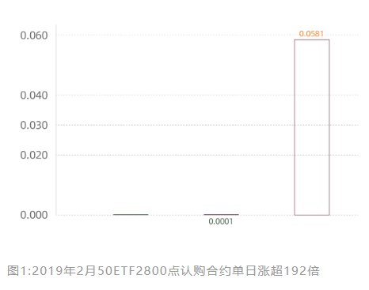
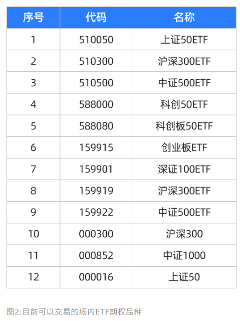
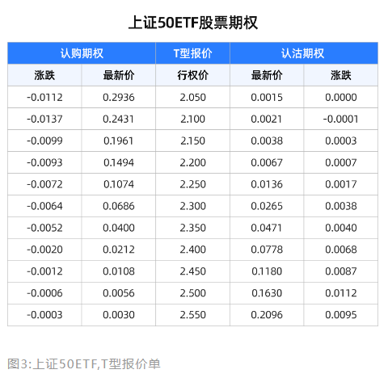
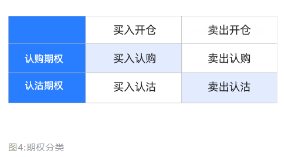
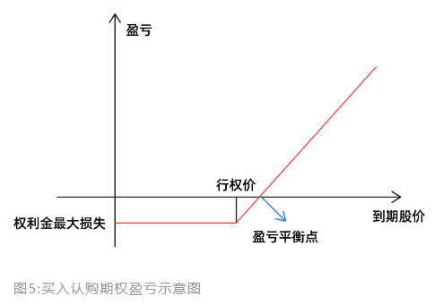
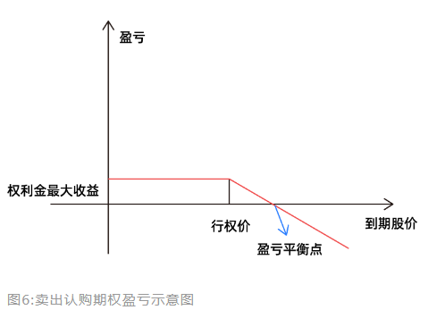
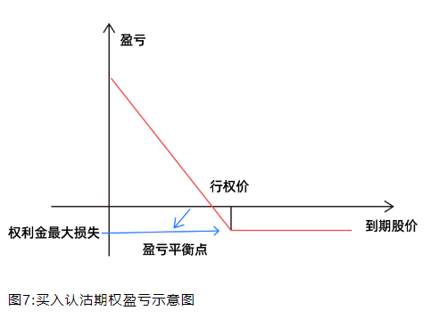
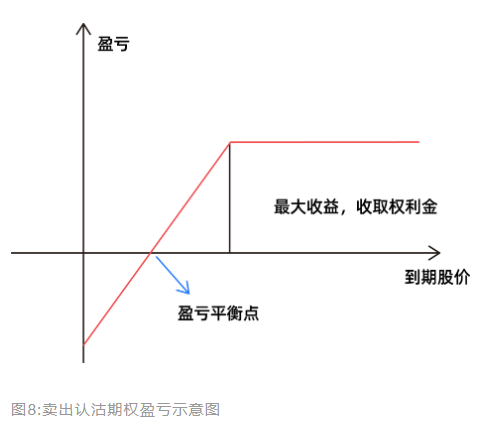
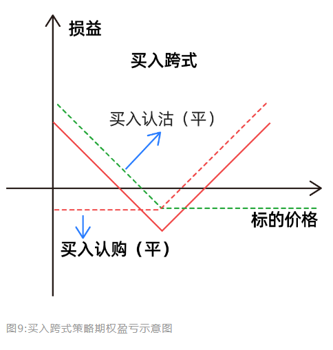
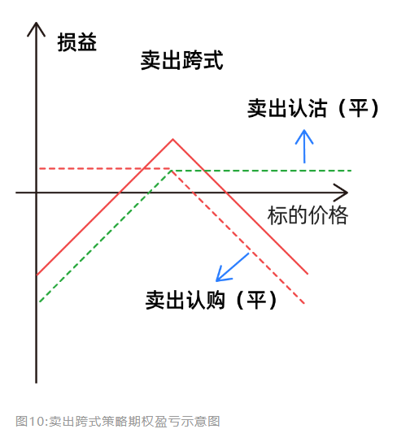

---  
title: 24|期权，普通人能接触到的投资最强赌具  
index: true  
icon: file  
order: 25  
category:  
  - 短线  
  - 大A  
tag:  
  - 雪球  
---  
  
## 24|期权，普通人能接触到的投资最强赌具  
  
在经历了2015年股，2018年金融去杠杆后，每一位亲历者都了解了杠杆的威力，一不留心都会让财产灰飞烟灭，但杠杆又在很多时刻扰动着每一位投资者的心弦。  
  
今天介绍的金融衍生品--期权，是很多人眼中的最强赌具。  
  
为什么敢说是最强赌具?因为期权登陆A股没几年，就创造了太多奇迹。  
  
曾经有一只神话期权，一天涨幅高达192倍。从理论上讲，你投入1万块钱几个小时就可以赚190万，这绝对属于暴富，甚至买彩票都不一定能够达到这种程度。  
  
2019年的2月25号可以说是期权史上最疯狂的一天，一只期权前一天的收盘价是0.003，深度虚值，收盘涨了多少?由0.003-直涨到收盘价0.0581，那么它的最终的涨幅是19,266%，也就是192倍。  
  
一天完成了192倍的涨幅，我们从它的这样一个K线图上面来看，是一根巨大的阳线，像摩天大楼样直冲云端。  
  
  
当然，期权不仅仅在市场突然变好时创造奇迹在低迷的时候也一样。  
  
2024年年初A股延续2023年的低迷，因结构化产品持续敲入，中证500成为了下跌最惨的宽指，截至1月22日中证500跌幅近12%，股民们怨声载道时，500ETF认沽期权却在15个交易里怒翻36倍!  
  
如果单独卖空中证500ETF，收益只有12%，但买入认沽500ETF期权却能带来3600%的收益，粗略算算这撬动了300倍的杠杆，照比期货的10倍杠杆而言，期权确实堪称大赌具!是普通人能触碰到的杠杆最大的交易工具。  
  
虽然期权在很多时候能撬动极大杠杆，很多人将其定义为赌具，但在一些机构乃至职业投资者眼中，这是最前沿的交易工具，不仅能够提供高杠杆，还能帮助投资者对冲风险，更有与股市完全不同的四维空间让你去利用。  
  
随着近些年期权产品的愈发丰富，从最初只有上证50ETF期权，到现在沪深300、科创50、中证500等一系列场内期权的推出，叠加场外个股期权作为补充，期权已经成为聪明投资者不可或缺的工具。  
  
  
接下来我将带你走入神奇的期权世界。  
  
### 期权不仅是赌具，也是保单  
  
很多人了解到期权，是因其强大的杠杆，但期权设立的初衷并非如此。  
  
期权，顾名思义，期就是未来，权就是权力，期权就是未来的权力。股票期权就像投资股票的保险，期权的买方相当于投保人，期权的卖方相当于保险公司。  
  
投保人买了车险，需要支付一笔保险费，车别蹭了就有权利跟保险公司要钱。而股票期权的买方在买入期权时支付的权利金就是保险费，支付后就获得了补偿未来股价波动的权力;  
  
保险公司收了保费，投保人车刮了来索赔时，保险公司就需要无条件赔偿。而股票期权的卖方在收取权利金后，如果期间发生了股价波动，卖方就需要履行该尽的义务。  
  
**投资者能用期权这个保单做些什么**?  
  
*最基础的功效---风险大挪移*.  
  
当投资者持有很多宽基ETF时，担心市场下跌造成损失，就可以买入ETF认沽期权进行保险，锁定未来最低卖出价。当股价下跌后，仍可以按照约定价格卖出股票.  
  
*提供高杠杆---花小钱办大事*.  
  
除了国内市场期权市场的几百倍杠杆外，历史上很多投资大鳄都经常使用期权来花小钱办大事。  
  
2012年末，索罗斯通过分析，认为安倍激进的货币政策会使日元进入大跌态势，到期行权会带来巨大收益，所以运用很少的资金杠杆性做多美元，做空日元。于是，索罗斯的量子基金用大约3000万美元买入看涨美元、看跌日元的外汇期权，获利10亿美元，相当于资金翻了30多倍。  
  
*不只可以做多---立体化作战*。  
  
实际上期权的出现将投资带入了立体化作战的时代，在股票市场中，我们只能在股价上涨时赚钱，如果股价下跌我们最多空仓，没法获利。虽然股指期货、融资融券的推出，给了我们在下跌中获利的渠道，但券难融，股指期货门槛高。  
  
有了期权后，除了上涨、下跌两个维度我们可以赚钱外，还可以实现市场平盘、或大涨大跌时的赚钱机会。  
  
### 什么在决定着期权的价格?  
  
期权的价值由内在价值与时间价值构成，内在价值比较好理解，就是买方当下立刻行权获得的收入。时间价值比较难以捉摸，一般而言一个期权会经历生老病死的过程，只要期权不到期，理论上时间价值都会大于0。  
  
实际操作中，期权的时间价值往往呈现一个特点，会随着时间的临近，呈抛物线加速衰减。  
  
了解了期权价值，再来说说影响期权的价格，其中影响最大的三个因素就是标的资产价格、时间以及波动率。  
  
#### 首先最重要的是基础资产的价格波动  
  
2015年8月27日，上证50ETF一改两个月来的颓势，单日涨幅高达8.43%。  
  
随着标的上证50ETF的一路上涨，认购期权普遍大涨，认沽期权普遍大跌。截至当日收盘，认购期权50ETF购9月2300涨幅高达64%，认沽期权50ETF沽9月1800跌幅最大达61.48%。  
  
#### 第二是行权价格和基础资产的现价对比  
  
如果行权价格和现价离得越远，说明发生的概率就越低，那么权利金就越低。  
  
如下图，上证50的看涨期权，行权价离现价越远的价格就越低，如果看涨的行权价是在高于现价的就叫做虚值期权，如果看涨期权的行权价是低于现价的就叫实值期权。  
  
  
#### 第三是时间价值对期权权利金的影响  
  
行权时间越远的，由于不确定性越大，所以权利金就越贵!  
  
2015年3月18日到3月25日，50ETF价格从2.611变化到2.604，50ETF购4月2700合约的波动率从25.9%变化到26%，在标的价格和波动率都未发生变化的情况下，期权价格仍然下跌12.5%，这就是时间对期权价格的影响，在其他因素不变的情况下，距离到期时间越短，期权价值越低。  
  
#### 第四是市场预期和波动对期权权利金的影响  
  
这部分业内人称之为波动率，简单讲，市场上大部分投资者都看多某只股票，那么这只股票对应的看涨期权就更贵，反之越便宜。  
  
2015年11月26日，50ETF微涨0.46%，但不论是认购期权还是认沽期权都出现了价格普遍下跌的情况。  
  
这是为什么?从盘面看，认购期权的隐含波动率从前一天的25%降至20%，认沽期权的隐含波动率从前一天35%下降到30%，隐含波动率是以百分比形式显示的数字，反映了交易者感知的不确定性或风险水平，隐含波动率的下降代表投资者对50ETF后市波动普遍看低。  
  
也就是说，在其他因素不变的情况下，波动率越小，期权价值越低。  
  
### 如何交易期权?  
  
#### 单腿策略  
  
最简单的期权交易莫过于单腿策略，就是只买入或卖出一种期权，分为四类:买入认购期权、买入认沽期权、卖出认购期权以及卖出认沽期权。  
  
  
其中买入认购与卖出认沽是看涨策略，买入认沽与卖出认购是看跌策略。四个策略应对不同的策略，看大涨买认购，看大跌买认沽，不看涨卖认购，不看跌卖认沽。  
  
##### 买认购，盼股涨，下跌可能全亏光  
  
小明一觉醒来突然觉得牛市要来了，于是买入一张50ETF的认购期权，行权价为2.3元，权利金为0.06元/份。当到期日股价高于2.3元，为2.5元时，小明可以以2.3元的行权价买入50ETF，再以2.5元将其抛售，到期日盈亏为2.5-2.3=0.2元，扣除权利金0.06元，总盈亏0.14元；  
  
当到期日股价小于2.3元，小明自然不会以更高的价格买入市值低于2.3元的证券，这样权利金就会归0。  
  
如果我们把到期股价作为横轴，到期总盈亏作为纵轴，然后把每个点连起来，就能清楚的看到认购期权的到期盈亏图。  
  
  
如上图所示，买入认购策略非常适合预期后市为大牛市的投资者，当标的价格长得越多，认购期权买方可以获得的收益也就越大，与此同时买入认购所承担的风险是有限的，无论标的价格跌多少，最终也就损失权利金。2019年那次单日192倍的奇迹，就来源于买入认购。  
  
##### 卖认购，怕股涨，风险无限细思量  
  
因为同一份期权的买卖双方是零和博弈，买方到期所赚到的钱就是卖方所亏损的钱，卖出认购其实就是买入认购的对手盘，所以卖认购的盈亏图如下。  
  
  
对于预期后市不会上涨的投资者而言，可以选择卖出认购策略收割买方权利金，不过当标的价格上涨时，卖出认购期权的会出现亏损，且越长亏得越多。  
  
也就是说，这是一个收益有限最多赚到权利金，却承担着无限风险的交易，现实生活中更多是机构、做市商在参与卖权交易。  
  
##### 买认沽，盼股跌，上涨或许皆湮灭  
  
小明等到了今年年初不再看好市场，觉得未来可能要大跌，于是买入了一张中证500ETF的认沽期权，行权价为5.00元，权利金为0.01元。  
  
等到期日股价低于5.00元为4.80元时，小明可以以市场价4.80元买入，再以5.00元卖出，因此到期日盈亏为5.00-4.80=0.2元，扣除权利金0.01元，总盈利0.19元，盈利19倍。  
  
当到期日股价高于5.00元时，小明自然不会以5.00元的价格卖出高于5.00元价格的股票，因此通常会放弃行驶权力，也就是权利金归0。  
  
同样把到期股价作为横轴，到期总盈亏作为纵轴，把每个点连起来，就能清楚的看到认沽期权的到期盈亏图。  
  
  
买入认沽跟卖出认购很像，预期未来会进入大熊市，可以考虑。当标的价格跌的越多，认沽期权的买方赚的就越多，极端情况下标的价格跌到0时，买方赚的最多。与此同时，买入认沽的投资者承担的风险同样有限，最多损失掉权利金。  
  
##### 卖认沽，怕股跌，损失巨大空悲切  
  
同理，卖出认沽其实就是买入认沽的对手盘，所以卖认沽的盈亏图如下：  
  
  
对于预期眼下已经跌不动了，后期不会再跌的投资者，可以选择卖出认沽策略，不过于卖出认购相似，这都是收益有限，风险无限的策略。  
  
#### 组合策略  
  
组合策略弥补股票市场的投资空白。回顾A股历史，牛短熊长是显著特征，也就是说A股很喜欢短期暴涨暴跌，长期横盘调整或慢慢阴跌，如果只投资股票，在漫长的调整时，总会闲的无所事事。  
  
有没有什么方法，能够应对更多的行情?期权组合策略为我们提供更多可能。  
  
##### 买入跨式策略  
  
当投资者总觉得要有大事发生，预期未来市场会出现大幅变动，但又无法判断方向时，最好的策略就是买跨策略，同时买入相同数量、相同标的、相同到期日、相同行权价格的看涨期权和看跌期权，这个策略只需付出有限的权利金，潜在收益却可能巨大。  
  
  
买入跨式策略的盈亏平衡点有两个，到期时当标的价格低于低盈亏平衡点或标的价格高于高盈亏平衡点时，买入跨式策略才能盈利。  
  
#### 卖出跨式策略  
  
投资中并非常有风浪，大风大浪过后总会有很长时间的平静，当投资者预期未来市场只会有小幅波动时，可以卖出相同数量、相同行权价的同月认购、认沽期权来构成卖出跨式策略。在市场小幅波动时获取收益，该策略在卖出开仓时可以获得权利金收入，不过收益有限，却承担了很大风险。  
  
  
最大的收益就是卖出认购期权的权利金与卖出认沽期权的权利金，但最大的损失接近于无限。当标的价格在盈亏平衡点之间，组合处于盈利状态，一旦波动超过盈亏平衡点，则组合开始亏损。  
  
### 是最强赌具，但也要注意风险  
  
虽然期权市场从不缺乏奇迹，但事实确实很少有人持续在期权市场中赚钱。  
  
很多人说“期权很难”，“别碰期权”，为什么会有这种情况?  
  
**因为期权不仅要求看对方向，还对择时要求非常高**。  
  
前面我们将期权比作保险，如果长期在场，相当于你买了份长期人身意外保险，如果你没有发生意外，那自然不能去申请补偿。  
  
用期权的话来说，就是你买了一个虚值期权，这个期权到期时归零了，一分不值。  
  
你一定看过《大空头》电影，里边的主人公发现了交易机会，靠买CDS，买衍生品赚的盆丰钵满。  
  
电影也准确的反映了在危机爆发之前，几个主人公们被市场按在地板上摩擦得很痛苦，因为他们并不知道什么时候会爆发，所以无法择时。  
  
虽然电影演绎的现实中的大空头们确实最终熬成了赢家，一战成名。  
  
但事实却并非如此，电影《大空头》没有告诉你的是，主人公们并非是最先发现这市场大bug的，在他们之前有人也意识到了市场中的泡沫并开始做空，但可惜的是，做空太早最终没能熬到泡沫破裂以亏损收场。  
  
方向对了，但没能熬过市场的疯狂，2000年互联网泡沫的时候，著名的老虎基金也有着同样的遭遇，虽然看对了方向，认为互联网公司有巨大泡沫，但是无法择时，最终因低估了泡沫的疯狂最终铩羽而归。  
  
除了择时很难外，**期权还具有非常高的复杂性与高杠杆效应**，虽说上文给大家简单介绍了期权的玩法，但在实际操作中，对于没有足够经验和知识的个人投资者来说，理解和应用这些概念有很大的难度。  
  
与此同时，期权交易可以提供杠杆效应，这意味着投资者在短时间内可以获得较大的盈利，但也伴随着较高的风险。  
  
对于个人投资者而言，未经充分的了解和风险管理，在杠杆效应的增持下无限的放大人性贪婪是很危险的。  
  
目前看，期权交易仍不适合大部分个人投资者，但这并不意味着完全不能进行期权交易。  
  
如果你对期权交易有浓厚的兴趣，并愿意投入时间和精力学习和了解相关知识，这仍然是一个很前沿且相当有价值的交易工具。  
