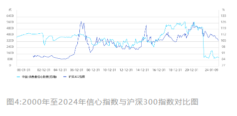

---  
title: 03|搞懂这些先行指标，提前读懂牛熊周期  
index: true  
icon: file  
order: 4  
category:  
  - 短线  
  - 大A  
tag:  
  - 雪球  
---  
  
## 03 搞懂这些先行指标，提前读懂牛熊周期  
  
我们知道了A股历史上牛短熊长，在A股想混好是要做择时的，我们还知道要在天时地利人和时做投资，可回到日常生活中，我们该如何判断现在到底是天时还是地利，还是人和?  
  
这节课将带大家梳理，哪些指标可以帮助我们提前读懂牛熊周期。  
  
### “预期”影响股价，先行指标很重要  
  
老股民很多都对当年国泰君安研究所所长黄燕铭的三朵花理论非常熟悉，股票价格不是树上的花，而是人们心里的花，股票价格不是客观世界的反映，而是人们内心世界的反映。  
  
言外之意，股票价格为什么会涨跌?因为人们的预期在发生变化，客观世界指标的变化并不会影响股价，人们心中预期的变化才能影响决策，进而改变股价。  
  
如果我们详细看过去几十年中国股市与经济之间的关系，股市表现更像是个先行指标，历史上经常会发生股市已经开始筑底走强，而经济可能在未来半年才变好，股市表现相对于宏观经济指标而言，更像是先行指标。  
  
先行指标总是比宏观经济更早地发生转折，提前于经济周期到达高峰或低谷。  
  
除了先行指标，还有同步指标，与经济周期到达高峰或低谷的时间大致相同;滞后指标则比总体经济更晚发生转折，落后于经济周期到达高峰或低谷。  
  
如果股市表现经常提前反应经济变化，我们跟踪经济指标时，就要盯着那些可以帮助寻找天时地利人和的先行指标，从而制定应对措施。  
  
### 这些指标洞察经济增长  
  
新闻里每天都会通报很多经济指标，CPI、PMI、M1、M2等等，不是读经济学出身的我们很难辨别到底都是什么?更不容易分清不同经济指标的变动与宏观经济运行的关系。  
  
我们都知道宏观经济波动是一种周期性的繁荣、衰退、萧条、复苏循环变化过程，具体在实际生活中我们该对哪些指标进行观测?如何根据观测到的指标制定决策?  
  
#### PMI看景气  
  
PMI在新闻中非常常见，中文意思是采购经理指数，经常用来反映经济的变化趋势。  
  
这个数据来源于市场统计，在不同区域、不同规模、不同所有制企业中选定样本企业，随后对企业进行问卷调查。  
  
此后企业根据新订单、生产、就业、供应商配送、存货、新出口订单、采购、产成品库存、购进价格、进口、积压订单这11个维度，按照一定的计算方法进行综合计算，最后得出来的指数就是PMI数据。  
  
在中国，通常官方PMI由国家统计局都会在每月的最后一天公布数值，这个数值以50为荣枯分水线。  
  
当PMI大于50时，说明经济在扩张，数值越高表明扩张速度越快;当PMI小于50时，说明经济在收缩，数值越低表明收缩速度越快。  
  
值得注意的是，日常生活中除了官方的PMI，我们经常能够看到一个非官方的PMI--财新PMI。  
  
这两者最重要的区别在于调查样本的偏向不同，官方调查样本中大企业、国企更多，所以数值所反映的信息更能体现大企业、国企的经  
济景气程度;  
  
而财新PMI调查样本偏中小企业、民企，所以数值所反映的信息比较偏向于中小企业和民企。  
  
**为什么PMI会是先行指标?**这与统计方法有关，PMI的数据来自于一线人员第一时间对企业运行的判断，正所谓春江水暖鸭先知。再加上PMI的频率是月度发布，而GDP大都是季度发布。  
  
所以PMI指数不仅与经济走势密切相关，而且通常会小幅领先于GDP指标。  
  
与此同时，大家都知道中国是个制造业大国所以制造业PMI与中国经济息息相关，制造业的走势往往反映了经济的运行情况。  
  
**PMI与股市的关联度如何?**历史上看除了2014年开始的杠杠牛外，沪深300的中期趋势与PMI紧密相连，下图不难看出，2016年PMI指数阶段触底，A股也走到了行情的最低点，接着PMI一路扩张，A股也随之上涨。等到2020年开始PMI开始一路走低，沪深300随后在2021年见顶后快速回落。  
  
基于此我们可以得出简单结论，PMI持续扩张对股市利好;PMI持续收缩对股市利空。  
  
  
#### M1定买卖  
  
MO、M1、M2、M3这4个指标都是用来反映货币供应量，统称为货币指标。  
  
在传统经济学理论中，因为M1代表了老百姓和企业机关等的现实购买力，反映的是交易性需求，普遍认为M1是决定股市流动性的关键性因素，两者具有很强的正向关联性。  
  
如果单纯的盯着M1数值对于股市的影响，更像是一个同步指标，很难辅助我们提前做决策。  
  
但是若我们不用流动性的视角视角去看M1，而是透过数值变化看背后反映出来的本质，似乎就成了一个先行指标。  
  
已知M1=M0(流通中现金)+企事业单位活期存款，若M1大幅增加，意味着企业将赚到的现金变成定期存款，也就是说企业家们对于未来的预期比较悲观，开始停止或者减少扩张。  
  
反之M1大幅减少，意味着企业将赚到的现金以及存款全部花出去，这时企业家往往对未来很乐观，重新开始扩张。  
  
在2009年之前，中国M1增速大概维持在10%-20%的区间内，10%意味着阶段低位，20%意味着阶段高位。  
  
当时招商证券的罗毅写过一篇非常著名的研报，提出了"M1定买卖”的说法。  
  
逻辑在于M1高位代表企业家信心处于低位，往往意味着股市和经济的顶部。他明确提出当M1增速接近10%时买入，增速超过20%时卖出，同时辅以深圳成指回测，1996年至2009年累计收益率达到惊人的9400%。  
  
  
在2011年以后，中国经济增速告别了双位数增长，和GDP直接挂钩的M1值波动区间也从10%-20%变为5%-10%，因此不能刻舟求剑仍以10%和20%作为买入卖出信号，现在如果以M1同比增速下降触及5%的低位水平为买入信号，上升触及10%的高位水平为卖出信号更为合理。  
  
如果将2000年至今M1增速与万得全A走势对比如下，可以看到除了2015年因为棚改货币化安置导致M1定买卖法则失效之外，其它M1增速还是很好的预测股市的指标。  
  
  
#### 信心指数读人心  
  
经历了几轮牛熊后的老股民经常挂在嘴边一句话:"信心是比黄金更珍贵"!不可否认，身处股市，信心是股价上涨的强大的推动力，可以冲破任何艰难险阻，扫平一切暗礁浊浪。  
  
如果我们能够将人们对于市场的信心绘制成指标图标，似乎就能成为预估经济周期的先行指标。  
  
如果说PMI是制造业的先行指标，消费者信心指数(Consumer Confidence)则是一个反映消费信心强弱的指标，它综合反映了消费者对当前经济状况的评价、对未来经济前最的预期、收入水平、收入预期以及消费心理状态的主观感受。  
  
1997年12月，中国国家统计局开始编制中国消费者信心指数，该指数对于预测经济走势和消费趋向有一定前瞻性，取值范围在0至200之间，其中100代表中性态度，指数值小于100表示悲观态度，而大于100则表示乐观态度。  
  
  
历史上看消费者信心指数与A股之间有很强的相关性，当消费者对经济前景持乐观态度时他们更可能增加消费，从而推动经济增长。这种经济增长的预期可能会提振股市，使得A股上涨。  
  
2016年以来消费者信心指数开始上涨并突破100，随后维持高位一直到2021年，对应的是整个大消费股的业绩爆棚、估值崛起，沪深300迎来了持续的上涨。  
  
相反，如果消费者对经济前景持悲观态度，他们可能会减少消费，这可能会导致经济增长放缓，进而影响A股市场的表现。  
  
2021年至今，消费者信心指数快速跌破100后维持低位，对应着沪深300持续低迷。  
  
值得注意的是，消费者信心指数每个月披露一次，我们需要观察的并不是单次的数值，而是一个整体趋势，如果连续几个月发现信心指数走出趋势，很可能是要“变天”了。  
  
### 这些指标判断估值水平  
  
此前很多人认为A股是一个新兴市场，只有趋势、没有估值，不过随着这些年尤其是2021年后赛道股的全线走低，越来越多投资者开始发现，A股过去20年一直重复一个事情--"高低切换”，高估值板块肯定会掉下来，而低估值板块则一定能涨起来，炒A股必须要看估值。  
  
不过估值永远都是一个相对概念，没有绝对的估值高低和好坏，我们该如何衡量估值水平?以下三个维度，会让你对A股估值有一个全方位认识。  
  
#### 对比经济总量--巴菲特指标  
  
投资大师沃伦·巴菲特有一个著名的论断:如果只选择一个指标，来判断任何时刻市场的估值水平，那么股市总市值与GDP之比可能是最好的指标，这个指标也被称为巴菲特指标。  
  
巴菲特认为，若两者之间的比率处于70%左右时买进股票就会有不错的收益，而当股票市值超过了100%，就比较危险了。  
  
我们用A股数据看看真实情况是否如此，考虑到2007年之前，上市的股票数量太少，好多超级龙头都没上市。所以，我们只看2008年之后的数据。  
  
先看几次历史底部，2008年底部时A股的巴菲特指标大概在46%，2013年钱荒底时大概在43%，2018年年底时巴菲特指标在53%左右。  
  
反观几次大顶，2007年牛市顶点时A股巴菲特指标直接冲到了180%!2015年水牛行情里巴菲特指标到达了120%，2021年核心资产行请里巴菲特指标再度触及100%。  
  
由此看来，用巴菲特来判断A股整体估值历史上长期有效。但同时也需要注意，过去20年来，巴菲特指标的底部不断抬高，还是那个道理，没有一个具体的数字能够代表绝对底部，更没有一个办法能精准抄底，能抓住相对估值低位布局入场就已经能战胜大多数人了。  
  
  
#### 对比不同资产--股债性价比  
  
单看股市估值而不考虑资金成本，那就是还没入门。  
  
股债性价比，顾名思义就是判断股票和债券在某个时间点哪个更具投资性价比。所以，这个指标需要用到两个数据:分别来自股市和债市。  
  
参考传统的股债利差模型，结合雪球投研团队大量数据验证分析，我们编制了雪球股债性价比指数：  
  
第一个数据来自于股市，也就是股票的平均预期收益率，我们用中证全指PE倒数来表示。  
  
第二个数据来自于债市，使用的是十年期国债收益率，十年期国债收益率看成是长期债市的基准利率，决定着整个债市的走向。  
  
股债利差 = 10年期国债收益率 - 中证全指数PE倒数  
  
最终得出的指数数值越低，则意味着股票类资产性价比越高。  
  
  
从上图可以看出，最近5年来，每当股债性价比指数进入0%-5%区间，都会引发一轮行情;而当股债性价比指数超过50%，往往意味着要谨  
慎入场。  
  
#### 对比历史趋势--估值百分位  
  
PB、PE大概是股民朋友最常用的一种判断估值高低的方法，它的核心要义就是跟过去相比现在的估值到底如何。  
  
与股债性价比不同，股债性价比是与别的资产做对比，估值百分位是跟同类资产的过去做对比。  
  
估值百分位就是某只股票/指数当前的估值数据，处于它历史数据(通常为5年以上，时间越长越有代表性)里的百分之多少位置，比如70%估值百分位，表示根据历史，目前估值并不便宜。  
  
根据估值水平的高低指导交易，在低估的时候买入，在高估的时候卖出。  
  
PE百分位适用于业绩增长稳定，周期性不强的股票/指数;PB百分位适用于周期性行业，如煤炭、石油石化、有色、农业、化工、金融、地产、汽车等行业。  
  
日常我们如何更直观的观测?雪球APP中有专门关于指数估值的分类，其中PE或PB百分位<30%，且PE绝对值小于20的显示浅蓝色，此时的指数处于较低估值的状态；  
  
PE或PB百分位>70%，且PE绝对值大于20的显示为深蓝色，此时的指数处于较高估值的状态;其余情况为估值适中的普通蓝色。  
  
  
在这里特别要指出的是，百分位是一个很好的参考指标，一个品种估值百分位低，可能是个很好的投资机会。  
  
历史上A股大部分时间会围绕着它的平均估值上下波动。当估值过高或者过低，未来大概率会回归到均值附近。  
  
但低估值这个单一指标很多时候有其自身的局限性，在做决策时可供参考，不可盲目刻舟求剑。  
  
### 这些指标感知流动性  
  
相对于经济增长和估值水平而言，流动性对股市的影响更为直观，其很大程度上决定市场有没有行情、行情能走多远、行情有多大。  
  
流动性最直接的体现就是在我们日常看到的成交量上，但是流动性背后的判断和预测确实比较复杂，对于从宏观到微观的分析会有很多，而对于我们普通投资者而言，关注这以下几个指标，就可以对流动性有一个最基本的感知。  
  
#### 宏观流动性看利率  
  
每到周五，我们经常听到大消息，央行又宣布降息、降准了，一整个周末股民们都在畅想下一周的行情，诸多自媒体开始回溯历史，某年某天降准后，未来一段时间A股涨了多少多少，虽然你还不清楚背后的原理，但也不由自主的兴奋起来。  
  
其实降息、降准乃至加息这些词都代表利率水平变化，而利率水平与A股之间的关系是复杂且动态变化的。  
  
一般我们认为，降息对股市就是直接利好，为什么呢?因为利率下降，人们不愿意往银行存钱，而企业主则能以更低的成本获得贷款资金，社会上资金更加充裕了，更容易流向股票市场，从而推动股价的上涨。  
  
从另外一个角度看，加息总体对于股市是利空的。加息目的就是回笼资金，避免通货膨胀，收紧市场货币;同时鼓励大家的钱往银行储蓄为主;让市场更多的热钱回流银行，导致市场货币资金流通量减少，宏观流动性缩紧，对于股市而言无疑是利空。  
  
  
如果将10年期国债收益率看作无风险利率，可以看到当历史上的A股在进入降息周期时，市场宏观流动性宽裕时，更容易走出大级别行情，2014年到2016年最为明显。  
  
而当进入加息周期(2008年-2014年中)，宏观流动性缩进时，往往很难有好的表现。  
  
那么具体如何观测利率水平?三大核心利率指标主要是长期利率LPR、中期利率MLF以及短期逆回购利率。  
  
**长期利率LPR可以粗略地认为就是此前我们买房的贷款利率**，以前我们国家还未实现利率市场化的时候，我们银行是按照央行发布的贷款利率作为标准，发放贷款时以此利率为基准上下浮动，这个利率被称为贷款基准利率。  
  
2019年，通过对LPR的持续改革和优化，央行发布了相关的新公告，自此LPR也有了一个更响亮的新名字:贷款市场报价利率，就是今天我们常见到的LPR，也就是咱们一般理解的长期利率水平。  
  
LPR一般是在每个月的20号公布新的报价，不过并非每个月都会有变化，经常会出现连续几个月维持不变的情况。  
  
**相比于LPR，MLF周期相对较短，什么是MLF(大家俗称麻辣粉)呢**?  
  
MLF指中期借贷便利，通俗的讲就是指央行借钱给商业银行，让他贷款给三农企业和小微企业等针对性领域，用于扶持实体经济的发展。  
  
所以一般大家理解为中期的利率即可。从传导机制上看，一般MLF利率的变化最终会传导到LPR上，所以基本上MLF不变的话，LPR也基本不会变;MLF利率一般是每月15号就公布。  
  
**逆回购的期限最短，所以最容易判断市场流动性的变化，什么是逆回购呢**?  
  
通俗的讲就是央行为了解决市场上流动性的不足，把之前给银行的国债再买回来，这样银行拿到了钱，这部分钱就可以投放到市场上面了，让市场上的钱变多。逆回购的期限一般是7天或14天，央行的官网上会披露当期逆回购利率。  
  
逆回购主要看趋势，如果短期利率抬头，也就是说短期利率价格上行，而且呈现连续性，那么就要注意流动性有收紧的趋势，这个也是一般最先能观察到的，需要时刻注意。  
  
#### 微观流动性看资金  
  
微观流动性就是咱们常说的各类资金，是能具体体现在市场当中的白花花银子。通常，咱们可关注的资金主要来源于个人投资者、一般法人、公募私募基金等国内机构以及外资机构。  
  
#### 散户开户数  
  
在A股市场个人投资者也就是最广大的散户，是最庞大的投资群体，是不同于美股的国内特有的投资者结构的具体表现。散户的力量足以左右市场，也是全市场最为关心的投资者标的。  
  
  
从上图大家会发现，往往阶段开户数集中增加，就是行情比较好的时候。而阶段中开户数高点的，也基本是行情的高点，这主要是多数投资者后知后觉以及追高所导致的。  
  
值得注意的是，2015年那轮牛市过后，散户开户数一直维持在低位震荡水平。一方面缘于机构资金日益庞大，另一方面是市场已经近10年没有全面牛市了。  
  
现在再去观察散户开户数，更要去观察一个长期趋势，短期的脉冲增加对微观流动性的影响已经没有过去那么大了。  
  
#### 基金发行情况  
  
公募基金目前已经成为A股市场最大的投资者，体量大，集中性强，对市场走势有决定性的作用。  
  
历史上，从基金发行以及持仓趋势看，都能直接左右市场的走势和机会方向。  
  
尤其是2016年以后，公募基金数量猛增，市场份额继续扩大，话语权不断加强，叠加价值投资盛行，公募基金已经成为全民投资的又一个方向。  
  
下图可以清晰看出，16年以来权益基金发行总数与份额稳步提升，流动性宽裕的同时推动股指持续走强。  
  
不过，等到了2020年末爆款基金频出，虽然发行总数还在增加，可募集资金却开始下滑后行情戛然而止。  
  
  
这些年随着公募基金的崛起，逐渐主线了好卖不好做，好做不好卖的现象。但这恰好可以成为我们感知流动性的线索，可以看到，相比于基金发行数量，基金发行份额更有指向性。  
  
一般基金发行份额持续走高时，往往意味着流动性宽裕，会有阶段性行情，等到密集出现爆款基金、发行份额却持续降低，也许说明外围资金已经不足了，往往也是行情的阶段高点。  
  
#### 外资的流入流出  
  
外资，其实就是现在大家经常听说的北向资金。在我们对外开放以来，不断引入外资和外资机构，这几年，对市场不仅提供资金的支持，同时也对市场投资风格的转换，起到了很大的作用。  
  
  
外资大家不能天天看，要看趋势，比如阶段性的净流入，基本上行情不会差。而如果阶段性的流出，那就要注意了。  
  
总体的趋势看，因为我国经济的持续向好，外资整体流入是趋势，但是阶段性看，外资的提前性和聪明性，确实值得跟踪和参考。  
  
#### 杠杆资金  
  
我们在股市当中不仅仅是普通的资金，还有杠杆资金可以用。杠杆资金通常也可以作为市场流动性的参考指标，而且其程度对市场热度的判断也可做一定的参考。  
  
融资融券是近年券商比较火热的业务，余额是指投资者每日融资买进与归还借款间的差额的累积，在2015年后清理伞形信托后，可以看作目前A股中的杠杆资金。不难看出，杠杆资金与股市表现密切相关。  
  
  
虽然对于普通投资者来说我们建议不要随意使用杠杆资金，因为风险比较大，可能会有无法承受的损失。但对于观测微观流动性而言，却有着很强的参考意义，这种参考意义更多的在于观测股市风险。  
  
以上便是为大家梳理判断牛熊周期的指标，虽说这些指标无法帮助你精确的判断明天是否会涨，但通过这些先行指标，我们更容易清晰的判断我们正处于牛熊周期的什么位置，一旦了解所处的周期位置，再来面对涨跌无常的市场，便会有清晰的思路来应对。  
