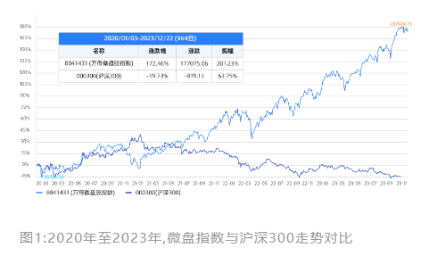
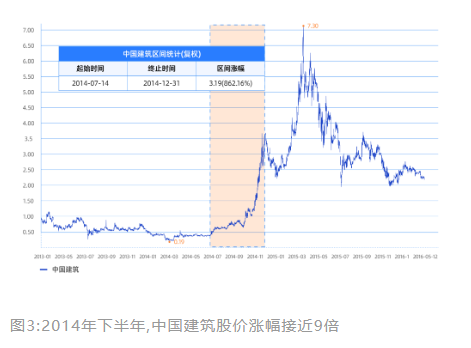
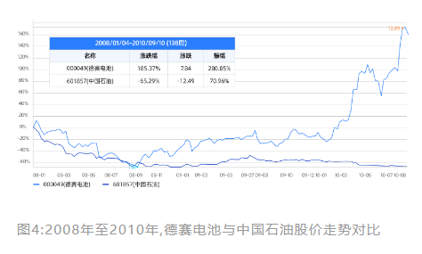
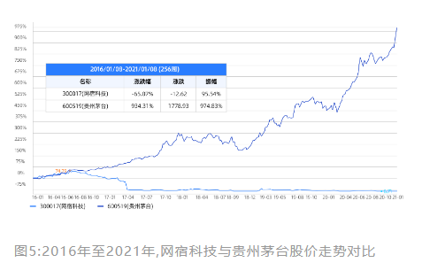
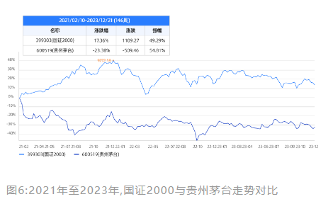

---  
title: 04|风格周期一直存在,如何做到随风而动?  
index: true  
icon: file  
order: 5  
category:  
  - 短线  
  - 大A  
tag:  
  - 雪球  
---  
  
## 04|风格周期一直存在,如何做到随风而动?  
  
有时候我们可以搞懂宏观大势，清楚A股的整体方向。但也有很多时候，只搞懂宏观大势无法解决所有问题，只知道衰退阶段闭眼买是远远不够的。  
  
纵观A股历史，更多的时间里我们无法精准的判断A股大周期，可以说A股大部分时间都保持着结构性机会。  
  
结构性行情中往往意味着只有踏准了机会才容易赚钱，如果摸不到市场的脉左右打脸会非常的尴尬，这种尴尬期对于A股投资来说，除了解决买与不买的问题外，买什么更为重要!  
  
### 风格周期过去有，未来依然有  
  
时间回到2020年，延续了2019年的结构性牛市后，市场风格呈现出了极度的大小风格分化。  
  
当时市值小于百亿的个股基本无人问津，某些市值大的个股被公募基金等机构投资者普遍目集中持有，A股市场某些热门板块的整体估值水平大幅提升，整个2020年核心资产扎堆的沪深300全年涨幅接近50%，而代表了小盘风格的国证2000全年涨幅仅19%。  
  
伴随着大盘蓝筹、白马股的全线上涨，不仅股民们开始以大为美，就连2021年2月的十大券商还在鼓吹抱团行情，称其尚不具备瓦解基础。  
  
市场上最多的一种声音是，随着注册制的持续展开，未来小市值、小盘股将会没有任何希望，尽早拥抱蓝筹股，才是投资者真正的归宿。  
  
三年后的2023年，当时资金扎堆的绩优白马股，各种消费茅、科技茅、医药茅、锂电茅等行业板块龙头们跌的稀里哗啦，反而另一边，微盘股策略却强势崛起，成为万绿丛中一点红。  
  
从涨幅来看，2021年到2023年五年间万得微盘股指数每年涨幅分别有40%、15%、45%，对应的，沪深300指数在2019、2020年连续大涨，从2021年开始与之背离，大盘股和小微盘股之间渐行渐远。  
  
  
这并不是第一次大小盘风格的剧烈切换，早在2015年以前，许多股民炒股时都会下意识的远离大盘蓝筹股，似乎大盘蓝筹股给人的感觉就是长的慢，没有活力，而小盘股本能的让人与成长、未来结合起来。  
  
大小盘股历史上究竟有何表现?风格切换是否有规律可循?首先我们需要对大小盘风格进行一个可比的定义，我们选用比较客观的按市值分类:申万大盘指数(市值排名1-200)与小盘指数(市值排名601-1400)做对比即可发现，2000 年以来，大小盘风格经历过3次大级别的切换，每轮切换时间在 5-8年不等。  
  
  
**2001至2007年**，经济增速上行势头强劲，传统周期和价值板块整体表现强势，大盘风格明显占优，持续时间长达7年。  
  
A股在此期间经历了史上波动最大的牛熊第一阶段，大牛市始于2005年6月6日，当时沪指998点，见顶于2007年10月16日的6124点，此后跌至2008年10月28日的1664点。  
  
这轮牛市中，上证综指累计上涨了28个月，最大涨幅5倍，期间涨幅最大的行业聚焦在周期、大金融中，有色指数涨了12倍、非银金融10倍、地产8倍、煤炭7倍、银行6倍。  
  
**2008年至2015年**，市场总体风格是小盘股占优，期间也短暂的出现了风格切换导致大盘股短期占优，这两次大切换都发生在岁未年初之际:  
  
第一次时值2012年，年内国内经济出现了显著的增速下滑，随着降准降息、财政基建、地产放松等一系列刺激政策落地，经济在四季度出现了复苏迹象，大盘价值股在经济上行期盈利改善预期强烈。  
  
第二次发生在2014年底，当年7月份A股市场开始迎来了久违的大牛市。11月央行宣布降息后，市场更是一度进入月涨30%的“疯牛”阶段。  
  
不过当年前三季度涨幅靠前的行业是国防军工、通信、计算机等行业，这些都是小盘股扎堆的行业;等到了下半年一带一路概念开始发酵，这成了大盘价值股大幅上涨的直接催化剂，建筑行业全年累计涨幅高达 83%，一大批中字头央企建筑业公司的涨幅甚至都超过了200%。  
  
  
**2016年至2020年**，市场总体呈现大盘股风格，现在看来2016年更像是核心资产崛起的元年，告别2013-2015年以传媒、计算机为核心的小盘成长牛，迎接2016-2021年以茅指数、宁指数为核心的大盘价值牛、大盘成长牛，实现风格大切换。  
  
当时国内经济持续向好，消费板块受益于居民收入提升、地产周期上行和消费升级，高端白酒持续涨价、国内智能手机出货量快速增长。  
  
与此同时，内外资增持高ROE和低估值分位的消费核心资产，2016年公募基金对消费持仓比例从24.72%上升至27.79%，在外资净流入和股票型基金快速发行的背景下，内外资开始对以茅指数为代表的消费资产形成共识。  
  
**2021年至今**，市场在这一年多时间中重新出现小盘占优风格。  
  
如此看来，A股市场一直不变的正是不断的风格切换，不同时期大家都会对某一类型的公司非常追捧，就会冠之以识别度高的名字。比如耳熟能详的“核心资产”，“白马龙头”，“高送转”，“壳资源”，美国也有类似的概念，最耳熟能详的就是“漂亮50”。  
  
那么到底什么才是人们口中的风格?风格像是不同个股拥有共同的一组属性!市场上分类比较多的比如大小盘风格，是用市值大小作为划分的依据;另外一种便是成长价值风格的区分，用的是财务和估值指标，很多时候，成长风格往往和高估值挂钩，价值风格往往和低估值挂钩。  
  
而市场上存在的风格基本可以被归纳为四类:大盘成长、大盘价值、小盘成长、小盘价值。  
  
### 风格切换每次都对应着估值的均值回归  
  
A股虽然只有几十年的时间，但却历经多次风格变换。每隔几年进行一次风格变化，未来会不会也这样?  
  
即便在更成熟的美股市场，拉长时间维度，去看过去50年历史，也有着4次明显的大小盘切换行情，而美股眼下这一轮科技大盘成长风格看似延续了十年多，但实际上过程中也有着很多次的细分切换。  
  
A股未来仍旧延续着频繁的风格切换，也许是大概率事件。也就是说身处A股，如果踩对了风格，收益率可以非常高，如果踩错了风格不只是跑输市场这么简单。  
  
在风格如此多变的市场，作为个人投资者，怎样做才能不在风格切换的浪潮中成为炮灰，甚至提前发现潜在的变盘信号?也许，估值是你最好的坐标尺。  
  
**很多人认为A股是新兴市场，只有趋势，没有估值**。但真实情况是，过去20年间A股三次大小盘风格切换时，无不对应着估值触碰极值后的均值回归。  
  
接下来通过三次历史名场面来体验一下估值与风格切换的微妙关系：  
  
2008年，代表大盘价值股的周期股的估值远远高于消费股和成长股，当时中国石油刚上市不久，市场狂热的给一个成熟期行业巨无霸8.2倍PB的估值，现在看来甚至无法想象;在同一时期，给予做电池起家且与iphone深度合作的超级成长股德赛电池10倍PB的市场定价。  
  
后视镜的角度看，这就是智能手机爆发的前夜最具成长想象空间的时刻，这是当时市场的缩影。结果后续极具成长性的德赛电池虽然也跟随回调，但企稳之后股价持续飙升，而中石油则成了股民们的饭后谈资。德赛电池与中石油缩影背后，是那一时期小盘股持续对大盘股形成超额收益。  
  
  
到了2016年初，即便经历了三轮股灾，创业板和互联网股的估值还远远高于白马股、蓝筹股，当时创业板第一牛股网宿科技刚刚创造了不到4年接近40倍的涨幅神话，滚动市盈率60倍，市净率接近20倍;而股王茅台当时股价仅在150元附近徘徊，市盈率不足15倍，市净率仅4倍。  
  
此后，我们看到了日后资金逐渐向核心资产转移，蓝筹白马日渐崛起的背后，是小盘成长股的日渐衰落。  
  
  
最近一次，2021年2月中旬开始，市场风格切换到小盘的一个重要背景是抱团白马股的估值陷入极度疯狂，彼时茅指数与宁指数杀的正欢，21年2月茅台股价超过2600元，市盈率来到了历史上从未有触及的70倍，宁德时代在当年11月触碰到近700元价格，市盈率也超过了100倍。而那时国证2000的市盈率只有36倍。这些年小盘风格在逐渐占优，也就不奇怪了。  
  
  
估值也许在多数时间无法直接帮助我们预测未来，不需要我们很高频的去跟踪，但估值可以为我们提供投资的标尺，当不同风格的估值差足够大时，不需要我们精确去测量，但我们要多一个心眼，变盘也许临近了。  
  
### 产业的更迭，缔造了风格的变换  
  
如果你能读懂产业更迭，也许就能更早一步看到未来的风格变化。  
  
进入21世纪，我们迎来了新世纪的背量一个重要会议--第十六次全国代表大会，大会提出全面建设小康社会的奋斗目标，此后我国持续加大基础设施建设投入，2003-2008年基建累计投资额达15万亿元，年均复合增速23%。  
  
能源、交通、通信等领域设施逐步完善，建成落地西气东输、青藏铁路、三峡工程、南水北调等多个超级工程，基建水平取得重大飞跃。  
  
在这一时代背景下，伴随着政府支出，基建行业开始进入快车道。  
  
与此同时住房体制改革后，商品房销售和新开工面积渗透率加速提升，商品房销售渗透率在2000年突破了10%，地产行业的发展也推动了城镇化进程。  
  
2003年初，一些蓝筹股因基金等机构投资者的集中持有而暴涨，构成了机构核心资产的五朵金花”，A股第一次出现了“二八分化的现象”。  
  
煤炭、汽车、电力、银行与钢铁这些与传统制造业、大基建息息相关的行业全线飙涨，A股进入五朵金花时代，**而大盘价值主要集中在金融、地产、建筑、电力等低估值板块**，得益于时代背景与产业发展，**2001-2007年大盘风格持续占优**。  
  
2009年是我国移动互联网浪潮的开始，2010年苹果发布iPhone4智能手机，移动互联网浪潮开始酝酿，2013年工信部发放4G牌照，移动互联网开始爆发，移动互联网以及其衍生应用社交、购物、出行等在极大便利了居民生活的同时，也促进了新的产业的兴起，**带动了从2013年开始的中小创行情和“互联网+”行情**，2012年12月到2014年2月的一年多时间里，创业板指数从585点上升到1571点，市盈率也从28倍提升至45倍。  
  
以移动互联科技为代表的中小创股票和“互联网+"股票表现出色，38.4%的个股最大涨幅达到5-10倍，有19.2%的个股最大涨幅甚至达到10-20倍，最有名的当属那个曾让人为梦想室息的乐视网了。也是因为当时这些美好记忆当时的股民都对小盘成长股有了坚定的信仰!小盘成长典型代表集中在计算机、医药、新能源等领域，从2012年开始一直到2015年牛市结束，整个小盘成长风格持续占优。  
  
2017年后随着4G渗透率进入低速增长期，科技周期进入下行阶段，新的产业机会变少，叠加国家实行供给侧改革，去除行业过剩产能的同时鼓励支持行业内部兼并，充分整合内部资源，行业龙头的竞争力得到提高，市场过渡到大盘风格。  
  
在此期间，新能源汽车行业实现了从量产到产量的关键跨越。2017年到2019年造车新势力纷纷下场，既有蔚小理的慷慨激昂，也有华泰、银翔等的折戟沙场。这期间电池密度大幅提高，电动汽车续航里程持续提高。  
  
等到2018年，我国宣布取消汽车制造行业的外资限制，特斯拉宣布即在上海临港自由贸易区建设超级工厂。随着Model3、比亚迪汉、蔚来ES8等逐步打开市场，时代正在悄然声息的发生巨大变化。  
  
在此期间以宁德时代为代表的新能源产业链公司逐渐被市场认可，甚至成为了时代的信仰，**大盘成长主要分布在酒、食品、半导体、消费电子、新能源、医药、旅游等行业，组成成分类似“核心资产”的概念，大盘成长风格也因此而生**。  
  
进入2019年后，科创板成立，覆盖了信息技术、生物医药、高端装备等尖端技术产业的优质上市公司，以科创100ETF华夏(588800)为代表的专精特新概念应运而生，成为新时代下的科创中小盘风格。  
  
**“见识”是要“见人所未见”，这样才能更好地发现机会。产业的更迭，缔造了风格的变换，越早了解产业更迭，越早看到风格切换**。  
  
### 人性永不变，常识很重要  
  
有数据统计，进入2010年之后，A股在72%的时间内至少是结构性行情，结构行情意味着选对风格很重要。  
  
如果踩对了风格，收益率可以非常高，如果踩错了风格，不只是跑输市场这么简单。  
  
作为投资者，如何才能在A股尴尬期不尴尬?  
  
#### 如果不信，你就得一直不信  
  
风格的力量如此强大的原因在于驱动力的终极形态不是基于分析，而是基于信念。  
  
当投资者被信念所支配时，他可以忽略一切短期利空，当看到账户出现正回馈时更加强了他的信念。可当风格一旦转换，信念的扭转却非常难，转换引发的痛苦更甚。  
  
如果你的投资方法本就是自下而上，通过分析企业出发，那么风格趋势投资可能在A股更好的一个投资方法，是放弃信念随大势而动，当你的投资框架筛选出你心仪的目标，你可以将持股周期延长一些，因为风格这东西总会回来，不去想他专心在自己框架内，至少不用承受内心的煎熬。  
  
#### 如果想要随风而动，你需要这样做  
  
**了解经济环境很重要**，在众多大小盘风格的研究中，大部分研究人员得出的结论都趋于一致。当经济好、经济预期乐观、产业趋势多、技术进步趋势存在的时候，投资者更倾向于追求未来的成长潜力大的标的，倾向于在小公司里去寻找，而股价一般是最乐观的投资者定价，因此，经济预期向好的背景下就形成了小盘风格。  
  
而反之，当经济前景黯淡，不确定很大，产业前最不明确时，龙头企业可以有更强的抵御经济下行压力的能力，同时也可以借助其他公司的危机，乘机兼并收购，从而强者更强。这种环境下，大盘龙头会相对占优。  
  
**关注重要指标--十年期国债收益率**，从历史经验来看，3.5%是一个关键的分水岭。2008年10月十年期国债收益率向下击穿3.5%，成长风格逐渐崛起;2015年1月之后，十年期国债利率加速击穿3.5%，成长风格重新回归;2017年4月之后十年期国债利率加速上行3.5%以上，小盘成长加速跳水;2018年11月十年期国债收益率向下击穿3.5%，大盘成长风格崛起。  
  
**对重大政策保持敏感**，A股风格演变很多时候都来自政策催化，突如其来的不寻常政策很容易导致风格切换，2016年9月证监会修订“重组新规“开始从严监管并购，直接将小盘成长风格重锤击倒。  
  
**对周期与估值时刻保持敬畏**，从历史风格持续时间来看，一旦一种风格持续超过两年，估值就会被抬升到相当高的水平，此时外部环境的变化会导致其他板块性价比回升，从而出现风格转换。  
  
**对产业变革性新闻保持敏感**，无论是消费电子、还是新能源汽车，技术的进步都需要时间的积累，但从后视镜角度，总有一个从量变到质变的节点。Iphone4让智能手机走进千家万户，Model3让新能源车不再高不可攀。如果能在产业变革节点保持足够敏感性，就能够更接近风格变盘点。  
  
如果掌握了以上常识，还能在众人疯狂时保持些理智，在口号式投资真的到来时众人皆醉我独醒，也许就真的能做到随风而动，做风格变化的朋友。  
