## 05|如果A股就是政策市，如何做政策的朋友?

沪指这几年总是在3000点上下徘徊，交易机制本可以随时卖出，股民们可以随时脱离这个波动的舞台，但历史上那每一次惊心动魄的波动像一根隐形的纽带，始终紧紧缠绕着他们的灵魂。

历史上，国家往往在行情的极致点出台政策，早些年间，1995年国债期货政策导致了上证指数三天内爆涨55%;2008年10月A股跌的透心凉，4万亿的出台直接改变了股市方向。

近年来，许多重磅政策直接改变了产业结构，2020年9月中国正式宣布力争2030年前实现碳达峰，2060年前实现碳中和，双碳目标的出现直接让锂电、光伏等新能源行业成为年度最强赛道。

2016年初商品价格处于极低的位置，当时很多人都嘲笑煤炭、钢铁企业没有未来，供给侧改革的到来直接让煤炭股、钢铁股成为市场上最耀眼的明星。

老股民提到A股时，经常愿意称其为政策市，这背后主要源于历史的记忆。正是这些政策带来的波动，让很多股民每一次的“离场”都不过是片刻的呼吸，一段短暂的休憩。

这也意味着A股市场受到政策的影响特别大，形象地说，政策更像是A股背后的手，这也是为什么有人说A股既是世界上最难玩的资本市场，也是世界上最简单的资本市场。

如果能读懂政策，也就看懂了所谓的政策市。

### 影响A股的两大政策---货币政策与财政政策

我们平时说的能够影响股价甚至股市大势的政策可以统称为货币政策和财政政策。

**货币政策可以分为紧缩性货币政策和扩张性货币政策**，在实行紧缩性货币政策时，货币供给减少，利率上升，不利于股市走牛;实行扩张的货而政策，意味着货币供给增加利率下调，股市容易走牛。

具体的工具主要有:利率、存款准备金率、贷款规模控制、公开市场业务等。

**财政政策主要通过调节国家预算、税收、国债等手段影响经济运行，进而影响股市**:

**国家预算作为政府的基本财政收支计划**，国家预算能够全面反映国家财力规模和平衡状态，扩大财政支出的结果往往会促使股价上涨。

**政府的税收政策也会影响股市**，减税会增加居民收入，扩大股市潜在资金供应量，最直接的比如降低印花税，直接活跃资本市场，提振市场信心。

**国债可以调节资金供求和货币流通量**，作为筹集财政资金的一种形式，在不带来通货膨胀的情况下，缓解了建设资金的需求，有利于总体经济向好，有利于股价上涨。

货币政策与财政政策如何影响经济，随后传导到股市?过去40年全球的主流思维都是重视货而政策、轻视财政政策，包括我们A股投资者，明显对降息、降准的热情度更高。

在主流的宏观政策框架下，货币政策是经济逆周期操作的主要工具，财政政策则注重中长期的稳健和可持续，货币和财政政策相对独立。

不过时至今日财政政策似乎越来越重要，财政政策不仅在短周期稳定经济增长中发挥有效作用，也可以在降低金融周期的波动幅度、控制金融风险中扮演重要角色。

与美国等发达国家相比，我国的房地产泡沫和去杠杆的调整刚刚开始，相比于货币政策，财政政策更能在有效稳定经济增长的同时，促进结构调整和化解金融风险。

### 历史上不同政策周期下的A股表现

单说枯燥乏味的政策很难有形象的感知，如果结合历史行情来对照着政策，我们会对政策周期以及不同政策周期下A股的表现有全面了解。
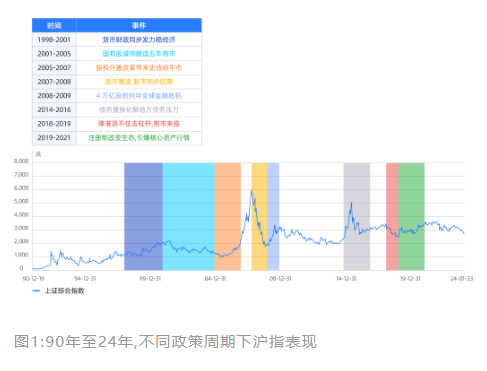

#### 1998-2001，货币财政同步发力稳经济

1992年邓小平南巡后全国开启了投资的热潮，高速的固定资产投资增速使得产能在90年代快速累积，90年代初期的股市一路飙升，沪指从90年成立的95.79点一路涨到最高的1558点，这种热络一直持续到了96年的冬天，随后股市开始了漫长的蛰伏。

在经济飞速发展的日子里社会上则积累了大量低效产能，当1997年亚洲金融危机对我国经济造成冲击时，外需突然的减少直接暴露国内的产能过剩问题，企业盈利纷纷下滑。

当时的国务院总理朱镕基曾在系列讲话中指出:1994年1月-5月，全国49.5%国有企业亏损，等到1995年，好多企业都资不抵债，负债率平均在87%。也是从那时开始，A股停滞不前，震荡徘徊。
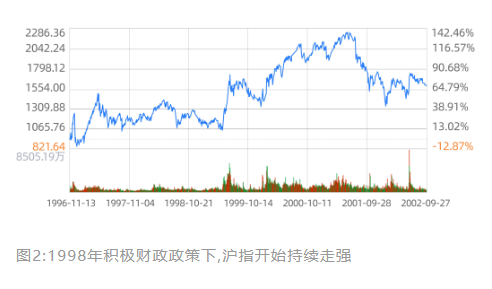

面对下行的经济我国政府在1998年开启积极财政政策，当年增发1000亿元长期国债并配套1000亿元银行贷款，并在随后的五年持续维持积极财政政策。
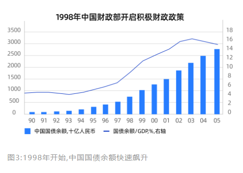

同时也在1998年，中国央行在货币政策端从之前“适度从紧”定调调整为“适当的货币政策”，并展开持续降息操作。
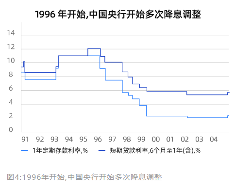

97年开始的经济困局在财政政策与货币政策的双重刺激下，终于在2000年宏观经济开始复苏，亚洲金融危机的影响消散，出口恢复强劲，GDP增速在两度破8之后保8成功。

虽然在此期间宏观经济面临下行压力，但这期间货币政策与财政政策持续发力，诸多政策利好和资本市场发展驱动股市走牛。1998-2001年中虽有亚洲金融危机引致的阶段性回落，但上证综指整体上涨幅度接近90%，在经济困境期内走出了大牛行情。

#### 2001-2005，国有股减持酿造五年熊市

从1998年开始的牛市持续三年后，2001年著名经济学家吴敬琏在接受央视采访时说:中国的股市很像个赌场。此言一出股市赌场论一时间席卷全国，引发市场一片哗然。巧合的是，在央视播出吴老先生这一著名的大实话的半年后，A股市场就开始了一场长达近五年的下跌--时间长度从2001年6月起一直到2005年6月止，沪指从最高2245点起，跌至最低998点止，跌幅高达55.5%。
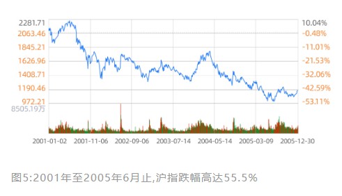

这期间的大跌是多种因素共同作用的结果，包括外部美国科技股泡沫破灭影响以及国内货币和其他政策的制定：

2001年美国科技股泡沫破灭美股三大股指纷纷暴跌，对全球股市都产生了冲击。在此背景下，我国央行实行稳健的货币政策，并没有采取大放水来对冲国际风险，根据历史记录，我国央行在2004年加息一次，在2006年加息两次。

这期间的国有股的减持，则成了压倒股市的最后一根稻草:

2001年4月26日，财政部部长表示适当减持国有资产的方案不久即可公布；

2001年6月12日，国务院正式发布《减持国有股筹集社会保障资金管理暂行办法》，国有股减持工作正式启动，沧州化工(现金州化工)、江苏索普、韶钢松山率先在增发新股方案中提出国有股减持。
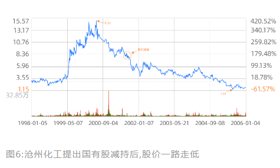

2002年6月24日，国务院发出通知，停止通过国内证券市场减持国有股，随后的A股闻声起舞，第二天沪指涨超9%，终于在跌了一年半后暂时企稳。

2001-2005年可以算得上A股史上首个暗黑时期。这个暗黑时期，几乎所有参与者都提不起劲，股市每天只有寥寥几十个亿的交易金额可以直接证实当时市场的低迷到了怎样的程度。

#### 2005-2007，股权分置改革带来史诗级牛市

2005年6月6日，中国股市发展史上最重大的事件之一--股权分置改革正式拉开帷幕，当天沪指跌至998点，而在随后的两年多时间里，沪指直冲云霄，一路飙升至6124点，也成为了至今无法逾越的高点。
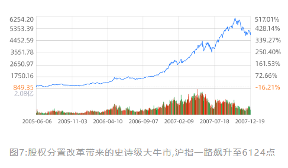

2005年以前，A股市场非流通股占比达到全部股份的近三分之二，同股不同权带来了诸多问题进而引发IPO排队企业众多、大股东侵占小股东利益、市盈率高等一系列市场乱象。

基于股权分置的种种弊端，我国于1999年开始探索国有股减持的方法，2001年《国有股减持办法》的出台正式拉开了股权分置改革的序幕。

2005年9月股权分置改革进入全面实施阶段，截止2006年末，已经完成或进入股份制改革的上市公司市值占应改革上市公司总市值比重的97%，股权分置改革基本完成。

叠加货币政策宽松加码，人民币持续升值，国外热钱涌入，一时间流动性变得非常宽裕，当时市面上开始泛起“不缺钱”的基调，最终上证综指于2007年10月创历史新高，期间累计涨幅达4倍。

#### 2007-2008，货币骤紧，股市同步回落

2005年开始的疯狂牛市一直延续到了2007年沪指捅到6124点，如今仍是老股民心中的灯塔，盼望着有一天能将其挑破。

2007年为防止经济过热和通胀，央行货币政策从“稳健”转为“从紧”，连续3次上调贷款基准利率央票发行利率及存款准备金率，但货币政策时滞下股市没有立刻降温，依旧处于牛市氛围，现在再用后视镜去看这段历史，不难看出这已经是明显的预警。

07年9月货币市场基准利率Shibor持续飙升，信贷见顶回落，上证综指在10月触及6124点后开始走熊。07年末再次上调贷款基准利率及央票利率后，央行不再使用价格手段。等到08年更侧重数量手段，7次提高准备金率。
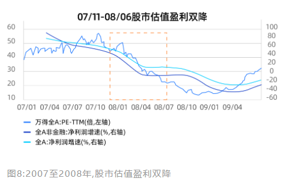

A股则在此期间进入戴维斯双杀，进入08年后估值持续下杀，整体盈利增速自07年三季度起出现持续回落，盈利估值双杀导致市场加速下跌，当时的核心资产五朵金花们--金融，地产，有色，煤炭，钢铁跌幅巨大。

#### 2008-2009，4万亿投资对冲全球金融危机

屋漏偏逢连夜雨，刚刚经历了07-08年内部经济过热下的货币政策收紧，我们又遭遇了全球金融危机对国内经济的冲击，这时候我们国家使出了每个投资者都熟悉的财政政策--4万亿投资。

2008年9月雷曼兄弟破产，美国次贷危机升级为全球金融和经济危机，国际金融市场流动性骤然趋紧。

受此影响，2008年9月中国出口同比增速快速下滑。国内经济既面临着前期紧缩货币政策带来的下行周期，又面临着国际金融危机扩大带来的外需下降，二者叠加导致2008年三季度之后中国经济下行速度明显加快，2008年一整年，沪指从5265点一路跌至最低1664点，可以说是A股历史上最熊的一年。
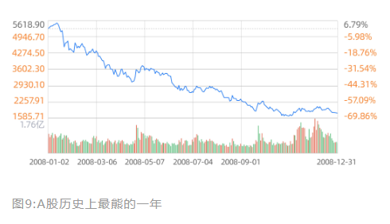

为了应对当时的经济环境，我们又看到了货币财政同步转向宽松扩张，四万亿投资拉动基建投资:

财政基调从稳健转向积极，推出“四万亿投资“计划，08年11月总理温家宝主持召开国务院常务会议，确定了当前进一步扩大内需、促进经济增长的十项措施，同时在全国所有地区、所有行业全面实施增值税转型改革，加大金融对经济增长的支持力度。

配合着4万亿的财政政策，货币政策及时转向宽松。2008 年下半年，央行四次下调存款基准利率，三次下调存款准备金率。与此同时，央行相继停发3年期中央银行票据、减少1年期和3个月期中央银行票据发行频率，引导中央银行票据发行利率适当下行，保证流动性供应。

在财政政策与货币政策再度联手后，经济整体经历了快下快上。在2008年11月推出“四万亿“政策后，2009年1季度实际GDP增速已经见底，2009年2季度至2010年1季度连续4个季度实际GDP增速连续回升，2009年3季度开始实际
GDP 增速已经回到 10%以上了。
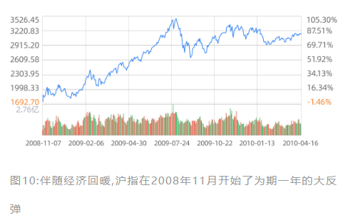

股市表现同样跟着政策亦步亦趋，2008年11月上证指数在大跌后快速反弹，反弹接近一年后，上证指数出现回落并开始大幅波动。

#### 2014-2017，货币宽松后，债务置换化解地方债务压力

2014年4月开启降准周期、11月开启降息周期在货币宽松的刺激下，A股迎来了久违的超级牛市。

2014年下半年每当到了周末，股民们便翘首以盼周末是否会出台降息降准政策，如若是有，接下来的周一将迎来银行股、券商股的涨停潮。等到了2015年，以互联网+为代表的主题投资接过了上涨接力棒。

好景不长，2015年沪指触摸5178点后，货币政策的突然缩紧，A股快速走低，导致杠杆资金主动被动的持续流出A股，A股遭遇滑铁卢。

同年宏观经济同样面临地产下行和库存压力增大等问题，作为中国第一大经济支柱的地产自2014年开始放缓，地产销售放缓，地产开发商库存压力高企。

随着地产销售放缓，地方政府债务压力上升，土地出让金下滑接近1万亿，降幅超过20%。

面对这样的背量，我们在货币政策上继续维持宽松，同时两个影响了很多人多年的土地财政创新政策出炉，财政部推出了地方债务置换，国务院推出了棚改货币化安置。

这两政策当时对A股并未产生很直接的影响，但却让我们与土地财政越走越近。也正是从2015年开始，以北上广深为代表的一线房价率先上涨，随后的几年二三线城市房价快速跟进，房价的持续上涨一直延续到了2021年。

伴随着房价的上涨，2015年来房地产以及上下游的产业链逐渐成为市场上核心资产，万科A在野蛮人险资的抢夺下，股价于2017年触碰36元创历史新高；

上游的水泥行业也是牛股频出，海螺水泥甚至被称为核心资产，股价一直涨到了2020年;下游的装修建材行业也是同样，无论是搞空调的格力美的，还是搞防水的东方雨虹，都在随后的近十年间受到了股民的追捧。

#### 2018-2019，降准顶不住去杠杆，熊市来临

2018年，A股从1月29日见顶开始一路狂泻至年底，市场有多绝望与悲观，过来人都是知道的，场内的人要么承受不了亏损割肉离席，要么涨回本就卖。场外的人想的不是逢低抄底，而更多是吃瓜看戏。

刨除我们都知道的贸易战，那一年我们还迎来了诸多政策上的挑战。外部方面，美联储持续收紧美元流动性，分别于3月31日、6月13日、9月27日、12月20日加息25BP，联邦基准利率从1.5%累升至2.5%。

尽管中国央行在当年不断释放流动性，在1月25日、4月25日、7月5日、10月15日4次降准，也无法对冲美联储加息对于风险资产的明显压制作用。

叠加上去杠杆，其实金融去杠杆早在2016年就已经被提出，2016年下半年一直到2017年政策导向基本是温和去杠杆，等到了2018年突然加速去杠杆。随后宏观经济表现每况愈下，2018年M1增速从15%持续下滑至12月的1.5%，社融、PPI等宏观指标也持续下滑。

在此宏观大背景下，A股全市场盈利增速暴降至-8.7%，而2017年高达33%。中小板和创业板更是降到-35%、-82%。

#### 2020-2021，货币大放水，核心资产行情一触即发

2020年初新冠肺炎突然爆发，随后大规模封锁初始阶段对供应链造成了严重影响，伴随着春节期间旺盛的需求端，通货膨胀迅速攀升。在春节假期刚一结束，中国人民银行就通过逆回购操作注入1.7万亿元的巨量流动性以安抚市场情绪。

随后新冠肺炎向国外蔓延，市场开始担心会造成全球范围的大流行，投资者风险偏好骤升，资金大幅回撤，中国人民银行再度向市场注入流动性。

从一月份开始到五月，存款准备金率从10.4%经历三次下调至五年低位的9.4%。根据央行数据，总计1.75万亿元基础货币被投放，向市场提供了长期流动性支持。与此同时从二月开始，央行先后两次下调这一基准利率至2.95%。

疫情被迅速扑灭善加货币大放水，让当年的A股成为地球上最为耀眼股市，与此同时注册制的到来让上市不再那么困难，过去稀缺的壳资源瞬间不再值钱，市场的目光逐步被大盘蓝筹股所吸引，主板推行注册制对于大盘股和核心资产形成长期利好，成了当时很多研报的重点宣传口号。

在此影响下，以茅指数为代表的大盘蓝筹股日益走高，在两年多的时间里整个指数涨幅近3倍。
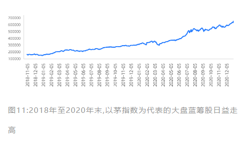

**正所谓国家往往在行情的极致点出台政策，从货币与财政政策角度该如何看当下**?

宽货币成为万众期待且可行性高，一方面美联储货币转向，人民币压力缓解，外部掣肘减弱，国内降准降息更加顺畅;国内经济行至当下，杠杆率持续拾升，债务问题逐步凸显，而历史上大规模坏账处理和债务化解过程中，均需要宽松的货币环境，包括总量和结构工具。

与此同时，2023年底的中央经济工作会议将2024年财政总基调由过去一年的“加力提效“调整为“适度加力，提质增效”。所谓适度，就是不追求总量刺激，而是保持适当的支出强度，财政政策基本上还是围绕着高质量发展。

除了高质量发展，这些领域同样值得关注，2023年的新增专项债限额3.8万亿元，2024年在这一基础上或增加至4万亿元左右，使用范围上新增支持城中村改造、保障房、旅游、充换电等。

### 这样把脉货币政策与财政政策

回顾了历史上不同政策周期下A股对应表现，我们不难发现这样几个现象:

货币政策总是循环往复，有降息周期就会有加息周期，在降息周期时的资产狂欢，往往都要在加息周期中还债。随着长期利率中枢的不断下移降息等放水政策对A股影响的边际效用逐步降低。

财政政策总是在市场需要他时应运而生，每当经济陷入水深火热，抑或是A股需要无形的手时，财政政策总会出现，而且不同时期总会有新的玩法。

货币政策与财政政策的本质区别是什么?前者是雨露均沾的，当央行降息，所有资产同步受益，往往引发全面上涨的行情;而后者是定向导向的，我国财政赤字给了谁，谁就腾飞，并且由于企业之间的竞争本质，有人吃的多，有人就吃的少，在A股中更多以某些行业在某些时期表现更好，也被称之为市场主线。

#### 怎样把脉货币政策，理清现在处于加息还是降息周期?

要理清货币周期，你需要关注央行的公开市场操作、存款准备金率调整等措施，以及央行对市场利率的引导。

如果央行提高政策利率，通常意味着加息周期；反之，降低政策利率则可能意味着降息周期。

要观察通货膨胀率和经济增长数据。在通胀压力较大或经济增长过快的情况下，央行可能会采取紧缩货币政策，即加息;而在通胀较低或经济增长放缓的情况下，央行可能会采取宽松货币政策，即降息。

还要去关注市场对未来利率走势的预期，市场预期往往会影响实际利率水平。如果市场预期未来利率上升，那么投资者可能会提前购买债券，推高债券价格，从而降低实际利率;反之，如果市场预期未来利率下降，那么投资者可能会提前卖出债券，导致债券价格下跌，从而提高实际利率。

国际经济环境同样重要，如果全球主要经济体普遍进入加息周期，那么本国央行也可能跟随加息;反之，如果全球主要经济体普遍进入降息周期，那么本国央行也可能跟随降息。

#### 如何解读财政政策，清晰找到未来主线?

1998年至今，我国共经历了三轮积极的财政政策周期，包括1998年-2004年、2008年底-2012年、2013年-至今，分别对应的是经济高速增长、应对金融危机和三期叠加新常态的三大经济发展阶段。

当前中国经济面临三重压力，积极的财政政策要提升效能，更加注重精准、可持续，是我国自国际金融危机后连续13年实施积极的财政政策。

解读财政政策前，先要了解这些会议对于股市格外重要：

**政府工作报告**每年都会出炉，通常这份报告会对过去一年的经济社会发展情况、未来一年的工作重点和目标以及政策措施等内容进行详细的述。

**两会**也是重要的政策窗口期，期间全国人民代表大会和中国人民政治协商会议召开，会对国家的重大政策和法律进行讨论和审议。

此外，中央经济工作会议、金融工作会议等专题会议也会对相关领域的发展产生深远影响。

政府工作报告以及各种工作会议中的这些方面与投资息息相关：

宏观经济政策相关的要密切跟踪，包括财政政策、货币政策、产业政策等。我们可以关注报告中关于经济增长目标、通货膨胀控制、财政政策等方面的表述，以便了解政府对经济的总体调控思路。

政府工作报告通常会提出未来一年的重点发展领域和产业要认真思考，无论是政府工作报告还是工作会议中提到的新兴产业、基础设施建设、科技创新等方面的内容，有时间的话要详读，很多机构研报也会对相关产业进行深度解读，密切跟踪以便把握投资机会。

A股过去20年，政策面对股市的影响不可低估，尤其相比成熟市场，我国股市还在发展期，各项法律、法规都有待于进一步完善，而每个与证券市场有关的政策、法规都会对市场产生很大影响。

与其说A股是经济晴雨表，还不如说是政策晴雨表，要想在A股做好投资，拎得清政策似乎也是投资中很重要的事。
