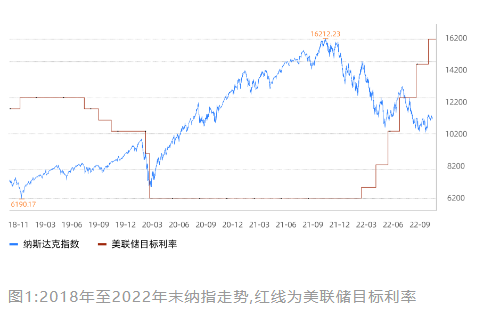
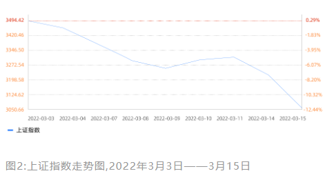
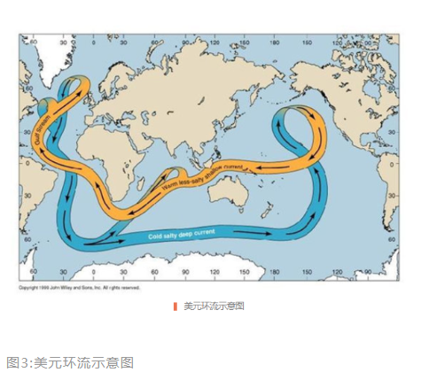
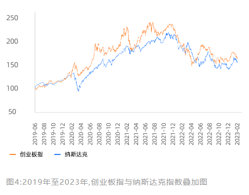
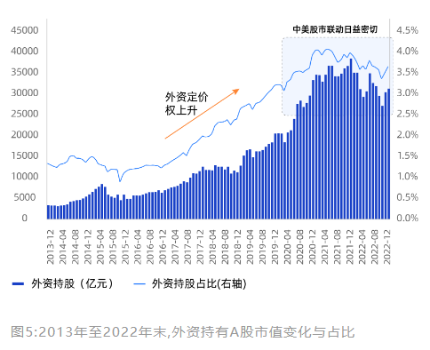
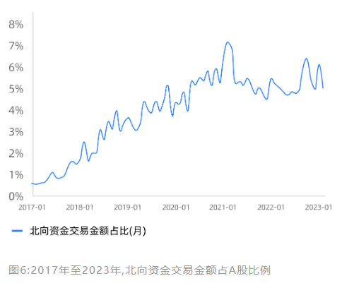
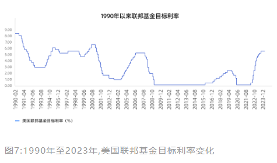
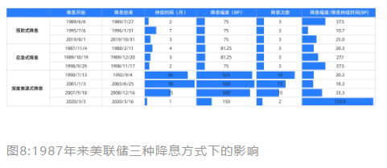

---  
title: 06|炒股，为什么要盯着美联储的一举一动?  
index: true  
icon: file  
order: 7  
category:  
  - 短线  
  - 大A  
tag:  
  - 雪球  
---  
  
## 06|炒股，为什么要盯着美联储的一举一动?  
  
有些投资经验，喜欢看新闻的投资者们应该都清楚，影响股市走势的因素很多，而除了国内的各种政策外，美联储货币政策同样需要密切关注。  
  
我们常看到的机构研报投资策略中，经常会分析美联储货币政策的变化。很多时候甚至将其看作决定市场牛熊的关键指标，美联储的一举一动到底对市场有着什么影响?  
  
美联储的货币政策制定对于股市的长期影响，在美股演绎的淋漓尽致。  
  
2018年末，美联储联邦目标利率2.5%时，纳指还在6000点附近徘徊。  
  
在随后一年多的时间里，美联储通过一系列的放水政策将目标利率降为0.25%，接近0利率的背景下，纳指一直冲到了16000点。  
  
随后2022年美联储为应对通胀再次重启加息，纳斯达克应声而落，一路跌到10000点附近。  
  
  
美联储不止影响美股，对别国股市也有着深远影响。  
  
2022年3月2日，美联储主席鲍威尔表示，在通胀高企、经济需求强劲和劳动力市场紧张的情况下，他将在两周后的美联储会议上提议加息25个基点，于是全球股市应声下跌，A股也没能幸免于难。  
  
沪指从3月3日那天开始一路走低，在随后的9个交易日里，3500点一路砸到3000点，累计跌幅超12%。  
  
  
为什么美联储货币政策的威力这么大，不仅能影响全球资本市场，还能漂洋过海影响到A股的走势?具体的影响机制又是怎么样的呢?我们又该如何跟踪判断?  
  
这节课，我们就来详细做个梳理。  
  
### 美联储为何能影响全球市场?  
  
我们先来揭开美联储神秘的面纱，美联储全称美国联邦储备系统，1913年被创建出来，负责履行美国中央银行的职责，一百多年来美联储也从最初的懵懂少年，变成了如今的老奸巨猾。  
  
1913年美联储最初成立的目的是通过执行货币政策维护金融稳定，但在而后遭遇的大萧条考验中，美联储并没有很好地履行维护金融稳定的职能，1951年美联储正式脱离财政部，进入货币政第独立时代，确立了物价、就业双目标。  
  
等到了80年代，美联储经过几十年的历练，变得老练了很多，为了应对经济停滞、通货膨胀，沃克尔宣布将抑制通胀作为货币政策的首要目标，货币供应量的收紧较快抑制了通胀，CPI同比在1983年7月降至2.5%。  
  
90年代开启中性货而政策，也就是维持低通胀下的适度经济增长。  
  
等到了2008年金融危机后，美联储变得愈发狡猾，为了应对次贷危机，美联储实际启动了零利率政策，并先后开展了三轮大规模QE和一轮扭转操作，向市场注入大量流动性。  
  
相比大萧条时期，次贷危机后美联储反应更主动和及时，有效遏制了经济的衰退趋势。  
  
简单回顾美联储历史，可以将美联储的职能归类如下:实施货币政策、促进金融体系稳定、监督和管理金融机构活动、提高支付和结算系统的安全性和效率、促进消费者保护和社会发展。  
  
**看起来维护的都是自己国内的事，为什么美联储的动向会影响全球市场?这还要归功于美元的国际地位**。  
  
自二战以来，美元就成为了世界货币，有人说美元的地位靠着美国的航母捍卫，也有人说跟地下的黄金储备有关，无论是什么原因，从上世纪布雷顿森林体系建立开始，美元先后和黄金、石油绑定确立了霸权地位，从那以后世界贸易结算和外汇储备均采用美元。  
  
全世界都使用美元进行交易就会有汇率的波动，而当美联储通过宽松政策释放出流动性后，就会有很大一部分资金去参与国际套息交易，利用国与国之间的利息差和汇率差赚取利润，也就是从低息的美国本土，流向经济潜力大且高息的新兴市场国家，待到美元收缩的时候再回流美国，这样美元的国际化环流体系就逐渐形成。  
  
  
当美国为了提振本国经济，比较常规的会选我们都理解的降息，但也会特殊时期选择量化宽松，也就是我们常见的QE。  
  
QE的具体操作呢，就是美联储凭空定量的生成一笔钱，去从各大银行购买国债以及住房抵押贷款支持证券。就像是你拿着印钞机去逛超市一样，目的不是买什么，是为了支援超市。  
  
当美国开启降息周期，并启动量化宽松以后，大量美元流入美国金融体系和实体经济，出现了资金供大于求的局面。  
  
过量的资金为了获取更高收益，率先涌入了本士的股市、债市和楼市，造成美股和房价齐刷刷的往上窜。同时，市场资金成本低，机构手里还有大笔钱，该怎么办?很多美国的金融机构就把目光移向了海外市场。  
  
一方面，这些资本通过套息交易，把钱存入利差较大的新兴市场国家赚取超额收益。  
  
另一方面，它们通过直接投资海外市场的股票、债券、地产，或是通过成立合资公司、商业收并购、受让股权或增资的方式，投资海外建设项目。  
  
这个过程由于过量资本的流入，凡是有增值空间的地方，就有资本来低买高卖赚差价，随后拉高海外资产的价格，**这个过程就是美元热环流，让美元流动起来的始作俑者，便是美联储**。  
  
有热环流，就会有冷环流。当美联储由降息周期转向加息周期时，便不再有新增美元涌入国际市场，同时海外资本回流美国避险或寻求更高的利息收益，导致美元越发稀缺，出现美元荒，进而推升美元走强。  
  
同时由于美元变得稀缺，全球背负美元债的机构需要抛售资产，去挤兑央行的美元储备来偿还美元负债，造成急剧的本币紧缩，本而紧缩再叠加资本外流，新兴国家的股市或楼市往往会因失去流动性支撑而出现恐慌性抛售。  
  
以阿根廷为例，在2023年美元加息的影响下，阿根廷再次陷入了债务危机，整个2023年阿根廷比索对美元已经贬值了近50%，创下了历史新低。比索的暴跌导致了阿根廷通胀率飙升到了40%。  
  
阿根廷央行为了稳定汇率和抑制通胀，不得不跟随美联储加息，将基准利率提高到了60%。  
  
然而，这样高昂的利率却对阿根廷经济造成了沉重的打击，这种最象在当下美联储进入加息周期中同样出现在很多国家。  
  
### 为什么A股受美联储影响越来越大  
  
如果美联储的决策直接影响美股，进而影响全世界资本市场，对A股又有什么影响?一个比较直观的感受是，近年来A股与美股的走势越来越相似。  
  
  
机构的统计结果也侧面印证了大家的感受，2010年创业板开板后到2018年年底，创业板指与纳斯达克、沪深 300与标普500、上证50与道琼斯周涨跌幅可以说基本不相关，而2019年以来，三组指数又变得非常相关。  
  
为什么A股与美联储政策的关系越来越紧密?这主要因为A股变得越来越国际化，2018年来外资持股规模逐步增加，且由于外资持股集中的特点，对部分蓝筹白马公司拥有较高定价权，特别是 MSCI等国际指数对 A股多次扩容之后，外资持股规模逐步增加。  
  
  
不仅外资持股比例高，他们的交易额占比更高，虽然外资持股市值比例最高时也只有4%，但A股中有大量股本不参与流通，因此外资影响力相比起市值占比更高。  
  
如果统计每月北向资金成交金额占全A的比例，可以发现2019年以来占比也有明显攀升，近两年基本处于 5%-6%之间的水平，2021年2月甚至达到了7.2%的高点。  
  
  
A股与美股联动性增强的背后的关键因素就是美联储，美联储影响下的美债收益率作为全球定价之锚，同时作用于中美两国股市，导致两个市场产生联动。  
  
美联储的货币政策会影响美股涨跌，进而直接影响A股估值。  
  
我们都知道美股众多科技龙头眼下已然成为全球成长股估值标杆，纳斯达克或相关科技龙头的股价波动会对创业板或相关科技行业估值产生直接影响。  
  
另一方面，美元环流体系下资金的流动同样有着很强的影响，美联储货币政策调整后，中美经济基本面差异等会引发美元兑人民币的汇率差异，如果美联储持续加息导致无风险利率上行，北上资金就有持续流出的动力，最终通过汇率波动和外资出入影响A股市场。  
  
### 2024，要盯着美联储哪些动作?  
  
2023年我们经历了比较复杂的国际形势，因经济复苏时间不同频，美国那边为了抑制此前大放水所引发的通胀，开启了漫漫加息路。  
  
而我国则是在小幅度的降息，这就导致两国无风险利率差距越来越大，当美国国债收益率高达5%时，A股吸引力开始下降，于是我们看到了北向资金的持续流出。  
  
美联储何时降息成了投资者眼下最关注的焦点!从2023年12月美联储鲍威尔超预期鸽派发言后，市场对2024年美联储提前降息的预期大幅发酵。  
  
毫无疑问，2024年美联储何时开始降息才是最重要的事。  
  
美联储自1990年以来已经历七轮降息过程，其中五轮为完整的加息至降息过程，与当前情形较为相似。  
  
复盘五轮降息开启的节点，美国经济均已处于下行阶段，非农就业、PMI降幅明显，通胀短期或仍在相对高位。  
  
美联储主席鲍威尔在2023年12月FOMC会议上的表态:联储会考虑到降息过晚带来的风险，这被解读为非常鸽派的言论，言外之意经济不好随时降息。  
  
  
通过历史经验看，降息对全球股市都有何影响?这还要看美联储要采取什么方式降息，历史上用过这三种降息方式:  
  
  
**预防式降息**。指美联储降息时美国基本面整体下行，但是仍维持韧性，美联储为了经济实现软着陆，采取预防式降息刺激经济，并且可能采取少量降息的方式来观察政策的效果。  
  
**应急式降息**。指当突发性金融性风险导致美股等金融性资产阶段性大幅下跌，美联储为了防止流动性风险扩散而被迫实施快而急的降息措施缓解市场流动性压力。  
  
**深度衰退式降息**。当美国经济快速回落的时候，美联储被迫开始较为连续的降息，这种情况下美国经济一般都将陷入到较为深度衰退，短暂的降息很难稳定经济，因此通常降息连续性较强幅度也比较大。  
  
**三种不同的降息方式，历史上对全球市场的影响各不相同，这一次会采取哪一种?以及会有怎样的影响**？  
  
**概率比较大的是采取预防式降息**，美联储很早开启降息，上半年即启动首次降息，同时美联储不锁定明确的降息路线，而是秉持边走边看原则更多的玩擅长的预期管理，根据后续数据和风险的演变来推进货币政策。  
  
如果是这样的降息方式，历史上往往会刺激全球股市整体大幅上行，对于A股而言，持续流出的外资也许会停下脚步，国内货币政策空间则越来越大。  
  
**有可能会衰退式降息**，观察美联储的讲话不难发现，他们更多警惕的是提前降息带来的二次通胀等风险。  
  
此情形下，美联储降息时点很可能晚于市场预期，降息节奏更多为持续性降息，如出现经济陷入衰退，10年期美债震荡中枢或下行至3.0%以下，与此同时美股可能会面临杀盈利的压力出现定幅度回调。  
  
相比于预防式降息，衰退式降息的速度与幅度可能更快，更能解决A股这边流动性的燃眉之急。  
  
**小概率事件，应急式降息**。2008年金融危机爆发、2020年新冠疫情等突发事件下，为了缓解流动性冲击和隔离金融风险，美联储都会快速甚至非常规降息以防范风险进一步蔓延。  
  
此情形下，美联储通常快速且可能大幅降低利率，甚至不排除重启 QE。历史上看如果真的遭遇应急式降息，美股则可能经历一轮深度调整在调整完成后会迎来强势反弹。  
  
那么A股呢?A股已经经历了好多轮深度调整，目前A股此前的核心资产已经不再对标美股估值，美股那边的大跌对A股的影响理应越来越小，如果美债利率能够大幅降低，也许独立日的号角就在此时打响。  
  
综上，美国进入降息周期对A股而言是利大于弊的，作为我们投资者而言，更多的是去观察各种潜在的信号，看不同经济数据下，鲍威尔老爷子每一次都说了怎样的话，来判断最终的降息方式与时间点。  
  
一个有前瞻性的可参照数据就是美联储点阵图这代表了美联储官员对于未来联邦基金利率的预测，这些预测通常基于当前的经济状况和未来的经济展望，历史上点阵图的公布对于市场未来的利率走势影响是不容忽视的，很大程度上和后期公布的利率政策是相吻合的。  
  
通过分析点阵图，可以了解美联储可能的政策倾向，比如是否会加息或降息，以及幅度可能有多大。  
  
当然，点阵图最重要的意义并不在于精准预测降息点位，而是用来判断长周期的利率拐点，加息和降息周期持续时间都是挺长的，实际交易中把握好重大的拐点才是重要的事。  
  
点阵图每年发布的次数不多，每年公布4次点阵图数据，时间分别在各季度末，也就是每年的3月、6月、9月和12月。  
  
大部分公布的时间可能是深夜，如果想拿到一手的原图的话，需要在美联储的官网上查看，不过国内大部分投资者看起来很困难，可以参考雪球APP中的7*24快讯。  
  
  
与此同时，还要盯着是否有重大的突发事件发生，虽然概率小，不过目前的地缘政治背景下黑天鹅并不罕见。  
  
跟踪美联储那边的一举一动，虽然不会直接帮助我们选股、交易，但却能让我们更清楚的看到世界上发生了什么，外资为何突然改变方向，进而辅助我们做出自己的交易计划。  
