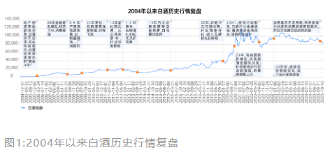
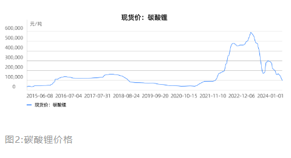
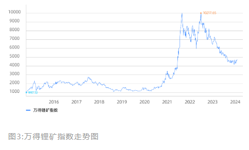
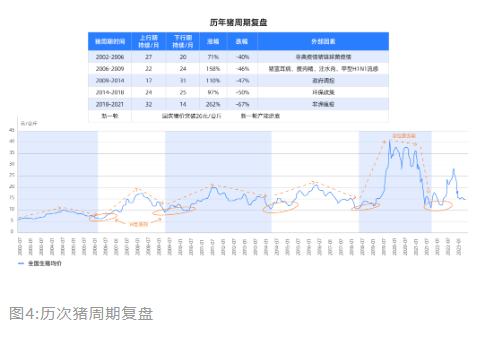
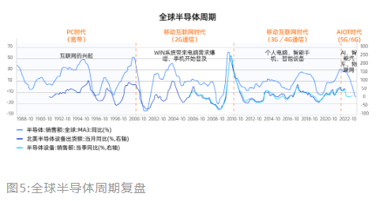
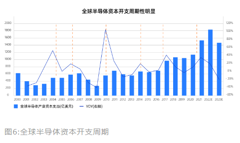

---  
title: 07|没有永远风光的行业，只有躲不过的周期  
index: true  
icon: file  
order: 8  
category:  
  - 短线  
  - 大A  
tag:  
  - 雪球  
---  
  
## 07|没有永远风光的行业，只有躲不过的周期  
  
2005年至今，A股经历了大大小小共5轮牛市，复盘历史可以发现，每轮牛市中的领涨行业都不尽相同，隔几年就换一批新面孔。  
  
无论是07年的五朵金花、15年的互联网，还是20年的消费、21年的新能源....上一段行情中的王者，在下个阶段里往往黯然失色，似乎没有哪个行业能够长盛不衰。  
  
周期股的大起大落，投资者尚有预期。但像消费医药这样拥趸众多的“长牛行业”，当它们的股价也在牛市退潮后重回原点，对那些坚信永恒赛道的投资者造成了不小打击，甚至是信仰的崩塌。  
  
**为什么长牛行业也像周期股一样重回原点**?其实万物皆周期，长牛行业自然也不例外，区别只在于周期长短和强弱的不同。  
  
大家都希望找到某个值得信仰的稳定成长行业，践行巴菲特的投资理念，长期持有，享受复利增长。但最终会发现，很多原本以为的成长行业，最后发现也是周期。  
  
当景气上行周期结束的时候，之前深入人心的宏大叙事和信仰，事后看来都是那么地经不起推敲和考验。  
  
人们最容易犯的一个错误，把周期中的局部现象当成永恒的真理，产生了真挚的信仰。但当周期结束的时候，才幡然醒悟:那看似真理的信仰，不过是又一个周期波动。  
  
**如果说投资一定要找个信仰的话，那么只有一个信仰永远正确，就是相信周期**。  
  
### 再长坡厚雪的行业也逃不过周期定律  
  
任何行业都会受到宏观经济周期的影响，只不过有些行业受影响的程度大，而有些行业则受影响的程度较小。  
  
股市中常说的周期行业，就是指受宏观经济周期影响大的行业，行业利润、产品价格会随着经济周期的波动，呈现出大起大落的特征。例如钢铁煤炭、石油化工、有色金属、船舶航运等等，都是大家印象中典型的周期股。  
  
而另外一些行业，因为在宏观经济的波动中表现相对平滑，也被认为是“非周期"行业。消费医药正是个中代表，按照拥护者的说法:不管经济好坏，人总是饿了要吃东西、冷了要穿衣服、生病了需要看病吃药。  
  
这种说法当然没有问题，但需要注意的是，这仅仅论证了该行业具备永恒的需求属性。**但永恒的需求并不代表着，行业就可以永远地稳定增长，而不出现周期性的反复，再长坡厚雪的行业也躲不过周期**。  
  
以消费行业的明珠--白酒为例。白酒一直被认为是“非周期"行业，但实际上并非如此。复盘21世纪以来的自酒行情，自酒也经历了4轮完整的周期。  
  
**第一轮**:2005-2007年，宽松的货币政策推动基建建设，催生政商务白酒消费需求，上行周期开启。  
  
08年金融危机爆发经济下行，消费活动受到冲击，自酒企业业绩断崖式暴跌，自酒板块迎来至暗时刻，申万白酒指数最大跌幅67%。  
  
**第二轮**:2009-2012年，"四万亿“财政刺激计划推出，中国经济触底反弹，自酒需求场景恢复迎来长达3年的上行周期。  
  
2012年底中央出台八项规定、限制三公消费，看加塑化剂事件，自酒行业再现至暗时刻，中万酒指数最大跌幅59%。  
  
**第三轮**:2014-2018年，白酒需求由政务消费转为商务消费、大众消费，行业上行周期再度开启。  
  
2018年国内经济放缓，中美贸易摩擦加剧，申万白酒指数在半年之内跌幅40%。  
  
**第四轮**:2019-2021年，消费升级趋势下，白酒消费习惯由“喝好酒"向“喝名酒"转变，高端白酒需求增长，白酒步入新一轮上行周期。  
  
  
没有永远风光的行业，只有躲不过的周期。即使是具有顶级商业模式的白酒，也会碰到逆境。  
  
虽然跟白酒最近20年六十几倍的收益比起来，k线图中的下行周期，仿佛只是一个微不足道的小波动，似乎显得不值一提。但倘若真的置身其中，就会发现面临的是惊涛骇浪，能扛住这种程度回撤的投资者风毛麟角。  
  
**再长坡厚雪的赛道，处在下行周期中，跌幅依然不容小觑**。  
  
虽然我们也都听过不少靠长期持有、践行价值投资理念，最终获得不菲收益的案例和事迹，但却未必具有普适性。  
  
由于A股参与者以散户为主，以及短线资金占据了主导地位，导致市场情绪常常被推向极端。  
  
因此，行业景气上行阶段，戴维斯双击总会演绎到极致，让人情不自禁为流行的“伟大故事“欢呼。到了景气下行阶段，戴维斯双杀也同样凶猛，让投资者认为当下面临的是“无解的困局”。  
  
在这样波动剧烈的市场中投资，机械的长期持有是一种奢侈。  
  
既然行业周期无法回避，那么顺应周期规律，来调整我们的投资站位，就显得尤为重要。  
  
要做到这一点，需要先理解周期的基本特点:到底是什么主导了行业的周期波动?  
  
### 什么主导了行业的周期波动?  
  
不同行业之间的商业模式，存在很大区别，因而各个行业周期背后的驱动因素，也各不相同。但万变不离其宗，细细拆下去，都会落到供需关系上来。  
  
**周期产生的本质，在于供需错配**。  
  
周期通常开始于某种因素带来的供需缺口。这种因素可能是技术革命，比如3G/4G通信技术和半导体制程技术的进步，带来智能手机需求爆发；  
  
亦或是黑天鹅事件，比如俄乌战争导致航运供应链受阻运价飙升，非洲猪瘟影响下猪肉的供给收缩;  
  
也可能是产业政策刺激，比如供给侧改革下煤炭钢铁水泥厂的去产能，双碳目标下新能源车购置补贴政策带来的需求上升。  
  
当面对一个个具体的行业时，会发现影响供需关系的因素，繁多且复杂。  
  
譬如说宏观经济、消费者收入水平、政策、行业技术创新、产品的生命周期、突发事件等等。。。。。。  
  
如果从行业的波动特征来做一下分类，大致可以分为由于需求端快速爆发，引起供需错配，从而引起周期波动的情况；  
  
另外一类则是需求端相对平稳，周期主要是受供给端变化驱动的情况。下面就对这两类进行详细介绍。  
  
#### 需求端引起的周期波动  
  
一般当需求爆发时，供给往往是跟不上的。其中的原因是，产能建设和释放并非一蹴而就、需要时间。  
  
循环轨迹是这样的:产品供不应求导致价格上涨，生产商看到有利可图，会开始扩张产能、加大生产;  
  
接下来，部分产能开始投入市场，需求继续释放，此时供给有所增加，但仍赶不上需求增加的速度，迎来量价齐升；  
  
再之后，需求见顶回落，而前期扩张的大量产能集中释放，产品价格下跌，周期开始下行;等到产品价格跌至无利可图后，生产商开始停工限产，产能出清开始，行业迎来新一轮洗牌。这就形成了一个完整的行业波动周期，如此周而复始。  
  
**供给端的变化总是滞后于需求端的变化，而需求变化和产能释放两者的时间差，引起了行业的周期波动**。听起来或许有些抽象，让我们通过例子来理解一下。  
  
以近两年轰轰烈烈的超级锂周期为例。  
  
2015年之前，碳酸锂主要应用在陶瓷、玻璃等传统产业，这些产业已经进入成熟阶段，需求较为稳定，因此全球锂价格也长期稳定在3、4万每吨。  
  
2015年之后，碳酸锂需求结构发生转变，电池替代传统需求成为锂的主要应用。在补贴政策的利好下，国内新能源汽车兴起，碳酸锂需求大增。而锂盐的生产周期平均在1-2年左右，这就导致了供需缺口。供不应求推动锂价大幅走高，进而带动全球主要锂矿扩产，这也为未来的供给集中释放埋下伏笔。  
  
2018年，前两年投放的产能超预期释放，碳酸锂供给大幅增加，叠加新能源汽车补贴退坡需求降温，锂价开始了长达2年的持续回落。部分澳洲锂矿企业破产，被迫退出牌桌，供给端持续缩减。  
  
就在供给端不断收缩的时候，全球新能源汽车却在2021年迎来了大爆发。欧美各国加大对新能源汽车的扶持力度，全球新能源汽车销量快速增加，渗透率大幅上升。为抢占市场份额，电池企业开始扩产，用锂需求快速上升，锂价也迎来了一轮超级周期。  
  
2021年碳酸锂涨价幅度高达430%，2022年碳酸锂价格又从年初的28万/吨最高涨至近60万/吨。涨疯了的锂价让上游扩张欲望爆棚，各大锂矿企业又开始积极扩产。  
  
23年开始，此前扩张的锂产能开始大规模投产，而新能源汽车行业增速也开始放缓，供求关系再次逆转。碳酸锂价格从近60万元/吨的高位，开始了凶猛的下跌，跌至如今不到10万元/吨，至今下行周期也难言结束。  
  
锂价暴跌的过程中，不少成本较高的企业陆续减产停产，产能新一轮出清开始，行业再次洗牌。  
  
  
  
随着供需的变化，锂价起起落落，A股的锂矿企业也经历了一轮极致的周期波动。  
  
如图所示，2021.01-2022.07，万得锂矿指数走出摧枯拉朽般的涨势，区间涨幅超过310%;而2022.07-至今，万得锂矿指数又跌得溃不成军，较高点腰斩，区间跌幅超过53%。  
  
需求端变化较快的行业，常在新兴成长性产业中出现，亦或是像锂矿这样的传统行业，但其产品在新兴行业中找到了应用方向。  
  
对于这种类型的行业，记住这个原则，即:需求是增长的第一动力，而供给的释放速度决定了行情的持续性。  
  
新兴产业受各种因素驱动，需求端超预期快速增长，因此对于需求的研究是重中之重。需要从政笛环境，行业市场规模、渗透恋、产销量增速、技术创新、竞争格局等等方面进行详细分析。  
  
以下这些问题也是我们需要想明白的。  
  
什么导致了需求的增长?是消费习惯的改变、还是政策催化、下游产品渗透率进入拐点、亦或是  
产业趋势?  
是增量需求还是存量替换需求?需求的量有多大，是否是结构性的?持续性如何?  
什么会导致需求的下降?当需求出现下降时，是消失了还是延后了?  
......  
  
虽然需求分析是这类行业的重点，但如果忽略对供给端的研究，在行业拐点到来之时，也非常容易陷入，即使赚了业绩，仍然大幅杀估值的境地。  
  
关注供给端变化，可从行业新增产能规模、产能建设周期、产能爬坡时间、产能利用率、库存等等开始入手。  
  
#### 供给端引发的周期波动  
  
投资时，大家往往更关注需求爆发的行业，但其实供给端的变化，也可以带来比较大的投资机会。  
  
典型的例子就是，近几年的煤炭。以往提起煤炭，投资者们都忍不住一脸嫌弃，认为旧能源要被新能源逐步取代。但却忽视了，供给端改革早就改善了行业的竞争格局，供给端持续收缩，供求关系已经发生了史诗级的巨变。  
  
2021年以来市场持续回调，煤炭板块却逆势走高枝独秀，上涨超过10倍的煤炭股不在少数，论涨幅丝毫不逊色于新能源类股票。煤炭亮眼表现的背后，正是由供给端的变化主导的。  
  
当然了，这几年煤炭行业的供给端是单向收缩，因此行业的波动减弱了很多。让我们看一个供给端双向大幅波动的典型例子--猪周期。  
  
需求端看，居民猪肉消费需求会受到居民收入水平、人口增长和消费结构的影响，但长期来看总体稳定，年均消费量大概在5000万吨左右。因此研究猪周期，关键还是看供给端的变化。  
  
由于养猪这件事的门槛不高，在农村搭个猪圈就能养，养猪行业可以说是一个完全竞争市场。一般认为，猪周期的形成，是供给端养殖户互相博弈的结果。而我国生猪养殖行业长期以散户养殖为主，散养户只能根据当前的市场行情进行决策，就导致了猪价的周期性波动。  
  
当猪价上涨到高位的时候，养殖户会纷纷加大生猪的养殖量。但生育育肥都需要时间，并不能马上出栏，供应量加大需要等一段时间才能体现出来。  
  
等到市场上新养的猪陆续出栏了，供应又开始大于市场需求，猪价开始下跌。为了尽快把猪卖出去，养殖户开始纷纷降价销售，于是猪价加速下行。  
  
猪价跌到一定程度以后，养殖户出现亏损，开始退出生猪养殖，产能开始出清。直到市场上生猪的供应出现短缺，猪价又开始上涨，养殖户们就又开始蜂拥而入。  
  
周而复始，这就形成了所谓的“猪周期”。  
  
  
一轮完整的猪周期约3-4年时间，与母猪产能从补充到淘汰的产能周期，基本保持一致。自2006年以来，总共经历了4轮猪周期。从2018年中至今的这轮堪称“超级猪周期”，不仅猪价突破历年最高点，涨幅远远超过以往周期，且上行时间长，出现持续32个月的上行期。  
  
这轮周期是在上轮周期底部产能大幅去化的基础上，叠加非洲猪瘟疫情影响，养殖户扩产难以开展，使原来失衡的供需缺口进一步加剧。  
  
2018年中，生猪价格从上轮周期底部开始回升。一般在常规周期中，养殖户应该逐步开始扩产了。但当年8月初，中国首例非洲猪瘟被确诊。疫情快速从北到南影响全国，19年6月感染区域扩大到全国32个省市。  
  
非洲猪瘟不仅具有高传染性、高致死率，且没有有效的疫苗可进行防控。为了防止猪瘟进一步扩散，只能对疫区生猪进行扑杀隔离，导致生猪产能直线下滑，养殖户损失惨重、补栏信心缺失。2019年繁殖母猪存栏量仅2045万头，相比于2018年下滑超过30%。  
  
供给端的急剧紧缩，使得猪价开始了爆发式的上涨，创下40元/公斤的历史新高，2020年全年猪价也几乎都在30元/公斤以上运行。行业在产能严重不足的背景下，进入暴利状态并持续一年之久。  
  
在高额利润的吸引下，企业纷纷扩大生猪生产养殖户补栏心态加强。  
  
2021年生猪产能全面恢复，12月底存栏数量增长至4329万头，已经大幅高于非瘟前水平。前两年积累的产能持续释放，生猪供应压力大幅增加，自此行业又开始面临供给过剩，猪价快速回落，正式进入下行周期。  
  
超级猪周期带动下，猪产业指数从低点到高点涨幅高达136%，而下行周期跌幅最大超过44%接近腰斩。  
  
像这样需求端相对稳定的行业，而供给端波动的行业，经常出现在传统行业里。  
  
而传统行业过去十几年需求增速稳步下降，投资对需求不需要有太强假设，供给端的研究更加重要。例如猪肉消费量在人口、健康饮食习惯的影响下，消费量小幅萎缩，但几乎不影响本轮猪期的振幅。所以对于这类周期的幅度，主要由供给的弹性决定。  
  
当出现供需关系变化时，以下这些问题，就是我们首先需要想明白的。  
  
供需缺口有多大，持续性如何?需不需要重新建设产能?新建产能的门槛、成本高不高?新增产能要多久可以释放?哪些产能可以跟上，哪些产能跟不上?  
现有产能的利用率提升和库存可以满足需求吗?  
其他产品的产线可以填补供需缺口吗?  
行业新增产能规模有多少?什么时间会集中释放?  
......  
  
探究所有行业的周期规律，最终都要落在对供需关系的研究上。  
  
当供需关系发生变化时，大部分投资者可能无法确定这个变化，是供需天平反转还是小的阶段性波动，很多变化往往是发生时不以为意、事后看一目了然。因此研究时只能大胆假设、小心求证、紧密跟踪、反复验证。  
  
并且，由于影响供需变化的因素很多。供需的变化也会在这些因素的作用下，呈现不同维度的周期波动，这些周期并非独立存在而是层层嵌套、相互影响的，周期也因此复杂多变。  
  
### 行业多周期的嵌套和共振  
  
经典的宏观经济周期，按照时间跨度的长短和内在的驱动因素，可以分为四种:  
  
由库存驱动的基钦周期(3-4年)、由固定资产投资驱动的朱格拉周期(10年)、由房地产建筑驱动的库兹涅茨周期(20年)和由创新技术变革驱动的康波周期(60年)。  
  
而经济学家约瑟夫·熊彼特在这基础上，提出了三周期嵌套理论，认为上述周期都存在，中长短三个周期存在嵌套关系，共同发挥作用。  
  
虽然“三周期嵌套”是用来解释宏观经济周期的，但如果用类似的视角来看行业周期，也有异曲同工之妙。很多行业也存在，多种时间维度的周期相互交织、共同作用的现象。例如白酒的大周期中，实际上就包含了人口周期、经济周期及白酒自身库存周期的多周期嵌套。  
  
为方便理解，接下来让我们以半导体为例，进行分析。  
  
半导体是典型的周期成长行业，周期的波动来自于创新周期(长)、产能周期(中)、库存周期(短)的叠加影响。  
  
创新周期是通常持续10年左右的长周期，主要受到行业自身以及下游应用的创新驱动。  
  
半导体前几轮长周期的发展，分别由PC&服务器和智能手机&移动互联网所驱动。2001-2010年，全球半导体的增长动力主要来自于互联网与笔记本电脑的普及:2010-2020年，行业增长动力主要来自于通信技术和智能手机的迭代升  
级。  
  
在经历了先后两个10年维度的技术创新周期，现在笔记本电脑和智能手机市场基本已经饱和。对于行业下一轮的增长驱动力会来源于哪，大家翘首以盼。当可能的方向出现的时候，相关概念估值会迅速拔升，这一点在2023上半年的AI行情中，就有非常明显的体现。  
  
  
半导体行业的产能周期，一般为4年左右，由供给端主导，表现为由资本开支驱动的产能周期。半导体产线从建设到量产通常需要2年左右的时间，晶圆制造产能从规划到落地通常需要2-4年。由于产能释放具有滞后性，无法紧跟下游需求的变化而变化，导致供需错配。  
  
例如2020年受疫情影响，半导体晶圆厂停工，与此同时宅经济及新能源汽车等持续爆发，供需缺口加剧，出现“缺芯潮”。行业周期上行，晶圆厂开始加大资本开支，采购半导体设备进行扩产。而2021年下半年需求回落，2022年四季度供需天平反转，供大于求。晶圆厂开始削减资本开支，减少半导体设备采购，产能开始出清。  
  
如同扩产阶段产能释放需要2年左右，资本开支缩减的效果也并不能立马体现，而会显现在下一轮周期的上升阶段。周而复始，这就是半导体的产能周期。  
  
  
半导体的库存周期是需求端主导的，长度大约在2-3年左右，观察行业短期的景气度变化，就主要看需求和库存。这个周期由产业供需关系变化和自主调节决定，包括主动补库存、被动补库存、主动去库存、被动去库存四个阶段。  
  
在半导体上行周期中，下游需求旺盛，实际需求大于产能，行业从主动去库存进入被动去库存阶段，而后公司主动备货，即主动补库存阶段。  
  
直至半导体行业进入下行周期，下游需求不佳，进入被动补库存阶段;随后公司缩减生产，并开始降价清库存，进入主动去库存阶段。库存清完之后，当下游需求再次爆发时，又将开始新一轮的库存周期。  
  
对于半导体行业而言，中、长周期决定波动的大方向，而库存周期则是放大短期波动的推手。当然对于国内的半导体来说，长周期级别的影响因素，还多了一重国产替代。  
  
全球半导体行业周期，整体由长、中、短三个周期嵌套组成，每个周期都有其特定的驱动因素。这些周期的运行节奏并不同步，相互交叉交错，如同地球的公转与自转。而当周期重合并且方向一致时，形成多周期共振，会爆发出二级市场上最强的beta。  
  
不止半导体行业，几乎所有行业的周期，放在不同时间维度看，都会发现存在多重周期的嵌套。  
  
行业周期是由多种因素共同作用的结果，这些因素包括但不限于市场需求、技术创新、产能库存、政策环境、宏观经济形势等。它们各自在不同时间尺度上发挥作用，共同决定了行业的周期波动。  
  
行业周期的多重嵌套现象是客观存在的，它既是行业发展的内在规律，也是进行投资决策时的重要依据。通过对不同时间维度周期的分析，可以辅助我们更准确地定位行业所处的阶段，了解投资时应注意的核心因素。  
  
### 相比于周期本身，投资中的周期思维更加重要  
  
供需关系是站在基本面的角度，来描绘行业的景气度变化。但很多时候我们会发现，基本面变化和二级市场上的股价变化，两者并不完全一致。  
  
以2021年年末的新能源为例，指数正式见顶回落，开始了漫长的调整。但在一路下跌的时间里，行业基本面并不差，渗透率依旧在稳步提升，终端销量增速依然良好，甚至一度推动了新能源的阶段性反弹，但依然未能改变总体下行的走势。  
  
这背后的主要原因就是，股价不仅受基本面影响，还有估值，而估值高本身就是最大的利空其实如果用周期的视角来看，不仅行业基本面有周期，估值和情绪也存在明显的周期。而在A股，估值和情绪的周期，基本与行业的景气度  
有着相同的节奏。  
  
虽然投资常识告诉我们:"最气度高点，估值应该在低位，而景气度低点，估值应该在高位。"  
  
但这是建立在理性人的假设上的，A股中更常见的是，景气度和估值同涨同跌。  
  
在景气度上行的强势行业，估值也随之水涨船高。哪怕行业景气度已经如日中天，也依旧能给出一个较高的估值。  
  
当然不少人认为，高估值可以通过高盈利消化掉。但如果复盘历史会发现，大多数行业都是要通过下跌来完成估值消化的。当估值处于极端高位时，一旦景气度发生边际的细微变化，就会遭遇巨大回撤。  
  
淡化估值、强化景气度的投资方法，在市场中很长一段时间都是主流。所以，A股常有戴维斯双升和双杀。  
  
投资者情绪周期也是如此，基本与股价的涨跌，保持着相同的频率。  
  
景气度周期中的每个波峰波谷，也均是情绪的极点。  
  
当周期运行至波峰处，投资者总会过于乐观，线性地认为高最气还能节节高升，从而导致行业加速赶顶。当周期运行至波谷处，又会将悲观情绪推向极致，认为行业的投资价值已经毁灭，导致行业加速下探。周期的钟摆摆幅越接近最大时，人们越倾向于将之视为永恒状态。  
  
线性思维放大了上行周期中的疯狂，同样也放大了下行周期中的绝望，这也清晰地体现在估值的大幅波动上。相对于下跌看空、上涨看多的线性思维，更应该相信周期思维。对于大多数投资者来说，与其试图精准把握周期，不如用“周期思维”进行投资。  
  
周期难不在规律，而在人性。  
  
谁都知道万物皆周期这句话。但每次行业运行到周期高点，都总有新的“伟大故事”，而每次行业运行到周期低谷，也都有新的“无解困局”，让很多人产生”这次不一样”的错觉。  
  
这次不一样”的念头很贵。很多时候，都是要等周期走出来后才发现，这次没有什么不一样。  
