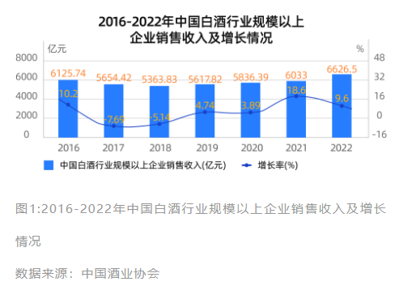
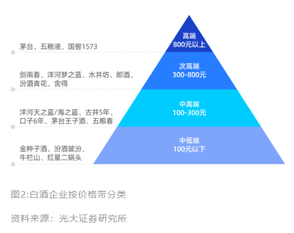
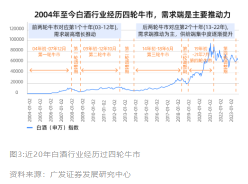

## 08|看懂白酒的投资逻辑，带你开启投资的大门

2019年可以说是白酒板块的高光之年，在这一年，贵州茅台股价突破千元，成为2000年后A股第一只千元股;在这一年，白酒主题基金在基金产品中脱颖而出，其中招商中证白酒上涨86.72%，成为2019年的“指基“状元。

让人没想到的是，2020年的白酒板块继续暴涨酒ETF(512690)在市场中脱颖而出，2020年全年涨幅高达125.32%。在短短的两年时间里山西汾酒、酒鬼酒涨幅分别高达989.51%、889.41%，就连涨幅107.77%的口子窖在白酒板块里都只能是垫底。

连续两年的大涨，让白酒板块成为了A股股民的信仰，“年少不知白酒香，错把科技加满仓;年少不知白酒好,错把医药当成宝..….”这样的段子也在股民群体中广泛流传。

如果拉长周期来看，中证白酒指数自成立以来的1000点上涨到了2023年底的12609.88，十几年里上涨约12倍。在这些年中，不少长期投资白酒板块的投资者赚的盆满钵满。

那么，白酒板块究竟有何魅力，能诞生如此多的牛股?白酒板块为什么是我们投资入门必看的行业?今天让我们一起研究下。

### 投资入门，为什么要先从白酒行业看起?

#### 商业模式简单而又稳定

白酒企业的商业模式简单而又稳定，即使是从未接触过行业分析的投资者也能看懂，因此特别适合初入股市的投资者用来学习和研究。

简单来说，白酒企业的商业模式就是把粮食和水酿成酒，再通过经销商卖给消费者。粮食和水又是最为便宜的原材料，经过酒厂的酿造和包装就可以摇身一变成为几百甚至上千块的白酒。

不仅如此，白酒企业的酿造工艺长期不变，不需要在研发上有太多投入。不像药企还有科技行业，每年都需要在研发上投入大量的资金，能否研发成功还是未知数。白酒企业也不需要太多设备，只要有窑池就够了，而且这些窑池越老越好，根本不需要更新换代。不像制造业，每年都需要更新设备，业务规模扩大后还需要再投入大量资金扩充厂房和设备。

在这样的商业模式下，白酒企业有着很强的盈利能力。2023年披露的中报显示，白酒行业的毛利率、净利率、净资产收益率分别高达80.43%、40.16%、16.56%，这样的财务表现在A股还没有哪个板块能够与之媲美。

#### 市场规模大，孕育牛股的温床

白酒在中国有着悠久的历史，在先秦时期，由于生产力低下，白酒十分珍贵，因而白酒在祭祀这样的重大场合中扮演着重要的角色，这也说明了酒在古人心中的地位。到了汉代，酿酒技术得到了充分的发展，自酒也开始走入寻常百姓家，成为人们交易和生活中常用的饮品。无论是庆祝丰收、亲友团聚、婚嫁丧礼，酒都是古人的必需品。

经过千百年的发展，白酒文化已经深入了每一个中国人的心里，白酒企业无需花太多心思就已经占领了消费者的心智。如今，无论是亲朋聚会还是商务宴请，都能看到白酒的身影。此外，白酒还是中国人送礼的首选之一。送的白酒越高端，越能表达自己的心意。

白酒除了消费属性、社交属性，还有很强的金融属性。像茅台这样的高端酱香型白酒需要在茅台镇才能酿出独特的风味和口感，并且需要存储5年以上才能出厂，因此高端酱香型白酒非常稀缺。同时，高端自酒价格不断攀升，这些都使得高端型白酒具有了金融属性。

在这三种属性的叠加下，自酒行业拥有巨大的市场需求。中国酒业协会数据显示，2022年中国白酒行业规模以上企业累计完成产品销售收入达到6626.5亿元。根据前瞻产业研究院数据，2026年我国白酒市场规模将首次突破万亿大关。

**市场规模决定了企业的发展上限，只有市场足够大，企业才有充分的的发展空间，这个行业才有可能诞生牛股。**正是如此巨大的市场空间，孕育了贵州茅台、五粮液、泸州老窖等众多牛股。

#### 竞争格局基本稳定，头部酒企业绩确定性强

前面我们说过，白酒企业盈利能力很强，再加上行业拥有巨大的发展空间，这些都吸引了无数玩家参与其中。中国酒业协会数据显示，2017年我国规模以上白酒企业数量可是有1593个。

随着近几年消费升级，人们对白酒的品质与品牌有了更多的追求，于是低端的白酒企业被逐渐淘汰。到了2022年，我国规模以上白酒企业数量只剩下了963个。

再看看行业集中度，我国白酒行业CR5(CR5是指业务规模前五名的市场份额)从2018年的32.10%增长到2022年的45.82%，这说明市场份额正在向头部企业集中，而中小企业的生存空间正在被挤压。

不同于其他消费品，白酒由于“面子工程”的存在，因此形成了非常清晰的价格带。按照销售终端价格来分，单瓶价格800元以上为高端，300-800元为次高端，100-300元为中高端，100元以下为中低端。

目前高端白酒中贵州茅台、五粮液、泸州老窖占据了95%的市场份额，这一价格带基本上是寡头垄断，进入壁垒较高，因此这三个头部酒企的业绩确定性更强，更适合初入股市的投资者分析、投资。

次高端白酒由于品牌众多，竞争格局较为分散、目前还没有出现绝对龙头。如果想要投资这一价格带上的白酒企业，需要对行业、个股的情况做长时间的追踪，对个人的能力提出了很高的要求，并不太适合初入股市的投资者练手。在整个白酒行业向头部企业集中的背景下，中高端和中低端这一价格带的酒企就不太建议大家关注了。

### 白酒长牛，可以随时买入吗

过去，白酒板块走出了波澜壮阔的涨幅，于是不少股民都在想，只要买入并长期持有白酒股首定能赚到钱。如果你也这么想，那你离亏钱就不远了。

想要在白酒板块赚钱，除了需要对白酒的行业特性有清晰的了解，还需要了解都是哪些因素影响了白酒板块的涨跌。

现在我们就来复盘下近20年的白酒周期，看看每个周期当中都发生了什么事情，又是如何影响白酒的估值和股价的。

#### 2004-2007年，白酒传奇的开始

2001年贵州茅台在A股上市，上市后股价一直表现平平，更是在A股下行周期时一路跌到了3.3元，这与今日上千元的茅台不可同日耳语。

但是到了2004年，房地产、基建等投资拉动着中国经济快速发展，白酒的政商务消费需求也因此变得旺盛，此时的白酒处于供不应求的状态，自此白酒行业迎来了快速扩张期，也迎来了自己的黄金十年。

政商务消费需求的增多，打开了高端白酒的市场空间，各个酒企也在激烈竞争着。

在此期间，茅台在战略上采用飞天大单品策略，并且积极拓展政企的团购渠道。而五粮液的多品牌战略带来的一系列问题开始在此期间显现，也是在这个时期五粮液被茅台超越，失去了白酒龙头的地位。泸州老窖继续打造“国窖1573”，并且在茅台、五粮液争抢政商团购渠道时，差异化切入了餐饮渠道，取得了不错的成绩。

2004-2007年期间，茅台的营业收入、归母净利润的复合增长率分别为34%、51%。泸州老密的营业收入复合增长率为32%，归母净利润的复合增长率更是高达169%。高端白酒在这一阶段展现出了良好的成长性。

与此同时，由于这一阶段市场流动性较为宽裕，申万白酒指数估值(PE-TTM)从2003年末的24一路上行至2007年底的95，涨幅高达296%。

利润高速增长加上一路走高的估值，白酒板块迎来了“戴维斯双击”。2004-2007年间，中万白酒指数从750点涨到了11103点，涨幅高达1367%。其中茅台、泸州老窖涨幅分别为2841%、1732%，远远超过了其他上市酒企。

直到2008年金融危机爆发，白酒板块才暂时停止了上涨的脚步。

#### 2009-2012年，自酒行业百花产放

金融危机爆发后，为了稳定经济，国家开启了刺激经济的“四万亿”，房地产、基建等投资再次快速增长。由于“四万亿“项目多以政府为主导，因此白酒的政商消费需求也在这个阶段达到了鼎盛时期。

由于政商务消费对价格不敏感，旺盛的需求推动着高端白酒竞相涨价，茅台、五粮液、泸州老窖的出厂价和批价均突破了500元。在此期间，高端白酒量价齐升。

2009年，五粮液营业收入达到111.29亿元，首次突破100亿大关。茅台、泸州老窖的营业收入也分别于2010、2012年突破百亿大关。

除了高端白酒，次高端以及地产酒均在此时期取得了很大成绩。酒鬼酒、古井贡酒、洋河股份在此期间的收入复合增长率分别高达65%、63%、46%。可以说，这-时期的白酒行业百花齐放。

2009-2012年间，为了应对金融危机，央行大幅降准降息释放流动性，白酒行业估值再次迎来了上涨。但是由于金融危机后市场恐慌情绪仍存，中万白酒指数估值(PE-TTM)在2009-2012年间最高点仅有44倍，涨幅为91%。

从整体行情来看，申万白酒指数从4351点涨到了13767点，涨幅高达212%。直到2012年底国家出台了“八项规定”，直接影响了白酒的最大需求端--政商务需求，白酒行业才开始进入调整期。

#### 2014-2018年，从喝好酒到喝名酒

2014年后我们常挂在嘴边的一个词叫"消费升级”，大家手里有钱后，无论是在吃上还是物品上都有了更高的追求，这点在年轻人身上体现的淋漓尽致。当然，在喝酒方面，大家的需求从“喝好酒“变成了“喝名酒”。在此阶段，高端和次高端白酒的需求都得到了提升。

消费升级的风推动着高端白酒价格上涨，2016年下半年茅台飞天的批发价格突破1000元，五粮液、泸州老窖的价格也随之上涨。

量价齐升也使得高端白酒的业绩快速上涨，2016-2018年间，茅台、五粮液、泸州老窖的营业收入复合增长率分别达到了38%、28%、25%，归母净利润的复合增长率达到了23%、23%、30%。

在此轮周期中，中万白酒指数估值(PE-TTM)从7.5涨到最高点38.94，涨幅达到了419%。业绩上涨叠加估值大幅上涨，白酒板块再次迎来了“戴维斯双击”。申万白酒指数从5667点到29000，涨幅高达412%。直到2018年下半年，宏观去杠杆，叠加贸易摩擦，此次白酒牛市得以终结。

#### 2019-2021年，白酒成为股民们的信仰

时间来到了2019年，随着消费升级进一步加速，飞天茅台的批发价格也于2019年下半年突破了2000元，与此同时贵州茅台的股价也突破千元，成为2000年后A股第一只千元股。

到了2020年虽然白酒的消费受到了疫情的影响，但也是在这个时期，大家发现高端白酒的需求并没有因疫情而改变，高端自酒的业绩仍然有很强的确定性。

白酒板块也因此受到了资金的追捧，在此期间，申万白酒指数估值(PE-TTM)最高时达到71倍，涨幅高达294%。申万白酒指数更是从19516点到96157，涨幅高达393%。也正是这个时期，白酒板块成为了股民们的信仰。

直到2021年市场投资风格切换，资金切换到新能源、半导体等高速增长的赛道，白酒板块的估值回落，白酒的牛市才得以终结。

通过回顾近20年的白酒周期，相信你也发现了，**白酒的需求和宏观经济紧密相连。宏观经济景气时，白酒板块的消费需求旺盛带来业绩提升，白酒板块才有可能进入牛市**。

那么当下的宏观经济处于怎样的一个境地呢?如果你已经学完咱们前面的宏观课程了，相信你也能判断出来目前的经济仍然处于复苏阶段，在这样的情况下，白酒很难迎来旺盛的需求。

最后我们再回顾下白酒的供给端，前面我们说过白酒行业正在向头部企业集中，中小酒企的生存空间越来越小。再加上目前整个白酒行业需求疲软，白酒企业的竞争将会越演愈烈。

如果你觉得白酒板块当前的业绩仍然稳健，同时白酒板块20倍的估值并不高，那么不妨对头部酒企做下具体的分析研究，为日后的投资做好准备。

后面的课程中我们也会教会你如何分析公司，同时我们也为你准备了头部酒企---茅台的案例分析，帮助你更好的学习。
