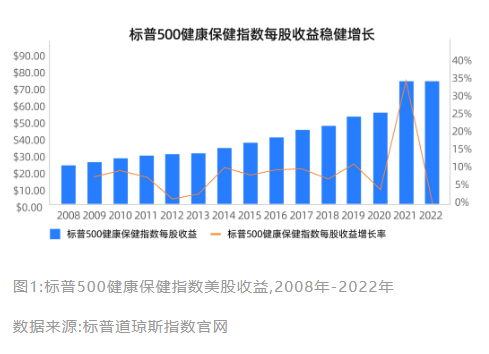
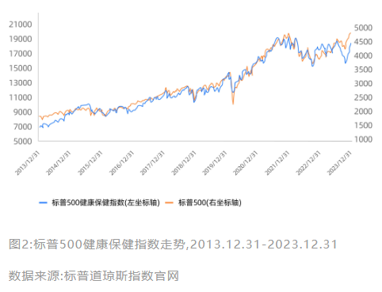
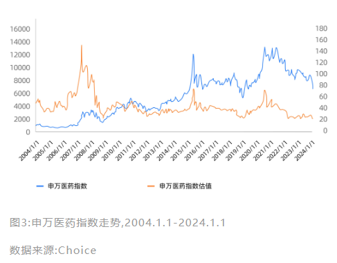
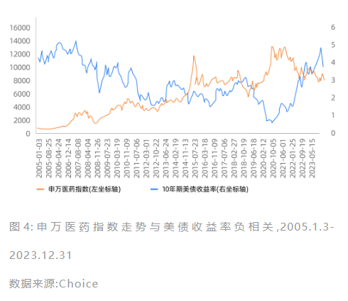
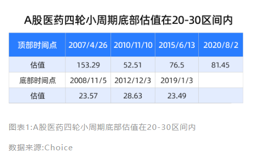
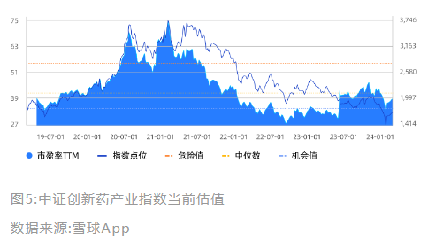
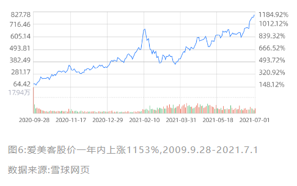
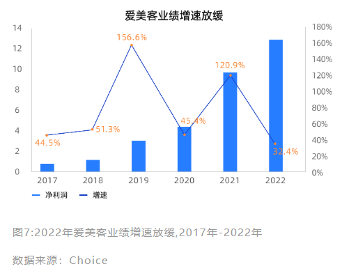
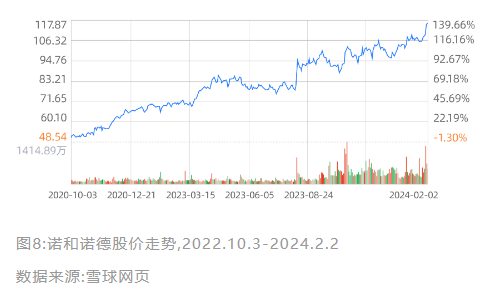

## 09|研究医药行业，寻找长坡厚雪好赛道

每个投资者都渴望挖到一个大牛股，让自己的投资收益最大化。那么大牛股都在哪里产生呢?首先，它得在一个“长坡厚雪“赛道上。

纵观全球，医药行业就是这么一个"长坡厚雪”好赛道。在《投资者的未来》这本书中，作者梳理了美国1957-2003年20个表现最佳的“幸存者"，其中有6家属于医药行业，无论投资哪一家公司都能在几十年中获得年化14%以上的收益率，实现超额回报。截至目前，这6家企业除了一家被收购外，剩余5家公司均是现在的医药巨头，比如我们都知道的辉瑞、默沙东等。

今天我们就通过分析医药行业，带你看看“长坡厚雪"赛道都有哪些特点，从而帮助你在后续的投资路上找准赛道。

### 什么样的赛道称得上“长坡厚雪”?

#### 需求永恒，且行业规模持续增长

需求永恒，是行业稳定存在的基础。以医药行业为例，在这世上，除了吃饭，没有什么比医药更刚需的了。

回想一下新冠疫情期间，我们经历过高烧不断“刀片嗓”、“水泥鼻”，那时躺在床上虚弱无力的你是不是希望有一片灵药让我们立马药到病除。面对几千元一盒的新冠特效药，一想到新冠可能危及到家里老人的生命，是不是觉得再贵也得备上一盒。

当然，行业稳定存在只是基础，行业规模还需要持续扩大，才能为企业的发展提供空间。如果行业的规模在萎缩，即使是优质的龙头企业也很难持续盈利。

我们继续以医药行业为例，现在全球正在加速老龄化，而老年人容易患慢性病，对于医疗保健的需求也会越来越大。

此外，世界上还有很多没有被治愈的疾病，比如我们熟知的阿尔兹海默症等，这些未满足的临床需求也在推动医药行业的规模持续增长。

#### 技术驱动，带来稳健盈利

一个好的行业除了需要有永恒的需求，还需要有稳健的盈利能力，这样才能长期给投资人带来超额回报。

医药行业就是这样一个具有稳健盈利能力的行业，以成熟的美股医药行业为例，无论宏观经济如何，2008年-2022年间标普500健康保健指数的每股收益都保持着正增长。

当然，这主要是因为这个指数以美股的制药巨头为主，而这些巨头拥有世界上最先进的技术。

医药行业的本质是技术驱动，只要研发出一款新药并成功商业化，就可以在20年的专利保护期内获得高额的回报。

因此美股的制药巨头每年在研发上要投入几十甚至上百亿美元，以保证有源源不断的新药能够上市。除了自己研发，这些制药巨头还会并购一些尚未盈利的生物技术公司，以此来扩大自己的产品线，增强自己的竞争实力。

**长期稳健的盈利能力使得美股医疗保健板块呈现出“长期向上、没有明显周期”的特征**，并且从2013年末到2023年末，美股医疗保健板块整体累计收益率170%，相较于标普500的累计收益率实现了超额。

在这样一个”长坡厚雪”的赛道里，美股医药行业诞生了诸如辉瑞、礼来、艾伯维等大牛股。

### 投资A股医药，你不得不知道的周期

A股的医药指数走势同样长期向上，但与美股医疗保健板块不同的是，**A股的医药板块具有明显的周期性**。这主要是由于我国的医药处于快速发展阶段，政策、货币以及技术这三个周期都会影响医药行业的波动。

#### 政策是影响医药行业波动的最大因素

由于医药行业是关系国计民生的重要产业，因此每一个环节都会被政府强监管。再加上医保是我国医药市场最大的支付方，因此政策的调整对于医药行业的发展尤为重要。我们在投资医药行业时要关注政策推动的子行业，避开明显政策向下的子行业。

比如2015年开启的创新药周期就是由政策推动的，2015年，为了解决国产仿制药“疗效差"和低仿”的问题，国家出台了一系列政策，其中最重要的便是《关于改革药品医疗器械审评审批制度的意见》( 简称“44号文”)。

44号文重新定义了新药和仿制药，并且提高了审评的门槛。与此同时，44号文还鼓励了创新药品优先审批，自此创新药IND申报数量开始增加，国产创新药开始进入飞速发展阶段。

还有我们都熟悉的集采，2018年国家医保局成立，并于当年11月启动带量采购试点，政府通过规模谈判，从而争取到更低的药品价格，降低医疗费用。

由于集采降价明显，对仿制药企业的利润产生了很大的影响，因此也影响了医药板块的行情。到2023年11月，医药行业已经经历过九轮带量采购，基本上实现了应采尽采，医药行业投资者才基本对集采政策脱敏。

#### 货币周期影响医药行业的估值和融资

医药行业属于成长型行业，因此货币周期对医药行业的估值影响极大。

从过往数据来看，医药板块的走势与美债收益率呈负相关。这主要是因为市场通常用10年期美债收益率作为无风险收益率，当美元加息时无风险收益率就会上升，从而来带贴现率的提高，由此导致了未来现金流的现值下降，企业的估值也随之下降。

此外，美债收益率的上升也影响了融资环境。医药行业尤其是创新药，研发难度极大，需要不断的融资，有了资金后才能更好地推进研发并且不断开拓新的管线。如果缺乏资金，创新药企业如果再研发失利，就将面临倒闭的风险。因此，我们在投资医药行业时要避开紧货币周期。

#### 技术更迭带来投资新方向

目前欧美国家的医药行业处于领先地位，我国的医药行业处于追赶状态。

从生物医药产业的演变来看，有化学药、生物药、生物治疗这三大阶段。目前化学药已经高度成熟，是全球医药产品的主体，我国的医药构成中化学仿制药也是最主的部分，但在政策的影响下我国化学仿制药正处于衰退阶段。

由于化学药物毒副作用大，容易产生抗药性等问题，生物药已逐步成为全球创新药物的主体。我国的生物药起步晚，但是在政策的支持下也在蓬勃发展。

近年来，细胞与基因治疗逐渐成为医药产业发展的重要方向，其中最为大众所知的就是CAR-T细胞疗法。2021年复星医药旗下复星凯特引进了美国Kite Pharma(吉利德科学旗下公司)CAR-T细胞治疗产品益基利仑赛注射液获批，自此开启了我国细胞和基因治疗的新篇章。

### 如何把握A股医药的投资机遇?

#### 根据指数估值判断周期

A股医药板块存在明显的小周期，好处之一就是你可以在短短一两年内获得美股医药十年的收益率。但也是由于周期的存在，找准好的买点和卖点尤为重要，不然就有可能出现高位站岗的局面。

那么我们如何判断小周期的位置呢?看指数估值就是一个很好的方法。

每一轮医药牛市必然伴随着估值的飙升，但是能飙到多高取决于当时的情绪和资金情况。

在2007年的史诗级大牛市中，中万医药板块估值的最高点达到了150，但是在最近一次的医药牛市中，中万医药板块的估值最高点为80，可以看
到顶部的估值还是有很大差异的。

但是每一轮底部都有一个大致的区间，在最近的四轮小周期中，医药底部的估值基本都在20-30这个区间。可见，在A股医药板块判断底部要比判断顶部容易的多。

如果你觉得从估值的绝对值来判断比较难，还可以结合估值百分位来判断当前估值是高还是低。

如果PE处在30分位值以下，说明估值偏低，此时买入是比较保险的情况。如果PE处在70分位值以上，说明估值偏高，买入是有些危险的。

以创新药ETF(159992)为例，其所跟踪的中证创新药产业指数当前估值为39.71，近五年估值百分位为38.31%，说明当前的估值比过去61.69%的时间都低，作为医药板块中成长性最强的细分赛道之一，可以说此时的创新药板块估值处于历史低位，投资的风险与之前相比较低。

#### 根据板块属性投资

判断完医药的小周期后，发现我们现在正处于底部的位置，适合布局，但是面对医药众多的细分领域，又变得无从下手。

别着急，这里教你一个简单的方法，我们可以将医药板块划分为偏消费属性的和偏科技属性的。

##### 消费医疗关注业绩成长性

消费医疗理解起来比较简单，像我们都知道的眼科、牙科、体检等等就属于消费医疗。

这一类的医疗需求主要以自费为主，而且价格也都偏高，因此企业的利润都非常高。就拿这几年最火的医美来说，生产玻尿酸的爱美客毛利率高达90%以上，净利率也达到了60%以上。

不仅如此，在颜值经济的推动下，爱美客的利润增速极快，从2017-2022年间净利润的复合增长率高达75%。

这样的高成长性也给爱美客带来了极高的估值，最高时期爱美客的市盈率曾突破200，股价也迎来了“戴维斯双击”，爱美客在短短一年内就成为了十倍股。

当然，不光是爱美客，我们熟知的爱尔眼科、通策医疗等消费医疗细分龙头都有着极高的盈利能力，并且在过去几年中高速成长着，并且也都受过极高的估值。

消费医疗之所以有着极高的成长性，主要还是受益于消费升级。经济发展到一定程度后，人们不满足于医疗仅仅是治病救人，还希望追求更好的治疗环境、更好的服务态度。而消费医疗的高成长性及高确定性又推高了投资的热情了，带来了估值的大幅提高，因此也诞生了一批消费医疗龙头。

由此可见，我们在**看消费医疗时要重点关注业绩成长性**。如果成长性不再，这些消费医疗企业将面临杀估值。

我们仍以爱美客为例，疫情后宏观经济受到了影响，大家在消费支出上也更为谨慎，消费升级也开始变成了消费降级。

2021年爱美客营收、净利润分别同比增长了104.13%、117.81%，而到了2022年，爱美客的营收、净利润仅分别同比增长了33.91%、31.90%，创下了7年来的新低。

这样的增速如何能匹配上百倍的估值?自此，爱美客的股价开始一落千丈，市值从最高时期的1800亿跌到了如今的600多亿。

不过从长远看，消费医疗仍然是值得投资的好赛道，毕竟大家都在追求更优质的医疗，只是这部分需求暂时被宏观环境压制了。随着经济的复苏，消费医疗板块也有望恢复高成长性。

此外，**消费医疗更适合普通投资者投资**，没有那么多难懂的专业知识，研究的门槛低一些。

##### 创新板块关注研发和融资

偏科技属性的医药板块靠创新驱动，需要不断投入研发费用来保证技术的更迭，这里面最具代表性的就是创新药。创新药企业每年要投入大量的费用在研发上，而且成功率是“九死一生”。

根据Nature Reviews Drug Discovery一篇文献测算，药企研发一款新药平均至少需要13.5年，花费17.78亿美元。一旦研发失败，之前的付出都将付之一炬。

高风险必然会有高回报，新药一旦上市就会给药企带来非常可观的收益。比如最近大火的减肥药司美格鲁肽，给诺和诺德带来了1458.11亿丹麦克朗(约合212.01亿美元)的营业收入，占到了诺和诺德总营收的62.78%。凭借着这款产品，诺和诺德股价一路狂飙，从减肥药站在风口上起至今，股价已经涨超130%。

投资这种偏科技属性的医药板块固然能获得高收益，但是前提是你能够对当下最前沿的技术有所了解，并且能判断出哪些企业能够研发成功，这就要求你有专业的知识，并且还能持续跟踪生物科技的发展。

如果这些你都不具备，仅凭着市场的热点、大众的舆论来投资，那你可能会血本无归。

比如2020年在港股上市的开拓药业，在2021年宣布自己的药物普克鲁胺可有效降低住院、死亡率，股价在短短2个月时间里暴涨了3倍。但是仅仅过了几个月，开拓药业由于新冠治疗药物III期临床结果不及预期，股价开盘暴跌了85%。

可见，投资创新药企业是一场“危险的游戏”。

但是，从长远的角度看创新药又是非常有投资价值的。

从政策角度看，国家对医药创新非常重视，因此出台了大量的政策来支持创新药的发展，无论是带量采购，还是仿制药一致性评价、医保谈判，都是在为创新药企腾出发展空间。和医药技术最强的欧美国家对比，美国创新药销售额占比近80%，而中国创新药销售额占比仅为10%左右，成长的空间巨大。

那么我们在投资创新药企的时候要看哪些呢?

**首先要看的就是研发能力**，只有研发能力最强的公司才能在激烈的竞争中生存下来。

我们可以通过观察企业已上市的产品来判断其研发能力，如果已经上市的产品获得了市场的认可，且有不错的收入，那么一定程度上可以说明企业的研发能力是比较强的。

同时，我们还要关注企业的在研管线有哪些，从这个地方可以判断企业的发展潜力。

**其次，我们还要看融资能力**，前面我们说到过研发一款创新药需要花费17.78亿美元，而且创新药的研发"九死一生”，因此创新型企业往往会布局很多研发管线来保证有充足的产品上市，这就需要企业投入大量的资金。

曾经备受资本青睐的信达生物2018年在港股上市，上市至今尚未盈利，而研发费用还在逐渐增长。2018-2022年信达生物的研发费用为12.2亿元、12.95亿元、18.5亿元、24.78亿元、28.71亿元。这就使得信达生物的发展离不开外部融资，因此在上市后的短短两年内配售了四次。

可见，能不能获得足够的融资，对于尚未盈利的创新药企业的发展来说也是至关重要的。

总结一下，无论是偏消费还是偏科技的医药板块都是非常值得投资的，偏消费的医药板块没有那么强的专业知识，更适合普通的投资者投资，重点关注板块的成长性。

具备科技属性的医药板块投资风险大，并且需要你有专业的知识进行分析判断。

如果你缺乏专业的背量，但又特别想投科技属性的医药板块，也可以看看相关的ETF，不仅降低了研究的门槛，也分散了风险。

在后面的交易章节中，我们也会带你学习如何投资ETF，帮助你更好的投资。