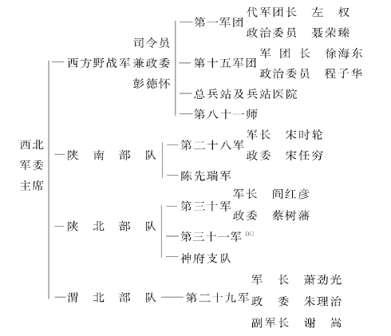

## 渡河以来战况与黄河以西的军事部署[^1-475]（一九三六年三月一日）

周副主席，刘宋并告博，迈，林聂，徐程[^2-475]：

甲、吴佳神府[^3-475]晋军五个步兵旅已完全东调，最后守备吴堡、宋家川[^4-475]之方旅[^5-475]，亦于今明两日撤至军渡[^6-475]（吴堡恐只有民团）。神木还有一骑兵旅，估计亦有东调可能。

乙、我军在东岸消灭与击溃了阎敌五个团，占领了石楼、中阳、孝义、汾西、隰县、永和六县广大地区，占据了石中孝隰四县交界地区这个战略战役枢纽，巩固了作战的阵地，取得了创造根据地的初步自由，提高了红军的战斗力，完成了战略侦察，开始发动了广大群众。目前是争取打第二个胜仗。

丙、请副主席直接指挥二十八军及吴佳绥米[^7-475]地方部队大举袭敌堡垒，扩大胜利。无定河以西部队还须多调向东岸，与神府红军连成一片，企图夺取一、二个城。

丁、沿河工作，暂由我们指挥杨立三[^8-475]（河口[^9-475]）、蔡树藩[^10-475]（义牒镇[^11-475]）二人，副主席请专任北面敌。

彭 毛  
三月一日二十时

>根据中央档案馆保存的抄件刊印。

[^1-475]:这是毛泽东和红军第一方面军司令员彭德怀给周恩来等的电报。

[^2-475]:刘宋，指刘志丹、宋任穷，当时分别任红军第二十八军军长和政治委员。博，指博古，即秦邦宪，当时任中共中央政治局常委、中华苏维埃共和国中央政府西北办事处主任。迈，指罗迈，即李维汉，当时任中共中央组织部部长，兼管陕北省委工作。林聂，指林彪、聂荣臻，当时分别任红军第一方面军第一军团军团长和政治委员。徐程，指徐海东、程子华，当时分别任红军第一方面军第十五军团军团长和政治委员。

[^3-475]:吴佳神府，指陕西吴堡、佳县、神木和府谷。

[^4-475]:宋家川，镇名，为今陕西吴堡县县治。

[^5-475]:方旅，指国民党军太原绥靖公署第四纵队第七十一师第二○六旅，旅长方克猷。

[^6-475]:军渡，位于今山西柳林县西部。

[^7-475]:绥米，指陕西绥德和米脂。

[^8-475]:杨立三，当时任西北革命军事委员会兵站部部长。

[^9-475]:河口，位于陕西清涧县东部。

[^10-475]:蔡树藩，当时任红军沿河游击队政治委员。

[^11-475]:义牒镇，位于山西石楼县西部。

## 关于执行优待俘虏政策的问题[^1-477]（一九三六年三月二日）

林聂朱，徐程郭并致张云逸，刘志丹宋任穷，阎红彦蔡树藩，萧劲光[^2-477]转告各地方武装首长：

关于改变待遇俘虏军官的政策，此次战斗中一团仍未能全部执行（四○五团王营长大衣帽子被剥）。必须向全体红色战士指战员说明优待俘虏特别优待官长的用意何在，以及对于清查敌军大小军官，一经解除武装，一律不得剥衣，不得搜身，不得打骂，不得捆绑，不得讥笑，而以热烈欢迎诚恳招待的态度向着他们，用此策略以瓦解白军。

彭 毛 杨  
三月二日二十一时半

>根据中央档案馆保存的抄件刊印。

[^1-477]:这是毛泽东和红军第一方面军司令员彭德怀、政治部主任杨尚昆给第一方面军第一军团军团长林彪、政治委员聂荣臻、政治部主任朱瑞和第十五军团军团长徐海东、政治委员程子华、政治部主任郭述申等的电报。

[^2-477]:张云逸，当时任红军第一方面军副参谋长兼军委后方办事处参谋长。刘志丹、宋任穷，当时分别任红军第二十八军军长和政治委员。阎红彦、蔡树藩，当时分别任红军第三十军军长和政治委员。萧劲光，当时任红军第二十九军军长。

## 消灭中阳一带敌军的部署[^1-479]（一九三六年三月五日）

林聂，徐程：

甲、阎[^2-479]敌东面三路已明，北面当亦有三路，南面将是两路，八路估计共有十六个团，至多二十个团。

乙、我军应以关上、水头[^3-479]为枢纽，背靠石楼，集中两军团最大主力，以连续战斗，消灭其东面之两路或三路为基本作战方针。如南面之敌迫近水头，亦可从南面打起，依明日情况决定。

丙、我以准备七日作战之目的，明（六）日部署：  
1．一军团一、四两师在关上东端约二十里地区集中，一部保持与兑九峪[^4-479]、高阳两路之敌接触，二师主力控制关上、车鸣峪间，向中阳阻敌。一军团七日作战准备任正面。  
2．十五军团以七十五师两个团，明日位于水头东面三十里通大麦郊路上，七十八师、八十一师集中水头，而于石口置一游击队。七号作战，十五军团准备从右翼打去。  
3．我们率二十三分队明日到水头与徐程见面。一军团地图应送水头不误。徐程明日在水头不得移动。

彭 毛  
三月五日二十四时

>根据中央档案馆保存的抄件刊印。

[^1-479]:这是毛泽东和红军第一方面军司令员彭德怀给第一方面军第一军团军团长林彪、政治委员聂荣臻和第十五军团军团长徐海东、政治委员程子华的电报。

[^2-479]:阎，指阎锡山，当时任国民党政府军事委员会副委员长、太原绥靖公署主任。

[^3-479]:关上，村名，位于山西中阳县南部。水头，镇名，位于今山西交口县西北。

[^4-479]:兑九峪，今名兑镇，位于山西孝义县西部。

## 各个击破向大麦郊推进之敌[^1-481]（一九三六年三月六日）

林聂，徐程：

一、汾西、隰县、永和方向似无进攻大麦郊[^2-481]敌，主力仍是东、北面之李生达孙楚[^3-481]两部，其方法是分路推进，不是冒进。

二、我军以待机各个击破、集中主力、连续战斗、先打东面、再打北面、击其侧后包围消灭之战法，本日两军团均须集结休息不应作战。

三、一军团伤兵速移界元里一带。

四、望林聂以作战意见送水头[^4-481]。

彭 毛  
六日二时

>根据中央档案馆保存的抄件刊印。

[^1-481]:这是毛泽东和红军第一方面军司令员彭德怀给第一方面军第一军团军团长林彪、政治委员聂荣臻和第十五军团军团长徐海东、政治委员程子华的电报。

[^2-481]:大麦郊，村名，位于今山西交口县东部。

[^3-481]:李生达，当时任国民党军太原绥靖公署第三纵队司令兼第七十二师师长。孙楚，当时任国民党军太原绥靖公署第四纵队司令兼第一○一师师长。

[^4-481]:水头，镇名，位于今山西交口县西北。

## 消灭兑九峪之敌的部署[^1-483]（一九三六年三月六日）

林聂：

一、十五军团七十五师由海东[^2-483]率领，明拂晓出发，先头十二时可到大麦郊[^3-483]。

二、兑九峪[^4-483]之敌明日如不动，则一军团在原地、十五军团在大麦郊宿营，后天（八号）攻击兑九峪。

三、兑九峪之敌明天如不向大麦郊，而向一军团位置前进，则一军团向后撤退二十里宿营，十五军团在大麦郊宿营。八号攻击。

四、敌明天如进至兑九峪与大麦郊中间地区停止宿营，则一军团在原地、十五军团在大麦郊宿营。八号攻击。

五、敌明天如向大麦郊前进，则一军团应候敌完全通过后，从敌右侧后攻击，十五军团以一部正面遭遇，主力从敌右侧攻击而消灭之。

六、以上四种情况，只有敌向大麦郊攻击，我军方与之作战，否则均在后天作战。

七、二师仍在关上以北钳制孙楚[^5-483]，十五军团一个营在石口以南钳制梁旅[^6-483]。

八、我们随七十八师及八十一师明日七时从水头[^7-483]出发，十四时可到大麦郊。

彭 毛  
六日二十时半

>根据中央档案馆保存的抄件刊印。

[^1-483]:这是毛泽东和红军第一方面军司令员彭德怀给第一方面军第一军团军团长林彪、政治委员聂荣臻的电报。一九三六年三月初，阎锡山一面请求蒋介石派军队支援，一面将自己的机动部队编为四个纵队，向红军东征部队发起第一次反击。三月十日，红一军团和十五军团向兑九峪发起进攻，击溃了晋军的第二、第三两个纵队。阎锡山组织的第一次反击被粉碎。

[^2-483]:海东，即徐海东，当时任红军第一方面军第十五军团军团长。

[^3-483]:大麦郊，村名，位于今山西交口县东部。

[^4-483]:兑九峪，今名兑镇，位于山西孝义县西部。

[^5-483]:孙楚，当时任国民党军太原绥靖公署第四纵队司令兼第一○一师师长。

[^6-483]:梁旅，指国民党军太原绥靖公署第一纵队第六十九师第二○三旅，旅长梁鉴堂。

[^7-483]:水头，镇名，位于今山西交口县西北。

以主力一部抄敌后路包围消灭之[^1-485]（一九三六年三月六日）

林聂：

为准备打一仗后，又打第二仗，又打第三仗，必须以主力一部抄敌后路，把敌包围消灭，免去追击。必须免去追击，才能当日集合队伍于一处，才便于打第二仗，才便于应付意外变化。敌人战斗力虽弱，但主力数不少，我们应该集结部队好好的打。

彭 毛  
六日

根据中央档案馆保存的抄件刊印。

[^1-485]:这是毛泽东和红军第一方面军司令员彭德怀给第一方面军第一军团军团长林彪、政治委员聂荣臻的电报。

## 第四团应迟滞敌向水头进攻[^1-486]（一九三六年三月十日）

李邓：

甲、敌六十六师昨（九）日进占离大麦郊十五里处，李生达[^2-486]部主力本日有向郭家掌[^3-486]攻击可能。

乙、两个军团主力本日有消灭敌左路之任务。

丙、第四团仍应钳制进入关上之敌，迟滞敌向水头进攻企图。部署如下：  
（一）背靠凤尾村[^4-486]，掩护该地伤兵，主力控制大道要隘，取运动防御。  
（二）派小部队向敌两侧翼袭击，并告以集合地点。

彭 毛  
三月十日十五时

根据中央档案馆保存的抄件刊印。

[^1-486]:这是毛泽东和红军第一方面军司令员彭德怀给第一方面军第一军团第二师副师长李天佑、政治部主任邓华的电报。

[^2-486]:李生达，当时任国民党军太原绥靖公署第三纵队司令兼第七十二师师长。

[^3-486]:郭家掌，村名，位于今山西交口县东部。

[^4-486]:凤尾村，位于山西中阳县南部。

## 打破敌军进攻争取创造山西苏区[^1-488]（一九三六年三月十一日）

林聂，徐程：

甲、敌三、二纵队杨李李三师[^2-488]昨日被我击溃，向兑九峪[^3-488]方面退走。

乙、我军有以主力乘胜东进，致迫太原，彻底打破阎敌总进攻部署，扩大战略上的战果，扩大宣传，扩大苏区，扩大红军，夺取民众，争取创造苏区有利条件之任务。

丙、部署如此：  
一、一军团以一、四两师及直属队一部由林率领，附十七分队，十五军团以七十五师（缺一团）由徐率领，两军团统归林指挥，明（十二）日进至南北马庄，十三日占领汾县[^4-488]西端马路待命。  
二、一军团以二师及直属队之一部由聂率领，控制于中阳城、兑九峪、水头[^5-488]之三角地区内，迫退孙纵队[^6-488]，巩固与赤化此地区。  
三、十五军团以七十八师、八十一师及直属队控制于水头、大麦郊[^7-488]以南地区，由程率领，以主力直迫隰县，引退杨纵队[^8-488]，赤化此地区。  
四、七十五师之一个团包围石楼城，方面军直属队担任石楼赤化任务不变。  
五、我们在大麦郊指挥。

彭 毛  
三月十一日十二时

>根据中央档案馆保存的抄件刊印。

[^1-488]:这是毛泽东和红军第一方面军司令员彭德怀给第一方面军第一军团军团长林彪、政治委员聂荣臻和第十五军团军团长徐海东、政治委员程子华的电报。

[^2-488]:杨李李三师，指国民党军太原绥靖公署第二纵队第六十六师、第三纵队第六十八师和第七十二师，师长分别为杨效欧、李服膺和李生达。

[^3-488]:兑九峪，今名兑镇，位于山西孝义县西部。

[^4-488]:原文如此，似应为汾阳。

[^5-488]:水头，镇名，位于今山西交口县西北。

[^6-488]:孙纵队，指国民党军太原绥靖公署第四纵队，纵队司令孙楚。

[^7-488]:大麦郊，村名，位于今山西交口县西部。

[^8-488]:杨纵队，指国民党军太原绥靖公署第一纵队，纵队司令杨澄源。

## 十五军团乘虚北进相机袭取介休等地[^1-490]（一九三六年三月十七日）

徐程并告林聂：

甲、敌二、三纵队本日一部进占郭家掌，主力仍进至兑九峪[^2-490]、郭家掌之间。敌第四纵队主力至车鸣峪、中阳城，一部至暖泉，有救援石楼模样。我一军团本日进占霍县地域。

乙、十五军团（缺八十一师）有乘虚北进，破坏敌后方，动摇敌人兵心，扩大我宣传之任务。明（十八）日主力进至北师屯、南师屯[^3-490]，一部渡河相机袭取介休城，如介休得手，则进到介休宿营，准备十九日向平遥前进，相机袭取之。如介休不得手，则明日全部在南、北师屯宿营，十九日以前出发到介休、孝义之间，经大庄村[^4-490]、演武镇进到汾水之间尽善村，并以一部相机占领文水城。

丙、随时集结兵力准备消灭敌骑兵。

丁、注意宣传发动群众，不得破坏商店学校。

彭 毛  
三月十七日二十时

>根据中央档案馆保存的抄件刊印。

[^1-490]:这是毛泽东和红军第一方面军司令员彭德怀给第一方面军第十五军团军团长徐海东、政治委员程子华并告第一军团军团长林彪、政治委员聂荣臻的电报。

[^2-490]:兑九峪，今名兑镇，位于山西孝义县西部。

[^3-490]:北师屯、南师屯，即师屯北、师屯南，均为村名，位于山西介休县西部。

[^4-490]:大庄村，疑为东大王村，位于山西汾阳县东南。

## 一军团十五军团应扩大占领区域[^1-492]（一九三六年三月二十日）

林聂，徐程：

甲、晋敌新部署尚在迟疑未决中，我一军团在南面，十五军团在北面，应利用此时间扩大占领区域，扩大进攻声势，扩大政治宣传，破坏统治基础，加紧争取民众当红军，尽可能占领几个县城。

乙、林聂注意对杨澄源[^2-492]六十九师之侦察警戒，徐程注意对商震[^3-492]部及敌骑兵之侦察。

彭 毛  
三月二十日三时

>根据中央档案馆保存的抄件刊印。

[^1-492]:这是毛泽东和红军第一方面军司令员彭德怀给第一方面军第一军团军团长林彪、政治委员聂荣臻和第十五军团军团长徐海东、政治委员程子华的电报。

[^2-492]:杨澄源，当时任国民党军太原绥靖公署第二路第一纵队司令兼第六十九师师长。

[^3-492]:商震，当时任国民党军第三十二军军长。

## 十五军团在晋西北创造根据地的行动方针[^1-494]（一九三六年三月二十二日）

徐程并告林聂：

行动方针训令：

甲、十五军团有在晋西北创造苏区根据地，并配合在神府[^2-494]行动之二十八军，控制黄河一段，打通与陕北联系的任务。

乙、行动区域，是以苛岚、岚县为中心之各县，包括交城、静乐、宁武、五寨、河曲、保德、兴县、临县、方山各县苏区之创造，则着重苛岚、岚县、兴县、临县。

丙、在此区域内，消灭地主武装，消灭北上小于自己之敌军部队，尽最大可能，用一切努力夺取一二个县城于我手中。

丁、广泛的扩大宣传，分发财物，发动广大群众，直至普遍建立游击队，建立政权，分配土地。

戊、猛烈扩大红军，争取在一个月扩大一千五百人。己、行动与工作时间不限制。

庚、万一电报不通，仍在指定地域活动，我们当令宋时轮[^3-494]率七分队找你们，但目前时期宋时轮及其部队仍在水头为中心之地区，吸引敌人，进行工作。

彭毛
三月二十二日十四时

>根据中央档案馆保存的抄件刊印。

[^1-494]:这是毛泽东和红军第一方面军司令员彭德怀给第一方面军第十五军团军团长徐海东、政治委员程子华并告第一军团军团长林彪、政治委员聂荣臻的电报。

[^2-494]:神府，指陕西神木和府谷。

[^3-494]:宋时轮，当时任红军第一方面军第十五军团司令部作战科长。此时奉第红一方面军首长命令，率第七十五师第二二四团一个营和第八十一师一个营，在水头、关上等地，钳制晋绥军主力对红军的第二次反攻。

## 创造河东战场及加强要道工作[^1-496]（一九三六年三月二十五日）

叶李：

甲、猛烈扩大红军，创造河东战场，即或遇着某些困难，必须坚决地克服之。你们应首先以赤化石楼全县为中心，及永和、隰县以北，中阳、柳林以南。

乙、特别要加强下述要道工作：一、石楼到水头[^2-496]。二、石楼到石口镇[^3-496]。三、石楼到隰县。四、石楼到永和。五、石楼到坪底、留誉[^4-496]。以上五条道路，充分地发动群众，加强游击工作和干部领导，准备石楼敌人深入后造成对敌群众封锁，断绝敌人一切供给，以群众力量和坚壁清野来疲困敌人。

丙、破坏白军的标语传单，首先布置上述要道。

丁、如何具体布置，望送报来四江村。

彭 毛  
二十五日十三时

>根据中央档案馆保存的抄件刊印。

[^1-496]:这是毛泽东和红军第一方面军司令员彭德怀给第一方面军参谋长兼中路军总指挥叶剑英、中共陕甘省委书记李富春的电报。

[^2-496]:水头，镇名，位于今山西交口县西北。

[^3-496]:石口镇，位于今山西交口县西部。

[^4-496]:坪底，位于山西石楼县北部。留誉，位于今山西柳林县南部。

## 第一军团的行动方针[^1-498]（一九三六年三月二十五日）

林聂：

一、为普遍摧毁反动基础，为普遍发动民众，为破坏千里黄河堡垒线与主要铁路线，先锋军（右路军）今后行动方针如下：  
甲、在现地区尽可能长久打，第一网分兵翼城、绛县，小部包围沁水，示欲东向。  
乙、第二网打在汾城[^2-498]、新绛、稷山、河津、乡宁五县，任务扩红，一部在临汾、襄陵吸引敌人南向。  
丙、第三网转至永和、大宁、吉县、隰县、蒲县，任务第一破坏黄河堡垒，第二扩红。  
丁、第四网突然打向介休、平遥、祁县、太谷，任务第一毁路，第二扩红。  
戊、第五步占领正太铁路[^3-498]，任务第一毁路，第二扩红。  
己、尔后或出河北，或出长治、晋城，依情况决定。

二、十五军团（左路）在此时期在晋西北转动，包括破坏黄河北段敌堡垒线，与神府[^4-498]苏区打通。

三、我石楼一带部队（中路军）在此时期吸引敌第一纵队不使南下。

四、你们的行动依此总方针，如敌情不许可则临时改变。

彭 毛  
二十五日二十时于石楼附近

>根据中央档案馆保存的抄件刊印。

[^1-498]:这是毛泽东和红军第一方面军司令员彭德怀给第一方面军第一军团军团长林彪、政治委员聂荣臻的电报。一九三六年三月十日兑九峪战斗后，毛泽东、彭德怀决定避敌主力，分兵作战，遂以红军第一军团和第八十一师主力为右路军，向霍县以南发展；以第十五军团（缺第八十一师）为左路军，向灵石以北发展；以第十五军团第二二四团、第八十一师一个营、第三十军和山西游击队等组成中路军，在石楼、中阳一带钳制敌人主力。

[^2-498]:汾城以及本项中的襄陵，均为旧县名，一九五四年两县合并为山西襄汾县。

[^3-498]:正太铁路，指正定至太原的铁路，即今石太线。

[^4-498]:神府，指陕西神木和府谷。

## 中央政治局会议讨论政治军事等问题的通报[^1-500]（一九三六年三月二十八日）

林聂，徐程并告朱郭：

甲、中央政治局会议完毕，完满地讨论了政治、军事、外交三问题。到会同志对于方面军各兵团首长及全体指战员英勇作战及扩红伟大胜利，深致慰劳与庆祝之意。

乙、关于政治问题，分析了华北时局，决定了争取迅速对日作战为党与红军的重要任务。

丙、关于军事问题，批准军委的提议：  
1．在争取迅速对日作战方针下，第一时期以经营山西为基本战略方针。在此种方针下，向河北河南绥远[^2-500]三省境内作战役的跳跃是许可的。  
2．决定了以发展求巩固的原则，目前是普遍摧毁反动基础，普遍发动群众，猛烈扩大红军，各个消灭敌人。  
3．十月革命节前扩大红军三万六千人，前方担任三万，争取超过。  
4．四个月内完成三个军九个师二十七个团的编制，每团七百五十人。  
5．地方红军，三个月内完成四个军，每军一千五百人。  
6．陕甘及华北五省发展游击战争。  
7．提高红军干部的政治水平与军事水平，保证红军战争中优秀的与坚强的领导。  
8．政治工作保证红军的统一与团结。

彭 毛  
二十八日一时

>根据中央档案馆保存的抄件刊印。

[^1-500]:这是毛泽东和红军第一方面军司令员彭德怀给第一方面军第一军团军团长林彪、政治委员聂荣臻、政治部主任朱瑞和第十五军团军团长徐海东、政治委员程子华、政治部主任郭述申的电报。一九三六年三月二十日至二十七日中共中央政治局在晋西地区举行扩大会议，传达共产国际“七大”的决议，分析国际国内形势，讨论政治、军事和开展抗日统一战线问题，确定了争取迅速对日作战和以发展求巩固的战略方针。

[^2-500]:绥远，旧省名，辖今内蒙古自治区中部地区，一九五四年撤销。

## 集中全力与东西来敌打遭遇战[^1-502]（一九三六年三月三十一日）

徐程，刘宋：

甲、十五军团应集中全力找寻有利机会，与东西来敌打遭遇战，再消灭敌一团，停止追敌，分散工作。此刻万不能分散。在不便作战时，则一部监视敌人，主力集结休息，准备作战。

乙、刘宋专任由南向北扫除堡垒，消灭守敌。

丙、刘宋通知特委[^2-502]加造大船十只、小船十只，分散于罗峪口[^3-502]以北以南数十里五个渡口中。

彭 毛  
三十一日二十时

>根据中央档案馆保存的抄件刊印。

[^1-502]:这是毛泽东和红军第一方面军司令员彭德怀给红军第一方面军第十五军团军团长徐海东、政治委员程子华和第二十八军军长刘志丹、政治委员宋任穷的电报。

[^2-502]:特委，指中共神（木）府（谷）特委。

[^3-502]:罗峪口，位于山西兴县西南。

## 第一方面军改编为中国人民红军抗日先锋军及其方针任务[^1-504]（一九三六年四月一日）

我方面军：

甲、为执行党中央争取迅速对日作战的决定，将第一方面军全部改为中国人民红军抗日先锋军，第一军团改为中国人民红军抗日先锋军第一路军，第十五军团改为第二路军，并在五个月内成立第三路军。

乙、抗日先锋军以华北五省[^2-504]为作战范围，第一阶段以在山西创造对日作战根据地为基本方针，以山西为方针下，可以全部或一部跃入绥远[^3-504]或河北或河南之一部，作为临时步骤。反对以跨越山西向河北、绥远作为第一阶段之基本战略方针，也反对不能以临时的跳跃作为战役方针。

丙、以发展求巩固。

丁、战略上以少胜多，战役上以多胜少，为目前军事指挥的基本原则。

戊、先锋军七个月内完成五万人的编制并武装起来，扩红为总方针的第一等任务。

己、地方三个月内完成四个地方军，陕西、山西各两军。

庚、在新苏区每县创造一个独立团。

辛、提高抗日先锋军到全国抗日红军的领袖地位，提高抗日先锋军及其他红军干部人员的政治军事水平到列宁主义原则与战略原则的程度，保证红军的团结与统一。

（传达到团以上的干部）

西北革命军事委员会  
毛 彭 周  
四月一日

>根据中央档案馆保存的抄件刊印。

[^1-504]:这是毛泽东和西北革命军事委员会副主席彭德怀、周恩来给红军第一方面军的电报。此前第一方面军已经使用中国人民红军抗日先锋军的称号。

[^2-504]:华北五省，指当时的河北、山东、山西、察哈尔和绥远。

[^3-504]:绥远，旧省名，辖今内蒙古自治区中部地区，一九五四年撤销。

敌军布防及红军第十五军团之部署[^1-506]（一九三六年四月二日）

徐程，刘宋：

甲、杨耀芳[^2-506]率六七个团在兴县、岚县一带，防我向北，李生达[^3-506]率两三个团正往娄烦、静乐一带，防我向东。临县、方山、离石、中阳、汾阳一带，仅七十一师方旅[^4-506]两团，丁旅[^5-506]一团，甚为空虚。

乙、十五军团部署：  
一、在现地休息训练三、四日后逐步向南，到达离石马路、隰县区域回旋一时期，尔后依情况或出汾阳、文水，或出介休、灵石。  
二、注意找寻机会，以遭遇姿势向后回击，或向前迎击，消灭敌人之小集团兵力。  
三、整个工作中，扩红列入第一位。四、群众中组织秘密支部。  
丙、二十八军与十五军团，在现在休息时间位于黑峪口、罗峪口之线努力扩红拆堡。十五军团南下时依情况决定，或仍回神府[^6-506]区域，或在河东[^7-506]行动一时期。  

彭 毛  
四月二日二十二时

>根据中央档案馆保存的抄件刊印。

[^1-506]:这是毛泽东和红军第一方面军司令员彭德怀给第一方面军第十五军团军团长徐海东、政治委员程子华和第二十八军军长刘志丹、政治委员宋任穷的电报。

[^2-506]:杨耀芳，当时任国民党军太原绥靖公署第二路河防部队第七十一师师长。

[^3-506]:李生达，当时任国民党军太原绥靖公署第二路第三纵队司令兼第七十二师师长。

[^4-506]:方旅，指国民党军太原绥靖公署第二路第四纵队第七十一师第二○六旅，旅长方克猷。

[^5-506]:丁旅，指国民党军太原绥靖公署第二路河防部队第七十一师第二一六旅，旅长丁炳青。

[^6-506]:神府，指陕西神木和府谷。

[^7-506]:河东，指黄河以东。

## 东征军的行动计划和陕甘部队的扩编问题[^1-508]（一九三六年四月三日）

周副主席并告林聂，徐程，刘宋，宋，萧[^2-508]：

甲、因敌情变动[^3-508]，复令一军团暂不去晋东南，明日开始转入蒲县地区集中训练，准备作战。尔后一时期内，由一军团与我们共任这一区域之赤化与破坏封锁线。

乙、十五军团现在汾临[^4-508]交界，明日起令其逐步向南，在临县、离石、中阳地域猛烈扩红赤化。

丙、二十八军决令其随十五军团行动一时期，打些小仗予以磨练，责其扩大至二千，尔后依河西需要令其西渡。

丁、请你即依陕北独立团营基础，立即编成第三十一军[^5-508]，位于神府米佳[^6-508]区域。

戊、为对付张杨[^7-508]进攻，四月份陕北、陕甘扩红全部编入二十九军、三十一军。应有一扩红新计划，我意数目不必大，求确实做到。

己、前后方联络，准备开辟永和关、三交镇[^8-508]以北两处渡口，以一军团任南面，十五军团任北面，实行当在一星期后。

德怀 泽东  
四月三日二十时半

>根据中央档案馆保存的抄件刊印。

[^1-508]:这是毛泽东和红军第一方面军司令员彭德怀给周恩来的电报。

[^2-508]:林聂，指林彪、聂荣臻，当时分别任红军第一方面军第一军团军团长和政治委员。徐程，指徐海东、程子华，当时分别任红军第一方面军第十五军团军团长和政治委员。刘宋，指刘志丹、宋任穷，当时分别任红军第二十八军军长和政治委员。宋，指宋时轮，当时任红军第一方面军第十五军团司令部作战科长。萧，指萧劲光，当时任红军第二十九军军长。

[^3-508]:一九三六年四月初，国民党军晋军和中央军分别向兴县以南地区和临汾、侯马、赵城地区集结，寻歼红军东征部队。蒋介石还强令张学良和杨虎城向延长、延川进击，袭扰陕甘苏区。

[^4-508]:汾临，疑是兴临之误。兴临，指山西兴县和临县。

[^5-508]:西北革命军事委员会曾酝酿以神府地区地方红军、游击队为基础组建红军第三十一军，后未实现。一九三六年八月，这支武装组成独立第二师。

[^6-508]:神府米佳，指陕西神木、府谷、米脂和佳县。

[^7-508]:张杨，指张学良、杨虎城，当时分别任国民党军西北“剿匪”总司令部副总司令和国民党军第十七路军总指挥、西安绥靖公署主任。

[^8-508]:永和关，位于山西永和县西部。三交镇，位于今山西柳林县西部。

## 一军团继续留在晋西南的任务[^1-510]（一九三六年四月八日）

林聂：

甲、你们不是迅速离开晋西南的问题，而是尽可能长久地在晋西南工作，直至敌情不许可继续留此区域时，然后离开此区域，转至另一区域。

乙、你们在晋西南须尽可能完成如下任务：  
1．打仗，收缴枪枝，武装新兵，训练新兵。  
2．发动民众，造成游击区域，创造新的游击区域。  
3．粉碎沿河封锁线之一段，接收河西[^2-510]游击队及其归队人员过河东后送资材过河西。  
4．继续扩红。

丙、目前准备转入乡宁地域，第二步转至蒲县、大宁、永和。

丁、为利于你们尔后向东北与向东的长距离跃进，与到达新区域后有展开工作的余裕时间，必须采取尽量吸引敌人向晋西南与向沿河的方面，尤其在胡宗南[^3-510]入晋的条件下，必须如此估计到。尔后东边的胜利，将使西边敌人没有长久留驻之可能。

戊、灵石、孝义、双池、大麦郊、水头[^4-510]地区不派一兵去引起敌人注意。我们直接指挥之部队，在隰蒲两县中间地区工作。

彭 毛  
四月八日二时

根据中央档案馆保存的抄件刊印。

[^1-510]:这是毛泽东和红军第一方面军司令员彭德怀给第一方面军第一军团军团长林彪、政治委员聂荣臻的电报。

[^2-510]:河西，指黄河以西。

[^3-510]:胡宗南，当时任国民党军西北“剿匪”总司令部第一军军长兼第一师师长。

[^4-510]:双池，镇名，位于今山西交口县东部。大麦郊，村名，位于今山西交口县东部。水头，镇名，位于今山西交口县西北。

## 七十八师应消耗敌军滞其南进[^1-512]（一九三六年四月九日）

徐程：

甲、不管方山来敌多少，七十八师应择有利地形节节抵抗方法，使用小部占领优势阵地，构筑工事，用少数子弹（十分注意节省子弹）同敌打着，逼敌展开，有时可用向敌前进办法逼敌展开，以消耗其弹药，迟滞其南进时间，以利我工作部队之工作。

乙、除七十八师掩护部队外，其余以营以连为单位，展开于南北一线放手工作，极大的宣传鼓动群众，尽量散发财物，努力扩红。

丙、遍写争取晋军抗日的标语于各大小村庄。丁、注意临县方面方旅[^2-512]之警戒。

戊、注意在大武镇[^3-512]选择利于回击之形势。

彭 毛  
九日二时

>根据中央档案馆保存的抄件刊印。

[^1-512]:这是毛泽东和红军第一方面军司令员彭德怀给第一方面军第十五军团军团长徐海东、政治委员程子华的电报。

[^2-512]:方旅，指国民党军太原绥靖公署第二路第四纵队第七十一师第二○六旅，旅长方克猷。

[^3-512]:大武镇，位于山西方山县南部。

## 同意集中兵力在乡宁等地域作战[^1-514]（一九三六年四月十二日）

林聂同志：

同意你们首先集中全部兵力在乡宁、吉县、大宁、蒲县地域找寻作战机会，求得在此地域打一、二仗，消灭敌一、二个团，这是最好的方针。你们准备以十天至十五天时间，完成作战与破坏封锁线任务，而把作战置于第一阶段。只要能打一胜仗，打破封锁线就不是迫切问题了。

彭 毛  
四月十二日二时

根据中央档案馆保存的抄件刊印。

[^1-514]:这是毛泽东和红军第一方面军司令员彭德怀给第一方面军第一军团军团长林彪、政治委员聂荣臻的电报。

## 十五军团和二十八军的行动部署[^1-515]（一九三六年四月十二日）

徐程，刘宋：

为吸引孙楚[^2-515]主力到中阳，便利尔后二十八军向留誉[^3-515]、石楼行动；为吸引杨效欧[^4-515]到吴城镇[^5-515]，便利徐程向中阳、关上、兑九峪[^6-515]之中间地区行动，部署如下：

甲、明日十五军团移至中阳、离石、吴城镇中间地区（苏村、桃园上、石戴上、禅房上），依队派至王营庄、义居村游击，破坏电线，阻止汽车交通。西向中阳城游击，威胁孙楚，另派便衣侦察。南至中阳，东南至相家塔、滚牛城、师庄村侦察敌情。

乙、二十八军明日主力移至金罗镇、朱家店[^7-515]，派队北向离石，南向中阳，逼近城边游击，准备十四日移至中阳西面之下枣村、冯家坡，从西面佯攻中阳。

丙、十五军团所捉之俘虏，多作宣传，多发路费，分向中阳、离石、汾阳放去。

丁、十五军团、二十八军准备在上述地区工作两三天，努力扩红，尽量散发财物于居民，多写抗日标语影响白军。

彭 毛  
十二日十六时

>根据中央档案馆保存的抄件刊印。

[^1-515]:这是毛泽东和红军第一方面军司令员彭德怀给第一方面军第十五军团军团长徐海东、政治委员程子华和第二十八军军长刘志丹、政治委员宋任穷的电报。

[^2-515]:孙楚，当时任国民党军太原绥靖公署第四纵队司令兼第一○一师师长。

[^3-515]:留誉，镇名，位于今山西柳林县南部。

[^4-515]:杨效欧，当时任国民党军太原绥靖公署第二纵队司令兼第六十六师师长。

[^5-515]:吴城镇，位于山西离石县东南。

[^6-515]:关上，村名，位于山西中阳县南部。兑九峪，今名兑镇，位于山西孝义县西部。

[^7-515]:金罗镇，位于山西中阳县西北。朱家店，村名，位于山西中阳县北部。

## 破坏河防与寻敌作战不宜兼顾[^1-517]（一九三六年四月十四日）

林聂：

甲、你们现到吉县，如估计数日内无良好作战机会，则以先打开河防为有利。

乙、目前北敌集中中阳附近，南敌主力在乡宁以南，数日后北敌必至关上、中阳、兑九峪之线，南敌必至乡宁、黑龙关之线。此时如我河道已通，便可放心作战，不受压迫，如万一找不到良好作战机会，要向另一区域转移，亦较为从容，望考虑部署之。

丙、破坏河防与寻敌作战，二者不宜兼顾。

丁、寻敌作战以运动战为上策，以打停止中之敌为下策。

戊、十五军团三角庄胜利[^2-517]后不能不到大麦郊[^3-517]休息，他们减员颇大，必须整顿。

彭 毛  
四月十四日二十一时半

>根据中央档案馆保存的抄件刊印。

[^1-517]:这是毛泽东和红军第一方面军司令员彭德怀给第一方面军第一军团军团长林彪、政治委员聂荣臻的电报。

[^2-517]:三角庄，位于山西中阳县东部。红军第一方面军第十五军团主力于一九三六年四月十二日在师庄、三角庄一带歼灭国民党军第六十六师第一九六旅的第三九二团，并将余敌击溃，俘敌团长以下官兵六百余人。

[^3-517]:大麦郊，村名，位于今山西交口县东部。

## 诱大宁之敌西进消灭之[^1-519]（一九三六年四月二十日）

甲、我一军团宜装浮桥西渡模样，引诱大宁之敌西进而消灭之。

乙、大宁之敌系六十九师梁鉴堂刘光斗两旅[^2-519]，其中梁旅樊团曾被第十五军团在隰县北之蓬门消灭一营，俘其营长。昨日梁旅被我二师消灭一连。郭宗汾旅[^3-519]在临汾。

丙、今明两日，一军团各师应全部集结于桑壁镇[^4-519]以西、清水关以东之地区荫蔽待机，仅令二师派小部附电台监视大宁之敌，候其离开大宁城向马头关或清水关之道路前进时，我以遭遇而攻击之。

丁、如敌停止不进，则一军团在上述地区，休息训练若干天。

彭 毛  
四月二十日十二时

>根据中央档案馆保存的抄件刊印。

[^1-519]:这是毛泽东和红军第一方面军司令员彭德怀给第一方面军第一军团的电报。

[^2-519]:梁鉴堂、刘光斗两旅，指国民党军太原绥靖公署第二路第一纵队第六十九师第二○三旅和第二一四旅，旅长分别为梁鉴堂、刘光斗。

[^3-519]:郭宗汾旅，指国民党军太原绥靖公署第二路第一纵队第六十九师第二○二旅，旅长郭宗汾。

[^4-519]:桑壁镇，位于山西永和县东南。

## 第一军团和第十五军团目前休整计划与扩红问题[^1-521]（一九三六年四月二十二日）

林聂，徐程并告周副主席，张参谋长[^2-521]：

甲、山西敌人已暂时全部转入守势，其主力正构筑从三交镇[^3-521]起经中阳、孝义、灵石、临汾、新绛至河津之东南北三面封锁线，一部在永大隰石[^4-521]守城，估计本月底或下月初将有数路向我进攻。陕西方面张学良[^5-521]之王以哲军[^6-521]已开始进至富县、甘泉之间构筑堡垒，杨虎城[^7-521]部四个旅进至韩城、宜川之间，均准备继续向北进攻并从西面封锁黄河。

乙、我军目前短时间内需要休息训练并继续扩大各部。依此方针适当部署兵力，从二十三日起至二十八日止作出六天计划。

丙、一军团派出一部占领永和关，保证将贺家畔船只全数放下，另派小部保持清水关、铁罗关、马头关、平渡关[^8-521]四处渡口于我手中，再派队分向永大隰三城游击，打通桑壁镇、义泉镇[^9-521]之联系。十五军团派队分路侦察中阳、孝义间，孝义、介休间，介休、灵石、霍县间敌封锁线之程度、位置、空隙及道路，以为尔后向东打破封锁线，或向西回击张学良、杨虎城之准备。

丁、各部除了训练外仍以扩红为第一位，规定一军团扩大一千，十五军团五百，宋支队[^10-521]、二十八军、三十军一千。

戊、除日食外准备携带粮食十五天。

彭 毛  
二十二日一时

>根据中央档案馆保存的抄件刊印。

[^1-521]:这是毛泽东和红军第一方面军司令员彭德怀给第一方面军第一军团军团长林彪、政治委员聂荣臻和第十五军团军团长徐海东、政治委员程子华的电报。

[^2-521]:周副主席，指周恩来。张参谋长，指张云逸，当时任红军第一方面军副参谋长兼西北革命军事委员会后方办事处参谋长。

[^3-521]:三交镇，位于今山西柳林县西部。

[^4-521]:永大隰石，指山西永和、大宁、隰县和石楼。

[^5-521]:张学良，当时任国民党军西北“剿匪”总司令部副总司令。

[^6-521]:王以哲，当时任国民党军西北“剿匪”总司令部第六十七军军长。

[^7-521]:杨虎城，当时任国民党军第十七路军总指挥、西安绥靖公署主任。

[^8-521]:清水关，位于陕西延川县东南。铁罗关，位于山西永和县西部。马头关、平渡关，分别位于山西大宁县西北和西南。

[^9-521]:桑壁镇，位于山西永和县东南。义泉镇，位于山西隰县南部。

[^10-521]:宋支队，指红军第一方面军第十五军团司令部作战科长宋时轮所率第七十五师第二二四团一个营和第八十一师一个营，此时在水头、关上等地钳制晋绥军主力对红军的第二次反攻。

## 关于西渡黄河扩大陕甘苏区的命令[^1-523]（一九三六年四月二十八日）

周副主席，林聂，徐程，叶杨[^2-523]：

甲、目前情况：  
（一）在山西是阎锡山[^3-523]加蒋介石（五十一个团），再加堡垒主义。  
（二）在陕西是张学良杨虎臣[^4-523]在蒋介石令下向陕北进攻，企图封锁黄河，但神府[^5-523]区域、三边[^6-523]区域空虚。  
（三）在甘肃是蒋介石之胡宗南周[^7-523]两部入山西，毛炳文[^8-523]调甘南，王均伍诚仁[^9-523]等在陕南与甘南，张学良原在环水区域之部队，大部调陕西，环水区域及其以西均空虚。

乙、根据上述情况，方面军在山西已无作战的顺利条件，而在陕西、甘肃则产生了顺利条件，容许我们到那边活动，以执行扩大苏区，锻炼红军，培养干部等任务。另一方面则粉碎卖国贼扰乱抗日后方计划，亦是当前的重要任务。此外则有派一支队去陕南扩大苏区，吸引敌人之必要。

丙、我军决西渡黄河，第一步集结于延长地域。渡河时机、渡河秩序及集结地域之区分，另命令定之。

丁、向西执行上述任务，仍然是为着争取迅速直接对日

作战之基本的政治的任务。华北各省仍然是战略进攻方向的主要方向。在把蒋介石部队调出山西以后，在积极地进行山西干部的创造，山西士兵运动的加强，神府苏区的扩大等条件下，再一次进入山西作战的机会是会有的。坚持以陕甘苏区为中心向各方面作战，而以东方各省为长时期内的主要方向，这是确定的方针。

戊、此命令仅给军团与师两级主要军政首长。

彭 毛  
二十八日二十时

>根据中央档案馆保存的抄件刊印。

[^1-523]:这是毛泽东和红军第一方面军司令员彭德怀给周恩来等的电报。

[^2-523]:林聂，指林彪、聂荣臻，当时分别任红军第一方面军第一军团军团长和政治委员。徐程，指徐海东、程子华，当时分别任红军第一方面军第十五军团军团长和政治委员。叶杨，指叶剑英、杨尚昆，当时分别任红军第一方面军参谋长和政治部主任。

[^3-523]:阎锡山，当时任国民党政府军事委员会副委员长、太原绥靖公署主任。

[^4-523]:张学良，当时任国民党军西北“剿匪”总司令部副总司令。杨虎臣，即杨虎城，当时任国民党军第十七路军总指挥、西安绥靖公署主任。

[^5-523]:神府，指陕西神木和府谷。

[^6-523]:三边，指陕西西北的定边、安边和靖边。

[^7-523]:胡宗南，当时任国民党军西北“剿匪”总司令部第一军军长兼第一师师长。周，当时任国民党军第六师师长。

[^8-523]:毛炳文，当时任国民党军西北“剿匪”总司令部第三十七军军长。

[^9-523]:王均，当时任国民党军西北“剿匪”总司令部第三军军长。伍诚仁，当时任国民党军第四十九师师长。

## 停战议和一致抗日通电（一九三六年五月五日）

南京国民政府，军事委员会，全体海陆空军，全国各党派，各团体，各报馆，一切不愿意当亡国奴的同胞们：

自苏维埃中央政府与红军革命军事委员会组织中国人民红军抗日先锋军[^1-526]渡河东征以来，所向皆捷，全国响应。但正当抗日先锋军占领同蒲铁路，积极准备东出河北与日本帝国主义直接作战之时，蒋介石氏竟以十师以上兵力开入山西，协同阎锡山[^2-526]氏拦阻红军抗日去路，并命令张学良杨虎臣[^3-526]两氏及陕北军队向陕甘苏区挺进，扰乱我抗日后方。

中国人民红军抗日先锋军，本意集中全力消灭蒋氏拦阻抗日去路的部队，以达到对日直接作战之目的，但苏维埃中央政府与红军革命军事委员会，一再考虑，认为国难当前，双方决战，不论胜负属谁，都是中国国防力量的损失，而为日本帝国主义所称快。且在蒋介石阎锡山两氏的部队中，不少愿意停止内战一致抗日的爱国军人，目前接受两氏的命令拦阻红军抗日去路，实系违反自己良心的举动。

因此，苏维埃中央政府与红军革命军事委员会，为了保存国防实力，以便利于迅速执行抗日战争，为了坚决履行我们屡次向国人宣言停止内战一致抗日的主张，为了促进蒋介石氏及其部下爱国军人们的最后觉悟，故虽在山西取得了许多胜利，然仍将人民抗日先锋军撤回黄河西岸，以此行动，向南京政府、全国海陆空军、全国人民表示诚意，我们愿意在一个月内与所有一切进攻抗日红军的武装队伍实行停战议和，以达到一致抗日的目的。

苏维埃中央政府与红军革命军事委员会特慎重地向南京政府当局诸公进言，在亡国灭种的紧急关头，理应翻然改悔，以“兄弟阋于墙，外御其侮”[^4-526]的精神，在全国范围首先在陕甘晋停止内战，双方互派代表，磋商抗日救亡具体办法，此不仅诸公之幸，实亦民族国家之福。如仍执迷不悟甘为汉奸卖国贼，则诸公的统治必将最后瓦解，必将为全中国人民所唾弃，所倾覆。语云“千夫所指，不病而死”[^5-526]，又云“放下屠刀，立地成佛”[^6-526]，愿诸公深思熟虑之。

苏维埃中央政府与红军革命军事委员会更号召全国凡属不愿意做亡国奴的团体、人民、党派，赞助我们停战议和一致抗日的主张，组织停止内战的促进会，派遣代表隔断双方火线，督促并监视这一主张的完全实现。

中华苏维埃人民共和国中央政府主席 毛泽东  
中国人民红军革命军事委员会主席 朱德  
一九三六年五月五日

>根据一九三六年五月十六日《红色中华》刊印。

[^1-526]:中国人民红军抗日先锋军是红军第一方面军东征时使用的称号。

[^2-526]:阎锡山，当时任国民党政府军事委员会副委员长、太原绥靖公署主任。

[^3-526]:张学良，当时任国民党军西北“剿匪”总司令部副总司令。杨虎臣，即杨虎城，当时任国民党军第十七路军总指挥、西安绥靖公署主任。

[^4-526]:兄弟阋于墙，外御其侮，语出《诗·小雅·棠棣》。

[^5-526]:千夫所指，不病而死，语出《汉书·王嘉传》，“千人所指，无病而死”。

[^6-526]:放下屠刀，立地成佛，语出〔宋〕彭大翼《山堂肆考·征集》卷一。

## 关于西征战役的行动命令[^1-529]（一九三六年五月十八日）

一、蒋阎[^2-529]二卖国贼，以我军西渡，似有以四师以上兵力由吴堡入陕的企图。南线、北线及西线情况无变化。

二、为着极力扩大西北抗日根据地并使之巩固，为着扩大抗日红军，为着更加接近外蒙和苏联，为着一切抗日力量有核心的团聚，西北军委[^3-529]决以红军之一部钳制蒋阎西渡部队及陕北、渭北敌人，以主力组织西方野战军活动于陕甘宁广大区域。另以有力支队，进出陕南，与我陈先瑞部[^4-529]会合，活动于陕鄂豫三省，调动并吸引蒋介石主力于该方面，使我主力易于在西方取得胜利。

三、依上述目的，重新规定我军战斗序列如下：  
[^5-529]

四、各兵团第一步行动指导如下：  
（1）野战军第一步以夺取并赤化安边[^6-529]、定边、环县、曲子[^7-529]之目的，在五月十九、二十两日由现地[^8-529]出发，分两路西进（行军计划另发），以七天行程到达新城堡、沙集、吴起镇之线集结，休息两天，一军团完成环县、曲子、庆阳一带侦察，十五军团完成安边、定边侦察，十五军团准备攻占安边定边两县城，左聂率一军团相机攻占曲子及环县。其战斗部署及后方勤务机关均由彭司令员规定之。

（2）二十八军应于五月二十五日以前完成一切南进准备，待命出动。

（3）三十军以迟滞晋敌西进之目的，五月十八日由现地出发，取捷径以五天行程进到宋家川[^9-529]附近活动，相机破坏敌之碉垒，并迫近河边游击，以阻扰敌之渡河。

（4）三十一军以进入神府[^10-529]区域活动并威胁高敌双成[^11-529]后方之目的，应于七天内（至五月二十四日止）完成一切准备，待命北上。

（5）二十九军主力（两个团）仍由副军长谢嵩指挥，在韩城区域执行原任务。其另一个团应配合保安独立团及关中红军之一个团（归萧军长统一指挥）于六月初开始活动于吴起镇与环县、曲子、庆阳之间，配合我一军团行动。

五、所有西北军委直接指挥之诸兵团，须经常用无线电与军委联络，以保证随时接受军委的补充指令。

六、此命令发至师及独立军为止，不得下达。

此令

主席 毛泽东  
副主席 周恩来  
       彭德怀  
五月十八日于大相寺

>根据中国人民解放军军事科学院保存的抄件刊印。

[^1-529]:这是东征战役结束以后，毛泽东和西北革命军事委员会副主席周恩来、彭德怀在陕西延川县大相寺发出的西征战役命令。此次战役从一九三六年五月十九日开始到七月下旬结束，在两个多月的战斗中，除歼灭大量国民党军外，还俘旅长以下人枪二千余，战马五百余匹，占领了环县、豫旺、同心、定边、盐池等城镇，开辟了纵横二百余公里的新区，推动了抗日民族统一战线的发展，为迎接红军第二、第四方面军北上，实现红军三大主力会师创造了条件。

[^2-529]:蒋，指蒋介石。阎，指阎锡山，当时任国民党政府军事委员会副委员长、太原绥靖公署主任。

[^3-529]:西北军委，全称为中华苏维埃政府西北革命军事委员会。一九三五年十一月三日成立，主席毛泽东，副主席周恩来、彭德怀。

[^4-529]:陈先瑞部，指红军第七十四师，师长陈先瑞。

[^5-529]:第三十一军，见《东征军的行动计划和陕甘部队的扩编问题》注[5]（本卷第509页）。

[^6-529]:安边，镇名，一九三五年陕甘边苏维埃政府曾置安边县，一九四九年裁入陕西定边县。

[^7-529]:曲子，镇名，位于甘肃环县东南。

[^8-529]:指陕西延长、延川地区，是红军第一方面军西方野战军西征前驻地。

[^9-529]:宋家川，镇名，今为陕西吴堡县县治。

[^10-529]:神府，指陕西神木和府谷。

[^11-529]:高双成，当时任国民党军晋陕绥宁边区“剿匪”总指挥部第八十六师师长。

## 目前形势与战略方针[^1-533]（一九三六年五月二十五日）

朱张刘，徐陈[^2-533]并转任贺萧关夏[^3-533]诸同志：

目前形势及战略方针：

（一）国内及国际的政治形势均取着暴风雨般的姿态向前发展，党的反日统一战线策略有第一步的成就。目前议事日程上的具体任务是建立西北国防政府[^4-533]，争取迅速对日作战，以走向建立全国国防政府，彻底战胜日本帝国主义。

（二）西北的形势是：红军与东北军取得密切合作，与杨虎城邓宝珊[^5-533]亦有联系。胡宗南[^6-533]由山西向陕南，王均[^7-533]在汉中，毛炳文[^8-533]在甘南，阎锡山[^9-533]受红军重大打击后，现只能出八团入陕。汤恩伯[^10-533]率十八团（四个师）准备入陕，亦颇动摇。于学忠[^11-533]率两师在兰州、天水间，奉军[^12-533]主力在洛水、环水、泾水流域，陕军[^13-533]在韩城、宜川线，马鸿宾[^14-533]主力在宁夏，马麟[^15-533]在青海，一部在兰州以西。红军西渡后，向陕甘宁发展，策应四方面军与二方面军[^16-533]，猛力发展苏区，渐次接近外蒙。外蒙与苏联订立了军事互助条约，国际盼望红军靠近外蒙、新疆。

（三）四方面军与二方面军，宜趁此十分有利时机与有利气候速定大计，或出甘肃，或出青海。在兄等大计决定之后，一方面军适时向天水、兰州出动，进一步策应兄等，使蒋军不能拦阻。至于奉军已与秘密约定不加拦阻。

（四）兄处情况与计划甚盼速告。

育英[^17-533] 洛甫 泽东 恩来 博古 德怀 林彪 海东[^18-533]  
二十五日

>根据中央档案馆保存的抄件刊印。

[^1-533]:这是毛泽东和洛甫（张闻天）、周恩来等给活动在四川甘孜地区的红军总部暨第四方面军领导人并转第二、第六军团领导人的电报。

[^2-533]:朱张刘，指朱德、张国焘、刘伯承，当时分别任红军总司令、总政治委员和总参谋长。徐陈，指徐向前、陈昌浩，当时分别任红军第四方面军总指挥和总政治委员。

[^3-533]:任贺，指任弼时、贺龙，当时分别任红军第二、第六军团总指挥部政治委员兼第二军团政治委员和总指挥部总指挥兼第二军团军团长。萧，指萧克，当时任红军第六军团军团长。关，指关向应，当时任红军第二、第六军团总指挥部副政治委员兼红军第二军团副政治委员。夏，指夏曦，红军第六军团政治部主任，当时夏曦已牺牲，因通讯不便，中央尚不知晓。

[^4-533]:这是中共中央当时的主张。一九三六年九月，中共中央为实现全国一致抗日，提出了建立民主共和国的口号，改变了建立地区性国防政府的政策。

[^5-533]:杨虎城，当时任国民党军第十七路军总指挥、西安绥靖公署主任。邓宝珊，当时任国民党军西北“剿匪”总司令部新编第一军军长。

[^6-533]:胡宗南，当时任国民党军西北“剿匪”总司令部第一军军长。

[^7-533]:王均，当时任国民党军西北“剿匪”总司令部第三军军长。

[^8-533]:毛炳文，当时任国民党军西北“剿匪”总司令部第三十七军军长。

[^9-533]:阎锡山，当时任国民党政府军事委员会副委员长、太原绥靖公署主任。

[^10-533]:汤恩伯，当时任国民党军第十三军军长。

[^11-533]:于学忠，当时任国民党军西北“剿匪”总司令部第五十一军军长。

[^12-533]:奉军，指当时张学良所率之国民党军东北军。

[^13-533]:陕军，指当时杨虎城所率之国民党军第十七路军。

[^14-533]:马鸿宾，当时任国民党军西北“剿匪”总司令部第三十五师师长。

[^15-533]:马麟，当时任国民党青海省政府主席，一九三六年六月因受马步芳排挤，被迫出国。

[^16-533]:一九三六年七月二日，红军第二、第六军团与第四方面军在四川甘孜会师。五日，红军第二军团、第六军团和第三十二军（原红军第一方面军第九军团，于红军一、四方面军会师后改编为第三十二军，随第四方面军行动）合编为红军第二方面军。此电发出时，第二方面军尚未正式编成。

[^17-533]:育英，即林育英，又名张浩，中共驻共产国际代表团所派代表，一九三五年十一月由苏联抵陕北。

[^18-533]:博古，即秦邦宪，当时任中共中央政治局常委、中华苏维埃共和国中央政府西北办事处主任。德怀，即彭德怀，当时任西北革命军事委员会副主席、红军第一方面军司令员、西方野战军司令员兼政治委员。林彪，当时任红军第一方面军第一军团军团长。海东，即徐海东，当时任红军第一方面军第十五军团军团长。

## 关于当前军情变化和基本任务等问题的通知[^1-536]（一九三六年五月二十九日）

彭并告刘晓，左聂朱邓，徐程王[^2-536]：

通知下列数事：

甲、二、六军团六月中可到甘孜。四方面军已接受我们方针，六月底北上，七月底到夏洮[^3-536]，二、六军团跟进。如不生枝节，当是西北计划一生力军。

乙、对国焘[^4-536]关系承认暂时采取协商方式[^5-536]，并告国焘我们与他们之间已没有政治上、战略上之分歧，过去分歧不必再谈，务以协和团结为目标。

丙、估计六、七、八三个月形势：李生达、汤恩伯[^6-536]当进至绥德、清涧、安定[^7-536]之线，王以哲[^8-536]进延安、瓦窑堡之线，杨虎城[^9-536]在韩城、延长之线，东北军主力在庆阳、固原、平凉、隆德之线，胡宗南[^10-536]在汉中、碧口之线，王均、毛炳文[^11-536]在西固、岷州[^12-536]之线，何柱国[^13-536]骑兵军有进天水、陇西之可能。

丁、西边创造新根据地，东边坚持游击战争，南边争取东北军，为六、七、八月之三大基本任务。东南两面正着力布置，西面由野战军与陕甘宁省委集全力赴之。

戊、二十八军暂缓派出，候二、四方面军北上，胡宗南西进汉中时，再派赴陕南出河南，目前拟用于三边[^14-536]。萧劲光[^15-536]率两个团用于环县、庆北[^16-536]方向。三十军在无定河东、宋家川[^17-536]南。

己、东边游击战争分为数个小军区，给以独立性。正作政治动员与完成组织事项。

庚、红校[^18-536]（一、二、三科一千四百人），以林彪为校长，罗瑞卿为教育长，周昆为校务部长，袁国平为训练部长。六个月毕业，开始着重政治教育，六月一日正式开学。

辛、瓦窑堡[^19-536]粮食仅够一个月，吴起镇[^20-536]以西须为后方筹粮三千六百担。
对四方面军北上，我们与东北军关系，二十八军将来行动，敌情将来变化等不得通知下级。

毛  
二十九日

>根据中央档案馆保存的抄件刊印。

[^1-536]:这是毛泽东给红军第一方面军司令员、西方野战军司令员兼政治委员彭德怀的电报。

[^2-536]:刘晓，当时任红军第一方面军西方野战军政治部主任。左聂朱邓，指左权、聂荣臻、朱瑞、邓小平，当时分别任红军第一方面军第一军团代军团长、政治委员、政治部主任和副主任。徐程王，指徐海东、程子华、王首道，当时分别任红军第一方面军第十五军团军团长、政治委员和政治部主任。

[^3-536]:夏洮，指甘肃夏河和洮河。

[^4-536]:国焘，即张国焘，当时任红军总政治委员。

[^5-536]:中央档案馆保存的另一抄件是：“对国焘关系承认时，仍采取协商方式。”

[^6-536]:李生达，当时任国民党军第七十二师师长。汤恩伯，当时任国民党军第十三军军长。

[^7-536]:安定，旧县名，即今陕西子长县。

[^8-536]:王以哲，当时任国民党军西北“剿匪”总司令部第六十七军军长。

[^9-536]:杨虎城，当时任国民党军第十七路军总指挥、西安绥靖公署主任。

[^10-536]:胡宗南，当时任国民党军西北“剿匪”总司令部第一军军长兼第一师师长。

[^11-536]:王均，当时任国民党军西北“剿匪”总司令部第三军军长。毛炳文，当时任国民党军西北“剿匪”总司令部第三十七军军长。

[^12-536]:西固，旧县名，即今甘肃宕昌县。岷州，即甘肃岷县。

[^13-536]:何柱国，当时任国民党军西北“剿匪”总司令部骑兵军军长。

[^14-536]:三边，指陕西西北的定边、安边和靖边。

[^15-536]:萧劲光，当时任中共陕甘宁省委军事部部长兼红军第二十九军军长。

[^16-536]:庆北，指甘肃庆阳县北部地区。

[^17-536]:宋家川，镇名，今为陕西吴堡县县治。

[^18-536]:红校，见《中央关于军事战略问题的决议》注[8]（本卷第422页）。

[^19-536]:瓦窑堡，今为陕西子长县县治。

[^20-536]:吴起镇，今名吴旗镇，为陕西吴旗县县治。

## 成立野战军后方勤务部及设小后方[^1-539]（一九三六年六月一日）

彭并转杨并告萧，李，左聂，徐程[^2-539]：

甲、为胜利进行野战军后方勤务工作，决组野战军后方勤务部，以杨至诚兼部长，统一指挥野战军兵站、供给、卫生诸机关（不另设机关）。

乙、决在吴起镇[^3-539]附近设小后方，选择适当地点成立小规模的兵工、被服、鞋袜各工厂，由叶季壮[^4-539]负责。组成后开往吴起镇，归后方勤务部管理（共须使用三十个窑房，由劲光、至诚负责办理）。开动时日另电告。

丙、望在三边[^5-539]一带收集多量牛皮，供做鞋用。

毛 周  
一日十二时

>根据中央档案馆保存的抄件刊印。

[^1-539]:这是毛泽东和周恩来给红军第一方面军司令员、西方野战军司令员兼政治委员彭德怀并转西北革命军事委员会兵站部部长杨至诚的电报。

[^2-539]:萧，指萧劲光，当时任中共陕甘宁省委军事部部长兼红军第二十九军军长。李，指李富春，当时任中共陕甘宁省委书记兼军事部政治委员。左聂，指左权、聂荣臻，当时分别任红军第一方面军第一军团代军团长和政治委员。徐程，指徐海东、程子华，当时分别任红军第一方面军第十五军团军团长和政治委员。

[^3-539]:吴起镇，今名吴旗镇，为陕西吴旗县县治。

[^4-539]:叶季壮，当时任西北革命军事委员会供给部部长。

[^5-539]:三边，指陕西西北的定边、安边和靖边。

## 一军团主力应向环县急进[^1-541]（一九三六年六月二日）

彭：

甲、一军团主力应向环县急进。

乙、一部在庆阳、曲子[^2-541]之线。

丙、主力占领环县后准备占领洪德城[^3-541]。

丁、派一个团附骑兵一连及电台向三岔[^4-541]前进，准备三天内占领三岔。

毛  
二号十一时

>根据中央档案馆保存的抄件刊印。

[^1-541]:这是毛泽东给红军第一方面军司令员、西方野战军司令员兼政治委员彭德怀的电报。

[^2-541]:曲子，镇名，位于甘肃环县南部。

[^3-541]:洪德城，镇名，位于甘肃环县北部。

[^4-541]:三岔，村名，位于甘肃镇原县北部。

## 横山定边间的作战部署[^1-542]（一九三六年六月六日）

彭：

甲、横山、定边间五百里工作[^2-542]是西方根据地的北面屏障，是北出绥宁[^3-542]打通苏联的战略枢纽，应以八十一师与二十八军、骑兵团全力担负，限一个半月内（七月半止）完成初步赤化。先令宋任穷[^4-542]率一个团限十号到宁条梁[^5-542]，宋时轮[^6-542]率主力随后跟进。请你候宋任穷到当面部署工作后再赴洪德城。

乙、庆阳、洪德城线及其东西地区是西方根据地的重心，是镇原以北人口经济条件较好地带，应以一军团一个师及军团政治部一半及陕甘宁红军主力全力担负，亦限七月半完成初步赤化。

丙、安边[^7-542]、定边是战略要点，保持于敌人之手将成后患，清涧等城可为殷鉴。但一时不易攻下，应计划于二月至三月内多方设法攻下之。请你于赴洪德城时取道两城附近作一调查，并当面部署八十一师工作。爆炸药物与步枪子弹均已向外面设法。目前可撤回，打其出扰部队，弹药到后再行攻城。

毛 周  
六日十二时

>根据中央档案馆保存的抄件刊印。

[^1-542]:这是毛泽东和周恩来在红军第一方面军西方野战军西征基本完成第一步作战任务，准备继续西进进行第二步作战时给西方野战军司令员兼政治委员彭德怀的电报。

[^2-542]:“工作”二字，似是衍字。

[^3-542]:绥宁，指当时的绥远、宁夏两省。绥远，旧省名，辖今内蒙古自治区中部地区，一九五四年撤销。

[^4-542]:宋任穷，当时任红军第二十八军政治委员。

[^5-542]:宁条梁，今名梁镇，位于陕西靖边县西部。

[^6-542]:宋时轮，当时任红军第二十八军军长。

[^7-542]:安边，镇名，一九三五年陕甘苏维埃政府曾置安边县，一九四九年裁入陕西定边县。

## 我军决定出瓦窑堡准备作战[^1-544]（一九三六年六月十四日）

阎蔡：

甲、东北军分三路向瓦市[^2-544]前进，明（十五）日可进至永坪、蟠龙、安塞之线。绥清[^3-544]敌人有配合可能。

乙、我军决定出瓦市准备作战。

丙、三十军得令后应以三天行程限十七日赶到延水城集中，准备侧击由清涧或由永坪向瓦市前进之敌。到达延水城后并应与二十九军密取联络，以便协同行动。

丁、三十军明拂晓前应脱离吴绥封锁线[^4-544]以南，其向吴绥封锁线游击任务应交给清绥第三作战分区。

戊、已令谢嵩甘渭汉[^5-544]率二十九军由临真经禹东于十七日起至延水、冯家坪之间待命。望与联络，因他们并无电台。己、望将行动及作战分区部队电告。

毛 周  
十四日二十三时

>根据中央档案馆保存的抄件刊印。

[^1-544]:一九三六年六月中旬，在蒋介石命令下，东北军第六十七军乘红军第一方面军主力在陕甘宁三省边界进行西征战役之机，分三路向中共中央、西北革命军事委员会所在地瓦窑堡逼进。六月二十三日毛泽东、周恩来、张闻天及中央各机关撤离瓦窑堡。当日，东北军进入。这是毛泽东和周恩来给红军第三十军军长阎红彦、政治委员蔡树藩的电报。

[^2-544]:瓦市，即瓦窑堡，今为陕西子长县县治。

[^3-544]:绥清，指陕西绥德和清涧。

[^4-544]:指国民党军当时在陕西北部吴堡至绥德设置的封锁线。

[^5-544]:谢嵩、甘渭汉，当时分别任红军第二十九军副军长和政治委员。

## 东北军活动情况和中央机关转移的部署[^1-546]（一九三六年六月十五日）

彭，左聂，徐程，宋宋，阎蔡，李，萧[^2-546]并转至诚[^3-546]：

甲、东北军现分三路向瓦窑堡[^4-546]前进，昨日其左中两路已抵安塞、蟠龙，右路则达坪不塌，今日可到永坪。清绥[^5-546]敌人亦有配合前进可能。

乙、估计到瓦窑堡迟早必失，我军决搬空瓦市，准备作战。中央及军委各机关准备移至洪德城、河连湾[^6-546]一带，其辎重先行，并以杨家园子[^7-546]及吴起镇[^8-546]附近为转运休息地点。

丙、军委决定：  
1．恩来留守东线，指挥东面各军及地方部队抗击进攻敌人，并布置中央及军委转移。  
2．德怀负责布置洪德城、河连湾一带机关（红校[^9-546]在内），期于本月底完成。  
3．林彪[^10-546]负责指挥沿途搬迁的机关、部队，并定十六日开始。

丁、为顺利进行迁移，责成：  
1．两宋以两连兵力担任杨家园子、沙集[^11-546]之线以北的掩护，并肃清该地带的团匪。  
2．劲光以一团兵力担任杨家园子、沙集之线的掩护，并肃清保安附近团匪。  
3．至诚至少集中二百只牲口，从十六日起驮粮来杨家园子，以便接运资材、机器及一部分伤病员至吴起镇、洪德城，并于吴起镇附近布置窑舍及粮食。

戊、中央此次准备迁移与抗战，并不改变利用目前西南事变[^12-546]，加速进行西北大联合的根本大计。在干部及群众中应解释，中央迁都是为着直接领导和巩固新的更大的西北根据地，是为着更便利于发展东西的游击战争，是为着更易于争取东北军，准备着新的回攻。

军委 毛 周 彭  
十五日二时半

>根据中央档案馆保存的抄件刊印。

[^1-546]:这是毛泽东和周恩来、彭德怀给红军第一方面军西方野战军及中共陕甘宁省委领导人的电报。

[^2-546]:彭，指彭德怀，当时任西北革命军事委员会副主席，在前线指挥作战。左聂，指左权、聂荣臻，当时分别任红军第一方面军第一军团代军团长和政治委员。徐程，指徐海东、程子华，当时分别任红军第一方面军第十五军团军团长和政治委员。宋宋，指宋时轮、宋任穷，当时分别任红军第二十八军军长和政治委员。阎蔡，指阎红彦、蔡树藩，当时分别任红军第三十军军长和政治委员。李，指李富春，当时任中共陕甘宁省委书记兼军事部政治委员。萧，指萧劲光，当时任中共陕甘宁省委军事部部长兼红军第二十九军军长。

[^3-546]:至诚，即杨至诚，当时任西北革命军事委员会兵站部部长、红军第一方面军西方野战军后方勤务部部长。

[^4-546]:瓦窑堡，今为陕西子长县县治。

[^5-546]:清绥，指陕西清涧和绥德。

[^6-546]:洪德城、河连湾，均位于甘肃环县北部。

[^7-546]:杨家园子，村名，位于陕西安塞县西北。

[^8-546]:吴起镇，今名吴旗镇，为陕西吴旗县县治。

[^9-546]:红校，见《中央关于军事战略问题的决议》注[8]（本卷第422页）。

[^10-546]:林彪，当时任中国人民抗日红军大学校长。

[^11-546]:沙集，村名，位于今陕西吴旗县东北。

[^12-546]:西南事变，即两广事变。一九三六年六月，国民党的广东地方势力陈济棠和广西地方势力李宗仁、白崇禧发出通电，宣布“北上抗日”，接着组织西南联军，出兵湖南，同蒋介石的军队发生激战。同年七月陈济棠因部下为蒋介石收买而被迫下台，九月李宗仁、白崇禧同蒋介石妥协。

## 第二第四方面军宜北出甘南[^1-549]（一九三六年六月十九日）

朱张二同志并转弼时同志：

甲、时局形势已起重大变化，这使中国革命走上了一个新阶段。党的任务是使抗日反蒋的统一战线进到高度具体化，即实行国防政府与抗日联军的组织。

乙、西北国防政府[^2-549]已经有了迅速组织的可能与必要。我们应以西北的发动去配合两广的发动[^3-549]。

丙、西北发动的时机与战略部署须以争取胜利为原则，依此原则并顾到各方面的条件。关于二、四方面军的部署，我们以为宜出至甘肃南部，而不宜向夏洮[^4-549]地域。其理由：  
第一，避免引起回汉冲突，利于争取青海三马[^5-549]。过去回汉仇恨是非常之深的，我们欲在西北建立局面，必须联合回人，否则将有重大不良影响。如出夏洮则引起冲突之可能极大。  
第二，甘南敌情较弱。胡宗南[^6-549]调走后，仅余王均、毛炳文、鲁大昌[^7-549]等部。马步芳不会向甘南。若出夏洮则将聚王、毛、鲁、马各部于一狭小地区，红军行动将较困难。  
第三，红军出至甘肃南，利于以后东出陕南，策应时局。  
第四，甘南利于补充。

上述方针请考虑电复。

育英 洛甫 恩来  
博古 泽东 德怀  
十九日

>根据中央档案馆保存的抄件刊印。

[^1-549]:这是毛泽东和林育英（张浩）、洛甫（张闻天）、周恩来、博古（秦邦宪）、彭德怀给朱德和红军总政治委员张国焘并转红军第二、第六军团总指挥部政治委员兼第二军团政治委员任弼时的电报。

[^2-549]:这是中共中央当时的主张。一九三六年九月，中共中央为实现全国一致抗日，提出了建立民主共和国的口号，改变了建立地区性国防政府的政策。

[^3-549]:参见《东北军活动情况和中央机关转移的部署》注[12]（本卷第548页）。

[^4-549]:夏洮，指甘肃夏河和洮河。

[^5-549]:三马，指马麟、马步芳、马步青叔侄三人。当时马麟任国民党青海省政府主席，马步芳任国民党军西北“剿匪”总司令部新编第二军军长兼第一○○师师长、青海南部边区警备司令，马步青任国民党军西北“剿匪”总司令部新编第二军骑兵第五师师长。

[^6-549]:胡宗南，当时任国民党军西北“剿匪”总司令部第一军军长兼第一师师长。

[^7-549]:王均，当时任国民党军西北“剿匪”总司令部第三军军长。毛炳文，当时任国民党军西北“剿匪”总司令部第三十七军军长。鲁大昌，当时任国民党军西北“剿匪”总司令部新编第十四师师长。

## 红军接近苏联的道路和时机问题（一九三六年六月二十九日）

德怀[^1-551]同志：

甲、从总的战略上看，无论站在红军的观点上，站在红军与其他友军联合成立国防政府的观点上，打通苏联解决技术条件是今年必须完成的任务，而这一任务是必须一及十五军团担负。

乙、红军接近苏联的道路有二：一是宁夏及绥远西这一条路，距离较近，人口经济条件较好，缺点是恐怕不易造成根据地。但如能给马鸿逵[^2-551]主力以打击，一个时期的立足是可能的。二是甘凉肃三州[^3-551]这一条路，能够造成巩固根据地，缺点是距离较远，某些区域人口稀少，行军宿营恐怕有些妨碍。

丙、红军出动的时机亦有二：一是夏天或秋天，如能解决渡河船只，这是最好时机。一是冬天，夏秋不成功则只好等候结冰。

丁、不论采取哪一条路与哪一个时机，给马鸿逵以坚决的打击都是决定的条件。因此，请你考虑在七月下半月一及十五军团向金积宁安[^4-551]之间或宁安中卫之间行动的问题，及在黄河抢夺船只的问题。

戊、如能在东岸解决马鸿逵一部又能抢到船只时，或东岸虽不能而依据已得材料我军有在西岸战胜马部之把握时，则均应准备西渡。

己、远方[^5-551]电台已通，中央的报告已发出，不久当有回电。关于西渡问题，当日内征求远方意见。兹先征求你的意见，同时告诉左聂徐程[^6-551]四同志，亦望对此问题提出意见。

毛泽东  
二十九日

>根据中央档案馆保存的抄件刊印。

[^1-551]:德怀，即彭德怀，当时任西北革命军事委员会副主席、红军第一方面军司令员、西方野战军司令员兼政治委员。

[^2-551]:马鸿逵，当时任国民党军西北“剿匪”总司令部第十五路军总指挥兼新编第七师师长。

[^3-551]:甘凉肃，指甘州、凉州、肃州，均为旧府名，即今甘肃张掖、武威和酒泉。

[^4-551]:金积，旧县名，一九六○年撤销，辖区裁入宁夏吴忠、青铜峡二市。宁安，指宁安堡，为宁夏中卫县县治。

[^5-551]:远方，指苏联和共产国际。

[^6-551]:左聂，指左权、聂荣臻，当时分别任红军第一方面军第一军团代军团长和政治委员。徐程，指徐海东、程子华，当时分别任红军第一方面军第十五军团军团长和政治委员。

## 今后战略方针和任务[^1-553]（一九三六年七月一日）

德怀同志：

一、各电收到。宁马[^2-553]情况、红军情况、地方工作情况与西渡利害，大体已明白了。

二、二、四方面军业已开动，约七月半到松潘地区，八月初可出甘东南攻击王均毛炳文[^3-553]。我方当派二十八军南下策应，尔后即转入陕南向河东行动，策应两广[^4-553]。

三、我野战军行动方针应依你的计划，七月以赤化现地为目标，八月以迫近河边求战为目标，九月以后依情况决定。如外蒙能出兵策应并解送军械，我军又有渡河作战条件，则出宁夏最为有利，否则只好候冰期。如须等候冰期，则十二月以前我军活动区域除灵武、金积[^5-553]外，自当展及固原、海原、靖远地区，将三边[^6-553]、靖远之间完全赤化。那时东北军当无理北进，甘宁之交当可巩固。

四、我们与东北军关系现有进一步发展可能。二、四方面军北上后局面当有变化，也许就在此时发动西北政府[^7-553]。我们方针力争此着。但即能如此，打通苏联取得接济，仍是总的战略方针中重要一着。不论为红军为东北军均须如此，不过彼时行动更有便利条件。

五、七月工作应以赤化扩红训练三件为中心。关于增加新兵之重要性，即是准备接受远方的赠品，因此连带问题要把队伍训得更整齐些。还有附带问题，即应注意征集大批骡马。新兵与骡马之数目，以准备负载步枪一万枝，子弹三百万发为标准。再则西渡过冬衣服要多些，每人须准备棉衣、风衣，冬天是应该注意的。

六、为准备在二、四方面军北上后不久时间东北军能作政治军事上的发动（为策应西南甚宜早动），七八两月须注大力于该部军师团三级。目前分工，甘肃境内完全由你任之，陕西境内周[^8-553]与我任之。办法：须派较得力人分途去见军师团长，根据他们的思想程度与接受可能，向他们解释“抗日”、“反蒋”、“联俄”、“联共”、“东北军本身问题”、“组织问题”等五六个根本而且具体的问题。现请先在前方征集干部（如邓小平黄克诚[^9-553]等），经过你的训练，找得适当线索，派遣出去，往来于彼我之间。我们于若干天后或派克农云逸[^10-553]二人来加强之。此事请大大注意。这边正动员剑英克农章伍[^11-553]三人向王刘[^12-553]两部三师三旅十八个团分途突击，这个中层乃是枢纽，目前最为重要。至于上层及在东北军中建立党的基础，此间正在加力，并且大有希望。

七、此电不准告知下级，其中许多执行事项，统由你负责指挥之。

泽东  
一号二十时

>根据中央档案馆保存的抄件刊印。

[^1-553]:这是毛泽东给红军第一方面军司令员、西方野战军司令员兼政治委员彭德怀的电报。

[^2-553]:马，指马鸿逵，当时任国民党军西北“剿匪”总司令部第十五路军总指挥兼新编第七师师长。

[^3-553]:王均、毛炳文，当时分别任国民党军西北“剿匪”总司令部第三军军长和第三十七军军长。

[^4-553]:参见《东北军活动情况和中央机关转移的部署》注[12]（本卷第548页）。

[^5-553]:金积，旧县名，一九六○年撤销，辖区裁入宁夏吴忠、青铜峡二市。

[^6-553]:三边，指陕西西北的定边、安边和靖边。

[^7-553]:指西北国防政府。这是中共中央当时的主张。一九三六年九月，中共中央为实现全国一致抗日，提出了建立民主共和国的口号，改变了建立地区性国防政府的口号。

[^8-553]:周，指周恩来。

[^9-553]:邓小平、黄克诚，当时分别任红军第一方面军第一军团政治部副主任和红军第一方面军第一军团第四师政治委员。

[^10-553]:克农，即李克农，当时任西北革命军事委员会后方办事处政治保卫局局长。云逸，即张云逸，当时任西北革命军事委员会后方办事处参谋长。

[^11-553]:剑英，即叶剑英，当时任红军第一方面军参谋长。克农，即李克农。章伍，即边章伍，当时任红军第一方面军司令部第五科科长。

[^12-553]:王，指王以哲，当时任国民党军西北“剿匪”总司令部第六十七军军长。刘，指刘多荃，当时任国民党军西北“剿匪”总司令部第一○五师师长。

## 关于西征战役的作战原则[^1-556]（一九三六年七月十四日）

德怀同志：

甲、在对敌两团以上兵力作战时，似宜集结更优势之兵力，期于一举消灭之。

乙、在作战条件不具备时，不妨再引退些，把敌诱至条件具备之情况下，以便一举消灭，这里须要更多的忍耐性。

丙、扩大与训练部队，使红军生息强大，造成将来战略上大举反攻之主要的条件。

丁、对何柱国[^2-556]指挥“进剿”之东北军，宜决定消灭其一部，这样做不会妨碍大局，反有利于大局。

戊、对西征以来的整个指挥，我都是同意的。以上各条，在你的过去部署中大概都包括了，现提出来，请特别考虑一番。

泽东  
十四日十七时

>根据中央档案馆保存的抄件刊印。

[^1-556]:这是毛泽东给红军第一方面军司令员、西方野战军司令员兼政治委员彭德怀的电报。

[^2-556]:何柱国，当时任国民党军西北“剿匪”总司令部骑兵军军长。

## 地方武装集中与分散并用的原则[^1-558]（一九三六年七月二十三日）

彭：

关于地方武装集中分散问题：

甲、地方武装分散与集中并用的原则，分散以到班为止，集中以到独立师为止，中间有排、连、团的各种形式，依照敌情及苏区巩固的程度而适宜配置之。在敌情严重及苏区尚未巩固之时，应偏重于分散配置。

乙、过去中央苏区与今年春季陕北苏区采取过于集中的配置，致使县、区、乡失去了自卫武力，县、区、乡的党与政府失去了指挥游击战争的能力，在敌人进攻时便变为不利于我们。

丙、陕甘宁新苏区在肃清团匪[^2-558]、防卫外敌活动、群众建立并巩固政权的任务面前，一般在一县之内或两县之内，特殊的在一区或两区之内，至少必须有一连一排或一班不等的自卫武装的配置。例如定安二县[^3-558]，其有散匪七、八股，因地方无武装，至今不能建立政权，工作员被匪杀者十人之多。

丁、请考虑独立师的分散配置及其他地方武装不过分集中的问题。

泽东  
二十三日三时

>根据中央档案馆保存的抄件刊印。

[^1-558]:这是毛泽东给红军第一方面军司令员、西方野战军司令员兼政治委员彭德怀的电报。

[^2-558]:团匪，对反动地主武装民团、靖卫团等的蔑称。

[^3-558]:指陕西西北的定边和安边。

## 我军应继续执行三大战略任务[^1-560]（一九三六年七月二十七日）

德怀同志并转左聂朱，徐程王，宋宋，萧，李，刘晓[^2-560]：

关于野战军的任务问题。

甲、两个月来西方野战军以其坚决机动的指挥与英勇牺牲的战斗，完成了在西方创造根据地的任务。东方的游击战争是坚决的持久着，南方的统一战线是发展了。中央与军委三大战斗任务[^3-560]已经完成第一阶段的要求。

乙、目前情况是蒋介石压迫西北各派军队，为了阻止我野战军的发展，为了阻止一、二、四方面军的会合，为了摧残苏区，指挥何柱国、马鸿逵、杨虎臣[^4-560]等对于我野战军、陕甘宁及陕北的进攻，并部署王均、毛炳文[^5-560]对二、四方面军的拦阻。

丙、我们的任务是继续执行三大任务，争取三个任务在第二阶段上的胜利。在西方是打破马、何进攻，极力扩大红军，巩固根据地。在沈克[^6-560]、何柱国、马鸿逵三个集团中进行统一战线，并把统一战线的任务提到比较其他任务在政治比重上更加高的地位，虽然打破进攻是野战军目前中心任务。在东方亦是把争取汤、陈、二高[^7-560]加入统一战线作为第一任务，同时继续游击战争的坚持，以保老苏区。在南方最主要的是发展统一战线于杨王刘[^8-560]各部中。综合这些任务，在第二个阶段上完成，就能使我们更有力量地迎接二、四方面军的北上与完全会合，更有力量去造成西北大联合与打通苏联，使得我们有一切优良条件去准备打破蒋介石在两广问题[^9-560]结束后可能增加兵力到西北的阴谋，与争取迅速对日作战。

丁、野战军在集中时期宜注意如下六点：  
（1）检查统一战线的成绩。  
（2）检查扩大红军与训练红军的成绩。  
（3）检查干部教育的成绩。  
（4）检查创造根据地的成绩。  
（5）进行积极的训练。  
（6）完成对马、何作战的一切准备。

（传达至团一级）

毛 周 彭 杨  
七月二十七日

>根据中央档案馆保存的抄件刊印。

[^1-560]:这是毛泽东和周恩来、彭德怀、杨尚昆给红军第一方面军西方野战军及中共陕甘宁省委领导人的电报。

[^2-560]:德怀，即彭德怀，当时任西北革命军事委员会副主席，在前线指挥作战。左聂朱，指左权、聂荣臻、朱瑞，当时分别任红军第一方面军第一军团代军团长、政治委员和政治部主任。徐程王，指徐海东、程子华、王首道，当时分别任红军第一方面军第十五军团军团长、政治委员和政治部主任。宋宋，指宋时轮、宋任穷，当时分别任红军第二十八军军长和政治委员。萧，指萧劲光，当时任中共陕甘宁省委军事部长兼红军第二十九军军长。李，指李富春，当时任中共陕甘宁省委书记兼省委军事部政治委员。刘晓，当时任红军第一方面军西方野战军政治部主任。

[^3-560]:东征战役结束后，中共中央于一九三六年五月在陕西延川县大相寺召开红军团以上干部会议，对东征战役作出总结，并布置西征战役。当时中央赋予红军第一方面军和陕甘苏区的三项战略任务是：向西面进攻，以造成广大的陕甘宁根据地，并向北打通与苏联、蒙古的联系，向南打通同红军第四方面军和红军第二、第六军团的联系；东面坚持游击战争；南面争取东北军和其他可以争取的国民党军队走向抗日。

[^4-560]:何柱国，当时任国民党军西北“剿匪”总司令部骑兵军军长。马鸿逵，当时任国民党军西北“剿匪”总司令部第十五路军总指挥兼新编第七师师长。杨虎臣，即杨虎城，当时任国民党军第十七路军总指挥、西安绥靖公署主任。

[^5-560]:王均、毛炳文，当时分别任国民党军西北“剿匪”总司令部第三军军长和第三十七军军长。

[^6-560]:沈克，当时任国民党军西北“剿匪”总司令部沈克纵队司令兼第一○六师师长。

[^7-560]:汤，指汤恩伯，当时任国民党军第十三军军长。陈，指陈诚，当时任国民党军晋陕绥宁边区“剿匪”总指挥部总指挥。二高，指高桂滋、高双成，当时分别任国民党军晋陕绥宁边区“剿匪”总指挥部第八十四师师长和第八十六师师长。

[^8-560]:杨，指杨虎城。王，指王以哲，当时任国民党军西北“剿匪”总司令部第六十七军军长。刘，指刘多荃，当时任国民党军西北“剿匪”总司令部第一○五师师长。

[^9-560]:两广问题，参见《东北军活动情况和中央机关转移的部署》注[12]（本卷第548页）。

## 目前西方野战军以休养生息为主[^1-563]（一九三六年八月一日）

德怀同志：

目前情况下，野战军似宜以休养生息为主，如无充分有利的作战条件，不妨以八月全月为训练时间。从政治的军事的党的各方面进行有计划的教育，务达到一定的进度。一面派出人员从陕甘宁全省进行扩红，后方医院进行治疗改善，以便在八月增加兵员。团以上高级干部宜有特别的教育计划，为将来计，高级干部教育占了特别重要地位。高级教育内容主要的是学习政治。以上意见如得到你的同意，就请你召集团以上干部大会宣布执行。如果我们在八月得到了休养生息的成绩，到九月纪念[^2-563]二、四方面军南北夹击夺取陕甘大道的战斗，就将更有力量地进行了。如何盼复。

泽东  
一号十时半

>根据中央档案馆保存的抄件刊印。

[^1-563]:这是毛泽东给红军第一方面军司令员、西方野战军司令员兼政治委员彭德怀的电报。

[^2-563]:“纪念”二字似为“配合”之误。

## 广泛宣传第二第四方面军北上胜利[^1-565]（一九三六年八月十一日）

彭，林，叶，左聂，徐程，宋宋，李，阎蔡，谢刘，戴，郭，钟[^2-565]：

我二、四方面军前锋已抵哈达铺[^3-565]及西固[^4-565]附近，西岷大道[^5-565]被我切断，毛炳文王均鲁大昌[^6-565]惊慌异常，我三个方面军会合之势已成。这一空前的伟大胜利，将兴奋着全苏区全中国的广大群众和同情我们的武装部队，将震惊着我们的敌人。望即根据上次军委总政的电令[^7-565]，分别在部队中、地方群众中广大宣传，并以扩大部队，训练部队，培养干部，争取胜利，巩固苏区，争取白军，联合苏蒙，共同抗日，保卫西北，庆祝红二、四方面军北上胜利，庆祝三个方面军大会合等为中心口号，来作庆祝胜利的动员。

毛  
十一号

>根据中央档案馆保存的抄件刊印。

[^1-565]:这是毛泽东给红军第一方面军司令员、西方野战军司令员兼政治委员彭德怀等的电报。

[^2-565]:林，指林彪，当时任中国人民抗日红军大学校长。叶，指叶剑英，当时任红军第一方面军参谋长。左聂，指左权、聂荣臻，当时分别任红军第一方面军第一军团代军团长和政治委员。徐程，指徐海东、程子华，当时分别任红军第一方面军第十五军团军团长和政治委员。宋宋，指宋时轮、宋任穷，当时分别任红军第二十八军军长和政治委员。李，指李夫克（李富开），当时任第一作战区参谋长。阎蔡，指阎红彦、蔡树藩，当时分别任红军第三十军军长和政治委员兼第二作战区司令员和政治委员。谢刘，指谢嵩、刘幼安（刘攸安），当时分别任红军第二十九军副军长和政治部主任。戴，指戴季英，当时任西北革命军事委员会动员武装部部长。郭，指郭宝珊，当时任红军第三作战区总指挥。钟，指钟赤兵，当时任中共陕北省委军事部部长兼第六作战区部长。

[^3-565]:哈达铺，镇名，位于今甘肃宕昌县西北。

[^4-565]:西固，旧县名，即今甘肃宕昌县。

[^5-565]:西岷大道，指甘肃西固（今宕昌）到岷县的公路。

[^6-565]:毛炳文，当时任国民党军西北“剿匪”总司令部第三十七军军长。王均，当时任国民党军西北“剿匪”总司令部第三军军长。鲁大昌，当时任国民党军西北“剿匪”总司令部新编第十四师师长。

[^7-565]:指一九三六年八月三日西北革命军事委员会和总政治部发给红军第一方面军及陕北红军的电报。该电通报了红军第二、第四方面军北上情况，号召全军准备热烈欢迎三个方面军的大会合，发展西北抗日的新局面。

## 对白军俘虏着重施以政治教育[^1-567]（一九三六年八月十三日）

彭，刘，左聂朱邓，徐程王，宋宋，阎蔡，萧，李，谢刘，钟，郭，黄[^2-567]：

甲、为加强统一战线的活动与争取白军工作，需要从俘获的白军官兵中施以着重的政治教育，并特别优待，以便训练出一批可以奔走各方的人材，至少可做联络交通。因此特规定：  
1．凡遇大批俘虏，必须选出一部优秀官兵施以特殊训练。  
2．各个战线上的零星俘虏和投诚的应全部留下训练，概不立即放回。  
3．训练机关，以一部留前方各政治部训练，一部送后方总政治部抗日战线部。  
4．训练内容着重讲统一战线、白军工作。  
5．训练好后应即派出做白军工作，并着重上层活动与军官来往。

乙、为适应目前工作开展，望分别将两马、何、董、沈、王[^3-567]及两高、汤、杨[^4-567]各部俘虏和投诚官兵现留在前方各政治部者，一律送来军委训练。

毛 周 杨  
十二日二十四时半

>根据中央档案馆保存的抄件刊印。

[^1-567]:这是毛泽东和周恩来，西北革命军事委员会总政治部副主任杨尚昆给红军第一方面军司令员、西方野战军司令员兼政治委员彭德怀等的电报。

[^2-567]:刘，指刘晓，当时任红军第一方面军西方野战军政治部主任。左聂朱邓，指左权、聂荣臻、朱瑞、邓小平，当时分别任红军第一方面军第一军团代军团长、政治委员、政治部主任和副主任。徐程王，指徐海东、程子华、王首道，当时分别任红军第一方面军第十五军团军团长、政治委员和政治部主任。宋宋，指宋时轮、宋任穷，当时分别任红军第二十八军军长和政治委员。阎蔡，指阎红彦、蔡树藩，当时分别任红军第三十军军长和政治委员兼第二作战区司令员和政治委员。萧，指萧劲光，当时任中共陕甘宁省委军事部部长兼红军第二十九军军长。李，指李富春，当时任中共陕甘宁省委书记兼省委军事部政治委员。谢刘，指谢嵩、刘幼安（刘攸安），当时分别任红军第二十九军副军长和政治部主任。钟，指钟赤兵，当时任中共陕北省委军事部部长兼第六作战区部长。郭，指郭宝珊，当时任红军第三作战区总指挥。黄，指黄春圃，即江华，当时任关中特区军事部部长兼第一作战区司令员。

[^3-567]:两马，指马鸿逵、马鸿宾。马鸿逵，当时任国民党军西北“剿匪”总司令部第十五路军总指挥兼新编第七师师长。马鸿宾，当时任国民党军西北“剿匪”总司令部第三十五师师长。何，指何柱国，当时任国民党军西北“剿匪”总司令部骑兵军军长。董，指董英斌，当时任国民党军西北“剿匪”总司令部第五十七军军长。沈，指沈克，当时任国民党军西北“剿匪”总司令部沈克纵队司令兼第一○六师师长。王，指王以哲，当时任国民党军西北“剿匪”总司令部第六十七军军长。

[^4-567]:两高，指高桂滋、高双成，当时分别任国民党军晋陕绥宁四省边区“剿匪”总指挥部第八十四师师长和第八十六师师长。汤，指汤恩伯，当时任国民党军第十三军军长。杨，指杨虎城，当时任国民党军第十七路军总指挥、西安绥靖公署主任。

## 攻占岷州战略上十分有利[^1-570]（一九三六年八月十三日）

朱张任同志：

如能攻占岷州[^2-570]城，则打马[^3-570]打毛[^4-570]打王[^5-570]均十分有利，战略上大占优胜。万一攻不开，则围城打援。毛炳文现正以一部从陇西增援，是消灭他的好机会。朱总司令宜速派人去见王均曾万钟[^6-570]，彼等孤危，不难收效。城内鲁大昌[^7-570]亦宜派人，允许放他向临潭跑。如何，望酌。

毛 周 彭  
十三日

>根据中央档案馆保存的抄件刊印。

[^1-570]:这是毛泽东和周恩来，西北革命军事委员会副主席、红军第一方面军司令员彭德怀给朱德和红军总政治委员张国焘、红军第二方面军政治委员任弼时的电报。

[^2-570]:岷州，即甘肃岷县。

[^3-570]:马，指马步芳，当时任国民党青海省政府代主席、国民党军西北“剿匪”总司令部新编第二军军长。

[^4-570]:毛，指毛炳文，当时任国民党军西北“剿匪”总司令部第三十七军军长。

[^5-570]:王，指王均，当时任国民党军西北“剿匪”总司令部第三军军长。

[^6-570]:曾万钟，当时任国民党军西北“剿匪”总司令部第三军第七师师长。

[^7-570]:鲁大昌，当时任国民党军西北“剿匪”总司令部新编第十四师师长。

## 征询对第一第二第四方面军作战部署的意见[^1-572]（一九三六年八月二十二日）

彭：

下列各点请在今明两日考虑见复。

1．据调查宁二马[^2-572]共有步兵二十个团、骑兵八个团。这个数目属实否。

2．黄河结冰期究有三个月，还是两个月。

3．假如以四方面军待机独立攻青海，一方面军独立攻宁夏，而以二方面军位于中央（例如在岷州[^3-572]、静宁、天水地区）钳制敌人，策应两方，估计能达占青宁两地之目的否，主要的是一方面军有独立战胜宁马之把握否，如果缺少把握之点在于攻城方面而不在于野战方面，则用多兵攻城与少用兵攻城是否有重大之区别。

4．如以二方面军位于陕甘大道附近钳制毛王何[^4-572]敌，看一四两方面军分攻宁青之第一步作战结果，再定增加与否及向何方增加，距离与时间上来得及否。我觉得如果冰期在两月以上，则增加是来得及的。判断合于事实否。

毛  
二十二日

>根据中央档案馆保存的抄件刊印。

[^1-572]:这是毛泽东给红军第一方面军司令员、西方野战军司令员兼政治委员彭德怀的电报。

[^2-572]:二马，指马鸿逵、马鸿宾。马鸿逵，当时任国民党军西北“剿匪”总司令部第十五路军总指挥兼新编第七师师长。马鸿宾，当时任国民党军西北“剿匪”总司令部第三十五师师长。

[^3-572]:岷州，即甘肃岷县。

[^4-572]:毛，指毛炳文，当时任国民党军西北“剿匪”总司令部第三十七军军长。王，指王均，当时任国民党军西北“剿匪”总司令部第三军军长。何，指何柱国，当时任国民党军西北“剿匪”总司令部骑兵军军长。

## 冬季前第一第二第四方面军的行动方针[^1-574]（一九三六年八月三十日）

朱张任同志：

关于冬季以前一、二、四方面军的行动方针，我们有下列意见。

甲、情况  
（一）日本向绥远[^2-574]有急进势。  
（二）全国民众抗日运动有更大发展。  
（三）广西与南京的斗争尚未解决，估计蒋在西南问题[^3-574]解决后出兵到西北时，尚有两个月左右时间。  
（四）成都感日近万民众暴动[^4-574]，打死日人二，打伤日人二。日本有借此大举压迫中国之势。  
（五）南京抗日联日两派斗争颇烈。  
（六）胡宗南[^5-574]之钟松[^6-574]旅开始由郑州向兰州开。  
（七）蒋介石有于西南问题解决后，分化东北军，撤换张学良[^7-574]之企图。

乙、我们的基本方针  
（一）迫蒋抗日，造成各种条件使国民党及蒋军不能不与我们妥协，以达到两党两军联合反对日本的目的。  
（二）紧密地联合东北军，并进行西北其他各部的联合谈判，造成西北新局面。  
（三）反对日本截断中苏关系的企图，准备冬季打通苏联。  
（四）发展甘南作为战略根据地之一，同时巩固与发展陕南苏区，使之成为另一战略根据地与陕北、甘北相呼应。  
（五）迫使胡宗南部停止于甘肃以东。

丙、九至十一月的具体部署  
（一）一方面军主力占领海原、靖远、固原及其南北地区，一部保卫定边、盐池、豫旺[^8-574]、环县苏区，一部保卫陕北苏区，另一部保卫关中苏区（泾水、环水、洛水之间）。  
（二）四方面军占领临潭、岷县、漳县、渭源、武山、通渭地区，尽可能取得岷武通三城。但岷州[^9-574]如无办法夺取，则用少数监视之。  
（三）二方面军速向陕甘交界出动。首先插出王均[^10-574]防线之后，占领凤县、宝鸡、两当、徽县、成县、康县地区，再与王均作战。

丁、上述部署的利益  
（一）一方面军主力出至海原、靖远地带，四方面军出至武山、通渭地带的结果：一面使得李忠[^11-574]三个师有所借口，全部控制兰州、定西地区，李仁李义[^12-574]之一部得由平凉向西延伸，控制隆德、静宁、会宁等城；一面使得毛炳文[^13-574]离开兰州，吸引之于陇西地区，相机给以打击，吸引宁夏二马[^14-574]部队向中卫及以西地区，并相机给以打击，使定、盐、豫苏区不受威胁。  
（二）二方面军向东的结果：首先吸引钟松旅于陕甘交界，使之无法西进；其次相机给王均以打击；其次把陕南苏区与甘南联系起来。  
（三）三个方面军的行动中，以二方面军向东行动为最重要。不但是冬季红军向西北行动的必要步骤，而且在目前我们与蒋介石之间不久就将举行的双方负责人谈判上也属必要。此外，在保护甲军[^15-574]与李毅[^16-574]，使不受蒋介石可能的打击，以及解决给养补充问题，都是必要的。以上意见，请你们考虑见复。

育 洛 恩 博 泽  
八月三十日

>根据中央档案馆保存的抄件刊印。

[^1-574]:这是毛泽东和林育英（张浩）、洛甫（张闻天）、周恩来、博古（秦邦宪）给朱德和红军总政治委员张国焘、红军第二方面军政治委员任弼时的电报。中共中央根据蒋介石解决两广事变后，将继续增兵西北和进一步分化东北军这一情况，对红军第一、第二、第四三个方面军冬季以前的部署作了调整。

[^2-574]:绥远，旧省名，辖今内蒙古自治区中部地区，一九五四年撤销。

[^3-574]:西南问题，参见《东北军活动情况和中央机关转移的部署》注[12]（本卷第548页）。

[^4-574]:日本为向中国腹地刺探情报，继在九江、武汉等地设立领事馆后，又要在成都、昆明等地设立领事馆，引起了中国人民的反对。一九三六年八月二十四日，成都万余学生和民众举行抗议示威，愤怒的群众打死日本人两名，打伤两名，并捣毁日本人下榻的大川饭店及经营日货的交通公司和益晋、恒宝商号。感日，系韵目代日，指二十七日。此处时间有误，应为二十四日。

[^5-574]:胡宗南，当时任国民党军西北“剿匪”总司令部第一军军长兼第一师师长。

[^6-574]:钟松，当时任国民党军西北“剿匪”总司令部第一军第二师补充旅旅长。

[^7-574]:张学良，当时任国民党军西北“剿匪”总司令部副总司令。

[^8-574]:豫旺，旧县名，即今宁夏同心县。

[^9-574]:岷州，即甘肃岷县。

[^10-574]:王均，当时任国民党军西北“剿匪”总司令部第三军军长。

[^11-574]:李忠，即于学忠，当时任国民党军西北“剿匪”总司令部第五十一军军长。

[^12-574]:李仁，即王以哲，当时任国民党军西北“剿匪”总司令部第六十七军军长。李义，身份不详。

[^13-574]:毛炳文，当时任国民党军西北“剿匪”总司令部第三十七军军长。

[^14-574]:二马，指马鸿逵、马鸿宾。马鸿逵，当时任国民党军西北“剿匪”总司令部第十五路军总指挥兼新编第七师师长。马鸿宾，当时任国民党军西北“剿匪”总司令部第三十五师师长。

[^15-574]:甲军，指东北军。

[^16-574]:李毅，即张学良。

## 占领宁夏的部署[^1-578]（一九三六年九月十四日）

朱张任三同志：

甲、国际[^2-578]来电，同意占领宁夏及甘肃西部，我军占领宁夏地域后，即可给我们以帮助。

乙、胡宗南[^3-578]部第一师及四十三师、七十八师、九十七师，十号从长沙开动，先头十八号到咸阳，月底集中定西，其补充旅已由静宁向定西开。其目的不外控制兰州地区，妨碍甲乙两军[^4-578]打通苏联，使联俄后苏方接济归其垄断，并于某种时机策应绥远[^5-578]。

丙、为坚决执行国际指示，准备在两个月后占领宁夏，拟作如下部署：  
（一）一方面军主力，九十两个月仍在海原、固原地区，十月底或十一月初开始从同心城、豫旺[^6-578]之线攻取灵武、金积地区，以便十二月渡河占领宁夏北部。一方面军之其余部队，保卫陕甘北苏区。  
（二）四方面军以主力立即占领隆德、静宁、会宁、通渭地区，控制西兰大道[^7-578]，与一方面军在固原西部硝河城[^8-578]地区之部相当靠近，阻止胡宗南西进，并相机打击之。十月或十一月初进取靖远、中卫南部及宁安堡[^9-578]之线，以便十二月渡河夺取宁夏南部。  
（三）二方面军在陕甘边积极活动，吸引胡宗南于咸阳、平凉之线以南地区，与四方面军互相策应，并联络陕南游击区。  
（四）由陕北派出游击支队，经关中苏区出至泾水以南活动，牵制胡宗南之侧后。

丁、以上部署主要是四方面军控制西兰大道，不使胡宗南切断，并不使妨碍尔后一四两方面军夺取宁夏之行动。当一四两方面军夺取宁夏时，二方面军仍在西兰大道以南，包括陕甘边与甘南，担负钳制敌军之任务。至于占领甘肃西部，候宁夏占领取得国际帮助后，再分兵略取之。在这一对于中国红军之发展与中国抗日战争之发动有决定意义的战略行动中，三个方面军须用最大的努力与最亲密的团结以赴之，并与甲军取得密切之配合。

戊、宁夏马[^10-578]部之士兵运动与回民运动，此间正用大力工作，敌情、地形之详细调查不日电告。

己、请兄等考虑电复。

育英 洛甫 恩来 博古 泽东  
九月十四日十八时

>根据中央档案馆保存的抄件刊印。

[^1-578]:这是毛泽东和林育英（张浩）、洛甫（张闻天）、周恩来、博古（秦邦宪）给朱德和红军总政治委员张国焘、红军第二方面军政治委员任弼时的电报。

[^2-578]:国际，指共产国际，即第三国际，成立于一九一九年三月，是各国共产党的联合组织。一九二二年中国共产党参加共产国际，成为它的一个支部。一九四三年五月共产国际执委会主席团通过决定，宣布解散。在这期间，共产国际对中国革命问题做过许多指示。

[^3-578]:胡宗南，当时任国民党军西北“剿匪”总司令部第一军军长兼第一师师长。

[^4-578]:甲乙两军，指东北军和红军。

[^5-578]:绥远，旧省名，辖今内蒙古自治区中部地区，一九五四年撤销。

[^6-578]:豫旺，旧县名，县治在今宁夏同心县下马关。

[^7-578]:西兰大道，指陕西西安至甘肃兰州的公路。

[^8-578]:硝河城，镇名，位于今宁夏西吉县东南。

[^9-578]:宁安堡，镇名，为宁夏中宁县县治。

[^10-578]:马，指马鸿逵，当时任国民党宁夏省政府主席、国民党军西北“剿匪”总司令部第十五路军司令兼新编第七师师长。

## 聂荣臻部应南下策应红四方面军[^1-581]（一九三六年九月十五日）

彭：

甲、李毅[^2-581]无被刺事。他应与南京保持统一，但应准备万一时的防御阵地。

乙、胡师[^3-581]补充旅进兰州，不是去甘凉肃[^4-581]。胡宗南主力前进甚速，故令四方面军速控制静宁、会宁大道。

丙、聂荣臻[^5-581]部应直下静宁、隆德间策应，尔后应迫近固原、瓦亭[^6-581]线活动，使该线敌军不敢北进。

毛  
十五日十二时

>根据中央档案馆保存的抄件刊印。

[^1-581]:这是毛泽东给红军第一方面军司令员、西方野战军司令员兼政治委员彭德怀的电报。

[^2-581]:李毅，即张学良，当时任国民党军西北“剿匪”总司令部副总司令。

[^3-581]:胡师，指国民党军西北“剿匪”总司令部第一军第一师，师长胡宗南。

[^4-581]:甘凉肃，指甘州、凉州、肃州，均为旧府名，即甘肃张掖、武威和酒泉。

[^5-581]:聂荣臻，当时任红军第一方面军第一军团政治委员。

[^6-581]:瓦亭，村名，位于宁夏固原县南部。

## 对三个方面军的行动意见[^1-583]（一九三六年九月十五日）

朱张陈同志并致任贺刘[^2-583]：

战略建议电[^3-583]发出后，适接十三日二十时电[^4-583]，彼此意见大体一致。惟我们意见四方面军宜迅以主力占领以界石铺[^5-583]为中心之隆静会定[^6-583]段公路及其附近地区，不让胡[^7-583]军占领该线。[^8-583]以一部附电台东出华亭、陇县区域纵横游击，成一远出支队。二方面军之支队附电台直出宝鸡、眉县以东。我们已派一个师向静隆线出动，如此当可滞阻胡宗南之行进，而便于四方面军之出至隆定大道[^9-583]，并准备作战。至一方面军主力如南下作战，则定盐豫[^10-583]三城必被马[^11-583]敌夺去，于尔后向宁夏进攻不利。故在未给马敌以相当严重打击以前不宜离开甘宁边境。对东敌作战宜以二、四方面军为主力，一方面军在必要时可以增至一个军协助之。请斟酌。

毛 周 彭  
九月十五日

>根据中央档案馆保存的抄件刊印。

[^1-583]:这是毛泽东和周恩来，西北革命军事委员会副主席、红军第一方面军司令员彭德怀给朱德和红军总政治委员张国焘、红军总政治部主任、第四方面军总政治委员陈昌浩的电报。

[^2-583]:任贺，指任弼时、贺龙，当时分别任红军第二方面军政治委员和总指挥。刘，指刘伯承，当时任红军总参谋长兼第二方面军红军大学校长。

[^3-583]:即《占领宁夏的部署》，见本卷第578页。

[^4-583]:指一九三六年九月十三日二十时朱德、张国焘、陈昌浩给毛泽东、周恩来、彭德怀等的电报。电报建议红军第一方面军主力向静宁、会宁地区，南同红军第四方面军以袭击方式侧击运动之胡宗南；红军第二方面军以主力在徽县、两当、凤县以北地区，并以一部进到宝鸡，牵制王均，吸引胡宗南。

[^5-583]:界石铺，村名，位于甘肃静宁县西北。

[^6-583]:隆静会定，指甘肃隆德（今属宁夏）、静宁、会宁和定西。

[^7-583]:胡，指胡宗南，当时任国民党军西北“剿匪”总司令部第一军军长兼第一师师长。

[^8-583]:中央档案馆保存的另一抄件在“不让胡军占领该线”之后，还有“此是最重要着”几字。

[^9-583]:隆定大道，指甘肃隆德至定西的公路。

[^10-583]:定盐豫，指陕西定边、宁夏盐池和豫旺。

[^11-583]:马，指马鸿逵，当时任国民党军西北“剿匪”总司令部第十五路军司令兼新编第七师师长。

## 四方面军宜以主力控制隆静会定大道[^1-585]（一九三六年九月十五日）

朱张任同志：

甲、蒋桂妥协[^2-585]。李宗仁为绥靖主任、五路军总司令。白崇禧[^3-585]调南京。胡宗南[^4-585]编入第七路军，第一师、第七十八师十八日全部到咸阳，四十三、九十七两师随后开来，尔后配置于静宁、会宁、定西、兰州线，配合川军及毛王[^5-585]等军向岷州[^6-585]压迫。

乙、一方面军已向海原、固原出动，一军团派第一师出静宁、隆德大道，策应四方面军。

丙、四方面军宜在五天至七天内以主力出至隆德、静宁、会宁、定西大道，控制以界石铺[^7-585]为中心之有利基点（界石铺比通渭大），迟则有被隔断之虞。渭水以南留小部队活动。以上建议请考虑。

毛 周 彭  
十五日

>根据中央档案馆保存的抄件刊印。

[^1-585]:这是毛泽东和周恩来，西北革命军事委员会副主席、红军第一方面军司令员彭德怀给朱德和红军总政治委员张国焘、红军第二方面军政治委员任弼时的电报。中央档案馆保存的另一抄件，收电人是朱、张、任、陈、王。陈王，指陈昌浩、王树声，当时分别任红军第四方面军政治委员和副总指挥。

[^2-585]:参见《东北军活动情况和中央机关转移的部署》注[12]（本卷第548页）。

[^3-585]:白崇禧，当时任国民党军第五路军副总司令。

[^4-585]:胡宗南，当时任国民党军西北“剿匪”总司令部第一军军长兼第一师师长。

[^5-585]:毛，指毛炳文，当时任国民党军西北“剿匪”总司令部第三十七军军长。王，指王均，当时任国民党军西北“剿匪”总司令部第三军军长。

[^6-585]:岷州，即甘肃岷县。

[^7-585]:界石铺，村名，位于甘肃静宁县西北。

## 阻滞胡宗南部西进[^1-587]（一九三六年九月十七日）

彭：

胡宗南[^2-587]全部到西安，正陆续西运，甚速。已连电朱张[^3-587]速以主力进占界石铺[^4-587]。为配合打击胡宗南，似有以我一军团一部向固原南部及西南部出动之必要。而在一、二日内聂[^5-587]率之第一师宜集中行动，配合策应于静隆大道[^6-587]北侧，向大道绕击，阻滞胡敌西进，同时以利我四方面军北出界石铺大道。如何，盼复。

毛  
十七日十二时

>根据中央档案馆保存的抄件刊印。

[^1-587]:这是毛泽东给红军第一方面军司令员、西方野战军司令员兼政治委员彭德怀的电报。

[^2-587]:胡宗南，当时任国民党军西北“剿匪”总司令部第一军军长兼第一师师长。

[^3-587]:朱，指朱德。张，指张国焘，当时任红军总政治委员。

[^4-587]:界石铺，村名，位于甘肃静宁县西北。

[^5-587]:聂，指聂荣臻，当时任红军第一方面军第一军团政治委员。

[^6-587]:静隆大道，指甘肃静宁至隆德（今属宁夏）的公路。

## 应以红一军团一部先占界石铺[^1-589]（一九三六年九月十七日）

彭并报聂[^2-589]：

界石铺[^3-589]既无敌，一师应以一个团附骑兵一部在明日确实占领之，并向东南游击，以待四方面军来接替。否则胡宗南[^4-589]先占该地大为不利。另派一部直达隆德、静宁道上扰乱。

毛  
十七日十五时半

>根据中央档案馆保存的抄件刊印。

[^1-589]:这是毛泽东给红军第一方面军司令员、西方野战军司令员兼政治委员彭德怀的电报。

[^2-589]:聂，指聂荣臻，当时任红军第一方面军第一军团政治委员，率该军团第一师前出静宁、隆德，策应红军第四方面军北上。

[^3-589]:界石铺，村名，位于甘肃静宁县西北。

[^4-589]:胡宗南，当时任国民党军西北“剿匪”总司令部第一军军长兼第一师师长。

## 一军团主力暂在现地待机[^1-590]（一九三六年九月十八日）

彭司令员：

两次电[^2-590]达朱张，要其速占界石铺[^3-590]，尚未得复。打击胡军[^4-590]，须以四方面军为主力，在其部署与决心未明之前，一军团主力暂时宜在现地待机。如能在固原北部再给何柱国[^5-590]一个打击，使后路无被切断之虞则更稳妥。将来进攻宁夏，一方面军只能从盐池、豫旺[^6-590]、同心城分路前进，而以同心城以西划为四方面军之作战线，故后路保持甚为重要。请酌行。

毛  
十八日二十时

根据中央档案馆保存的抄件刊印。

[^1-590]:这是毛泽东给红军第一方面军司令员、西方野战军司令员兼政治委员彭德怀的电报。

[^2-590]:指一九三六年九月十五日毛泽东、周恩来、彭德怀，十七日十二时毛泽东、周恩来给朱德、张国焘的电报。前电，即《四方面军宜以主力控制隆静会定大道》，见本卷第585页。后电说：四方面军主力务须在两三天内进占界石铺及以西地段，否则胡宗南军乘汽车将在二三日内控制界石铺，我野战军昨日在固原北消灭骑六师主力，现令其向南进展策应你们。机不可失，千祈留意。

[^3-590]:界石铺，村名，位于甘肃静宁县西北。

[^4-590]:胡，指胡宗南，当时任国民党军西北“剿匪”总司令部第一军军长兼第一师师长。

[^5-590]:何柱国，当时任国民党军西北“剿匪”总司令部骑兵军军长。

[^6-590]:豫旺，旧县名，县治在今宁夏同心县下马关。

## 发展重点在宁夏不在甘西[^1-592]（一九三六年九月十九日）

朱张并致任贺[^2-592]：

篠申电十九日十二时收到，敬复如下：

甲、向宁夏及甘西发展，重点在宁夏，不在甘西。因宁夏是陕、甘、青、绥[^3-592]、内外蒙，即整个西北之枢纽，且国际来电说，红军到宁夏地区后给我们帮助，没有说甘西。

乙、我们已将宁夏、甘西地区狭小不利回旋，且城坚难破之困难条件报告国际，并说明须取得苏联飞机、大炮之帮助，才能破城。现据回电说，到宁夏地区后给帮助。则我军只要能占领宁夏之乡村，靠近贺兰山，便可取得攻城武器，再行克城。

丙、外蒙、宁夏间是草地，有许多汽车通行路，过去即从这些道路接济冯玉祥[^4-592]。邓小平[^5-592]同志亦亲从定远营[^6-592]汽车路走过。他们从外蒙接济，我们先占领定远营。

丁、据宁夏同志云，宁夏因有贺兰山，气候比绥远、青海、陕甘北部及甘西较暖，且是产大米区域，在西北为最富。四方面军占领宁夏南部后，应顿住几个月，待明年春暖再攻甘西。实行攻甘西，亦须得到苏联协助才能攻克甘凉肃[^7-592]三州等坚固城池。现盐池、定边可大批买布，我们在向李毅[^8-592]借款，为你们制备一批衣服。从中卫到红水[^9-592]、永登，沿黄河西岸并不通过沙漠。

戊、攻宁夏须待结冰（无造船把握），结冰从阳历十二月开始，距今还有七十天左右。此七十天内，四方面军占领静宁、通渭、会宁、靖远、海原、中宁（中宁县在金积县西南）及金积之一部，粮食不成问题。一方面军则占领固原、灵武、同心城及金积之一部，准备十二月初渡河。

己、因马鸿逵[^10-592]有二十余团，汤恩伯、何柱国、高桂滋、高双成[^11-592]等军在我军侧后，一方面军独攻宁夏有顾此失彼之虑。如使胡宗南[^12-592]确占静、会地区会合毛炳文[^13-592]，彼既可加强马鸿逵，使我们攻宁夏计划失败，又可加强马步青[^14-592]，使你们攻甘西计划失败。如此有各个击破之虞。只有集中先占领宁夏方免此失。

庚、据最近调查，靖远以上至兰州不结冰，靖远以下均结冰。

辛、目前对胡宗南不宜进行决战，只须速进静宁以西，占领广大阵地，让他展开筑碉。我在七十天内逐步北移，至十二月一四两方面军各以一部拒止南敌，各以主力北进攻宁，配合苏联帮助，夺取宁城[^15-592]，至明年春暖再行决定分路西进、南进、北进。

壬、夺取宁夏打通苏联，不论在红军发展上，在全国统一战线，在西北新局面上，在作战上，都是决定的一环，在当前一瞬间则拒止胡军把一四两方面军隔开，又是决定一环。时机迫促，稍纵即逝，千祈留意，至祷至盼。

毛周彭
十九日十五时

>根据中央档案馆保存的抄件刊印。

[^1-592]:这是毛泽东和周恩来，西北革命军事委员会副主席、红军第一方面军司令员彭德怀给朱德和红军总政治委员张国焘等的电报。

[^2-592]:任贺，指任弼时、贺龙，当时分别任红军第二方面军政治委员和总指挥。

[^3-592]:绥，指绥远，旧省名，辖今内蒙古自治区中部地区，一九五四年撤销。

[^4-592]:冯玉祥，一九三六年时任国民党政府军事委员会副委员长。

[^5-592]:邓小平，当时任红军第一方面军第一军团政治部副主任。一九二六年底他从苏联回国，曾经定远营到银川，后又从银川到西安，在中山军事学校工作。

[^6-592]:定远营，也称定远城，俗称王爷府，即今内蒙古阿拉善左旗巴彦浩特镇。

[^7-592]:甘凉肃，指甘州、凉州、肃州，均为旧府名，即甘肃张掖、武威和酒泉。

[^8-592]:李毅，即张学良，当时任国民党军西北“剿匪”总司令部副总司令。

[^9-592]:红水，位于甘肃景泰县北部。

[^10-592]:马鸿逵，当时任国民党宁夏省政府主席、国民党军西北“剿匪”总司令部第十五路军司令兼新编第七师师长。

[^11-592]:汤恩伯，当时任国民党军第十三军军长。何柱国，当时任国民党军西北“剿匪”总司令部骑兵军军长。高桂滋，当时任国民党军西北“剿匪”总司令部第八十四师师长。高双成，当时任国民党军西北“剿匪”总司令部第八十六师师长。

[^12-592]:胡宗南，当时任国民党军西北“剿匪”总司令部第一军军长兼第一师师长。

[^13-592]:毛炳文，当时任国民党军西北“剿匪”总司令部第三十七军军长。

[^14-592]:马步青，当时任国民党军西北“剿匪”总司令部第五纵队兼第二防守区（新编第二军）骑兵第五师师长。

[^15-592]:宁城，即今银川市。银川旧为宁夏府治，称宁夏城。

## 阻止胡宗南西进确保界石铺[^1-595]（一九三六年九月二十五日）

彭并告聂：

（一）四方面军决心向西从永靖渡河，谋占永登、凉州[^2-595]，其通渭部队二十四日撤去。据云渡河后以一部向中卫策应一方面军占宁夏。此事只好听他自己做去。

（二）但目前阻止胡[^3-595]敌西进仍属重要，十三团已否归还第一师，如未宜先派去加强之，界石铺[^4-595]仍应确保于我手中。此外是否可用一军团主力及八十一师占领固原、镇原线，威胁平凉、瓦亭[^5-595]，请酌复。

（三）二方面军如何动作，我们正考虑与电商中。

毛  
二十五日十四时

>根据中央档案馆保存的抄件刊印。

[^1-595]:这是毛泽东给红军第一方面军司令员、西方野战军司令员兼政治委员彭德怀并告第一方面军第一军团政治委员聂荣臻的电报。

[^2-595]:凉州，旧府名，即甘肃武威。

[^3-595]:胡，指胡宗南，当时任国民党军西北“剿匪”总司令部第一军军长兼第一师师长。

[^4-595]:界石铺，村名，位于甘肃静宁县西北。

[^5-595]:瓦亭，镇名，位于宁夏固原县南部。

## 四方面军有充分把握控制隆静会定大道[^1-597]（一九三六年九月二十六日）

朱张：

确息：胡宗南[^2-597]部到咸阳未动，其后续尚未到齐。四方面军有充分把握控制隆静会定大道[^3-597]，不会有严重战斗。一方面军可以主力南下策应，二方面军亦可向北移动钳制之。北上后粮食不成问题，若西进到甘西，则将被限制于青海一角，尔后行动困难。

英 洛 恩 博 稼 泽  
二十六日十二时

根据中央档案馆保存的抄件刊印。

[^1-597]:这是毛泽东和林育英（张浩）、洛甫（张闻天）、周恩来、博古（秦邦宪）、王稼祥给朱德和红军总政治委员张国焘的电报。

[^2-597]:胡宗南，当时任国民党军西北“剿匪”总司令部第一军军长兼第一师师长。

[^3-597]:隆静会定大道，指甘肃隆德（今属宁夏）、静宁、会宁、定西间的公路。

## 四方面军宜迅即北上[^1-598]（一九三六年九月二十七日）

朱张，陈徐[^2-598]同志并致贺任刘[^3-598]：

甲、迭接二十六日两电[^4-598]，敬悉一切，并有如无党中央明令停止，决照西渡计划行动等语。中央书记处及政治局详细慎重地讨论了这个行动问题，特将结果奉告如下：

乙、中央认为：我一四两方面军合则力厚，分则力薄；合则宁夏、甘西均可占领，完成国际[^5-598]所示任务，分则两处均难占领，有事实上不能达到任务之危险。一四两方面军合力北进，则二方面军可在外翼制敌。一四两方面军分开，二方面军北上，则外翼无力，将使三个方面军均处于偏狭地区，敌凭黄河封锁，将来发展困难。且胡[^6-598]敌因西兰路[^7-598]断怕我夹击，又怕东北军不可靠，不敢向隆德、静宁，拟向天水靠近王均[^8-598]。如四方面军西渡，彼将以毛[^9-598]军先行，胡军随后，先堵击青兰线[^10-598]，次堵击凉兰线[^11-598]，尔后敌处中心，我处僻地，会合将不可能，有一着不慎全局皆非之虑。

丙、因此，中央认为，四方面军仍宜依照朱张陈九月十八日之部署[^12-598]，迅从通渭、陇西线北上，不过半月左右即可到达靖远、海原地域，从靖远渡河；一方面军跟即渡河，或合力先取宁夏，或分途并取宁夏、甘西；二方面军仍在外翼制敌，则万无一失。一方面军目前一面确占界石铺[^13-598]，一面立即出四个团以上通过隆静线[^14-598]，直迫秦安、天水，使胡敌不敢动作，以便四方面军十分安全的北上。务请朱张陈徐四兄顾及整个局势，采纳此方针，亦即九月十八日朱张陈三同志之方针。

丁、请诸兄速决速复。

毛 周 彭  
九月二十七日十四时

>根据中央档案馆保存的抄件刊印。

[^1-598]:为贯彻关于红军第一、第四两个方面军合力北上夺取宁夏的战略方针，中共中央屡电张国焘等，要其北上。一九三六年九月十八日，张国焘在中共西北局朱德等多数同志的反对下，被迫放弃西进计划。九月二十二日，张国焘又违背西北局多数同志意见，致电中央，仍主张红军第四方面军先机占领甘肃北部。并于九月二十六日两次致电中央，告已照西渡黄河计划行动。为此，毛泽东和周恩来，西北革命军事委员会副主席、红军第一方面军司令员彭德怀发出本电。

[^2-598]:朱，指朱德。张，指张国焘，当时任红军总政治委员。徐陈，指徐向前、陈昌浩，当时分别任红军第四方面军总指挥和总政治委员。

[^3-598]:贺任，指贺龙、任弼时，当时分别任红军第二方面军总指挥和政治委员。刘，指刘伯承，当时任红军总参谋长兼第二方面军红军大学校长。

[^4-598]:指一九三六年九月二十六日十二时、二十二时张国焘等给毛泽东、周恩来等的电报。前电说：先机占领甘北是目前最重要一环，我们决定四方面军即应行动，先机抢占永登一带地区，将胡宗南向北吸引。现已按此调动，不便再更改，务祈采纳。后电说：四方面军已照西渡计划行动，通渭已无我军。如无党中央明令停止，决照此计划实施，免西渡、北进两失时机。

[^5-598]:国际，见《占领宁夏的部署》注[2]（本卷第580页）。

[^6-598]:胡，指胡宗南，当时任国民党军西北“剿匪”总司令部第一军军长兼第一师师长。

[^7-598]:西兰路，指陕西西安至甘肃兰州的公路。

[^8-598]:王均，当时任国民党军西北“剿匪”总司令部第三军军长。

[^9-598]:毛，指毛炳文，当时任国民党军西北“剿匪”总司令部第三十七军军长。

[^10-598]:青兰线，指青海西宁至甘肃兰州的公路。

[^11-598]:凉兰线，指甘肃凉州（武威）至兰州的公路。

[^12-598]:指一九三六年九月十八日朱德、张国焘、陈昌浩发布的关于北上夺取通渭、庄浪、静宁、会宁的战役计划。

[^13-598]:界石铺，村名，位于甘肃静宁县西北。

[^14-598]:隆静线，指甘肃隆德（今属宁夏）至静宁一线。

## 拟令一、二师策应第二第四方面军北上[^1-601]（一九三六年九月二十八日）

彭并告聂：

甲、朱张来电[^2-601]：停止西渡转向北进，先头师十月四日可到通渭，八日到界石铺[^3-601]。

乙、谍息，胡[^4-601]敌六个团到天水、秦安，六个团在凤翔及天水道上。关师[^5-601]向宝鸡。

丙、我军有策应四方面军北上之任务，拟作如下部署：  
一、第二师立即南下，取直径超越隆静大道，相机袭取庄浪、秦安、天水，然后在大道渭水之间向华亭、陇县广大地区纵横游击，成为三个方面军之中间的战略支队。加强其政治工作人员。  
二、第一师在原地区与第二师相呼应。  
三、其余任务不变。

毛  
九月二十八日二十二时半

>根据中央档案馆保存的抄件刊印。

[^1-601]:这是毛泽东给红军第一方面军司令员、西方野战军司令员兼政治委员彭德怀并告第一方面军第一军团政治委员聂荣臻的电报。

[^2-601]:指一九三六年九月二十七日朱德、张国焘、徐向前、陈昌浩给中共中央和红军第二方面军领导人的电报。电报说：为尊重你们的指示和意见，决仍照原计划东出会宁，与一方面军会合，部队即出动，决不再改变。

[^3-601]:界石铺，村名，位于甘肃静宁县西北。

[^4-601]:胡，指胡宗南，当时任国民党军西北“剿匪”总司令部第一军军长兼第一师师长。

[^5-601]:关师，指国民党军西北“剿匪”总司令部第二十五师，师长关麟征。

## 开办随营学校非常必要[^1-603]（一九三六年九月二十九日）

贺任关刘同志：

甲、二十八日电[^2-603]悉。你们尚保存伟大力量，将来发展无量，可为中国革命庆贺。

乙、随营学校非常必要，你们所需干部主要靠此供给。我们从前线部队抽出大批高级干部开办红大[^3-603]训练，储为将来之用。林彪为校长，罗瑞卿教育长，陈光、罗荣桓、周建屏、刘亚楼、谭政、周士第、周昆、袁国平、彭雪枫及师团营长百余人均在学习。前四个月专学政治理论，后四个月政治军事并重。此外，尚有造就连排长的普通科六百人，均长征中之优秀下级干部与战士。因此，暂时不能供给你们，但准备于毕业后分配你们一部分。

丙、在四方面军北上条件下，只要你们当前情况许可，应该尽量争取在现地区休息整理扩大。

毛 周 彭

>根据中央档案馆保存的抄件刊印。

[^1-603]:这是毛泽东和周恩来，西北革命军事委员会副主席、红军第一方面军司令员彭德怀给红军第二方面军总指挥贺龙、政治委员任弼时、副政治委员关向应和红军总参谋长兼第二方面军红军大学校长刘伯承的电报。

[^2-603]:指一九三六年九月二十八日贺龙、任弼时、关向应、刘伯承关于红军第二方面军状况给毛泽东、周恩来、彭德怀的电报。电报说，因远征中经过大小十余次战斗，干部伤亡颇多，请派师团级军政干部若干人来，并决定开办随营学校培养干部。

[^3-603]:红大，指中国人民抗日红军大学。一九三七年一月改称中国人民抗日军事政治大学。

## 应与国民党军积极建立反日统一战线[^1-604]（一九三六年十月一日）

朱张，徐陈同志并致贺任关刘[^2-604]：

据报：静宁骑三师第七团[^3-604]曾派代表到通渭与通渭红军联络，但通渭方面仅估计骑七团派代表来的原因是怕我们打他，因此似未十分积极地与之建立统一战线关系。我们向兄等建议：发一通知于各部队，对一切白军遇接近时，先由我方试派人员携带要求建立反日统一战线而态度诚恳的信件，如彼方先派人来或因同意我方要求派人来接洽，不论其动机仅是怕打或真有合作抗日诚意，我方均一律用诚恳面貌招待他们，以期沟通双方，扩大西北统一战线范围。根据我们十个月经验，红色指战员中如无深切的教育及工作中自己的经验，对于与白军建立统一战线工作是困难的。因为又要打又要和的复杂情况，一般的同志颇不易了解。

毛 周 彭  
十月一日十六时

>根据中央档案馆保存的抄件刊印。

[^1-604]:这是毛泽东和周恩来，西北革命军事委员会副主席、红军第一方面军司令员彭德怀给朱德和红军总政治委员张国焘、红军第四方面军总指挥徐向前、总政治委员陈昌浩等的电报。

[^2-604]:贺任关，指贺龙、任弼时、关向应，当时分别任红军第二方面军总指挥、政治委员和副政治委员。刘，指刘伯承，当时任红军总参谋长兼第二方面军红军大学校长。

[^3-604]:指国民党军西北“剿匪”总司令部骑兵军骑兵第三师第七团，团长张诚德。

## 二师宜位于硝河城地域[^1-607]（一九三六年十月二日）

彭：

胡宗南[^2-607]还在陇县一带。我二方面军将于一星期后转移至渭水以北。据李富春[^3-607]报，宁夏群众很好，马[^4-607]部恐慌，除少数据点外，大部围寨可不战而定，并有抢夺渡船之可能。似此二师宜即位置于硝河城[^5-607]地域，以便待提早攻宁问题决定后，二师调动便利，不致过于疲劳。关于提早攻宁问题，请你提出意见。

毛  
二号十四时

>根据中央档案馆保存的抄件刊印。

[^1-607]:这是毛泽东给红军第一方面军司令员、西方野战军司令员兼政治委员彭德怀的电报。

[^2-607]:胡宗南，当时任国民党军西北“剿匪”总司令部第一路第二纵队（第一军）司令兼第一师师长。

[^3-607]:李富春，当时任中共陕甘宁省委书记。

[^4-607]:马，指马鸿逵，当时任国民党军西北“剿匪”总司令部第一防守区（第十五路军）司令兼新编第七师师长。

[^5-607]:硝河城，镇名，位于今宁夏西吉县东南。

## 二方面军渡渭水后的我军行动部署[^1-609]（一九三六年十月二日）

朱张，徐陈并致任贺关刘[^2-609]：

甲、关于二方面军的行动，根据他们现处地域的情况和他们本身需要休息的情况，似不宜于在渭水以南单独的打仗。故我们曾对他们提议，侦察渭水渡河情况，并准备在一星期后，作战略的或战役的行动。今据他们一日来电[^3-609]，拟一星期后渡到渭水以北地域，我们觉得是可行的。你们意见如何，请告。

乙、二方面军渡到渭水以北之后，三个方面军均处内线，主要的敌人胡关王毛[^4-609]等军，将首先依据渭水流域构成封锁，然后将我压至陕甘大道以北，再凭大道筑起封锁线来。敌之两个步骤完成时间大约需两个月左右，如我能合力给敌相当打击，还可延长些时间。从十二月起，我之主力向北开展新局面，二方面军即从内线拒止南敌至明年二月，以后我们进入新的地位，自可使用若干力量打出南面封锁，转向外线活动。

丙、估计胡敌集中以后，如不遇到我们打击，二方面军在大道渭水间是[^5-609]能久停的，那时当然再可以北进一步，即进到固原、镇原、庆阳以南地区。严重的缺点是要与李毅[^6-609]冲突。再则长期停留，给养也较困难。所以在十月、十一月内，似有集中三个方面军全力选择有利机会给南敌以打击之必要，但如果四方面军之渡河技术能保证迅速在靖远、中卫地段渡河，则自以早渡为妙，对南敌一般可暂取钳制手段。

毛 周 彭  
十月二日十四时

>根据中央档案馆保存的抄件刊印。

[^1-609]:这是毛泽东和周恩来，西北革命军事委员会副主席、红军第一方面军司令员彭德怀给朱德和红军总政治委员张国焘、红军第四方面军总指挥徐向前、总政治委员陈昌浩等的电报。

[^2-609]:任贺关，指任弼时、贺龙、关向应，当时分别任红军第二方面军政治委员、总指挥和副政治委员。刘，指刘伯承，当时任红军总参谋长兼第二方面军红军大学校长。

[^3-609]:指一九三六年十月一日十四时贺龙、任弼时、关向应、刘伯承给中共中央军委和朱德、张国焘的电报。电报说，现在敌人已进到利害冲突线下，我活动内幅狭小。建议在现地一星期后，方面军出动，经天水、宝鸡间北渡渭河，移至清水、张家川、莲花镇地域，策应一、四方面军之会合，同时我能背靠一、四方面军争取休整。

[^4-609]:胡，指胡宗南，当时任国民党军西北“剿匪”总司令部第一路第二纵队（第一军）司令兼第一师师长。关，指关麟征，当时任国民党军西北“剿匪”总司令部第三路第十一纵队司令兼第二十五师师长。王，指王均，当时任国民党军西北“剿匪”总司令部第一路副总司令兼第一纵队司令、第三军军长。毛，指毛炳文，当时任国民党军西北“剿匪”总司令部第一路第三纵队（第三十七军）司令。

[^5-609]:原件“是”后似漏一“不”字。

[^6-609]:李毅，即张学良，当时任国民党军西北“剿匪”总司令部副总司令。

## 二方面军宜乘敌尚未全部集中之时迅速转移[^1-612]（一九三六年十月三日）

贺任关刘：

胡宗南[^2-612]第一师及七十八师，其三个团已到清水，余六团从扶风、岐山跟进。关麟征[^3-612]四团向宝鸡开，有配合王川各部[^4-612]先向你们攻击之势。你们宜乘胡敌尚未全部集中之时迅速开始转移为佳。转移道路似宜走武山附近，并先以支队附电台从天水附近渡河，向胡敌前进，迫近胡敌，节节钳制，掩护主力转移。如有可能，最好再用一支队附电台留在现地若干时，一面吸引敌人，一面候胡敌后续六团集中清水时，从清水以东渡河转入华亭、陇县一带，在敌后活动。此两支队均以不少于一个师为适宜。仍望斟酌处理。

毛 周  
三号一时

>根据中央档案馆保存的抄件刊印。

[^1-612]:这是毛泽东和周恩来给红军第二方面军总指挥贺龙、政治委员任弼时、副政治委员关向应和红军总参谋长兼第二方面军红军大学校长刘伯承的电报。

[^2-612]:胡宗南，当时任国民党军西北“剿匪”总司令部第一路第二纵队（第一军）司令兼第一师师长。

[^3-612]:关麟征，当时任国民党军西北“剿匪”总司令部第三路第十一纵队司令兼第二十五师师长。

[^4-612]:指国民党军王均部和川军一部。王均，当时任国民党军西北“剿匪”总司令部第一路副总司令兼第一纵队司令、第三军军长。川军，主要指编为国民党军西北“剿匪”总司令部第十二纵队的川军第四十一军及第四十五军一部。

## 四方面军应迅将主力集结马营通渭地区[^1-614]（一九三六年十月三日）

朱张，徐陈：

甲、九十三师[^2-614]宜迅占庄浪，以后续部队接占通渭。庄浪通渭两处部队均向秦安迫近，掩护四方面军主力北进，并掩护二方面军从天水以西向北转移。五军仍宜照原计划向庄浪进，以增厚东面兵力，因胡宗南[^3-614]已有六团进至秦安、清水，但其后续尚在扶风、岐山道上，估计还要五天至七天才能在清水集中完毕。

乙、会宁城已为我西路支队[^4-614]占领，似此，静宁定西两城以外，以界石铺[^5-614]、会宁城为中心的大道已控制在我手中。兄处除以一部接替会宁、界石铺大道外，宜迅将主力集结马营、通渭地区，主要注意天水、秦安方面。岷县、临潭部队宜迅速北撤。

丙、武山、甘谷方面宜布置相当兵力，掩护二方面军转移。

丁、因兄处已部署占庄浪，二方面军Z亦将北上，我二师暂停止于硝河城。

毛 周 彭  
三号十二时

>根据中央档案馆保存的抄件刊印。

[^1-614]:这是毛泽东和周恩来，西北革命军事委员会副主席、红军第一方面军司令员彭德怀给朱德和红军总政治委员张国焘、红军第四方面军总指挥徐向前、总政治委员陈昌浩的电报。

[^2-614]:九十三师，指红军第四方面军第三十一军第九十三师，师长柴洪儒、政治委员叶成焕。

[^3-614]:胡宗南，当时任国民党军西北“剿匪”总司令部第一路第二纵队（第一军）司令兼第一师师长。

[^4-614]:指红军第一方面军第十五军团第七十三师政治委员陈漫远率领的由第七十三师一个团和骑兵第三团组成的特别支队。该部于一九三六年九月中旬与红军第一方面军第一军团特别支队相呼应，南下策应红军第四方面军北上，于十月二日凌晨袭占甘肃会宁城。

[^5-614]:界石铺，村名，位于甘肃静宁县西北。

## 截断会静定间道路并立即占领庄浪[^1-616]（一九三六年十月五日）

朱张，徐陈并告贺任关刘[^2-616]：

甲、为彻底消灭迫近会宁城西南门之敌，请你们令向会静[^3-616]前进之部队即速截断会、静、定西间道路，以便我第一师及守城陈支队[^4-616]明（六）日将敌击溃后全部俘虏之。该敌大约是邓宝珊[^5-616]部一团至二团。

乙、胡宗南[^6-616]先头才到清水、秦安，大部尚在咸阳、清水道上。判断该敌再须十天左右才能全部集中并开始展开。二方面军从六号起以四天行程经天水以西到达通渭。千万请你们派有力一部立即占领庄浪，在通渭、庄浪两地部队均向秦安迫近游击，以确实掩护二方面军之到达。

毛 周  
五号十五时

>根据中央档案馆保存的抄件刊印。

[^1-616]:这是毛泽东和周恩来给朱德和红军总政治委员张国焘、红军第四方面军总指挥徐向前、总政治委员陈昌浩的电报。

[^2-616]:贺任关，指贺龙、任弼时、关向应，当时分别任红军第二方面军总指挥、政治委员和副政治委员。刘，指刘伯承，当时任红军总参谋长兼第二方面军红军大学校长。

[^3-616]:会静，指甘肃会宁和静宁。

[^4-616]:陈支队，指红军第一方面军第十五军团第七十三师政治委员陈漫远率领的支队。

[^5-616]:邓宝珊，当时任国民党军西北“剿匪”总司令部新编第一军军长。

[^6-616]:胡宗南，当时任国民党军西北“剿匪”总司令部第一路第二纵队（第一军）司令兼第一师师长。

## 派人侦察宁夏及绥远等地敌情[^1-618]（一九三六年十月五日）

罗迈，宋宋：

甲、立即派妥人分两次出发（装做生意的），经宁夏直到阿拉善旗达王[^2-618]根据地之定远营[^3-618]，确实侦察该地日本人修建机场、储存飞机情形，该地城堡高厚程度，达王步骑蒙兵数目及宁夏到该地沿途里程、房屋、关隘等情形。

乙、宁夏绥远[^4-618]两处日本人是否已筑飞机场及设特务机关，亦派人专查。

丙、上两项限十一月五日以前报告我。

丁、张心余[^5-618]十一月五日须到定边待命。并请立即函张将他所知宁夏至定远营道路、房屋、关隘及定远营之一切情形先期妥报你处。

毛  
五号十五时

>根据中央档案馆保存的抄件刊印。

[^1-618]:一九三六年九月，中共中央为实现夺取宁夏的战略计划，专门成立了定边工作委员会，从事夺取宁夏的准备工作。这是毛泽东给中共定边工作委员会书记罗迈（李维汉）、红军第二十八军军长宋时轮和政治委员宋任穷的电报。

[^2-618]:达王，当时任宁夏阿拉善旗旗长、国民党军阿拉善旗区防司令部司令。

[^3-618]:定远营，也称定远城，俗称王爷府，即今内蒙古阿拉善左旗巴彦浩特镇。

[^4-618]:绥远，旧省名，辖今内蒙古自治区中部地区，一九五四年撤销。

[^5-618]:张心余，即张德生，中共三边特委书记。

## 目前不应过分威胁宁夏[^1-620]（一九三六年十月六日）

罗宋：

目前不应过分威胁宁夏，因此东方仍以支队活动为适宜。二十九军亦不宜过早到定边。

毛  
六日十时

>根据中央档案馆保存的抄件刊印。

[^1-620]:这是毛泽东给中共定边工作委员会书记罗迈（李维汉）和红军第二十八军军长宋时轮的电报。

## 对一军团主力行动的意见[^1-621]（一九三六年十月六日）

彭并告左聂：

甲、四方面军同意我们意见，以一个军到靖远布置渡河，以一部向甘谷、武山间及庄浪活动，掩护二方面军北移。主力位于通渭、马营[^2-621]、陇西、会宁地区，对付胡毛[^3-621]及定西敌。二方面军五号由徽县到天水以南，约九号到通渭。尔后拟令其转至瓦亭[^4-621]、隆德、静宁大道及其以南地区。

乙、在四方面军接替会静段任务后，一军团主力（一二两师）如何行动问题请即提出意见。我意以占领固原城、硝河城、青石咀[^5-621]三点之间地区及其附近，南与二方面军接近为适宜，以便尽量将胡宗南军与东北军向西吸引，利于尔后之机动。如何望即复。

毛  
六号十五时

>根据中央档案馆保存的抄件刊印。

[^1-621]:这是毛泽东给红军第一方面军司令员、西方野战军司令员兼政治委员彭德怀并告第一方面军第一军团代军团长左权、政治委员聂荣臻的电报。

[^2-621]:马营，镇名，位于甘肃通渭县西北。

[^3-621]:胡，指胡宗南，当时任国民党军西北“剿匪”总司令部第一路第二纵队（第一军）司令兼第一师师长。毛，指毛炳文，当时任国民党军西北“剿匪”总司令部第一路第三纵队（第三十七军）司令。

[^4-621]:瓦亭，村名，位于今宁夏固原县南部。

[^5-621]:硝河城，镇名，位于今宁夏西吉县东南。青石咀，村名，位于今宁夏固原县南部。

## 集中渭水以北后的行动部署[^1-623]（一九三六年十月六日）

朱张，徐陈，贺任关刘[^2-623]：

甲、四方面军五号电部署及二方面军从天水以西向通渭转移，我们均完全同意。

乙、我三个方面军在渭水以北集中后，胡毛王[^3-623]三军及东北军均必须从新部署，需要相当时间。尔后，拟四方面军主力仍在通渭、马营[^4-623]、陇西川、会宁、界石[^5-623]地区，一个军相机攻占靖远，布置从靖远以北至中卫段渡河事宜；二方面军拟从通渭再转进至通渭、静宁、隆德、庄浪之间；一方面军之一二两师则将会宁、界石防务交给四方面军后，转至隆、静大道以北固原以南地区，使胡、王、毛、何、王（以哲）[^6-623]各军不得不展开筑碉前进，我则利用时间休息兵力，待十一月即可开始执行新任务。

毛 周  
六日十七时

>根据中央档案馆保存的抄件刊印。

[^1-623]:这是毛泽东和周恩来给朱德和红军总政治委员张国焘等的电报。

[^2-623]:徐陈，指徐向前、陈昌浩，当时分别任红军第四方面军总指挥和总政治委员。贺任关，指贺龙、任弼时、关向应，当时分别任红军第二方面军总指挥、政治委员和副政治委员。刘，指刘伯承，当时任红军总参谋长兼第二方面军红军大学校长。

[^3-623]:胡，指胡宗南，当时任国民党军西北“剿匪”总司令部第一路第二纵队（第一军）司令兼第一师师长。毛，指毛炳文，当时任国民党军西北“剿匪”总司令部第一路第三纵队（第三十七军）司令。王，指王均，当时任国民党军西北“剿匪”总司令部第一路副总司令兼第一纵队司令、第三军军长。

[^4-623]:马营，镇名，位于甘肃通渭县西北。

[^5-623]:界石，即界石铺，村名，位于甘肃静宁县西北。

[^6-623]:何，指何柱国，当时任国民党军西北“剿匪”总司令部第二路骑兵军军长。王以哲，当时任国民党军西北“剿匪”总司令部第二路第六纵队（第六十七军）司令。

## 二十八军二十九军三十军目前的部署[^1-625]（一九三六年十月十日）

宋宋并告彭：

甲、高敌双成[^2-625]现无西进模样，敌横山、石湾部队现正积极筑堡垒，因我游击队迟滞之，前进甚缓。如三十军向米横[^3-625]方向活动会引起重新部署，造成对峙，而该地粮困，又不力持久，因之三十军仍以留安、靖边之南清匪与进行赤化为宜。

乙、二十九军于本月半后移铁边城以北清匪就食，逐渐向北转移，月底达安、定、靖边[^4-625]间，以免过早暴露。

丙、同意对二十八军目前部署[^5-625]。

毛  
十月十日

>根据中央档案馆保存的抄件刊印。

[^1-625]:这是毛泽东给红军第一方面军第二十八军军长宋时轮和政治委员宋任穷并告第一方面军司令员、西方野战军司令员兼政治委员彭德怀的电报。

[^2-625]:高双成，当时任国民党军晋陕绥宁边区“剿匪”总指挥部第八十六师师长。

[^3-625]:米横，指陕西米脂和横山。

[^4-625]:安定靖边，指陕西西北的安边、定边和靖边。

[^5-625]:指宋时轮、宋任穷一九三六年十月七日八时电报中拟以红军第二十八军西路支队出盐池西南活动七天后再转向西北，其余部队仍担任定边、盐池两县防务的部署。

## 按照十月作战纲领做好各项准备工作[^1-627]（一九三六年十月十三日）

彭：

甲、吊堡子到打拉池、到硝河城若干里，会宁到打拉池、硝河城到打拉池若干里。

乙、已电询朱张[^2-627]何时到打拉池。

丙、二方面军大约七天内到单家集、硝河城之线。

丁、请按照十月作战纲领[^3-627]准备，作出宁夏战役计划纲要，与朱张面商后提出于军委。

戊、请准备派一负责人（聂鹤亭[^4-627]如何）带电台或用陈漫远[^5-627]电台到黄河边，参加朱张所派之一个军造船与部署渡河战役之指导事宜。

己、一二两师本月底须集中固原以北，以便全野战军集中训练至少半个月，预先准备粮食。

庚、充分注意个别同志之可能的动摇性。准备在无别部参加时，野战军单独执行冰期计划[^6-627]。

辛、中日形势极度紧张，汤恩伯[^7-627]奉蒋令集中候命援绥[^8-627]。

毛  
十三日十七时

>根据中央档案馆保存的抄件刊印。

[^1-627]:这是毛泽东就制定宁夏战役计划纲要给红军第一方面军司令员、西方野战军司令员兼政治委员彭德怀的电报。一九三六年八月，中共中央提出了夺取宁夏的战略计划，准备十二月利用冰期过黄河占领宁夏，打开西北合作抗日的新局面。为贯彻这一计划，十月十一日中共中央与中央军委下达了《十月份作战纲领》，对夺取宁夏的各项准备和各部任务作了具体部署。

[^2-627]:朱，指朱德。张，指张国焘，当时任红军总政治委员。

[^3-627]:指中共中央、中央军委于一九三六年十月十一日下达的《十月份作战纲领》，其内容是：甲、根据目前敌我情况，为着集中一切力量克服困难条件，完成基本作战任务起见，十月份作战纲领拟定如次：乙、四方面军以一个军率造船技术部迅速进至靖远、中卫地段，选择利于攻击中卫与定远营之渡河点，以加速的努力造船，十一月十号前完成一切渡河准备。四方面军主力在通马静会地区就粮休整，派多数支队，组成扇形运动防御，直逼定西、陇西、武山、甘谷、秦安、庄浪、静宁各地敌军附近，与之保持接触，敌不进，我不退，敌进节节抵抗，迟滞其前进时间，以期可能在十月份保持西兰大道于我手中。丙、二方面军进至通渭、马营以北界石铺以南地区休息数日，转进至静宁、隆德线以北地区休整，派支队伸出静隆线以南，威胁胡敌侧翼，滞其西进，准备尔后以主力或一部接替一方面军在固原北部之防御任务。丁、一方面军之西方野战军主力，保持固原、同心城间之枢纽地段及豫旺城于手中。其第二师相机袭占庄浪，待二方面军到达静隆线后，北上归还建制。第一师及陈支队暂在黄河海原间威胁与抑留于学忠部，使不敢东进，尔后逐渐西移归还主力。二十八、二十九两军，集中定盐地域，一部逼进灵武，准备居民条件完成侦察任务。独四师确保环曲苏区，其余东方部队任务不变。戊、攻宁部队准备以一方面军西方野战军全部及定盐一部，四方面军之三个军组成之。四方面军之其余两个军及二方面军全部，一方面军之独四师组成向南防御部队，可能与必要时抽一部参加攻宁。己、攻宁开始时机依造船情况决定，但至迟十一月十号前须完成一切攻击准备。庚、十一月十号前各部注重休息、补充、扩大，尤特别注意训练，以便有力的执行新任务。辛、宣传鼓动以庆祝会合，消灭拦阻红军抗日去路扰乱抗日红军后方之敌，争取国民党军队参加抗日民族统一战线，反对日寇侵略中国，为保卫西北保卫华北保卫中国而血战到底，工农商学兵联合起来驱逐日本帝国主义出中国等口号为中心，不提宁夏任务以免泄露。壬、本纲领依情况变化得部分修正之。癸、本纲领不得下达，各部任务由朱张两总及各方面军首长以个别命令行之。

[^4-627]:聂鹤亭，当时任红军第一方面军西方野战军参谋长。

[^5-627]:陈漫远，当时任红军第一方面军第十五军团第七十三师政治委员。

[^6-627]:冰期计划，即红军准备在一九三六年乘结冰期过黄河，消灭国民党宁夏军阀部队，占领宁夏的计划。

[^7-627]:汤恩伯，当时任国民党军第十三军军长。

[^8-627]:指援助当时绥远省（今属内蒙古自治区）中国军民抵御日本侵略的抗战活动。

## 目前我军应坚持休整与迟滞敌人前进的方针[^1-630]（一九三六年十月十六日）

任贺关刘并致朱张[^2-630]：

甲、十四日电悉。二方面军进至单家集、硝河城[^3-630]线后即可开始休息整理。该地区比较丰富，待一方面军执行新任务时接替对南防御任务，亦当有休息机会。

乙、我三个方面军目前应以休息整理蓄积锐气准备执行新的战略任务为基本方针，对敌采迟滞其前进方针。判断在敌情地形等条件下可能达此目的。即使船渡不成，我亦应坚持此方针，方于尔后行动有更大利益。

毛 周  
十六日二十二时

根据中央档案馆保存的抄件刊印。

[^1-630]:这是毛泽东和周恩来给红军第二方面军政治委员任弼时、总指挥贺龙、副政治委员关向应和红军总参谋长兼第二方面军红军大学校长刘伯承等的电报。

[^2-630]:朱，指朱德。张，指张国焘，当时任红军总政治委员。

[^3-630]:单家集、硝河城，均位于今宁夏西吉县东南。单家集，今作单民。

## 同意彭德怀宁夏战役计划[^1-632]（一九三六年十月二十四日）

彭并致朱张，贺任，徐陈[^2-632]：

甲、同意二十三日九时电[^3-632]之计划。

乙、胡毛王关[^4-632]业占大道[^5-632]，如继续北进，而地形、给养条件又可能给以基本限制，则我处南北两敌[^6-632]之间，非击破南敌无法向北。现虽有各种材料判断，南敌不能持久，但蒋介石在短期内拚命一干之可能仍是有的。因此目前先决问题是如何停止南敌。

丙、前电各项请即复。

毛  
二十四日二十四时

>根据中央档案馆保存的抄件刊印。

[^1-632]:这是毛泽东给红军第一方面军司令员、西方野战军司令员兼政治委员彭德怀等的电报。

[^2-632]:朱，指朱德。张，指张国焘，当时任红军总政治委员。贺任，指贺龙、任弼时，当时分别任红军第二方面军总指挥和政治委员。徐陈，指徐向前、陈昌浩，当时分别任红军第四方面军总指挥和总政治委员。

[^3-632]:指一九三六年十月二十三日九时彭德怀就宁夏战役的部署给毛泽东的电报。电报说：宁夏战役分两步进行。第一步，以第一方面军西方野战军主力占领黄河沿岸，以第四方面军第四、第三十军攻击中卫，牵制马鸿逵。第二步渡过黄河，控制宁夏门户，以一部兵力袭占定远营，相机攻占宁夏省会。

[^4-632]:胡，指胡宗南，当时任国民党军西北“剿匪”总司令部第一路第二纵队（第一军）司令兼第一师师长。毛，指毛炳文，当时任国民党军西北“剿匪”总司令部第一路第三纵队（第三十七军）司令。王，指王均，当时任国民党军西北“剿匪”总司令部第一路副总司令兼第一纵队司令、第三军军长。关，指关麟征，当时任国民党军西北“剿匪”总司令部第三路第十一纵队司令兼第二十五师师长。

[^5-632]:指陕西西安至甘肃兰州的公路。

[^6-632]:南敌，指从会宁、静宁至隆德、固原一线由南向北进攻红军之胡宗南、毛炳文、王均、关麟征各部以及东北军王以哲、何柱国等部。北敌，指沿黄河一线布防之马鸿逵、马步青和邓宝珊等部。

## 击破南面之敌的部署[^1-634]（一九三六年十月二十五日）

朱张，彭并致贺任，徐陈[^2-634]：

甲、根据敌向打拉池[^3-634]追击及三十军已渡黄河的情况，我们以为今后作战，第一步重点应集注意力于击破南敌，停止追击之敌。我处南北两敌之间，北面作战带阵地战性质，需要准备两个月时间。不停止南敌，将使尔后处于不利地位。第二步重点集注意力于向北。

乙、因此，部署应如下：  
（一）以九军以外之一个军接三十军渡河后，两军迅速占领黄河弯曲处西岸头卢塘、三眼井堡、大营盘、大塘驿地区之枢纽地带及向中卫方向延伸，侦察定远营[^4-634]与中卫情形，准备第二步以一个军攻取战略要地之定远营。  
（二）四方面军除渡河之两个军外，尚余以九军为中心三个军。二方面军除派赴七营[^5-634]部队外，尚余其主力。对南敌不须多加抵抗，如在若干天内逐渐集结于打拉池南北地区，对敌则坚壁清野，诱其深入，对我则构筑阵地，鼓励士气，待敌前进时消灭其三、四个团，即足以停止南敌矣。  
（三）一方面军之主力于四方面军两个军控制河西枢纽地带后开始行动，以突然手段占领金积[^6-634]、灵武地带。徐陈拨造船技术队二分之一或更多些附属之，迅速造船准备渡河。  
（四）在南敌确实受严重打击后，第九军从中宁渡河。此时整个战局进入以北面为重点之第二步，而以四方面军之两个军与二方面军全部防御南敌。如何盼复。

毛 周  
十月二十五日

>根据中央档案馆保存的抄件刊印。

[^1-634]一九三六年十月十一日，中共中央和中央军委下达了《十月份作战纲领》，对夺取宁夏的各项准备和各部任务作了具体部署，决定以红军第一方面军西方野战军全部和第四方面军三个军进攻宁夏。二十日，国民党军胡宗南、王均、毛炳文等部由南向北大举进攻，企图歼灭红军于黄河以东的甘肃、宁夏边界地区。为此，毛泽东和周恩来致电朱德和红军总政治委员张国焘、西北革命军事委员会副主席彭德怀等，提出红军先行击破南敌，然后再集中向北。

[^2-634]贺任，指贺龙、任弼时，当时分别任红军第二方面军总指挥和政治委员。徐陈，指徐向前、陈昌浩，当时分别任红军第四方面军总指挥和总政治委员。

[^3-634]打拉池，村名，位于甘肃靖远县东部。

[^4-634]定远营，也称定远城，俗称王爷府，即今内蒙古阿拉善左旗巴彦浩特镇。

[^5-634]七营，村名，位于宁夏固原县北部。

[^6-634]金积，旧县名，一九六○年撤销，辖区裁入宁夏吴忠、青铜峡二市。

## 对胡宗南部作战的部署[^1-636]（一九三六年十月二十九日）

彭：

与南敌决战，关系重要。现敌轻我锐进，胡[^2-636]敌先头又是郭华宗[^3-636]旧部周孔[^4-636]两师，打得好可获大胜。我有如下提议：

甲、全战役须掌握在你一人手里。

乙、以野战军[^5-636]全部为主力，从二方面军抽二分之一辅助之，专打周孔两师。四方面军为右翼钳制队，或任右翼之部分突击，专对付胡之西路及毛王[^6-636]两路。

丙、以二方面军二分之一替换七营[^7-636]、同心城等处任务，使一方面军全部集中。

丁、需有充分之准备，须召集贺任、左聂、徐程[^8-636]开会，部队要有充分之休息与鼓动。

戊、实行打时要在有利之地形条件下，首战限于打两个师，并首先消灭其一个师。不合此条件时再退一步，总以胜仗为目的。

毛

>根据中央档案馆保存的抄件刊印。

[^1-636]:这是毛泽东给西北革命军事委员会副主席彭德怀的电报。一九三六年十月下旬，国民党军乘红军主力准备宁夏战役之机，由南向北大举进攻，企图歼灭红军于黄河以东的甘肃、宁夏边界地区。胡宗南部先头向海原、打拉池之间急进，左翼毛炳文、王均两路均向靖远猛进。中共中央军委为阻止南敌追击，遂任命彭德怀为前敌总指挥兼政治委员，组织海（原）打（拉池）战役，重点打击胡宗南部。一九三六年十月二十八日毛泽东、周恩来批复完全同意彭德怀提出的海打战役计划。

[^2-636]:胡，指胡宗南，当时任国民党军西北“剿匪”总司令部第一路第二纵队（第一军）司令兼第一师师长。

[^3-636]:郭华宗，一九三一年任国民党军第四十三师师长，率部参加对中央苏区的第二次“围剿”时，曾受到红军第一方面军打击。

[^4-636]:周，指周祥初，当时任国民党军西北“剿匪”总司令部第一路第二纵队第四十三师师长。孔，指孔令恂，当时任国民党军西北“剿匪”总司令部第一路第二纵队第九十七师师长。

[^5-636]:野战军，指红军第一方面军西方野战军。

[^6-636]:毛，指毛炳文，当时任国民党军西北“剿匪”总司令部第一路第三纵队（第三十七军）司令。王，指王均，当时任国民党军西北“剿匪”总司令部第一路副总司令兼第一纵队司令、第三军军长。

[^7-636]:七营，村名，位于宁夏固原县北部。

[^8-636]:贺任，指贺龙、任弼时，当时分别任红军第二方面军总指挥和政治委员。左聂，指左权、聂荣臻，当时分别任红军第一方面军第一军团代军团长和政治委员。徐程，指徐海东、程子华，当时分别任红军第一方面军第十五军团军团长和政治委员。

## 先打胡宗南后攻宁夏[^1-638]（一九三六年十月三十日）

朱张：

目前方针，先打胡[^2-638]敌，后攻宁夏，否则攻宁不可能。请二兄握住此中心关键而领导之。除九军、三十军已过河外，其余一、二方面军全部，四方面军之三个军，统照德怀二十九日部署[^3-638]使用，一战而胜，则全局转入佳境矣。

毛 周  
三十日十六时

>根据中央档案馆保存的抄件刊印。

[^1-638]:这是毛泽东和周恩来给朱德和红军总政治委员张国焘的电报。

[^2-638]:胡，指胡宗南，当时任国民党军西北“剿匪”总司令部第一路第二纵队（第一军）司令兼第一师师长。

[^3-638]:指一九三六年十月二十九日红军前敌总指挥兼政治委员、第一方面军司令员彭德怀发布的关于各兵团集中协同消灭胡宗南部的命令。命令说：胡宗南向打拉池，毛炳文、王均向靖远前追甚急，我三个方面军主力有协同消灭胡宗南一两个师，迟滞毛炳文、王均之任务。红军各部应于三十一日前集中完毕。第一方面军在古西安州、关桥堡、麻春堡一带集结；第四方面军第四军应注意在打拉池以南设置钳制阵地，第三十一军在打拉池以东集中，准备靠拢第一方面军从东向西侧击北进之敌。
