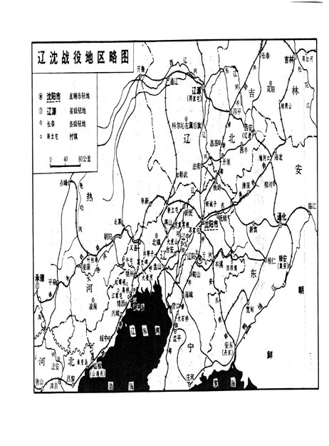

关于辽沈战役[^1]的作战方针

（一九四八年九月、十月）

这是毛泽东为中共中央军事委员会起草的给林彪、罗荣桓等的电报。毛泽东在这里提出的关于辽沈战役的作战方针，后来得到了完全的实现。辽沈战役的结果是：（一）歼敌四十七万人，加上当时人民解放军在其他各个战场上的胜利，就使人民解放军在数量上对于国民党军也转入了优势；（二）解放了东北全境，并为解放平津和全华北准备了前提；（三）人民解放军获得了进行大规模歼灭战的经验；（四）由于东北的解放，解放战争获得了战略上巩固的和具有一定工业基础的后方，党和人民获得了逐步转入经济恢复工作的有利条件。辽沈战役是中国人民解放战争中有决定意义的三个最大战役的第一个。其他两个是淮海战役和平津战役。这三大战役，共进行四个月零十九天，歼灭国民党军正规军一百四十四个师（旅），非正规军二十九个师，共一百五十四万余人。在这个期间，其他战场的人民解放军也都展开了进攻，歼灭了大量的敌人。在战争的头两年，人民解放军每月平均歼灭敌军八个旅左右。到了这时，人民解放军歼灭敌军的数目，已经不是平均每月八个旅，而是三十八个旅了。这三大战役，使国民党赖以发动反革命内战的精锐部队基本上归于消灭，大大加速了解放战争的全国胜利的到来。关于淮海战役和平津战役，见本卷《关于淮海战役的作战方针》、《关于平津战役的作战方针》两文。

## 一　九月七日的电报

我们准备五年左右（从一九四六年七月算起）根本上打倒国民党，这是具有可能性的[^2]。只要我们每年歼灭国民党正规军一百个旅左右，五年歼敌五百个旅左右，就能达到此项目的。过去两年我军共歼敌正规军一百九十一个旅，平均每年九十五个半旅，每月八个旅弱。今后三年要求我军歼敌正规军三百个旅以上。今年七月至明年六月，我们希望能歼敌正规军一百十五个旅左右。此数分配于各野战军和各兵团[^3]。要求华东野战军担负歼灭四十个旅左右（他们七月歼灭的七个旅在内），并攻占济南和苏北、豫东、皖北若干大中小城市。要求中原野战军担负歼灭十四个旅左右（七月已歼两个旅在内），并攻占鄂豫皖三省若干城市。要求西北野战军担负歼灭十二个旅左右（八月已歼一个半旅在内）。要求华北徐向前、周士第兵团歼灭阎锡山十四个旅左右（七月已歼八个旅在内），并攻占太原。要求你们配合罗瑞卿、杨成武两兵团担负歼灭卫立煌、傅作义两军三十五个旅左右（七月杨成武已歼一个旅在内），并攻占北宁、平绥、平承、平保各线除北平、天津、沈阳三点以外的一切城市。欲达此目的，战役部署指挥的适当，作战休息调节的适当，是决定性关键。你们如果能在九十两月或再多一点时间内歼灭锦州至唐山一线之敌，并攻克锦州、榆关、唐山诸点，就可以达到歼敌十八个旅左右之目的。为了歼灭这些敌人，你们现在就应该准备使用主力于该线，而置长春、沈阳两敌于不顾，并准备在打锦州时歼灭可能由长、沈援锦之敌。因为锦、榆、唐三点及其附近之敌互相孤立，攻歼取胜比较确实可靠，攻锦打援亦较有希望。如果你们以主力位于新民及其以北地区准备打长、沈出来之敌，则该敌因受你们威胁太大，可能不敢出来。一方面长、沈之敌可能不出来，另一方面锦、榆、唐诸点及其附近之敌（十八个旅）则因你们去的兵力过小，可能收缩于锦、唐两点，变为不甚好打而又不得不打，费时费力，这样就有可能使自己陷入被动地位。不如置长、沈两敌于不顾，专顾锦、榆、唐一头为适宜。再则，今年九月至明年六月的十个月内，你们要准备进行三次大战役，每次准备费去两个月左右时间，共费去六个月左右时间，余四个月作为休息时间。如果在你们进行锦、榆、唐战役（第一个大战役）期间，长、沈之敌倾巢援锦（因为你们主力不是位于新民而是位于锦州附近，卫立煌才敢于来援），则你们便可以不离开锦、榆、唐线连续大举歼灭援敌，争取将卫立煌全军就地歼灭。这是最理想的情况。于此，你们应当注意：（一）确立攻占锦、榆、唐三点并全部控制该线的决心。（二）确立打你们前所未有的大歼灭战的决心，即在卫立煌全军来援的时候敢于同他作战。（三）为适应上述两项决心，重新考虑作战计划并筹办全军军需（粮食、弹药、新兵等）和处理俘虏事宜。以上意见望考虑电复。

## 二　十月十日的电报

（一）从你们开始攻击锦州之日起，一个时期内是你们战局紧张期间，望你们每两日或每三日以敌情（锦州守敌之抵抗能力，葫芦岛、锦西援敌和沈阳援敌之进度，长春敌军之动态）我情（攻城进度，攻城和阻援之伤亡程度）电告我们一次。

（二）这一时期的战局，很有可能如你们曾经说过的那样，发展成为极有利的形势，即不但能歼灭锦州守敌，而且能歼灭葫、锦援敌之一部，而且能歼灭长春逃敌之一部或大部。如果沈阳援敌进至大凌河以北地区，恰当你们业已攻克锦州、使你们有可能转移兵力将该敌加以包围的话，那就也可能歼灭沈阳援敌。这一切的关键是争取在一星期内外攻克锦州。

（三）按照我军攻击锦州的进度和东西两路援敌的进度，决定阻援部署的方法。如果沈阳援敌进得较慢（如果长春之敌在你们攻锦过程中突围，并被我十二纵等部抓住歼击，则沈阳援敌可能被麻痹，进得较慢，或停止不进，或回头救援长春之敌），葫、锦援敌进得较快，则你们应准备以总预备队加入四纵、十一纵方面歼灭该敌一部，首先停止该敌之前进。如果葫、锦援敌被我四纵、十一纵等部所钳制和阻止而进得很慢或停止不进，长春之敌没有突围，沈阳援敌进得较快，而锦州之敌业已大部被歼，全城已接近于攻克，则你们应使沈敌深入大凌河以北，以便及时转移兵力包围该敌，然后徐图歼击。

（四）你们的中心注意力必须放在锦州作战方面，求得尽可能迅速地攻克该城。即使一切其他目的都未达到，只要攻克了锦州，你们就有了主动权，就是一个伟大的胜利。前面所说各点，只是希望你们予以相当的注意。尤其在锦州作战的头几天内，东西援敌不会大动，你们要用全部精力注于锦州方面之作战。

**注　　释**  

[^1]:辽沈战役，是一九四八年九月十二日至十一月二日中国人民解放军东北野战军在辽宁省西部和沈阳、长春地区同国民党军进行的一次具有决定意义的战役。战役前，国民党军在东北地区的总兵力有四个兵团，连同地方保安团队，共约五十五万人，分别收缩在长春、沈阳、锦州三个孤立地区。东北野战军集中主力十二个纵队、一个炮兵纵队和十七个独立师，连同地方武装共一百零三万人，在东北广大人民支援下，发起辽沈战役。北宁线上的锦州，是联结东北和华北的一个战略要点。防守锦州地区的国民党军开始时为东北“剿总”副总司令范汉杰指挥下的六个师，连同特种兵、后勤及地方部队约十万人，到九月下旬，国民党又空运一个师增援锦州。打下锦州是辽沈战役的关键。东北野战军根据中央军委的指示，以一个纵队和六个独立师、一个骑兵师、一个炮兵团继续围困长春；以五个纵队又一个师以及炮兵纵队主力、一个坦克营围攻锦州；以两个纵队配置于锦州西南的塔山、虹螺山一线，十一个师配置于彰武、新立屯以东地区，分别阻击由锦西、葫芦岛方向和沈阳方向救援锦州之敌；以一个纵队位于高桥地区为战役预备队。锦州地区的作战是从九月十二日开始的。正当人民解放军攻克义县，扫清锦州外围敌人时，蒋介石慌忙飞到东北亲自指挥，并急调北宁线华北“剿总”的五个师来援，连同原来在锦西的四个师，共九个师，于十月十日起开始向塔山阵地猛攻，但始终未能突破人民解放军阵地。廖耀湘兵团（国民党第九兵团）十一个师又三个骑兵旅由沈阳驰援锦州，被人民解放军阻击在彰武、新立屯地区。十月十四日人民解放军对锦州发起进攻，经过三十一小时激战，全歼该敌，俘虏敌东北“剿总”副总司令范汉杰、第六兵团司令卢濬泉以下约九万人。锦州的解放迫使长春敌人的一个军起义，其余全部投降。此时，东北国民党军全军覆灭的命运，已成定局。但蒋介石仍然梦想夺回锦州，打通关内外的联络，严令廖耀湘兵团继续向锦州前进。东北野战军在攻占锦州后，就立即向东北方面回师，从黑山、大虎山南北两翼合围廖耀湘兵团。十月二十六日将廖兵团包围于黑山、大虎山、新民地区，经两日一夜的激战，全部歼灭该敌，俘虏敌兵团司令廖耀湘，军长李涛、向凤武、郑庭笈以下十万余人。人民解放军乘胜追击，十一月二日解放沈阳、营口。至此，辽沈战役胜利结束，共歼灭敌人四十七万二千余人。锦西、葫芦岛地区的国民党军于十一月九日从海上撤向关内，东北全境获得解放。

[^2]: 五年左右根本上打倒国民党，这是当时的预计。后来，这个时间缩短为三年半左右。参见本卷《中国军事形势的重大变化》。

[^3]:一九四八年十一月一日中共中央军事委员会根据中共中央政治局九月会议的决定，把原各大战略区的部队划分为野战部队、地方部队和游击部队三类。将野战部队编为野战军。野战军以下辖兵团，兵团辖军（即原来的纵队），军辖师，师辖团。各野战军以其所在地区分为中国人民解放军西北野战军、中原野战军、华东野战军、东北野战军。各野战军所属兵团、军、师的数目，依各大战略区具体情况而定。后来，西北野战军改为第一野战军，辖两个兵团；中原野战军改为第二野战军，辖三个兵团；华东野战军改为第三野战军，辖四个兵团；东北野战军改为第四野战军，辖四个兵团。华北军区所辖的三个兵团，直属中国人民解放军总部。

