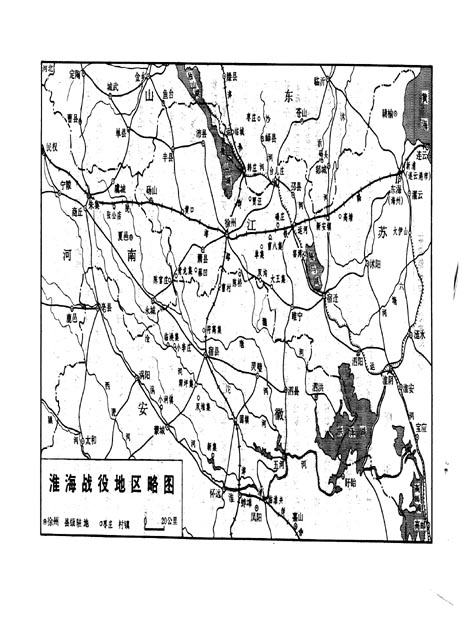

关于淮海战役的的作战方针

（一九四八年十月十一日）

>这是毛泽东为中共中央军事委员会起草的给华东野战军的电报。这个电报同时告知华东局和中原局。此后，全国局势发生了对中国人民解放军有利的急剧变化，中原野战军奉命东进徐州、蚌埠地区，由华东野战军、中原野战军和华东、中原的地方部队共同作战。战役发起后，毛泽东又为中央军委起草致华东野战军并告中原野战军的电报，下达在徐州附近歼灭国民党军刘峙集团主力的战役决心。于是，淮海战役发展成为中国人民解放战争中三个有决定意义的最大战役之一。这个战役共歼灭国民党军五十五万五千多人。毛泽东在这个电报中所提出的战役方针得到完全的成功，只是战役的发展比预计的更为顺利，因而胜利也比预计的更快更大。在这个战役以后，国民党反动政府的首都南京就处在人民解放军的直接威胁之下了。淮海战役在一九四九年一月十日结束，一月二十一日蒋介石即宣告“引退”，南京国民党反动统治集团从此陷入土崩瓦解的状态。

关于淮海战役[^1]部署，现在提出几点意见，供你们考虑。

（一）本战役第一阶段的重心，是集中兵力歼灭黄百韬兵团，完成中间突破，占领新安镇、运河车站、曹八集、峄县、枣庄、临城、韩庄、沭阳、邳县、郯城、台儿庄、临沂等地。为达到这一目的，应以两个纵队担任歼灭敌一个师的办法，共以六个至七个纵队，分割歼灭敌二十五师、六十三师、六十四师。以五个至六个纵队，担任阻援和打援。以一个至二个纵队，歼灭临城、韩庄地区李弥部一个旅，并力求占领临韩，从北面威胁徐州，使邱清泉、李弥两兵团不敢以全力东援。以一个纵队，加地方兵团，位于鲁西南，侧击徐州、商丘段，以牵制邱兵团一部（孙元良三个师现将东进，望刘伯承、陈毅、邓小平即速部署攻击郑徐线牵制孙兵团）。以一个至二个纵队，活动于宿迁、睢宁、灵壁地区，以牵制李兵团。以上部署，即是说要用一半以上兵力，牵制、阻击和歼敌一部，以对付邱李两兵团，才能达到歼灭黄兵团三个师的目的。这一部署，大体如同九月间攻济打援[^2]的部署，否则不能达到歼灭黄兵团三个师的目的。第一阶段，力争在战役开始后两星期至三星期内结束。

（二）第二阶段，以大约五个纵队，攻歼海州、新浦、连云港、灌云地区之敌，并占领各城。估计这时，青岛之五十四师、三十二师很有可能由海运增至海、新、连地区[^3]。该地区连原有一个师将共有三个师，故我须用五个纵队担任攻击，而以其余兵力（主力）担任钳制邱李两兵团，仍然是九月间攻济打援部署的那个原则。此阶段亦须争取于两个至三个星期内完结。

（三）第三阶段，可设想在两淮方面[^4]作战。那时敌将增加一个师左右的兵力（整八师正由烟台南运），故亦须准备以五个纵队左右的兵力去担任攻击，而以其余主力担任打援和钳制。此阶段，大约亦须有两个至三个星期。

三个阶段大概共须有一个半月至两个月的时间。

（四）你们以十一、十二两月完成淮海战役。明年一月休整[^5]。三至七月同刘邓协力作战，将敌打至江边各点固守。秋季你们主力大约可以举行渡江作战[^6]。

**注　　释**  

[^1]:毛泽东在起草这个电报的时候，对淮海战役确定的作战任务，主要是消灭国民党军刘峙集团主力的一部，开辟苏北战场，使山东、苏北打成一片。后来，由于局势发生变化，中原野战军东进与华东野战军会合，共同作战，淮海战役遂发展成为以徐州为中心，东起海州，西止商丘，北起临城（今薛城），南达淮河的广大地区同国民党军进行的一次决定性的战役。集结在上述地区的国民党军队有徐州“剿总”总司令刘峙、副总司令杜聿明指挥下的四个兵团和三个绥靖区部队，连同以后从华中增援的黄维兵团，共五个兵团和三个绥靖区部队。人民解放军参加这次战役的有华东野战军十六个纵队，中原野战军七个纵队，华东、中原军区和华北军区所属冀鲁豫军区的地方武装，共六十余万人。在淮海战役过程中，中央军委决定由刘伯承、陈毅、邓小平、粟裕、谭震林组成总前委，邓小平为书记，执行领导淮海前线军事和作战的职权。战役自一九四八年十一月六日开始到一九四九年一月十日结束，历时六十五天，共歼灭国民党军五十五万五千人，此外还击退了由南京方面来援的刘汝明、李延年两个兵团，基本上解放了长江以北的华东、中原地区。整个战役，共分三个阶段。第一阶段，从十一月六日到二十二日，人民解放军于徐州以东新安镇碾庄地区，围歼了黄百韬兵团（黄百韬毙命），解放了碾庄以东陇海路两侧和徐州以西以北广大地区，切断了津浦路徐（州）蚌（埠）段间国民党军的联系。国民党第三绥靖区所属三个半师，共二万三千人，在徐州东北的贾汪、台儿庄地区起义。第二阶段，从十一月二十三日到十二月十五日，人民解放军在宿县西南双堆集地区围歼了黄维兵团，生俘兵团司令官黄维、副司令官吴绍周。该兵团一个师起义。同时，华东野战军将由徐州西逃的杜聿明指挥下的邱清泉、李弥、孙元良三个兵团包围于永城东北的青龙集、陈官庄地区，随后歼灭了力图突围的孙元良兵团，孙元良只身潜逃。第三阶段，从一九四八年十二月十六日到一九四九年一月十日，人民解放军淮海前线部队首先进行了二十天的战场休整。从一九四九年一月六日起，对青龙集、陈官庄地区被围的国民党军发起总攻，全歼邱清泉、李弥两个兵团，生俘杜聿明，击毙邱清泉，只有李弥逃脱。至此，规模巨大的淮海战役胜利结束。

[^2]:攻济打援，是指一九四八年九月人民解放军在济南战役中所采取的作战方法。济南是津浦、胶济两铁路的交会点和连结华东、华北地区的战略要地，国民党以第二绥靖区的十万余人守备济南。同时，准备以配置在徐州地区的主力三个兵团，约十七万人，随时北援。为了以多数兵力歼灭援敌，以保证夺取济南，华东野战军以七个纵队，约十四万人，组成攻城集团，担负攻克济南的任务；以八个纵队，约十八万人，组成打援集团，随时准备阻击和歼灭沿津浦路北援的敌人。人民解放军于一九四八年九月十六日晚，对济南守敌发起攻击。经八昼夜连续攻击，于二十四日全歼守敌（内有二万余人起义），生俘国民党第二绥靖区司令官王耀武。由于人民解放军打援力量的强大和迅速达到攻济目的，徐州之敌未敢北援。

[^3]: 后来该敌没有敢来。

[^4]: 指淮阴、淮安一带。

[^5]: 一九六○年出版本卷第一版时，此处删去“二月西兵团转移”一句。

[^6]:毛泽东起草的这个电报，原共五点，这一段文字是其中的第五点。一九六○年出版本卷第一版时，删去了第四点，其原文为：“淮海战役的结果，将是开辟了苏北战场，山东苏北打成一片，邱李两兵团固守徐蚌一线及其周围，使我难于歼击。此时，你们仍应分为东西两兵团。以大约五个纵队组成东兵团，在苏北苏中作战。以其余主力为西兵团，出豫皖两省，协同刘邓，攻取菏泽、开封、郑州、确山、信阳、南阳、淮河流域及大别山各城。西兵团与刘邓协力作战的方法，亦是一部兵力打城，以主要兵力打援阻援，这样去各个歼敌。刘邓因为兵力不足，不能实现如像你们攻济打援战役及淮海战役那样的作战。你们西兵团去后，就可以实现那样的作战。六七两月开封睢杞战役就是西兵团与刘邓协力的结果。”

