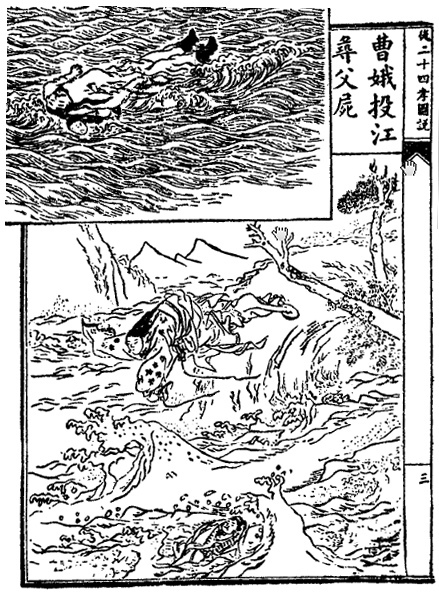
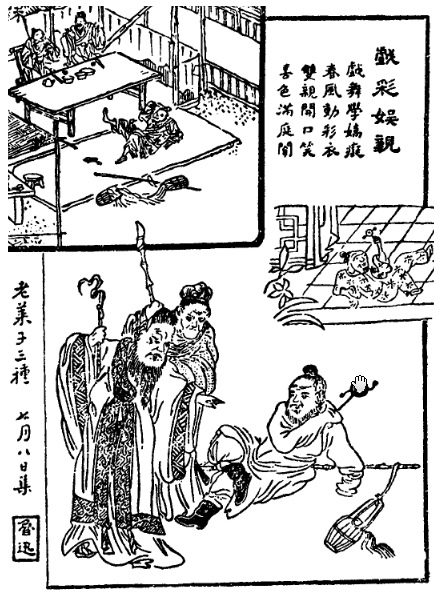
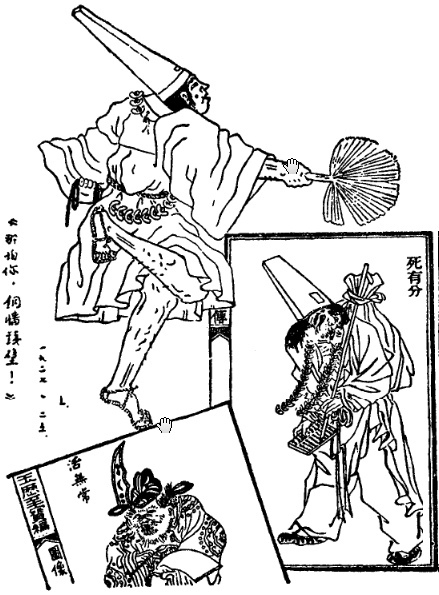
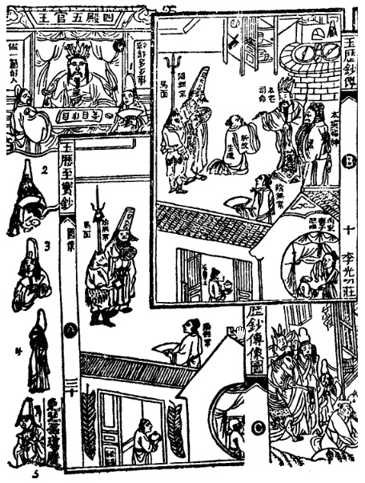

## 后记[^1]

　　我在第三篇讲《二十四孝》的开头，说北京恐吓小孩的“马虎子”应作“麻胡子”，是指麻叔谋，而且以他为胡人。现在知道是错了，“胡”应作“祜”，是叔谋之名，见唐人李济翁[^2]做的《资暇集》卷下，题云《非麻胡》。原文如次：

　　“俗怖婴儿曰：麻胡来！不知其源者，以为多髯之神而验刺者，非也。隋将军麻祜，性酷虐，炀帝令开汴河，威棱既盛，至稚童望风而畏，互相恐吓曰：麻祜来！稚童语不正，转祜为胡。只如宪宗朝泾将郝玭[^3]，蕃中皆畏惮，其国婴儿啼者，以玭怖之则止。又，武宗朝，闾阎孩孺相胁云：薛尹[^4]来！咸类此也。况《魏志》载张文远辽[^5]来之明证乎？”（原注：麻祜庙在睢阳。鄜方节度李丕即其后。不为重建碑。）

　　原来我的识见，就正和唐朝的“不知其源者”相同，贻讥于千载之前，真是咎有应得，只好苦笑。但又不知麻祜庙碑或碑文，现今尚在睢阳或存于方志中否？倘在，我们当可以看见和小说《开河记》所载相反的他的功业。

　　因为想寻几张插画，常维钧[^6]兄给我在北京搜集了许多材料，有几种是为我所未曾见过的。如光绪己卯（1879）肃州胡文炳作的《二百卌孝图》──原书有注云：“卌读如习。”我真不解他何以不直称四十，而必须如此麻烦──即其一。我所反对的“郭巨埋儿”，他于我还未出世的前几年，已经删去了。序有云：

　　“……坊间所刻《二十四孝》，善矣。然其中郭巨埋儿一事，揆之天理人情，殊不可以训。……炳窃不自量，妄为编辑。凡矫枉过正而刻意求名者，概从割爱；惟择其事之不诡于正，而人人可为者，类为六门。……”

　　这位肃州胡老先生的勇决，委实令我佩服了。但这种意见，恐怕是怀抱者不乏其人，而且由来已久的，不过大抵不敢毅然删改，笔之于书。如同治十一年（1872）刻的《百孝图》[^7]，前有纪常郑绩序，就说：

　　“……况迩来世风日下，沿习浇漓，不知孝出天性自然，反以孝作另成一事。且择古人投炉[^8]埋儿为忍心害理，指割股抽肠为损亲遗体。殊未审孝只在乎心，不在乎迹。尽孝无定形，行孝无定事。古之孝者非在今所宜，今之孝者难泥古之事。因此时此地不同，而其人其事各异，求其所以尽孝之心则一也。子夏曰：事父母能竭其力。故孔门问孝，所答何尝有同然乎？……”

　　则同治年间就有人以埋儿等事为“忍心害理”，灼然可知。至于这一位“纪常郑绩”先生的意思，我却还是不大懂，或者像是说：这些事现在可以不必学，但也不必说他错。

　　这部《百孝图》的起源有点特别，是因为见了“粤东颜子”的《百美新咏》[^9]而作的。人重色而己重孝，卫道之盛心可谓至矣。虽然是“会稽俞葆真兰浦编辑”，与不佞有同乡之谊，──但我还只得老实说：不大高明。例如木兰从军[^10]的出典，他注云：“隋史”。这样名目的书，现今是没有的；倘是《隋书》[^11]，那里面又没有木兰从军的事。

　　而中华民国九年（1920），上海的书店却偏偏将它用石印翻印了，书名的前后各添了两个字：《男女百孝图全传》。第一叶上还有一行小字道：家庭教育的好模范。又加了一篇“吴下大错王鼎谨识”的序，开首先发同治年间“纪常郑绩”先生一流的感慨：

　　“慨自欧化东渐，海内承学之士，嚣嚣然侈谈自由平等之说，致道德日就沦胥，人心日益浇漓，寡廉鲜耻，无所不为，侥幸行险，人思幸进，求所谓砥砺廉隅，束身自爱者，世不多睹焉。……起观斯世之忍心害理，几全如陈叔宝[^12]之无心肝。长此滔滔，伊何底止？……”

　　其实陈叔宝模胡到好像“全无心肝”，或者有之，若拉他来配“忍心害理”，却未免有些冤枉。这是有几个人以评“郭巨埋儿”和“李娥投炉”的事的。

　　至于人心，有几点确也似乎正在浇漓起来。自从《男女之秘密》《男女交合新论》出现后，上海就很有些书名喜欢用“男女”二字冠首。现在是连“以正人心而厚风俗”的《百孝图》上也加上了。这大概为因不满于《百美新咏》而教孝的“会稽俞葆真兰浦”先生所不及料的罢。

　　从说“百行之先”[^13]的孝而忽然拉到“男女”上去，仿佛也近乎不庄重，──浇漓。但我总还想趁便说几句，──自然竭力来减省。

　　我们中国人即使对于“百行之先”，我敢说，也未必就不想到男女上去的。太平无事，闲人很多，偶有“杀身成仁舍生取义”的，本人也许忙得不暇检点，而活着的旁观者总会加以绵密的研究。曹娥的投江觅父[^14]，淹死后抱父尸出，是载在正史[^15]，很有许多人知道的，但这一个“抱”字却发生过问题。

　　我幼小时候，在故乡曾经听到老年人这样讲：

　　“……死了的曹娥，和她父亲的尸体，最初是面对面抱着浮上来的。然而过往行人看见的都发笑了，说：哈哈！这么一个年青姑娘抱着这么一个老头子！于是那两个死尸又沉下去了；停了一刻又浮起来，这回是背对背的负着。”

　　好！在礼义之邦里，连一个年幼──呜呼，“娥年十四”而已──的死孝女要和死父亲一同浮出，也有这么艰难！

　　我检查《百孝图》和《二百卌孝图》，画师都很聪明，所画的是曹娥还未跳入江中，只在江干啼哭。但吴友如[^16]画的《女二十四孝图》（1892）却正是两尸一同浮出的这一幕，而且也正画作“背对背”，如第一图的上方。我想，他大约也知道我所听到的那故事的。还有《后二十四孝图说》，也是吴友如画，也有曹娥，则画作正在投江的情状，如第一图下。

　　就我现今所见的教孝的图说而言，古今颇有许多遇盗、遇虎、遇火、遇风的孝子，那应付的方法，十之九是“哭”和“拜”。

　　中国的哭和拜，什么时候才完呢？

　　至于画法，我以为最简古的倒要算日本的小田海仙本，这本子早已印入《点石斋丛画》里，变成国货，很容易入手的了。吴友如画的最细巧，也最能引动人。但他于历史画其实是不大相宜的；他久居上海的租界里，耳儒目染，最擅长的倒在作“恶鸨虐妓”，“流氓拆梢[^17]”一类的时事画，那真是勃勃有生气，令人在纸上看出上海的洋场来。但影响殊不佳，近来许多小说和儿童读物的插画中，往往将一切女性画成妓女样，一切孩童都画得像一个小流氓，大半就因为太看了他的画本的缘故。

　　而孝子的事迹也比较地更难画，因为总是惨苦的多。譬如“郭巨埋儿”，无论如何总难以画到引得孩子眉飞色舞，自愿躺到坑里去。还有“尝粪心忧”[^18]，也不容易引人入胜。还有老莱子的“戏彩娱亲”，题诗上虽说“喜色满庭帏”，而图画上却绝少有有趣的家庭的气息。

　　我现在选取了三种不同的标本，合成第二图。上方的是《百孝图》中的一部分，“陈村何云梯”画的，画的是“取水上堂诈跌卧地作婴儿啼”这一段。也带出“双亲开口笑”来。

　　中间的一小块是我从“直北李锡彤”画的《二十四孝图诗合刊》上描下来的，画的是“著五色斑斓之衣为婴儿戏于亲侧”这一段；手里捏着“摇咕咚”，就是“婴儿戏”这三个字的点题。但大约李先生觉得一个高大的老头子玩这样的把戏究竟不像样，将他的身子竭力收缩，画成一个有胡子的小孩子了。然而仍然无趣。至于线的错误和缺少，那是不能怪作者的，也不能埋怨我，只能去骂刻工。查这刻工当前清同治十二年（1873）时，是在“山东省布政司街南首路西鸿文堂刻字处”。下方的是“民国壬戌”（1923）慎独山房刻本，无画人姓名，但是双料画法，一面“诈跌卧地”，一面“为婴儿戏”，将两件事合起来，而将“斑斓之衣”忘却了。吴友如画的一本，也合两事为一，也忘了斑斓之衣，只是老莱子比较的胖一些，且绾着双丫髻，──不过还是无趣味。

　　人说，讽刺和冷嘲只隔一张纸，我以为有趣和肉麻也一样。孩子对父母撒娇可以看得有趣，若是成人，便未免有些不顺眼。放达的夫妻在人面前的互相爱怜的态度，有时略一跨出有趣的界线，也容易变为肉麻。老莱子的作态的图，正无怪谁也画不好。像这些图画上似的家庭里，我是一天也住不舒服的，你看这样一位七十岁的老太爷整年假惺惺地玩着一个“摇咕咚”。

　　汉朝人在宫殿和墓前的石室里，多喜欢绘画或雕刻古来的帝王、孔子弟子、列士、列女、孝子之类的图。宫殿当然一椽不存了；石室却偶然还有，而最完全的是山东嘉祥县的武氏石室[^19]。我仿佛记得那上面就刻着老莱子的故事。但现在手头既没有拓本，也没有《金石萃编》[^20]，不能查考了；否则，将现时的和约一千八百年前的图画比较起来，也是一种颇有趣味的事。

　　关于老莱子的，《百孝图》上还有这样的一段：

　　“……莱子又有弄雏娱亲之事：尝弄雏于双亲之侧，欲亲之喜。”（原注：《高士传》[^21]。）

　　谁做的《高士传》呢？嵇康的，还是皇甫谧的？也还是手头没有书，无从查考。只在新近因为白得了一个月的薪水，这才发狠买来的《太平御览》上查了一通，到底查不着，倘不是我粗心，那就是出于别的唐宋人的类书[^22]里的了。但这也没有什么大关系。我所觉得特别的，是文中的那“雏”字。

　　我想，这“雏”未必一定是小禽鸟。孩子们喜欢弄来玩耍的，用泥和绸或布做成的人形，日本也叫 Hina，写作“雏”。他们那里往往存留中国的古语；而老莱子在父母面前弄孩子的玩具，也比弄小禽鸟更自然。所以英语的 Doll，即我们现在称为“洋囡囡”或“泥人儿”，而文字上只好写作“傀儡”的，说不定古人就称“雏”，后来中绝，便只残存于日本了。但这不过是我一时的臆测，此外也并无什么坚实的凭证。

　　这弄雏的事，似乎也还没有人画过图。

　　我所搜集的另一批，是内有“无常”的画像的书籍。一曰《玉历钞传警世》（或无下二字），一曰《玉历至宝钞》（或作编）。其实是两种都差不多的。关于搜集的事，我首先仍要感谢常维钧兄，他寄给我北京龙光斋本，又鉴光斋本；天津思过斋本，又石印局本；南京李光明庄本。其次是章矛尘[^23]兄，给我杭州玛瑙经房本，绍兴许广记本，最近石印本。又其次是我自己，得到广州宝经阁本，又翰元楼本。

　　这些《玉历》，有繁简两种，是和我的前言相符的。但我调查了一切无常的画像之后，却恐慌起来了。因为书上的“活无常”是花袍，纱帽，背后插刀；而拿算盘，戴高帽子的却是“死有分”！虽然面貌有凶恶和和善之别，脚下有草鞋和布（？）鞋之殊，也不过画工偶然的随便，而最关紧要的题字，则全体一致，曰：“死有分”。呜呼，这明明是专在和我为难。

　　然而我还不能心服。一者因为这些书都不是我幼小时候所见的那一部，二者因为我还确信我的记忆并没有错。不过撕下一叶来做插画的企图，却被无声无臭地打得粉碎了。只得选取标本各一 ──南京本的死有分和广州本的“活无常”──之外，还自己动手，添画一个我所记得的目连戏或迎神赛会中的“活无常”来塞责，如第三图上方。好在我并非画家，虽然太不高明，读者也许不至于嗔责罢。先前想不到后来，曾经对于吴友如先生辈颇说过几句蹊跷话，不料曾几何时，即须自己出丑了，现在就预先辩解几句在这里存案。但是，如果无效，那也只好直抄徐（印世昌）大总统的哲学：听其自然[^24]。

　　还有不能心服的事，是我觉得虽是宣传《玉历》的诸公，于阴间的事情其实也不大了然。例如一个人初死时的情状，那图像就分成两派。一派是只来一位手执钢叉的鬼卒，叫作“勾魂使者”，此外什么都没有；一派是一个“马面”，两个“无常”──“阳无常”和“阴无常”──而并非“活无常”和“死有分”。倘说，那两个就是“活无常”和“死有分”罢，则和单个的画像又不一致。如第四图版上的Ａ，“阳无常”何尝是花袍纱帽？只有“阴无常”却和单画的“死有分”颇相像的，但也放下算盘拿了扇。这还可以说大约因为其时是夏天，然而怎么又长了那么长的络腮胡子了呢？难道夏天时疫多，他竟忙得连修刮的工夫都没有了么？这图的来源是天津思过斋的本子，合并声明；还有北京和广州本上的，也相差无几。

　　Ｂ是从南京的李光明庄刻本上取来的，图画和Ａ相同，而题字则正相反了：天津本指为“阴无常”者，它却道是“阳无常”。但和我的主张是一致的。那么，倘有一个素衣高帽的东西，不问他胡子之有无，北京人，天津人，广州人只管去称为“阴无常”或“死有分”，我和南京人则叫他“活无常”，各随自己的便罢。“名者，实之宾也”[^25]，不关什么紧要的。

　　不过我还要添上一点Ｃ图，是绍兴许广记刻本中的一部分，上面并无题字，不知宣传者于意云何。我幼小时常常走过许广记的门前，也闲看他们刻图画，是专爱用弧线和直线，不大肯作曲线的，所以无常先生的真相，在这里也难以判然。只是他身边另有一个小高帽，却还能分明看出，为别的本子上所无。这就是我所说过的在赛会时候出现的阿领。他连办公时间也带着儿子（？）走，我想，大概是在叫他跟随学习，预备长大之后，可以“无改于父之道”[^26]的。

　　除勾摄人魂外，十殿阎罗王中第四殿五官王的案桌旁边，也什九站着一个高帽脚色。如Ｄ图，１取自天津的思过斋本，模样颇漂亮；２是南京本，舌头拖出来了，不知何故；３是广州的宝经阁本，扇子破了；４是北京龙光斋本，无扇，下巴之下一条黑，我看不透它是胡子还是舌头；５是天津石印局本，也颇漂亮，然而站到第七殿泰山王的公案桌边去了：这是很特别的。

　　又，老虎噬人的图上，也一定画有一个高帽的脚色，拿着纸扇子暗地里在指挥。不知道这也就是“无常”呢，还是所谓“伥鬼”[^27]？但我乡戏文上的“伥鬼”都不戴高帽子。

　　研究这一类三魂渺渺，七魄茫茫，“死无对证”的学问，是很新颖，也极占便宜的。假使征集材料，开始讨论，将各种往来的信件都编印起来，恐怕也可以出三四本颇厚的书，并且因此升为“学者”。但是，“活无常学者”，名称不大冠冕，我不想干下去了，只在这里下一个武断：

　　《玉历》式的思想是很粗浅的：“活无常”和“死有分”，合起来是人生的象征。人将死时，本只须“死有分”来到。因为他一到，这时候，也就可见“活无常”。

　　但民间又有一种自称“走阴”或“阴差”的，是生人暂时入冥，帮办公事的脚色。因为他帮同勾魂摄魄，大家也就称之为“无常”；又以其本是生魂也，则别之曰“阳”，但从此便和“活无常”隐然相混了。如第四图版之Ａ，题为“阳无常”的，是平常人的普通装束，足见明明是阴差，他的职务只在领鬼卒进门，所以站在阶下。

　　既有了生魂入冥的“阳无常”，便以“阴无常”来称职务相似而并非生魂的“死有分”了。

　　做目连戏和迎神赛会虽说是祷祈，同时也等于娱乐，扮演出来的应该是阴差，而普通状态太无趣，──无所谓扮演，──不如奇特些好，于是就将“那一个无常”的衣装给他穿上了；──自然原也没有知道得很清楚。然而从此也更传讹下去。所以南京人和我之所谓活无常，是阴差而穿着死有分的衣冠，顶着真的活无常的名号，大背经典，荒谬得很的。

　　不知海内博雅君子，以为何如？

　　我本来并不准备做什么后记，只想寻几张旧画像来做插图，不料目的不达，便变成一面比较、剪贴，一面乱发议论了。那一点本文或作或辍地几乎做了一年，这一点后记也或作或辍地几乎做了两个月。天热如此，汗流浃背，是亦不可以已乎：爰为结。

　　一九二七年七月十一日，写完于广州东堤寓楼之西窗下。

【注释】

[^1]:本篇最初发表于一九二七年八月十日《莽原》半月刊第二卷第十五期。

[^2]:李济翁：名匡文，他著的《资暇集》共三卷，是一部考证古物、记述史事的书。

[^3]:郝玭：《旧唐书》作郝玼，唐贞元、元和年间，为临泾（今甘肃镇元）镇将（后升为刺史）。据《旧唐书·郝玼传》载，“玼……在边三十年，每战得蕃俘，必刳剔而归其尸，蕃人畏之如神。……蕃中儿啼者，呼玼名以怖之。”蕃，指当时青藏高原的少数民族。

[^4]:薛尹：指薛元赏，唐武宗会员年间，曾任京兆尹。据《新唐书·薛元赏传》载：“元赏到府三日，收恶少，杖死三十余辈，陈诸市。”

[^5]:张文远辽：张辽（169─222），字文远，三国雁门马邑（今山西朔县）人。曹操部将，屡建战功。建安二十年（215）孙权攻合肥，他率敢死士八百人大破权军，名震江东。

[^6]:常维钧：名惠，字维钧，河北宛平（今北京丰台区）人。北京大学法文系毕业，曾任北大《歌谣》周刊编辑。  
    　　胡文炳：甘肃肃州（今酒泉人），清道光二十九年（1849）拔贡，曾任湖南湘乡知县。

[^7]:《百孝图》：即《百孝图说》，清代俞葆真编辑，俞泰绘图，共五卷，另附诗一卷。

[^8]:投炉：三国时吴国李娥的故事。《太平御览》卷四一五引《纪闻》说：“娥父吴大帝时为铁官冶，以铸军器；一夕炼金，竭炉而金不出。时吴方草创，法令至严，诸耗折官物十万，即坐斩；倍又没入其家，而娥父所损折数过千万。娥年十五，痛伤之，因火烈，遂自投于炉中，赫然烛天。于是金液沸涌，溢于炉口，娥所蹑二履浮出于炉，身则化矣。”

[^9]:《百美新咏》：清代乾隆时广东颜希源编著的诗画集，内收关于古代美女潘妃、窅娘等百人的诗和画像。分《新咏》《图传》《集咏》三部分。《新咏》是颜希源自己的题咏，每人一首；《图传》即画像；《集咏》是收集前人题咏潘妃等的诗篇。

[^10]:木兰从军：木兰代父从军的故事，见北朝时民间产生的《木兰诗》，不见于“正史”。

[^11]:《隋书》：纪传体隋代史，唐代魏征等编撰，共八十五卷。

[^12]:陈叔宝：南朝时的陈后主。《南史·陈本纪》：“（陈叔宝）既见宥，隋文帝给赐甚厚，数得引见，班同三品；每预宴，恐致伤心，为不奏吴音。后监守者奏言：‘叔宝云，“既无秩位，每预朝集，愿得一官号。”’隋文帝曰：‘叔宝全无心肝。’”

[^13]:“百行之先”：语出《旧唐书·刘君良附宋兴贵传》所引唐高祖诏：“士有百行，孝敬为先。”

[^14]:曹娥的投江觅父：曹娥事见于《后汉书·孝女曹娥传》：“孝女曹娥者，会稽上虞人也。父盱，能弦歌，为巫祝。汉安二年五月五日，于县江藘涛婆娑迎神，溺死，不得尸骸。娥年十四，乃沿江号哭，昼夜不绝声，旬有七日，遂投江而死。”在三国魏邯郸淳作的《曹娥碑》文中才有曹娥“经五日抱父尸出”的话。

[^15]:正史：历代封建王朝组织编写或认可的史书。清高宗（乾隆）时规定从《史记》到《明史》共二十四部史书为“正史”。

[^16]:吴友如（？─约1893）：名猷（又作嘉猷），字友如，江苏元和（今吴县）人，清末画家。他先在苏州画年画，后到上海主绘《点石斋画报》，并为许多小说作绣像，曾汇印有作品集《吴友如画宝》。

[^17]:拆梢：上海方言，指流氓敲诈行为。

[^18]:“尝粪心忧”：梁代庾黔娄的故事。见《梁书·庾黔娄传》，庾黔娄的父亲庾易病重时，“医云：‘欲知差（瘥）剧，但尝粪甜苦。’易泄痢，黔娄辄取尝之”。

[^19]:武氏石室：指东汉武氏家族墓葬的四个石室，四壁有石刻画像，其中以武梁祠为最早，故一般称《武梁祠画像》。

[^20]:《金石萃编》：清代王昶编，共一六〇卷。辑录夏、商、周至宋末的金石文字一千五百余件，《武梁祠画像》也收入在内。

[^21]:《高士传》：晋代皇甫谧撰，共三卷。记录上古至魏晋高士九十六人。据南宋李石《续博物志》，皇甫原书记述高士七十二人，今本系后人抄录《太平御览》所引嵇康《高士传》《后汉书》等增益而成。

[^22]:类书：辑录各门类或某一门类的资料，以供寻检、征引的工具书。通常分类编排，也有用分韵、分字等方法编排的。

[^23]:章矛尘：名廷谦，笔名川岛，浙江绍兴人。著有《和鲁迅相处的日子》等。

[^24]:徐世昌（1855─1939）：字菊人，天津人。清宣统时任内阁协理大臣，一九一八年至一九二二年任北洋政府总统。他是一个老于世故的圆滑的官僚，“听其自然”是他常说的处世方法的一句话。

[^25]:“名者，实之宾也”：语见《庄子·逍遥游》。这里的意思是说，事物的本身是主要的，名称是从属的。

[^26]:“无改于父之道”：语见《论语·学而》：“三年无改于父之道，可谓孝矣。”

[^27]:“伥鬼”：旧时迷信传说，人被虎吃掉后，其“鬼魂”反助虎吃人，称为“虎伥”或“伥鬼”。成语“为虎作伥”即源于此。
