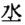
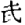
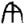
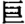

## 《吕超墓志铭》跋[^1]

　　吕超墓志石[^2]，于民国六年出山阴兰上[^3]乡。余从陈君古遗[^4]得打本[^5]一枚，以漫患难读，久置箧中。明年，徐吕孙[^6]先生至京师，又与一本，因得校写。其文仅存百十余字，[^7]国号年号俱泐，无可冯证。唯据郡名及岁名考之，疑是南齐永明中刻也。按随国，晋武帝分义阳立，[^8]宋齐为郡，隋为县。此云隋郡，当在隋前。南朝诸王分封于随者，惟宋齐有之。此云隋郡王国，则又当在梁陈以前。《通鉴目录》[^9]，宋文帝元嘉六年，齐武帝永明七年，并太岁在己巳。《宋书》[^10]《文帝纪》，元嘉二十六年冬十月，广陵王诞改封随郡王。又《顺帝纪》，升明二年十二月，改封南阳王翙为随郡王，改随阳郡。其时皆在己巳后。《南齐书》[^11]《武帝纪》，建元四年六月，进封枝江公子隆[^12]为随郡王。子隆本传云，永明三年为辅国将军，南琅琊彭城二郡太守，明年迁江州刺史，未拜，唐寓之[^13]贼平，迁为持节，督会稽东阳新安临海永嘉五郡东中郎将，会稽太守。《祥瑞志》云：“永明五年，山阴县孔广家园柽树十二层，会稽太守随王子隆献之”，与传合。子隆尝守会稽，则其封国之中军，因官而居山阴，正事理所有。故此己巳者，当为永明七年，而五月廿五为卒日。□一年者，十一年。《通鉴目录》，永明十一年十月戊寅，十二月丁丑朔，则十一月为戊申朔，丙寅为十九日，其葬日也。和帝[^14]为皇子时，亦封随郡王，于时不合。唐开元十八年[^15]己巳，二十一年十一月丙寅朔，与志中之□一年冬十一月丙寅颇近，然官号郡名，无不格迕，若为迁窆，则年代相去又过远，殆亦非矣。永明中，为中军将军见于纪传者，南郡王长懋，王敬则，阴智伯，庐陵王子卿。此云刘□[^16]，泐其名，无可考。“□志风烈者云”以下无字。次为铭辞，有字可见者四行，其后余石尚小半。六朝志例，铭大抵不溢于志，或当记妻息名字，今亦俱泐。志书“随”为“隋”，罗泌云，随文帝恶随从辵改之。[^17]王伯厚亦讥帝不学。[^18]后之学者，或以为初无定制，或以为音同可通用，至征委蛇委随作证。今此石远在前，已如此作，知非随文所改。《隶释》《张平子碑颂》，有“在珠咏隋，于璧称和”语[^19]。隋字收在刘球《隶韵》[^20]正无辵，则晋世已然。作随作隋作阢，止是省笔而已。东平本兖州所领郡，宋末没于魏，《南齐书》《州郡志》言永明七年，因光禄大夫吕安国[^21]启立于北兖州。启有云“臣贱族桑梓，愿立此邦”，则安国与超盖同族矣。与石同出垅中者，尚有瓦罂铜竟各一枚。竟有铭云“郑氏作镜幽涑三商幽明镜”十一字，篆书，俱为谁何毁失。附识于此，使后有考焉。

[^1]:本篇据手稿编入，原无标点。据《鲁迅日记》，当写于一九一八年六月十一日。此文曾发表于一九一八年六月二十五日《北京大学日刊》第一七一号“文艺”栏，题为《新出土吕超墓志铭考证》，署名周树人。一九一九年又曾印入顾鼎梅编刊的《吕超墓志拓片专集》，题为《南齐《吕超墓志〉跋》，末署“绍兴周树人跋”。

[^2]:吕超墓志石：出土于一九一六年（民国五年）十二月，原石“超”字之下有“静”字残画可辨，当定名为《吕超静墓志石》。  
    　　《鲁迅日记》一九二三年六月八日，一九二四年八月二十二日，分别有购得《吕超静墓志》拓本的记载。按一九一七年绍兴张拯亢曾对此石作过考证，误断为隋炀帝大业五年（609）物。

[^3]:兰上：绍兴西南的兰亭。《水经·渐江水注》：“兰亭，亦曰兰上里”。吕超墓志石的出土地点灰灶头村在兰亭以西约二里。

[^4]:陈古遗（1875─1943）：字伯翔（又作伯祥），号古遗，浙江绍兴人。越社、氮社社员。曾任绍兴府中学堂、绍兴浙江省立第五师范学校教员，《浙事新闻报》《越铎日报》编辑。著有《中国历代郡县分类考》等。

[^5]:打本：即拓片。语见唐代窦泉《述书赋》注。

[^6]:徐以孙：名维则，字贻孙，浙江绍兴会稽人，金石收藏家、目录学家。当时在北京大学附属国史编纂处工作。著有《东西学书录》《石墨毖碎锦》等。《鲁迅日记》一九一八年六月二日：“午后得徐以孙信并《吕超墓志》拓片一枚。”

[^7]:鲁迅校写的《吕超墓志》释文曾发表于一九一八年六月二十四日《北京大学日刊》第一七〇号“文艺”栏，全文如下：  
    　　□□□墓志□  
    　　□故龙骧将军隋郡王国中军吕府君讳超□□□  
    　　□□东平人也胄兴自姜奄有营业飞芳□□□□  
    　　□□□□□□因官即邦今居会稽山阴□□□□  
    　　□□□□□□起令誉早宣故孝弟出□□□□□  
    　　□□□□□□□风猷日新而脩[豆寸]有□□□□□  
    　　□□□□□□岁在己巳夏五月廿五□□□□□  
    　　□□□□□□一年冬十一月丙寅□□□□□□  
    　　□□□□□□同糸中军将军刘□□□□□□□  
    　　□□□□□金石□志风烈者云  
    　　□□□□蔼蔼清猷白云□岫素□□□□□□□  
    　　□□□□嘉□如□应我□□□□□□□□□□  
    　　□□□□□□其區眷言□□□□□□□□□□  
    　　□□□□□□蕙□□□□□□□□□□□□□  
    　　□□□□□□夕悄松□□□□□□□□□□□

[^8]:按晋武帝当系惠帝之误，《晋书·地理志下》：“惠帝……分义阳立随郡。”

[^9]:《通鉴目录》：即《资治通鉴目录》，是《资治通鉴》的提要，北宋司马光著，三十卷。

[^10]:《宋书》：南朝宋史，南朝梁沈约编撰，一百卷。下文的广陵王诞，即宋文帝第六子刘诞；南阳王翙，即宋明帝第六子刘。按升明二年十二月，当为十一月。

[^11]:《南齐书》：南朝齐史，南齐萧子显编撰，五十九卷

[^12]:子隆：即萧子隆（474─494），字云兴，南齐武帝第八子。齐高帝建元四年（482）至武帝永明八年（490）间为随郡王。

[^13]:唐寓之（？─486）：南齐富阳（今浙江富阳）人，农民起义领袖。永明三年（485）起兵反齐，次年攻占钱塘（今浙江杭州）称帝，国号吴。同年兵败被杀。

[^14]:和帝：即萧宝融（488─502），南齐高帝第八子，于建武元年（494）受封随郡王。

[^15]:唐开元十八年：按唐开元十八年为庚午，己巳当为开元十七年。

[^16]:刘□：范鼎卿据《吕超墓志》精拓本“刘”字下有“玄”字残划可辨，并引证《南史》，认为此人系“刘玄明，临淮人，为山阴令”，“其时玄明已任中军将军，未几殆即改官司农矣。”（见顾燮光《梦碧簃石言》所收范跋）按《南史·循吏传》仅载刘玄明“终于司农卿”，未见任中军将军的记载。

[^17]:罗泌：字长源，宋代庐陵（今属江西）人。著有《路史》四十七卷。该书卷三十五：“隨之文帝恶之从辵，乃去其辵，以为隋，不知隋自音妥；隋者尸祭鬼神之物也。”据《困学纪闻》清代翁元圻辑注本卷十三“隨恶辵改隋”条“集证”：“罗泌《路史》：隨文帝恶隨从辵，改为隋。”按四库全书本《路史》不见有此记载。

[^18]:王伯厚（1223─1296）：名应麟，庆元（今浙江宁波）人，宋代学者。理宗淳祐进士官至礼部尚书，后去官从事著述。著有《困学纪闻》二十卷。该书卷十三“隨恶辵改隋”条：“徐楚金《说文系传》云，‘隨文帝恶隨字为辵，乃去之，成隋字。’隋，列肉也，其不祥大焉。殊不知隨从辵：辵，安步也，……而妄去之，岂非不学之故！”

[^19]:《隶释》：宋代洪适编，二十七卷，是集录汉、魏石刻文字的专书。《张平子碑颂》，晋代夏侯湛撰，见《隶释》卷十九。张平子即东汉科学家张衡，“在珠咏隋，于璧称和”是对他的赞词。隋，指隋侯珠；和，指和氏璧。

[^20]:《隶韵》：字书，宋代刘球著，十卷。钩摹宋代以前出土汉碑隶字，按韵分类。《张平子碑颂》的隋字收入该书卷一“五支”部。

[^21]:吕安国（426─490）南齐广陵（今江苏扬州）人。官义阳太守、平北将军兼南兖州刺使。他曾启请在南齐侨置的北兖州设置东平侨郡。  

〔附文〕  

## 〇 吕超墓出土吴郡郑蔓镜考[^1-1]

　　右竟出山阴兰上乡吕超墓中，墓有铭，尝得墨本二枚，国号纪元俱泐。以其官随郡王国中军，又有己巳字，因定为齐永明十一年十一月葬。竟则止闻铭辞云是“郑氏作镜幽涷三商幽明镜”十一字，篆书，不能得墨本。六月中，中弟起明[^2-1]归会稽，遂见此竟，告言径建初尺[^3-1]四寸四分，质似铅，已裂为九，又失其二，然所阙皆华饰，而文字具在。未几，手拓见寄。铭有二层，与所传者绝异，文句譌夺，取他竟铭校之，始知大较。外层云：“五月五日，大岁在未。吴□郑蔓作其镜，幽涷三商，周刻禺彊，白，众神容”，凡卅字。内层云：
　　“吾作明幽竟蓑三商周”，凡十字。上虞罗氏《古镜图录》[^4-1]收金山程氏所藏一竟，文字略同，末云：“众神见容天禽”，较此多三字，而句亦未尽。他竟尚有作“天禽四守”者也。古人铸冶，多以五月丙午日，虞喜《志林》[^5-1]谓“取纯火精以协其数”（《初学记》廿二引）[^6-1]。今所见汉魏竟，带句，帐构铜[^7-1]，凡勒年月者，大率云五月丙午日作；而五日顾未闻宜铸，唯索缕，采药，辟兵，却病之事，兴作甚多。后世推类，或并以造竟。家所臧唐代小镜一枚，亦云五月五日午时造，则此事当始于晋，至唐犹然。大岁在未，在字反左书，未年亦不知何年，“未”又似“戊午”或丙午，“”或作“”，得转譌如未，所未详也。吴下一字，仅存小半，程氏臧竟作“”，罗氏题为“吴郡郑蔓镜”。吴越接壤，便于市卖，所释当塙。郡字并亦反左书，郑又如帱，蔓又似“”，皆譌变。幽涷三商者，《关中金石记》尝以《仪礼》郑注“日入三商为昏”语释永康竟铭，然孔疏云，“商谓商量”，是刻漏名，则亦无与竟事。[^8-1]《墨林快事》[^9-1]以为三金，于义最协。他竟或云幽涷宫商，或云合涷白黄。宫为土，商为金[^10-1]，金白土黄；竟则丹扬善铜，殽以银锡，其类三　其色黄白；幽殽声近相通，涷，水名，乃湅之误，湅又叚[^11-1]为煉；殽煉三金，犹云合涷白黄，亦即幽涷宫商矣。

　　禺彊者，《山海经》[^12-1]云：“北方禺彊，人面鸟身。”郭注：“字玄冥，水神也。”竟之为物，仪形曜灵[^13-1]，月为水精，故刻禺彊。禺字上有羡画[^14-1]，他竟或譌成万。又有云“周刻罔象[^15-1]”者，罔象亦水精，与此同意。白即伯牙[^16-1]，建安竟[^17-1]铭有“白单”语，徐氏同柏[^18-1]云：“未详”。今按彼为伯牙弹琴，而此“”字尤缪，唯迹象可据寻究。“”颇似樂饗，殆亦單琴之误也。据程氏竟，神容二字间，当敚[^19-1]见字，见容即见形矣。末三句十一字，并颂雕文刻镂之美。而竟止作四神人，乘异兽，其二今阙。又有四乳，具存。内层之“”亦吾字　笔画不完，遂与予字相似。“”亦幽也，他竟多如此作。此铭在汉，当有全文，施之巨竟。后来屡经转刻，夺落舛误，弥失其初，遂至不可诵说。余以此竟出于故乡，铭文又不常见，长夏索居，辄加审释，虽多所穿凿，终亦不能尽通，聊记所获，以备忘失。又闻越竟铅泉，时或出土，而铅竟甚为希有；盖铅锡事本非宜，而此则窀夕所用，故犹刍灵木寓[^20-1]，象物斯足，不复幽涷三商与。中华民国七年七月廿九日记。

[^1-1]:本篇据手稿编入，原无标题，有句读。郑蔓，汉代吴郡（治所在今江苏苏州）著名铸镜人，后人造镜多假托其名。

[^2-1]:起明：即周作人（1885─1967），号起孟，又作启孟、起明、启明，鲁迅的二弟。曾在绍兴浙江省立第五中学、北京大学、北京女子师范大学等校任教。抗日战争期间曾出任伪华北政务委员会教育总署督办。一九一八年六月他从北京回绍兴省亲，通过陈古遗得到吴郡郑蔓镜拓本，于七月二十五日寄鲁迅二枚，八月十六日又寄四枚。

[^3-1]:建初尺：参看本卷第56页注[2]。

[^4-1]:罗氏：即罗振玉（1886─1940），字叔蕴、叔言，号雪堂，浙江上虞人，金石学家。清末曾任学部参事等职，民国后以清遗老自居，后任伪满洲国监察院长。《古镜图录》，三卷，共收古镜拓片一五九枚。金山程氏所藏镜，见该书卷中第二十九面，外层铭文可辨“五月五日大岁在未吴郡郑蔓作其□□涷三商白神见容天禽”等字；内层铭文为“吾作明幽竟涷三商周□”十字。

[^5-1]:虞喜（281─356）：字仲宁，余姚（今属浙江）人，晋代学者。《志林》，《隋书·经籍志》著录三十卷，已佚。明代陶宗仪《说郛》、清代马国翰《玉函山房辑佚书》中均有辑本；鲁迅亦有辑校本一卷，未刊行。

[^6-1]:“取纯火精以协其数”：意思是取干支都属火的月、日进行冶炼，以符合阴阳五行的术数。此说本于汉代王充《论衡·乱龙》：“阳燧取火于天，五月丙午日中之时，消炼五石，铸以为器，乃能得火。”后来无论是否在五月丙午日铸器，铭文往往皆作“五月丙午”。《初学记》，类书，唐代徐坚等编，三十卷。

[^7-1]:带句：衣带钩。句，通钩。帐构铜，古时帐幕上用以结构木架的铜件。

[^8-1]:《关中金石记》金石考古集，清代毕沅著，八卷。按这里的《关中金石记》系《中州金石记》之误。《中州金石记》亦为毕沅所著，五卷。其卷一“永康镜铭”条解释汉桓帝永康元年（167）所铸铜镜铭文中的“幽涷三商”一语说：“郑康成注《仪礼》云：日入三商为昏。孔颖达蔬：商为商量，是漏刻之名。”《仪礼》，我国古代专记礼制仪式的儒家经典，毕沅上述引语，见于该书第二章“士昏礼”题下注疏，疏者为唐代贾公彦；非孔颖达。郑康成（127─200），名玄，字康成，北海高密（今属山东）人，东汉经学家。孔颖达（574─648），字冲远，衡水（今属河北）人，唐代经学家。

[^9-1]:《墨林快事》：古器物、书画跋语集，明代安世凤著，十二卷。卷二有“三商者，商，金也：银、锡、铜也。一釜而和之，故曰幽炼”等语。又有“汉有善铜出丹阳”的记载，丹阳同丹扬。

[^10-1]:宫为土，商为金：古代音乐有宫、商、角、徵、羽五声，古人认为它们同土、金、木、火、水五行有对应关系。

[^11-1]:叚：同假，借。

[^12-1]:《山海经》：十八卷，约公元前四世纪至二世纪间的作品，主要记述我国古代神话传说中的山水、地理、方物等。晋代郭璞曾为之作注。禺彊的故事见该书《海外北经》。

[^13-1]:曜灵：屈原《天问》：“角宿未旦，曜灵安藏？”姜亮夫注：“戴震云：‘……曜灵，月也。’”

[^14-1]:羡画：多出的笔画。

[^15-1]:罔象：《史记·孔子世家》：“水之怪，龙、罔象。”

[^16-1]:伯牙：相传为春秋时人，善弹古琴。

[^17-1]:建安竟：东汉献帝建安十年（205）铸，原为金山程氏收藏。其铭文为：“吾作明镜幽涷三商周卫罔象五帝天皇三單黄帝除凶朱鸟玄武白虎青龙君宜高官子孙番昌建安十年造大吉君宜□君宜□”。

[^18-1]:徐同柏：字籀庄，浙江嘉兴人，清代金石学者。著有《从古堂款识学》。他对建安镜的考释文字，见罗振玉《古镜图录》卷上第五面。

[^19-1]:敚：夺的古字。

[^20-1]:刍灵木寓：旧时送葬用的草扎或木制的人畜。寓，通偶。
