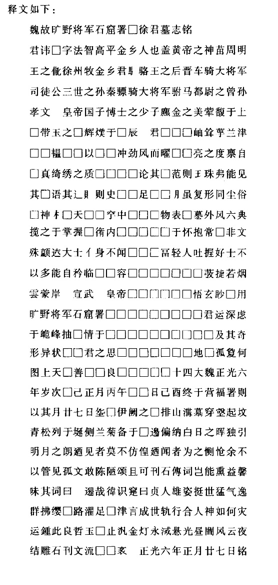

## 《徐法智墓志》考[^①]

　　志，其名惟云“字法智，高平金乡人也”；姓在首行，存下半，似徐字。《元和姓纂》[^②]有东阳徐氏，云“偃王之后，汉徐衡徙高平，孙饶又徙东阳”，则法智似即其后。惟又云“徐州牧，金乡君骆王之后，晋车骑大将军司徒公三世之孙，秦骠骑大将军驸马都尉之曾孙，孝文皇帝国子博士之少子”，所举先世诸官，求之史书，乃无一高平徐氏，所未详也。次多剥蚀，大略述其平生笃于佛教，中有“□冨轻人”语。“轻人”，非美德，当有误字。次云“宣武皇帝（泐六字）”，“悟玄眇□用旷野将军石窟署（泐九字）”，“君运深虑于峗峰抽□情于□□”。又云“及其奇形异状□□君之思□”。又云正光六年正月□□日“终于营福署则以其月廿七日□伊阙之□”。按《魏书·释老志》：“景明初，世宗诏大长秋卿白整准代京灵岩寺石窟，于洛南伊阙山，为高祖、文昭皇太后营石窟二所。”“至正始二年中，始出”[^③]。“永平中，中尹刘腾奏为世宗复造石窟一，凡为三所。从景明元年至正光四年六月已前，用功八十万二千八百六十六”云云。“石窟署”盖立于景明初，专营石窟，法智与焉。官氏之旷野将军，诸署令六百石已上者第九品上阶，不满六百石者，从第九品上阶[^④]，则“署”下所泐，当是“令”字。石窟以正光四年毕，法智卒于六年，故在营福署，是署所掌不可考，要亦系于释教，置于伊阙[^⑤]，故法智卒，便葬其地。[alt text](010.gif)，即葬字，或以为癸，甚非。次云“余不以管见孤文敢陈陋颂”，则撰者逊让之词，然不著其名，亦不知何人也。

【注释】

[^①]:本篇据手稿编入，原无标题、标点。写作时间未详。《徐法智墓志》，全名《魏故旷野将军石窟署□徐君墓志铭》，北魏正光六年(525)刻，在河南洛阳出土，共二十七行，行二十字，正书。鲁迅释文如下：  
    　　魏故旷野将军石窟署□徐君墓志铭〔释文〕  
    　　  
    　　附：北京大学图书馆藏拓本释文  
    　　魏故旷野将军石窟署丞徐（渊）君墓志铭（正光六年正月廿七日）  
    　　魏故旷野将军石窟署□徐君墓志铭  
    　　君讳渊字法智高平金乡人也盖黄帝之神苗周明王子胤宋州牧金乡君□骆王之後晋车骑大将军司徒公王臣之孙秦骠骑大将军驸马都尉之曾孙孝文皇帝国子博士之少子 麃金之美章毅於上□带王之禅辉焕於□辰君□□□骑耸萼厥津□□错□□以□□冲劲风而俄□□□之受禀自□冥绮绣之质□□因□始得□范则璃衮弗能见其成□其□赐则史□□足□□虽复形□□俗□神□委命天□□卒两□□□□□如纂分风六典揽之於掌名□循□□□□□□□□抱□哂非文殊韵夫大士□□□□□□□□□人吐握□士不以多能自矜临坐□□□□□□□□□发玑若烟云蒙岸先宣武皇帝□□□□□宇悟邃眇启用旷野将军石窟署丞□□□□□□□□府运乎虑於峗峰抽□□□□□□□□□□□□□□□寺形异状□以君之思□□□□□□□□□□双可图上天□善有□良□□春秋□十四大魏正光六年岁次乙巳正月丙午朔四日己酉终於营﹙旧注﹚署则以其月廿七日葬於伊阙之□排山构京齐壑起坟青松列於□侧兰菊□於□□遍纳白日之晖独引明月之门□见者莫不彷徨□闻者为之恻怆余不以管见孤文敢陈陋颂且可刊石传风□能熏益馨□其辞曰：邈哉□识实日月人雄姿挺世猛气逸群拂□□□□之□津守成世范行合人神如何灾中歼此良哲玉□守□金灯永□□光昼闇风云夜结唯石刊文流□□□　　正光六年正月廿七日铭。  
    　　﹙北京大学图书馆藏拓本﹚  
    　　旧注，原石巳泐，不可确识，或疑为福字。本志损泐过甚，无法标点。

[^②]:《元和姓纂》唐代林宝撰，原本久佚，今本十八卷，从《永乐大典》录出，分类考证唐代各姓氏的来源及其旁支世系。东阳徐氏，见该书卷二。

[^③]:关于白整为魏高祖、文昭皇太后营建石窟的情况，《魏书·释老志》载：“初建之始，窟顶去地三百一十尺。至正始二年中，始出斩山二十三丈。”下段引文中的“八百六十六”，原为“三百六十六”。

[^④]:关于旷野将军及石窟署令的品级，据《魏书·官氏志》记载，旷野将军为第九品上阶；认署令分三纸：千石以上者为从第八品上阶，六百石以上者为第九品上阶，不满六百石者为从第九品上阶。

[^⑤]:伊阙：山名，在河南洛阳以南的伊河西岸，又名龙门山。伊阙石窟分布于此山及伊河东岸的香山，约于北魏太和十八年（494）开始营凿，延续至唐代，历四百余年而成。
