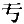
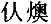
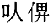
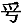
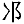

## 《郑季宣残碑》考[^①]

　　郑季宣碑，今存上截。额字灭尽，翁方纲[^②]见穿左有直纹一线，知是阳文。碑文行存十七字，以《隶续》[^③]所载文补之，每行三十一字至三十八字不等。盖所注阙字之数转刻有误，碑又失其下半，无以审正。今可知者第十二行“卒〔于〕”至“是路”间，洪云阙四字，碑实阙五字。第十七行“赖祉”至“迹”字间，洪云阙六字，碑实阙七字。铭辞宁成为韵，四字为句，则“迹”至“显奕世”间当阙六字，而洪云五字。又第七行“据”洪作“折”，第九行“〔化燠〕”洪作“〔以亻畀〕”，第十三行“”洪作“”，并误。其旧拓可见而《隶续》所阙者：第四行“”半字，第五行“郎中”二字，第六行“帝”字“特”字，第七行“未”字“波”字，第十行“汰”字，第十二行“徽”字，“能惠”二字阙半，第十三行“”字“约殁”二字，第十六行“庭”字，第十七行“洪”二字，凡多得十六字又二半字也。

　　碑阴，洪写作二列，跋云四横，今存上二列，列廿人，与《隶续》所载前半略相合。惟第二列第十七行“□□□□邯郸□□□”，洪作“（阙三字）邵训（阙）张”，颇不同。第三横，当亦二十人，则洪云末有“直事干”四人，正在第三列之末。最后有“（上阙）音伯字”三字，当即造碑者所识文。然则第四列当为“直事小史”三人，“门下小史”一人也。

【注】

[^①]:本篇据手稿编入，原无标题、标点。写作时间未详。《郑季宣残碑》，全称《汉尉氏令郑季宣碑》，在山东济宁学宫，东汉中平二年（185）四月辛酉立。碑侧刻有清代乾隆五十一年（1786）八月十六日黄易题记：“汉尉氏令郑季宣碑，正面向壁，其下久埋土中。翁詹事方纲欲显全文，属卫河通判黄易升碑向外。乃与知济宁直隶州事刘永铨、州判王所礼成其事。碑字复全露，殊可快也。乾隆五十一年八月十六日黄易题记，李东琪同来。”

[^②]:翁方纲（1733─1818）：字正三，号覃溪，顺天大兴（今属河北）人，清代学者。官至内阁学士。著有《两汉金石记》、《复初斋诗文集》等。《郑季宣碑》侧刻有翁方纲乾隆五十七年（1792）的一段题识：“壬子三月，翁方纲按试过此，与秋毖摩挲是碑，穿左有直纹一线，知额是阳文也。”按秋毖，黄易的字。

[^③]:《隶续》：辑录汉、魏石刻文字的字书，续《隶释》而作，宋代洪适辑，二十卷。《郑季宣碑》见于卷十九。洪适（1117─1184），字景伯，鄱阳（今属江西）人，宋代学者。官至尚书右仆射、观文殿学士。著有《隶释》《隶续》《盘洲集》。
