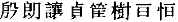

## 《鲍明远集》校记[^①]

　　此从毛斧季校宋本[^②]录出，殷朗讓貞筐樹亘恒──皆缺笔[^③]；又有愍世，则袭唐讳。毛所用明本[^④]，每页十行，行十七字，目在每卷前，与程本[^⑤]异。

【注释】

[^①]:本篇据手稿编入，原无标题、标点。据《鲁迅日记》，当写于一九一八年九月二十五日前后。《鲍明远集》，南朝宋文学家鲍照的诗文集。原由南齐虞炎编定，题为《鲍照集》，共十卷；据《隋书·经籍志》注，南朝梁还有一种六卷本。皆失传。后来传世的有《鲍明远集》《鲍参军集》《鲍照集》《鲍氏集》等不同版本。鲁迅校勘所用底本为明代新安汪士贤校本，十卷。鲍照（约414─466），字明远，东海（今江苏连云港）人。宋孝武帝时官太子博士兼中书舍人，后为临海王刘子顼前军参军。

[^②]:毛斧季（1640─？）：名　，字斧季，明末清初常熟（今属江苏）人，藏书家、版本学家。著有《汲古阁珍藏秘书图目》等。毛氏校宋本《鲍氏集》共十卷，校勘后记和识语中说：康熙丙辰（1676）“借吴趋友人宋本比较一过”，宋本“每幅廿行，每行十六字，小字不等

[^③]:缺笔：唐代开始的一种避讳方式，在书写和镌刻本朝皇帝或尊长的名字时，一般省略最末一笔。本文中的“殷朗讓貞筐樹亘恒”缺笔，即“”，是避宋太祖赵匡胤父弘殷、始祖玄朗，英宗父允让，仁宗赵祯、太祖匡胤、英宗赵曙（音同树）、钦宗赵桓、真宗赵恒的名讳。〔愍世〕，是避唐太宗李世民的名讳。

[^④]:毛斧季校勘所用的底本，是明代正德庚午（1510）朱应登刊本。

[^⑤]:程本：指明代程荣的刻本，十卷，目在前，每页九行，行二十字，前有虞炎序，后有朱应登跋。（见《汉魏六朝诸家文集二十二种》）程荣，字伯仁，安徽歙县人。曾辑刊《汉魏丛书》三十八种。
