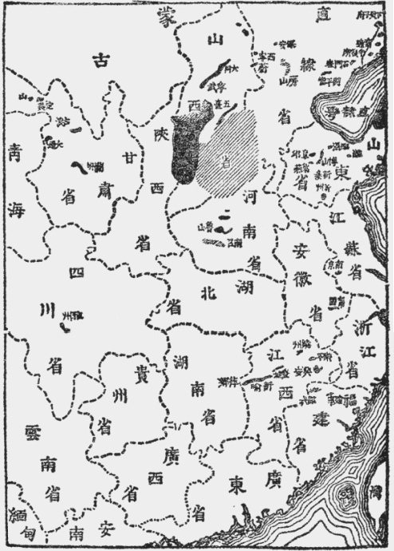
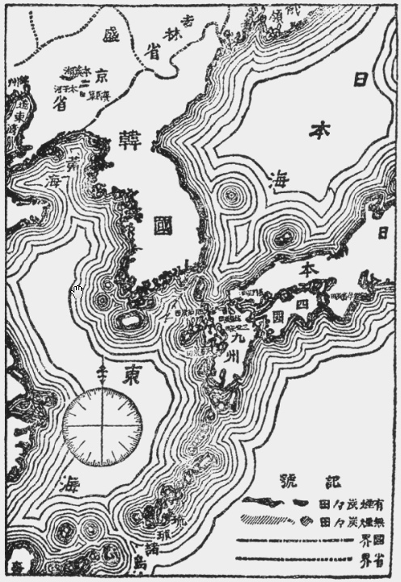

## 中国地质略论[^1]

### 第一　绪言

　　战国非难。入其境，搜其市，无一幅自制之精密地形图，非文明国。无一幅自制之精密地质图（并地文土性等图），非文明国。不宁惟是；必殆将化为僵石，供后人摩挲叹息，谥曰绝种 Extract species 之祥也。

　　吾广漠美丽最可爱之中国兮！而实世界之天府，文明之鼻祖也。凡诸科学，发达已昔，况测地造图之末技哉。而胡为图绘地形者，分图虽多，集之则界线不合；河流俯视，山岳则恒作旁形。乖谬昏蒙，茫不思起，更何论夫地质，更何论夫地质之图。呜呼，此一细事，而令吾惧，令吾悲，吾盖见五印[^2]详图，曾招贴于伦敦之肆矣。况吾中国，亦为孤儿，人得而挞楚鱼肉之；而此孤儿，复昏昧乏识，不知其家之田宅货藏[^3]，凡得几许。盗据其室，持以赠盗，为主人者，漠不加察，得残羹冷炙，辄大感叹曰：“若衣食我，若衣食我。”而独于兄弟行，则争锱铢，较毫末，刀杖寻仇，以自相杀。呜呼，现象如是，虽弱水[^4]四环，锁户孤立，犹将汰于天行，以日退化，为猿鸟蜃藻，以至非生物。况当强种鳞鳞，蔓我四周，伸手如箕，垂涎成雨，造图列说，奔走相议，非左操刃右握算，吾不知将何以生活也。而何图风水宅相之说，犹深刻人心，力杜富源，自就阿鼻[^5]。不知宅相大佳，公等亦死；风水不破，公等亦亡，谥曰至愚，孰云不洽。复有冀获微资，引盗入室，巨资既虏，还焚其家，是诚我汉族之大敌也。凡是因迷信以弱国，利身家而害群者；虽曰历代民贼所经营养成者矣，而亦惟地质学不发达故。

　　地质学者，地球之进化史也；凡岩石之成因，地壳之构造，皆所深究。取以贡中国，则可知栾然尘球，无非经历劫变化以来，造成此相；虽涵无量宝匚壮，足以缮吾生，初无大神秘不可思议之物，存乎其间，以支配吾人之运命。斩绝妄念，文明乃兴。然欲历举其说，则又非一小册子所能尽也。故先掇学者所发表关于中国地质之说，著为短篇，报告吾族。虽空谭几溢于本论，然读此则吾中国大陆里面之情状，似亦略得其概矣。

### 第二　外人之地质调查者

　　中国者，中国人之中国。可容外族之研究，不容外族之探捡；可容外族之赞叹，不容外族之觊觎者也。然彼不惮重茧，入吾内地，狼顾而鹰睨，将胡为者？诗曰：“子有钟鼓，弗鼓弗考。宛其死矣，他人是保。”[^6]则未来之圣主人，以将惠临，先稽帐目，夫何怪焉。左举诸子，皆最著名。其他幻形旅人，变相侦探，更不知其几许。虽曰跋涉山川，探索秘密，世界学人，皆尔尔矣；然吾知之，恒为毛戴血涌，吾不知何祥也。

　　千八百七十一年，德人利忒何芬 Richthofen[^7]者，受上海商业会议所之嘱托，由香港入广东，湖南（衡州，岳州），湖北（襄阳）遂达四川（重庆，叙州，雅州，成都，昭化）；入陕西（凤翔，西安，潼关），山西（平阳，太原）而之直隶（正定，保定，北京）。复下湖北（汉口，襄阳），往来山西间（泽州，南阳，平阳，太原），经河南之怀庆，以至上海，入杭州，登宁波之舟山岛，遍勘全浙。复溯江至芜湖，捡江西北部，折而之江苏（镇江，扬州，淮安），遂入山东（沂州，泰安，济南，莱州，芝罘）。碧眼炯炯，击节大诧若所悟。然其志未熄也；三涉山西（太原，大同），再至直隶（宣化，北京，三河，丰润），徘徊于开平炭山，入盛京（奉天，锦州），始由凤皇城而出营口。历时三年，其旅行线强于二万里，作报告书三册，于是世界第一石炭[^8]国之名，乃大噪于世界。其意曰：支那大陆均蓄石炭，而山西尤盛；然矿业盛衰，首关输运，惟扼胶州，则足制山西之矿业，故分割支那，以先得胶州为第一着。呜呼，今竟何如？毋曰一文弱之地质家，而眼光足迹间，实涵有无量刚劲善战之军队。盖自利氏游历以来，胶州早非我有矣。今也森林民族[^9]，复往来山西间，是皆利忒何芬之化身，而中国大陆沦陷之天使也，吾同胞其奈何。

　　千八百八十年，匈牙利伯爵式奚尼[^10]初丧爱妻，欲借旅行以漓其恨。乃偕地理学者三人，由上海溯江以达湖北（汉口，襄阳），经陕（西安）甘（静宁，安定，兰州，凉州，甘州）而出国境；复入甘肃（安定，巩昌），捡四川（成都，雅州）云南（大理）由缅甸以去。历时三年，挥金十万，著纪行三册行于世。盖于利忒何芬氏探捡未详之地，尤加意焉。

　　越四年，俄人阿布导夫[^11]探捡北部之满洲，直隶（北京，保定，正定），山西（太原），甘肃（宁夏，兰州，凉州，甘州），蒙古等。其后三年，复有法国里昂商业会议所[^12]之探捡队十人，探捡南部之广西，河南（河内），云南，四川（雅州，松潘）等。调查精密，于广西，四川尤详。是诸地者，非连接于俄法之殖民地者软？其能勿惧！

　　先年，日本理学博士神保，巨智部，铃木之辽东，理学士西和田之热河，学士平林，井上，斋藤之南部诸地，均以调查地质为目的。递和田，小川，细井，岩浦，山田五专门家，复勘诸处，一订前探捡者报告之谬，则去岁事也。

### 第三　地质之分布

　　昔德儒康德 Kant[^13] 唱星云说，法儒拉布拉 Laplace[^14]和之。以地球为宇宙间大气体中析出之一份，回旋空间；不知历几亿万劫，凝为流质；尔后日就冷缩，外皮遂坚，是曰地壳。至其中心，议者綦众：有内部融体说，有内部非融体说，有内外固体中挟融体说。各据学理，以文其议。然地球中心，奥不可测，欲辨孰长，盖甚难矣。惟以理想名地面之始曰基础统系 Fundamental formation[^15]，其上地层，则据当时气候状态，及蕴藏僵石 Fossil 之种类，分四大代 Era,细析之曰纪 Period ，析纪曰世 Epoch。然此诸地层则又非掘吾人立足地，即能灿然毕备也。大都错综残缺，散布诸方。如吾中国，常于此见新，而于彼则获古。盖以荒古气候水陆之不齐，而地层遂难一致。犹谭人类史者，昌言专制立宪共和，为政体进化之公例；然专制方严，一血刃而骤列于共和者，宁不能得之历史间哉。地层变例，亦如是耳。

　　今言中国，则以地质年代 Geological  Chronology 为次。

（一）原始代或太古代 Archean Era

　　地球初成，汽凝为水，是即当时之遗迹，居基础统系之上，而始为地质学家所目击者也。故吾侪目所能见之地层，以是为极古。其岩石以片麻，云母，绿泥为至多，然大都经火力而变质。捡遍石层，略无生物，惟据石类析之为：  
　　（12）老连志亚纪 Laurentian Period  
　　（11）比宇鲁亚纪 Huronian Period 二纪。后虽有发见阿屯[^16]（意即初生生物）之说，而经德人眉彪[^17]研究以来，已知其谬；盖尔时实惟荒天赤地，绝无微生命存其间也。所难解者，岩石中时含石灰石墨之属。夫石灰为动物之遗蜕，石墨为植物之槁株，设无生物存，何得有是？而或有谓是等全非由生物之力而来者，迄于今尚存疑焉。索之吾中国，则两纪均于黄海沿岸遇之。虽未能知其蕴藏何如，然太古代地层中，则恒产金银铜铂电石红宝石之属，意吾国黄海沿岸地方，亦当如是耳。

（二）古生代 Palaeozoic Era

　　以始有生物，故以生命名者也，分六纪[^18]：  
　　（10）寒武利亚纪 Cambrian Period  
　　（9）志留利亚纪 Silurian Period  
　　（8）泥盆纪 Devonian Period  
　　（7）石炭纪 Carboniferous Period  
　　（6）二叠纪 Permian Period 岩石繁多，以水成者，若砂，硅，粘板，石炭[^19]等；以火成者，若花刚，闪丝，辉丝等。

　　石类既自少而至多，生物亦由简以进复，然当（10）纪时，尚鲜见也。递及（9）纪，则藻类，三叶虫，珊瑚虫之族日盛，然惟水产物而止耳。入（8）纪，而鱼，而苇[^20]，而鳞木，而印木，渐由水产以超陆产。然亦惟隐花植物而已，高贵生物，未获见也。降及（6）纪，而两栖动物及爬虫出，盖已随时日之变迁，以日趋于高等矣。是即造化自著之进化论，而达尔文[^21]剽窃之以成十九世纪之伟著者也。

　　蕴藏矿物以是代为最富。（10）纪之见于中国者，自辽东半岛直亘朝鲜北部；虽土质确荦[^22]，不宜稼穑，而所产金银铜锡之属，实远胜于他纪诸岩石，土人仅耕石田，于生计可绰有余裕焉。其（9）纪岩石，则分布于陕西至四川之山间，以产金著。其（8）纪岩石，则在云南北境及四川之东北。变质岩中，常含玉类，而岩石脉络间，亦少产银铁铜铅，搜全世界，以此纪岩石为至多，而石类亦均适于用。其上则（7）纪矣，产煤铁綦多，故以石炭名其纪。而吾中国本部，实蔓延分布，无地无之，合计石炭之量，远驾欧土（详见第五）；是实榜陀罗Pan-dora[^23]之万祸箧底之希望，得之则日近于光明璀灿之前途，失之则惟愁苦终穷以死者也，吾国人其善所择哉。

（三）中生代 Mesozoic Era

　　组成是代之岩石为粘板，角，硅，及粘土等，或遇如含有岩盐石炭石膏之地层，分三纪，即：  
　　（5）三叠纪 Triassic Period  
　　（4）侏罗纪 Jurassic Period  
　　（3）白垩纪 Cretaceous Period 是也。

　　前纪生物已日归于消灭，故（5）纪时，鳞印诸木，衰落既久，而松柏，苏铁，羊齿诸科，乃代之握植界之主权。至（3）纪则无花果，白杨，柳，槠等诸被子植物出，与现世界几无大异矣。动物则前代已生之爬虫，日益发达，有袋类亦生，为乳哺类之先导。至（4）纪而诡形之龙类[^24]（旧译作鼍），跋扈于陆地，有齿之大鸟[^25]，飞翔于太空，盖自有生物以来，未有若斯之瑰奇繁盛者也。且菊石，箭石之属，亦大繁殖，其遗蜕遂造成（3）纪之地层，即学校日用之垩笔[^26]，亦此微虫之余惠耳。至（3）纪时，生物界乃大变革，旧生动植，或衰或灭，而真阔叶树及硬骨鱼兴。

　　（5）纪之在中国者，为西藏，有用卝[^27]物则有岩盐石膏铜铁铅等。（4）纪则自西伯利亚东方，以至中国之本部，虽时有物，而极鲜石炭。（3）纪则并有用物亦鲜见矣，中国之极西方是也。

（四）新生代 Cenozoic Era

　　新生代者，地质时代中最终之地层，而其末叶，即吾人生息之历史也，别为二纪，曰：  
　　（2）第三纪 Tertiary Period  
　　（1）第四纪 Quaternary Period 其岩石为粗面，流纹，玄武，及粘土，砂砾，柔石炭等。

　　其生物虽与今几无大异，然细察之，则不同之点綦多，如象，貘，张角兽，恐鸟[^28]是也。如是盛衰递嬗，益衍益进，至洪积世Diluvium而人类生。

　　（2）纪分布于中国全部，其矿物有金属，且产石炭，然以新成，故远逊于石炭纪者。（1）纪则全世界无不见之，如中国扬子江北部之累斯Loess（黄色无层之灰质岩石），即为是时积聚之砂土；黄河附近之黄土，亦是时发育之垆坶之一种也。

### 第四　地质上之发育

　　地球未成以先，吾中国亦气体中之一份耳，无可言者，故以地球成后始。

　　（一）太古代之中国　太古代之地球，洪水澎湃，烈火郁盘，地鲜出水，奚言生物，瞑想其状，当惟见洪流激浪而已。

　　然火力所激，而地壳变形，昆仑山脉，忽然隆出；蒙古之一部分，及今之山东，亦离水成陆，崛起海中，其他则惟巨浸无际，怒浪拂天已耳。

　　（二）古生代之中国　地壳地心，鏖战既久，其后地心花刚岩之溶液，挟火力以泉涌，流溢海陆，地壳随之隆出水面，乃构成东方亚细亚之大陆。秦岭以北断层分走于诸方，即为台地，大苇鳞木印木等巨大植物，于焉繁殖。以北，则地层恒作波折形，似曾为山脉者。厥后经风雨之剥蚀，海浪之冲激，秦岭以北，渐成海底，无量植物，受水石之迫压，及地心热力，相率僵死。然地心火力，则犹冲突而未有已也，故复隆出水中，成阶级状之台地，所谓支那炭田者，实形成于此时焉。然其南部，尚潜海底，迨因受西北方之横压力，而秦岭以南之地层，遂成波状之崛起，即所谓支那山系（南岭）者是也。

　　（三）中生代之中国　火山之活动，至是稍衰，惟南方之一部，渐至沦陷，成新地中海，是实今日四川省之洼地（四川之赤盆砂地），而南支那之炭田也。迨喜马拉牙山崭然显头角，而南部中国始全为陆地。厥后南京与汉江之北，生分走北东之两断层，陷落而成中原，即为历代枭雄逐鹿地，以造成我中国旧史之骨子者也。

　　（四）新生代之中国　入新生代之初，水火之威日杀，甘肃及蒙古地方，昔为内海，至是亦渐就干涸，砂漠成焉。然以暴风所经营，故土砂埃尘，均随风飞动，运入黄河流域地方，积为黄土。扬子江北部，亦广大之砂漠耳，后以风之吹拂，雨之浸润，遂成累斯，故累斯大发育于中国。其他则与今日地形，几无大异矣。

### 第五　世界第一石炭国

　　世界第一石炭国！石炭者，与国家经济消长有密接之关系，而足以决盛衰生死之大问题者也。盖以汽生力之世界，无不以石炭为原动力者，失之则能令机械悉死，铁舰不神。虽曰将以电生力矣，然石炭亦能分握一方霸权，操一国之生死，则吾所敢断言也。故若英若美，均假僵死植物之灵，以横绝一世；今且垂尽矣，此彼都人士，所为抚心愁叹，皇皇大索者也。列邦如是，我国如何？利忒何芬曰：“世界第一石炭国！……”今据日本之地质调查者所报告，石炭田之大小位置，图遍于左，即：  
　　●满洲七处  
　　芜河水　　　　　　　　　┐  
　　赛马集　　　　　　　　　│辽东  
　　太子河沿岸（上流）　　　│  
　　本溪湖　　　　　　　　　┘  
　　锦州府（大小凌河上流）　┐  
　　宁远县　　　　　　　　　│辽西  
　　中后所　　　　　　　　　┘  
　　●直隶省六处  
　　石门塞（临榆县）  
　　开平  
　　北京之西方（房山县附近）  
　　保安州  
　　蔚州　　　　　　　　　　西宁州  
　　●山西省六处  
　　东南部炭田　　　　　　　西南部炭田  
　　五台县　　　　　　　　　大同宁民府间炭田  
　　中路（译音）　　　　　　西印子（译音）  
　　●四川省一处  
　　雅州府  
　　●河南省两处  
　　南召县　　　　　　　　　鲁山县附近  
　　●江西省六处  
　　丰城　　　　　　　　　　新喻  
　　萍乡　　　　　　　　　　兴安  
　　乐平　　　　　　　　　　饶州  
　　●福建省两处  
　　邵武县　　　　　　　　　建宁府  
　　●安徽省一处  
　　宣城  
　　●山东省七处  
　　沂州府　　　　　　　　　新泰县  
　　莱芜县　　　　　　　　　章丘县  
　　临榆县　　　　　　　　　通县[^29]  
　　博山县及淄川县  
　　●甘肃省五处  
　　兰州府　　　　　　　　　大通县  
　　古浪县　　　　　　　　　定羗县  
　　山丹州

　　等四十三处是也。或谓此外有湖南东南部有烟无烟炭田，无虑二万一千方迈尔[^30]，虽未得其的据，然吾中国炭田之未发见者，固不知其几许，宁止湖南？今仅就图中（见13页）山西省有烟无烟大炭田计之，约各一万三千五百方迈尔，合计七百万步[^31]。加以他处炭田，拟一极少数，为一千万步。设平均厚率为三十尺，一立方坪之重量为八吨，则其总量凡一万二千亿吨，即每年采掘一亿二千万吨，亦可保持至一万年之久而未有尽也。况加以湖南传说之炭田，五百六十六万步即约六千八百亿吨乎。吾以之自熹，吾以之自慰。然有一奇现象焉，即与吾前言反对者，曰中国将以石炭亡是也。列强领土之中，既将告罄，而中国乃直当其解决盛衰问题之冲，列国将来工业之盛衰，几一系于占领支那之得失，遂攘臂而起，惧为人先。复以不能越势力平均之范围，乃相率而谈分割，血眼欲裂，直睨炭田。而我复麻木罔觉，挟无量巨资，不知所用，惟沾沾于微利以自贼，于是今日山西某炭田夺于英，明日山东各炭田夺于德[^32]，而诸国犹群相要曰：“采掘权！采掘权！！”呜呼，不待十年，将见此朊朊[^33]中原，已非复吾曹之故国，握炭田之旧主，乃为采炭之奴，弃宝藏之荡子，反获鄙夫之谥。虽曰炭田有以诲盗，而慢藏[^34]不用，则谁之罪哉。

### 第六　结论

　　生敬爱忧惧种种心，掷笔大叹，思吾故国，如何如何。乃见黄神啸吟，白眚舞蹈[^35]，足迹所至，要索随之，既得矿权，遂伏潜力，曰某曰某，均非我有。今者俄复索我金州复州海龙盖平诸矿地矣。初有清商某以自行采掘请，奉天将军诺之，既而闻其阴市于俄也，欲毁其约，俄人剧怒，大肆要求[^36]。呜呼，此垂亡之国，翼翼爱护之，犹恐不至，独奈何引盗入室，助之折桷挠栋，以速大厦之倾哉。今复见于吾浙矣。以吾所闻，浙绅某者[^37]，窃某商之故智，而实为外人伥，约将定矣。设我浙人若政府，起而沮尼之，度其结果，亦若俄之于金州诸地耳。试问我畏葸文弱之浙人，老病昏糙之政府，有何权力，敢遏其锋；阖口自臧，犹将罹祸，而此獠偏提外人耳而促之曰：“若盍索吾浙矿。”呜呼，鬼蜮为谋，猛鹫张口，其亡其亡，复何疑焉。吾尝豫测将来，窃为吾浙惧，若在北方，则无瞢耳。彼等既饱尝外人枪刃之风味，淫掠之德政，不敢不慑伏谄媚，以博未来之圣主欢，夺最爱之妻女，犹不敢怨，更何有于毫无爱想之片土哉！若吾浙则不然，台处衢严诸府，教士说法，犹酿巨前[^38]。况忽见碧瞳皙面之异种人，指挥经营，丁丁然日凿吾土，必有一种不能思议之感想，浮游于脑，而惊，而惧，而愤，挥梃而起，莳刈之以为快。而外人乃复得口实，以要索，以示威，枭颅成束，流血碧地之惨象，将复演于南方，未可知也。即不然，他国执势力平均之说，群起夺地，倏忽瓜分，灭国之祸，惟我自速。即幸而数十年后，竟得独立，荣光纠纷，符吾梦想；而吾浙矿产，本逊他省，复以外族入室，罗掘一空，工商诸业，遂难优胜，于是失败迭来，日趋贫病。呜呼，浙人而不甘分致戎之谤也，其可不谋所以挽救之者乎。

　　救之奈何？曰小儿见群儿之将夺其食也，则攫而自吞之，师是可耳。夫中国虽以弱著，吾侪固犹是中国之主人，结合大群起而兴业，群儿虽狡，孰敢沮者，则要索之机绝。乡人相见，可以理喻，非若异族，横目为仇，则民变之祸弭。况工业繁兴，机械为用，文明之影，日印于脑，尘尘相续，遂孕良果，吾知豪侠之士，必有阿阿以思，奋袂而起者矣。不然，则吾将忧服箱[^39]受策之不暇，宁有如许闲情，喋喋以言地质哉。

　　（一九〇八年）

【注释】

[^1]:本篇最初发表于一九〇三年十月在日本东京出版的《浙江潮》月刊第八期，署名索子。原为句读。

[^2]:五印：指印度。古代印度分为东西南北中五部份。

[^3]:藏：原文中该字结构为｛匚壮｝，即“藏”之古字。

[^4]:弱水：我国古书中关于弱水的神话传说很多，如《山海经·大荒西经》：昆仑之丘“其下有弱水之渊”。晋代郭璞注：“其水不胜鸿毛。”

[^5]:阿鼻：梵文Avici的音译，意为“无间”，指痛苦无有间断。佛教传说中有所谓阿鼻地狱。

[^6]:“子有钟鼓，弗鼓弗考”等语，见《诗经·唐风·山有枢》。考，敲。

[^7]:利忒何芬（F.von Richthofen，1833─1905）：通译李希霍芬，德国地质地貌学家。一八六八年至一八七二年，他在上海西商会的指使和资助下，七次旅行我国内地，搜集地质、矿产等资料。回国后撰有《中国──亲身经历及其研究报告》三册和地图一本。他在此书和一些文章中，极力主张德国霸占我国胶州湾。

[^8]:石炭：这里指煤。

[^9]:森林民族：指日耳曼人。他们在公元一世纪之前，一直居住在北欧森林地带，过着游牧打猎的生活。

[^10]:式奚尼（B.von Széchenyi，1837─1918）匈牙利人。他于一八七九年来中国，与克雷德纳（G.Kreitner）、洛奇（L，Lóczy）一同探察我国西部和西南地区，回国后著有《一八七七年──一八八〇年东亚旅行的学术成果》一书。

[^11]:阿布导夫（英文： Vladimir Afanasyevich Obruchev, 俄文：Владимир афанасьевич обручев，1863─1956）：通译奥勃鲁契夫，俄国地质地理学家。一八九二年至一八九四年间参加波丹宁为首的考察队来中国进行地质考察，回国后著有《亚洲中部、华北和南山》二卷

[^12]:里昂商业会议所：通译里昂商会，法国的商人团体之一。成立于一七〇二年。它的主要职责是讨论所在城市或地区的事宜，向政府提出工商方面的建议等。一七九一年因立宪会议下令取消各地商会而解散，一八〇二年恢复。一八九五年至一八九七年，法国矿业工程师杜克洛（Duclos）考察我国云南、贵州、四川地区，提出了关于当地矿物资源的报告书；随后，里昂商会为进一步考察对华进行贸易渗透的前景，向上述地区派出了以法国外交部委任的领事艾米尔·罗歇（Emil Ro-cher）率领的考察团。

[^13]:康德（I.Kant，1724─1804）：德国哲学家。一七五五年发表《自然通史和天体论》，提出关于太阳系起源的星云假说，认为宇宙中无限混沌的原始物质彼此吸引、相撞、发热、旋转而成星云；旋转着的星云在其赤道面上甩出物质，依次形成太阳系诸行星。

[^14]:拉布拉（P.Laplace，1749─1827）：通译拉普拉斯，法国科学家。他于一七九六年根据角动量守恒原则解释星云冷凝体的加速自转，独立地提出了与康德相似的论点。

[^15]:基础统系：也称基础建造，指原始地壳。

[^16]:阿屯（Eozone）：美国科学家达逊曾在隐生宙（即文中的原始代）形成的加拿大石灰岩中，发现类似原生动物有孔虫的遗迹，取名为Eozone。

[^17]:眉彪（1825─1908）：又译梅标士，德国科学家。他经过研究，否定了隐生宙存在过有孔类原生动物的说法。

[^18]:按寒武利亚纪后，当有奥陶纪（Ordovician Period）。

[^19]:按石炭当系石灰之误。

[^20]:苇：又作大苇（calamits），通译芦木，一种木贼纲的古植物。

[^21]:达尔文（C.R.Darwin，1809─1882）：英国生物学家，进化论的奠基者。著有《物种起源》等。他提出以自然选择为基础的进化学说，阐明了在自然条件的作用下，生物从低级向高级发展、进化的客观规律，摧毁了各种唯心主义的神造论、目的论和生物不变论。

[^22]:确荦：土地瘠薄多石。

[^23]:榜陀罗：通译潘陀拉，希腊神话中的一个美女。主神宙斯把她送给厄匹米修斯为妻，并交给她一只箱子，内装疾病、灾害、罪恶等祸患，“希望”则藏在底层。她和厄匹米修斯见面时，打开箱盖，向人间放出各种祸患，却把“希望”关在箱里。

[^24]:诡形之龙类：指恐龙。

[^25]:有齿之大鸟：指始祖鸟。

[^26]:垩笔：即粉笔，我国多用石膏制作；其他国家则多用白垩土制作。白垩土是一种主要由微体动物遗壳堆积而成的白色土质岩石。

[^27]:卝：矿的古字。

[^28]:貘：指巨貘（Megatapirus），真貘科的古代哺乳动物。张角兽，当指恐角类（Dinocrata）动物，头上常有角状的骨质突起。恐鸟，又称莫滑（MOA）鸟，一种类似驼鸟的走禽。

[^29]:按这里的临榆县、通县，据本文所附地图，当为临淄县、潍县。

[^30]:迈尔：英语mile的音译，即英里。

[^31]:步：日本的面积单位，同坪，一坪合三·三〇五七平方米。

[^32]:山西某炭田夺于英：指一八九四年（光绪二十年）英国福公司攫取山西盂县平定矿权。山东各炭田夺于德，指一八九八年（光绪二十四年）德国政府攫取山东胶济铁路沿线三十里内矿权，次年德商瑞记洋行攫取山东境内五处矿权。

[^33]:朊朊：肥沃。

[^34]:慢藏：意思是财物保管不严。《易·系辞上》：“慢藏诲盗。”

[^35]:黄神啸吟：《淮南子·览冥训》：“西老折胜，黄神啸吟。”东汉高诱注：“为时<按指夏桀之时）无法度，黄帝之神伤道之衰，故啸吟而长叹也。”白眚，指西方帝国主义者。眚，灾害。

[^36]:关于俄索金州诸矿，见一九〇三年十月一日日本大阪《朝日新闻》：“九月三十日天津特电：奉天将军以金州厅、复州、盖平、海龙厅等矿山许请清商出资开采，该清商联络俄国人，自俄国人出资，其权利尽落俄国人之手；故奉天将军近令禁止，俄国领事盛气诘问，奉天将军乃电请外务部，乞与俄国公使开议，以保护矿山权云。”奉天将军，指当时的盛京将军增祺。清商，指买办商人梁显诚。

[^37]:浙绅某者：指高尔伊，字子衡，浙江杭州人。一九〇三年，他借开设宝昌公司承办浙东衢、严、温、处四府矿产之名，暗中以二百五十万两银价将四府矿产全部出卖给意大利惠工公司。同年十月三日，浙江留日学生曾在东京上野三宜亭集会抗议，并发布公开信声讨高尔伊的卖国行径。

[^38]:教士说法，犹酿巨前：一八九八年到一九〇三年间，浙江的台州、处州、衢州、严州等地区，爆发过多次以反对教会为口号的群众反帝斗争，都遭到清政府的残酷镇压。计有一八九八年二月的海门起义，一九〇〇年七月的诸暨起义、八月的衢州起义、九月的宁海起义，一九〇三年六月的宁海、桐庐起义等。前，同灾。

[^39]:服箱：驾车。《诗经·小雅·大东》：“皖彼牵牛，不可以服箱。”
